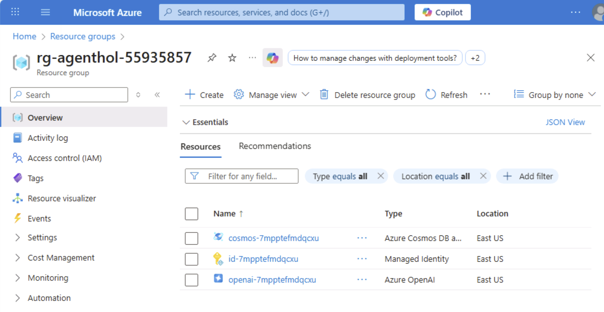

#  Multi Agent Workshop using Microsoft Agent Framework in C#

This module contains the exercise files, including minimal scaffolding code and step-by-step instructions to the exercises. 

To run the multi-agent application using Azure Cosmos DB and Microsoft Agent Framework in C#, follow these steps:

1. Deploy the required Azure resources.
2. Run the starter application locally and begin working through the exercises.

If you prefer to view the final code, see the [exercises](../../../02_completed/README.md).

## Deployment and Setup

### Git Clone

Let's clone the repository to download the files to your machine.

1. Create a working directory on your machine, for example: `C:\repos\HOL_AFandLangGraph`.
2. Open PowerShell from the Start menu.
3. Navigate to the `C:\repos\HOL_AFandLangGraph` folder.
4. Clone the GitHub repository by running the following command:

```shell
git clone --branch HOL_v2_AFandLangGraph https://github.com/AzureCosmosDB/banking-multi-agent-workshop.git C:\repos\HOL_AFandLangGraph
```

### Resource Provisioning

Let's deploy the Azure Services needed to run the application.

1. Open the PowerShell terminal on the Start Bar and navigate to the multi-agent-hol folder.

```shell
cd C:\repos\HOL_AFandLangGraph\01_exercises\
```

1. Authenticate  yourself

```shell
azd auth login
```

1. Deploy the Azure services using `azd up`

```shell
azd up
```

1. For environment name enter: `agenthol`
1. Press enter to select the subscription listed.
1. Press enter to select the default region listed.

1. Return to the Azure Portal and refresh the list of resource groups. You may need to refresh a few times.
1. Select the *rg-agenthol* resource group.
1. Find the collapsed *Essentials* section at the top of the page and expand.
1. Click on the Deployments and watch until the status of all deployed resources shows as Succeeded.
1. Your screen should appear as below.



## Running the App

### 1. Start the Backend App

1. Open the PowerShell terminal on the Start bar.
1. Navigate to `C:\repos\HOL_AFandLangGraph\01_exercises\csharp\src\MultiAgentCopilot`.

1 . Execute the below command to add the preview Nugget packages.

    ```shell
    dotnet add package Microsoft.Agents.AI --version 1.0.0-preview.251016.1 --source https://api.nuget.org/v3/index.json
    dotnet add package Microsoft.Agents.AI.OpenAI --version 1.0.0-preview.251016.1 --source https://api.nuget.org/v3/index.json
    dotnet add package Microsoft.Agents.AI.Workflows --version 1.0.0-preview.251016.1 --source https://api.nuget.org/v3/index.json
    ```
1. Type `code .`
1. Open the Terminal in VS Code.
1. Type `dotnet run` to start the multi-agent service.
1. You will notice some warnings when the app starts. You can ignore these.
1. Leave the app running.

### 2. Run the Frontend App

1. Within VS Code, open a new terminal.
1. Navigate to the `frontend` folder, `C:\repos\HOL_AFandLangGraph\01_exercises\frontend`
1. Copy and run the following:

   ```sh
   npm install
   npm start
   ```

1. If prompted, **Allow** so the Node.js Javascript Runtime to access this app over the network.
1. Open your browser and navigate to <http://localhost:4200/>.

### 3. Start a Conversation

1. In the Login dialog, select a user and company and click, Login.
1. Click New Chat.
1. Send the message:

   ```text
   Hello, how are you?
   ```

1. You should see something like the output below.

   

### 4. Stop the Application

- Return to VS Code.
- In the frontend terminal, press **Ctrl + C** to stop the frontend application.
- Select the backend terminal, press **Ctrl + C** to stop the backend application.

## Common Issues and Troubleshooting

1. Errors during azd deployment:
   - Service principal "not found" error.
   - Rerun `azd up`
1. Frontend issues:
   - If frontend doesn't fully start, navigate to `/frontend/src/environments/environment.ts` and update `apiUrl: 'https://localhost:63279/'`
   - Frontend will restart

## Next Steps

Proceed to Module 1: [Creating Your First Agent](./Module-01.md)
