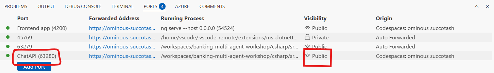
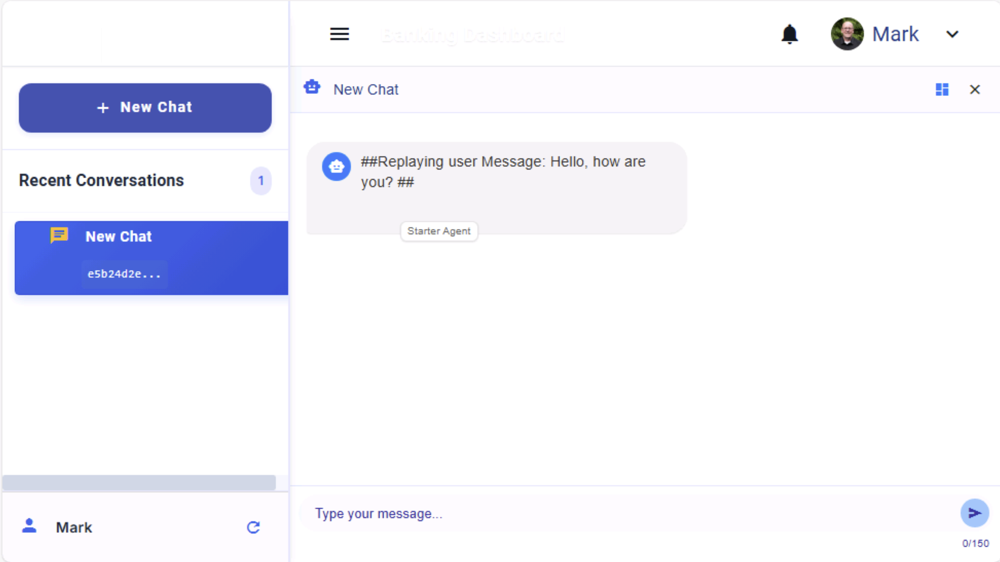

# Module 00 - Prerequisites - Deployment and Setup

**[Home](Home.md)** - [Creating Your First Agent >](./Module-01.md)

## Introduction

In this Module, you'll deploy the Azure Services needed to run this workshop and get your local environment configured and ready. You will also learn about the structure of this workshop and get an overview of Multi-Agent Systems.

## Learning Objectives and Activities

- Begin the deployment of the Azure Services
- Learn the structure and get an overview of this workshop
- Explore the core principals of multi-agent systems
- Complete the configuration of your local environment
- Compile and run the starter solution locally

## Module Exercises

1. [Activity 1: Configure Workshop Environment](#activity-1-configure-workshop-environment)
1. [Activity 2: Deploy Azure Services](#activity-2-deploy-azure-services)
1. [Activity 3: Workshop Structure and Overview Session](#activity-3-workshop-structure-and-overview-session)
1. [Activity 4: Configure Environment Variables](#activity-4-configure-environment-variables)
1. [Activity 5: Compile and Run](#activity-5-compile-and-run)

## Activity 1 Configure Workshop Environment

Complete the following tasks in order to prepare your environment for this workshop.

**Note:** These pre-requisites are a hard requirement for successful completion of this workshop. If you do not have all three you will not be able to successfully complete this workshop.

### Prerequisites

- Laptop or workstation with **administrator rights** (Alternatively you can run this workshop virtually in [GitHub Codespaces](https://github.com/features/codespaces))
- Azure subscription with **owner rights**
- Subscription access to Azure OpenAI service. Start here to [Request Access to Azure OpenAI Service](https://aka.ms/oaiapply). If you have access, see below for ensuring enough quota to deploy.

  #### Checking Azure OpenAI quota limits

  For this sample to deploy successfully, there needs to be enough Azure OpenAI quota for the models used by this sample within your subscription. This sample deploys a new Azure OpenAI account with two models, **gpt-4o with 30K tokens** per minute and **text-3-embedding-small with 5k tokens** per minute. For more information on how to check your model quota and change it, see [Manage Azure OpenAI Service Quota](https://learn.microsoft.com/azure/ai-services/openai/how-to/quota)

  #### Azure Subscription Permission Requirements

  This solution deploys a [user-assigned managed identity](https://learn.microsoft.com/entra/identity/managed-identities-azure-resources/overview) and defines then applies Azure Cosmos DB and Azure OpenAI RBAC permissions to this as well as your own Service Principal Id. You will need the following Azure RBAC roles assigned to your identity in your Azure subscription or [Subscription Owner](https://learn.microsoft.com/azure/role-based-access-control/built-in-roles/privileged#owner) access which will give you both of the following.

  - [Manged Identity Contributor](https://learn.microsoft.com/azure/role-based-access-control/built-in-roles/identity#managed-identity-contributor)
  - [Cosmos DB Operator](https://learn.microsoft.com/azure/role-based-access-control/built-in-roles/databases#cosmos-db-operator)
  - [Cognitive Services OpenAI User](https://learn.microsoft.com/azure/role-based-access-control/built-in-roles/ai-machine-learning#cognitive-services-openai-user)

### Get Started

You can choose from the following options to get started with the workshop.

#### GitHub Codespaces

You can run this sample app and workshop virtually by using GitHub Codespaces (requires a GitHub account). The button will open a web-based VS Code instance in your browser:

1. Open the template (this may take several minutes):

  [](https://codespaces.new/AzureCosmosDB/banking-multi-agent-workshop?branch=start&devcontainer_path=.devcontainer%2Fcsharp%2Fdevcontainer.json)


3. Move on to the [Deployment](Module-00.md#deployment) section.

#### Local Environment using VS Code Dev Containers

1. Install [Docker Desktop](https://docs.docker.com/desktop/), and [VS Code](https://code.visualstudio.com/Download) along with the [Dev Containers extension](https://code.visualstudio.com/docs/devcontainers/tutorial#_install-the-extension) extension.

2. Clone the repository and checkout the WorkShop_v1_SKandLangGraph branch:

   ```bash
   git clone https://github.com/AzureCosmosDB/banking-multi-agent-workshop/
   cd banking-multi-agent-workshop
   git checkout WorkShop_v1_SKandLangGraph
   ```

3. Open the repository in VS Code and select **Reopen in Container** when prompted. When asked to **Select a devcontainer.json file**, select the **C# Development Container**.

4. Wait for the container to build and start. This is a one time operation and may take a few minutes.

5. Move on to the [Deployment](Module-00.md#deployment) section.

#### Local Environment without VS Code Dev Containers

1. To run the workshop locally on your machine, install the following:

   - [Docker Desktop](https://docs.docker.com/desktop/)
   - [Git](https://git-scm.com/downloads)
   - [Azure Developer CLI (azd)](https://aka.ms/install-azd)
   - [.NET 8](https://dotnet.microsoft.com/downloads/)
   - [Visual Studio](https://visualstudio.microsoft.com/downloads/) or [VS Code](https://code.visualstudio.com/Download) with [C# Dev Kit](https://marketplace.visualstudio.com/items?itemName=ms-dotnettools.csdevkit)
   - To build and run the frontend component, install [Node.js](https://nodejs.org/en/download/) and [Angular CLI](https://angular.dev/installation#install-angular-cli)

2. Clone the repository and checkout the WorkShop_v1_SKandLangGraph branch:

   ```bash
   git clone https://github.com/AzureCosmosDB/banking-multi-agent-workshop/
   cd banking-multi-agent-workshop
   git checkout WorkShop_v1_SKandLangGraph
   ```

3. Move on to the [Deployment](Module-00.md#deployment) section.

## Activity 2: Deploy Azure Services

### Deployment

1. Navigate to the correct folder:

   ```bash
   cd csharp/infra
   ```

1. Log in to Azure using AZD. Follow the prompts to complete authentication.

   ```bash
   azd auth login
   ```

1. Provision the Azure services and deploy the application.

   ```bash
   azd up
   ```

This step will take approximately 10-15 minutes.

> [!IMPORTANT]
> If you encounter any errors during the deployment, rerun `azd up` to continue the deployment from where it left off. This will not create duplicate resources, and tends to resolve most issues.

1. When the resources are finally deployed, you will see a message in the terminal like below:

```bash
Deploying services (azd deploy)

  (✓) Done: Deploying service ChatServiceWebApi
  - Endpoint: https://ca-webapi-6xbkqp3ybtbuw.whitemoss-86b36485.eastus2.azurecontainerapps.io/

Do you want to add some dummy data for testing? (yes/no): y
```

1. Press `y` to load the data for the workshop.

1. After the data is loaded, you will see a message in the terminal like below:

```bash
PUT offerdata Request Successful: True
PUT offerdata Request Successful: True
PUT offerdata Request Successful: True

Do you want to deploy the frontend app? (yes/no): 
```
1. Press `y` to deploy the frontend application.


## Activity 3: Workshop Structure and Overview Session

While the Azure Services are deploying we will have a presentation to cover on the structure for this workshop for today as well as provide an introduction and overview of multi-agent sytems.

## Activity 4: Configure Environment Variables

### Setting up local debugging

When you deploy this solution it automatically injects endpoints and configuration values into the .env file stored in the .azure directory in a folder with the name of your resource group.

1. Navigate to `.azure\[your-resource-group-name]\.env`
1. Open the .env file using any text editor.
1. Navigate to `csharp\src\MultiAgentCopilot.sln` and open the solution.
1. Within your IDE, navigate to `ChatAPI` project and open `appsettings.json`
1. Update `"CosmosDBSettings:CosmosUri": "https://[accountname].documents.azure.com:443/"` with the AZURE_COSMOSDB_ENDPOINT value from the .env file.
1. Update `"SemanticKernelServiceSettings:AzureOpenAISettings:Endpoint": "https://[accountname].openai.azure.com/"` with the AZURE_OPENAI_ENDPOINT value from the .env file.
1. Update `"ApplicationInsights:ConnectionString": "[connectionstring]"` with the APP_INSIGHTS_CONNECTION_STRING value from the .env file.

## Activity 5: Compile and Run

### Running the ChatAPI and Frontend App

#### 1. Start the ChatAPI

##### If running on Codespaces

1. Navigate to `src/ChatAPI`.
2. Run the following command to trust the development certificate:

   ```sh
   dotnet dev-certs https --trust
   ```

3. Start the application:

   ```sh
   dotnet run
   ```

4. In the **Ports** tab, right-click and select the **Port Visibility** option to set port **63280** as **Public**.
5. Copy the URL for **63280** port.

   

##### If running locally on Visual Studio or VS Code

1. Navigate to `src\ChatAPI`.
2. Press **F5** or select **Run** to start the application.
3. Copy the URL from the browser window that opens.

#### 2. Run the Frontend App

1. Open a new terminal. Navigate to the `frontend` folder.
1. Copy and run the following:

   ```sh
   npm install
   npm start
   ```

##### If running locally

1. Open your browser and navigate to <http://localhost:4200/>.

##### If running on Codespaces

1. From the **PORTS** tab, search for the port with the label **Frontend app**. Hover over the address and choose **Open in Browser** (second icon) to access the frontend application.

#### 3. Start a Conversation

1. Open the frontend app.
1. Start a new conversation.
1. Send the message:

   ```text
   Hello, how are you?
   ```

1. You should see something like the output below.

   

#### 4. Stop the Application

- In the frontend terminal, press **Ctrl + C** to stop the application.
- In your IDE press **Shift + F5** or stop the debugger.
- If you are in CodeSpaces, go to each terminal and press **Ctrl + C**.

### Deployment Validation

Use the steps below to validate that the solution was deployed successfully.

- [ ] All Azure resources are deployed successfully
- [ ] You can compile the solution in CodeSpaces or locally
- [ ] You can start the project and it runs without errors
- [ ] You are able to launch the Chat Frontend app , create a new chat session, and get a reply when you send a message.

### Common Issues and Troubleshooting

1. Errors during azd deployment:
   - Service principal "not found" error.
   - Rerun `azd up`
1. Azure OpenAI deployment issues:
   - Ensure your subscription has access to Azure OpenAI
   - Check regional availability
1. Frontend issues:
   - If frontend doesn't fully start, navigate to `/frontend/src/environments/environment.ts` and update `apiUrl: 'https://localhost:63279/'`
   - Frontend will restart
   - In CodeSpaces, if frontend displays the spinning icon when starting up, double-check you have made port `ChatAPI (63280)` public. Then restart the front end.
1. Connecting to backend running CodeSpaces

   - If you cannot get the front end to connect to the backend service when running in Codespaces try the following

     - Navigate to the /src/ChatAPI folder in the Terminal
     - Run the following command to trust the development certificate:

       ```sh
       dotnet dev-certs https --trust
       ```

     - Then start the application:

       ```sh
       dotnet run
       ```

   - Copy the URL from the **Ports** tab and use this for the environments.ts file

## Success Criteria

To complete this Module successfully, you should be able to:

- Verify that all services have been deployed successfully.
- Have an open IDE or CodeSpaces session with the source code and environment variables loaded.
- Be able to compile and run the application with no warnings or errors.

## Next Steps

Proceed to [Creating Your First Agent](./Module-01.md)

## Resources

- [azd Command Reference](https://learn.microsoft.com/azure/developer/azure-developer-cli/reference)
- [Semantic Kernel Agent Framework](https://learn.microsoft.com/semantic-kernel/frameworks/agent)
- [LangGraph](https://langchain-ai.github.io/langgraph/concepts/)
- [Azure OpenAI Service documentation](https://learn.microsoft.com/azure/cognitive-services/openai/)
- [Azure Cosmos DB Vector Database](https://learn.microsoft.com/azure/cosmos-db/vector-database)
