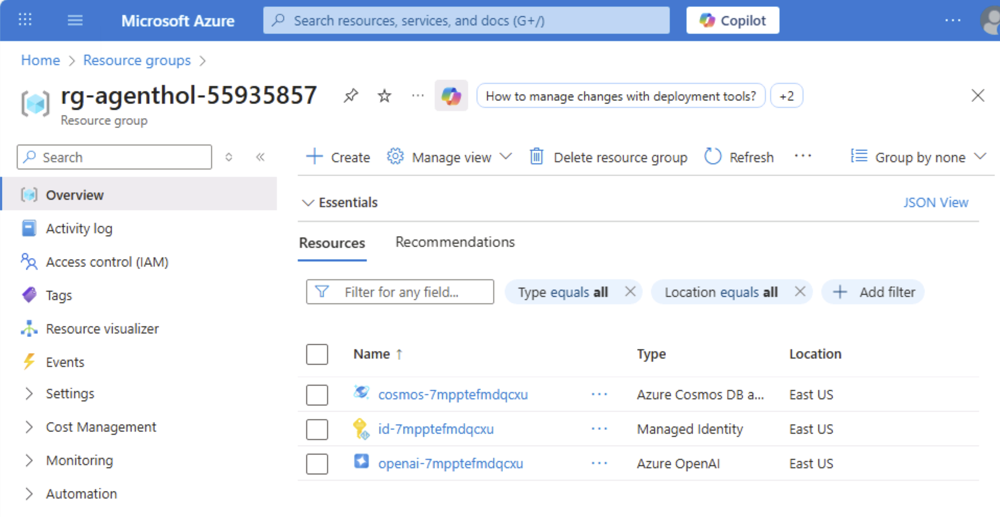

# Module 00 - Configure local lab resources

## Introduction

In this Module, you'll configure the lab resources then start the application to ensure everything has been properly configured.

1. Open a browser locally on the VM and navigate to +++https://portal.azure.com+++
1. Login using the credentials below
1. User name +++@lab.CloudPortalCredential(User1).Username+++
1. Temporary Access Pass +++@lab.CloudPortalCredential(User1).AccessToken+++
1. In the Search box at the top of the Azure Portal, type in `resource group`. Open the Resource groups blade
1. Open the resource group that starts with: *rg-agenthol-*.
1. If the resource group does not appear wait a few moments then refresh.
1. When the new resource group appears, expand the Overview tab and click deployments.

1. If all resources have been deployed successfully, you are ready to begin the lab. Your screen should look like this.

1. Leave this browser open to the Azure Portal.
1. Proceed to [Running the App](#running-the-app)

## Running the App

### Start the Backend App

1. Open VS Code from the desktop.
1. This should open this folder by default, *"C:\Users\LabUser\multi-agent-hol\01_exercises\"*. If not, navigate to and open this folder.
1. From the menu, select Terminal, New Terminal, then open a new PowerShell terminal.
1. Navigate to *csharp\src\MultiAgentCopilot*.

```shell
cd csharp\src\MultiAgentCopilot

```
1. Execute the below command in the Terminal to add the preview Nuget packages.

```shell
dotnet add package Azure.AI.OpenAI --prerelease
dotnet add package Azure.Identity
dotnet add package Microsoft.Agents.AI.OpenAI --prerelease
```

1. Type  `dotnet run` to start the multi-agent service.
1. You will notice some warnings when the app starts. You can ignore these.
1. When you see *No agents initialized in ChatService* the app has started.
1. Leave the app running.

### Start the Frontend App

1. Next we will start the frontend application. We will leave this running for the duration of the lab.
1. Within VS Code, open a new terminal.
1. Navigate to the *frontend* folder.

```shell
cd frontend
```

1. Copy and run the following:

```shell
npm install
npm start
```

1. If prompted, **Allow** so the Node.js Javascript Runtime can access this app over the network.
1. Open your browser and navigate to `http://localhost:4200/`.

### Start a Conversation

1. In the Login dialog, select a user and company and click, Login.
1. Start a new conversation.
1. Send the message:

```text
Hello, how are you?
```

1. You should see something like the output below.

   

### Stop the Application

1. Return to VS Code.
1. Select the backend terminal, press **Ctrl + C** to stop the backend application.

**Note:** Leave the front-end application running for the duration of the lab.

## Next Steps

Proceed to Module 1: Creating Your First Agent
