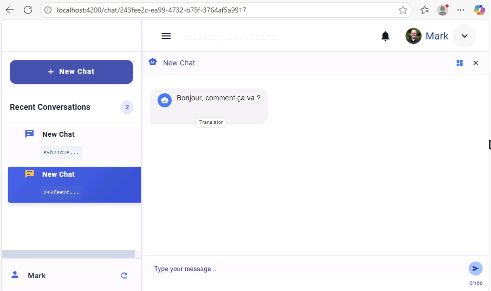

# Module 01 - Creating Your First Agent

## Introduction

In this module, you'll implement your first agent as part of a multi-agent banking system using Microsoft Agent Framework. You will get an introduction to the Microsoft Extensions AI framework and their integration with Azure OpenAI for generating intelligent responses in conversational interfaces.

## Learning Objectives

- Learn the fundamentals of Microsoft Agent Framework and Extensions AI
- Understand how to integrate agent frameworks with Azure OpenAI services
- Build and configure a simple chat agent with basic conversational capabilities
- Implement agent response handling and message processing

## Module Exercises

1. [Activity 1: Instantiate Agent Framework](#activity-1-instantiate-agent-framework)
1. [Activity 2: Create a Simple Agent](#activity-2-create-a-simple-agent)
1. [Activity 3: Test your Work](#activity-3-test-your-work)

## Activity 1: Instantiate Agent Framework

In this hands-on exercise, you will learn how to initialize an agent framework and integrate it with a Large Language Model (LLM).

The Microsoft Agent Framework is built on top of Microsoft Extensions AI, a unified API layer that provides a consistent interface for AI services. It enables developers to incorporate agentic patterns into applications by abstracting the complexities of different AI providers and offering a standardized way to build intelligent agents. Agents built using this framework can collaborate, manage multiple concurrent conversations, and integrate human input, making it suitable for complex, multi-agent workflows.

There are several key components and concepts necessary to build multi-agent apps using this framework:

- **IChatClient** - The core interface in Microsoft Extensions AI that provides a unified way to interact with different chat completion services. It abstracts the underlying AI provider (like Azure OpenAI, OpenAI, or others) and provides a consistent API for sending messages and receiving responses. The chat client handles the communication protocol, authentication, and request/response formatting, allowing developers to focus on building agent logic rather than managing provider-specific APIs.

- **AIAgent** - A higher-level abstraction built on top of IChatClient that represents an individual agent with specific behavior, personality, and capabilities. An AIAgent encapsulates the agent's instructions (system prompt), tools/functions it can use, and conversation handling logic. It provides methods like RunAsync() to process user input and generate responses based on the agent's configuration.

- **Tools and Functions** - Tools in the Microsoft Agent Framework are callable functions that extend an agent's capabilities beyond text generation. They come in two primary forms:
  - **Native Functions** - These are standard C# methods that perform specific tasks, such as accessing a database, calling an external API, or processing data. To define a native function, you create a method in your codebase and annotate it with attributes that describe its purpose and parameters. This metadata allows the agent framework to understand and utilize the function appropriately.
  - **Semantic Functions** - These functions are defined using natural language prompts and are designed to interact with LLMs for specific tasks. They guide the model to generate responses or perform tasks based on the provided prompt. Semantic functions can include variables and expressions to make the prompts dynamic and context-aware.

- **Agent Groups and Orchestration** - The framework supports multi-agent scenarios where multiple agents can collaborate on complex tasks. Agent groups allow for orchestration patterns where agents can hand off conversations, work in parallel, or follow specific workflows. This enables building sophisticated AI systems where different agents specialize in different domains or capabilities.

- **Connectors and Integrations** - The Microsoft Extensions AI framework provides connectors that facilitate seamless integration with various external services and AI models. These connectors enable developers to incorporate diverse AI functionalities—such as text generation, chat completion, embeddings, and vector search—into their applications without dealing with provider-specific APIs. There are two types of connectors we will use in this workshop:
  - **AI Service Connectors** - These provide a uniform interface to interact with multiple AI services, allowing developers to switch between different AI providers effortlessly. This flexibility is particularly beneficial for experimenting with various models.
  - **Vector Store Connectors** - Beyond direct AI service integrations, the framework provides connectors for various vector databases, including Azure Cosmos DB, facilitating tasks like semantic search and retrieval-augmented generation (RAG).

Let's dive into the starter solution for our workshop and get started completing the implementation for our multi-agent application.

### Implement the AgentFrameworkService

We are going to define two primary functions as part of our multi-agent application:

- **GetResponse()** will be the entry point called by the front end to interact with the multi-agent service. Everything happens behind this function.
- **Summarize()** will be used to summarize the conversations users are having with the agent service.

1. In VS Code, use the explorer on the left-hand side of the IDE to open the **01_exercises\csharp\src\MultiAgentCopilot\Services** folder.
1. Within the **\Services** folder navigate to **AgentFrameworkService.cs**.
1. Search for **//TO DO: CreateChatClient** and replace **CreateChatClient()** method with the code below.

**Note:** To paste code, place your cursor exactly where you want it in the code, including any tabs or spaces, then click the `T` in the lab guide. This will paste the code directly into your app. You may need to tab or format the code a little after pasting.

This method creates and configures an Azure OpenAI chat client with proper authentication. It uses DefaultAzureCredential for seamless authentication across different environments.

```csharp
        private IChatClient CreateChatClient()
        {
            try
            {
                var credential = CreateAzureCredential();
                var endpoint = new Uri(_settings.AzureOpenAISettings.Endpoint);
                var openAIClient = new AzureOpenAIClient(endpoint, credential, new AzureOpenAIClientOptions
                {
                    Transport = new HttpClientPipelineTransport(),
                });
        
                return openAIClient
                    .GetChatClient(_settings.AzureOpenAISettings.CompletionsDeployment)
                    .AsIChatClient();
            }
            catch (Exception ex)
            {
                _logger.LogError(ex, "Failed to create chat client");
                throw;
            }
        }

```

## Activity 2: Create a Simple Agent

 Let's create two simple agents powered by an LLM. The first agent will greet users and translate their requests into French, providing a multilingual experience. The second agent will implement a summarize function that dynamically renames the current chat session based on the user’s topic, making conversations easier to organize and reference.

1. Search for **//TO DO: Add GetResponse function** and replace **GetResponse()** method with the code below.

This method creates a simple AI agent with specific instructions and runs it with user input. The agent is configured to greet users and translate requests into French.


```csharp
    public async Task<Tuple<List<Message>, List<DebugLog>>> GetResponse(
        Message userMessage,
        List<Message> messageHistory,
        BankingDataService bankService,
        string tenantId,
        string userId)
    {
        try
        {
            var agent = _chatClient.CreateAIAgent(
                "Greet the user and translate the request into French",
                "Translator");
            
    
            var responseText= agent.RunAsync(userMessage.Text).GetAwaiter().GetResult().Text;
            return CreateResponseTuple(userMessage, responseText, "Translator");      
    
        }
        catch (Exception ex)
        {
            _logger.LogError(ex, "Error when getting response: {ErrorMessage}", ex.Message);
            return new Tuple<List<Message>, List<DebugLog>>(new List<Message>(), new List<DebugLog>());
        }
    }
```

2. Search for **//TO DO: Add Summarize function** and replace **Summarize()** method with the code below.

This method creates a summarization agent that condenses user input into exactly two words. It's useful for generating concise session titles or quick content summaries.

```csharp

public async Task<string> Summarize(string sessionId, string userPrompt)
{
    try
    {
        var agent = _chatClient.CreateAIAgent(
            "Summarize the text into exactly two words:", 
            "Summarizer");

        return agent.RunAsync(userPrompt).GetAwaiter().GetResult().Text;        
      
    }
    catch (Exception ex)
    {
        _logger.LogError(ex, "Error when getting response: {ErrorMessage}", ex.Message);
        return string.Empty;
    }
}   

```

### Update ChatService

1. Remain in the **/Services** folder
1. Navigate to **ChatService.cs**.
1. Replace the code for **GetChatCompletionAsync()** method with code below.

This method integrates the agent framework service with the chat service. It processes user messages and returns the agent's response through the framework.

```csharp
    public async Task<List<Message>> GetChatCompletionAsync(string tenantId, string userId, string? sessionId, string userPrompt)
    {
        try
        {
            var archivedMessages = new List<Message>();
            var userMessage = new Message(tenantId, userId, sessionId, "User", "User", userPrompt); 
            var result = await _afService.GetResponse(userMessage, archivedMessages, _bankService, tenantId, userId);
            return result.Item1;
        }
        catch (Exception ex)
        {
            _logger.LogError(ex, $"Error getting completion in session {sessionId} for user prompt [{userPrompt}].");
            return new List<Message> { new Message(tenantId, userId, sessionId!, "Error", "Error", $"Error getting completion in session {sessionId} for user prompt [{userPrompt}].") };
        }
    }

```


## Activity 3: Test your Work

With the activities in this module complete, it is time to test your work. The agent should respond and greet you then translate your request into French.

### Start the Backend

1. Return to the open terminal for the backend app in VS Code. Ensure you are in `01_exercises\csharp\src\MultiAgentCopilot` folder. Type `dotnet run`

### Start a Chat Session

1. Return to the still running frontend application in your browser.
1. Send the message:  

```text
Hello, how are you?
```

1. You should see something like the output below.

    

### Stop the Application

1. Return to VS Code.
1. Select the backend terminal, press **Ctrl + C** to stop the backend application.

## Validation Checklist

Your implementation is successful if:

- [ ] Your app compiles with no errors.
- [ ] Your agent successfully processes user input and generates an appropriate response.

## Module Solution

The following sections include the completed code for this Module. Copy and paste these into your project if you run into issues and cannot resolve.

<details>
  <summary>Completed code for <strong>\Services\AgentFrameworkService.cs</strong></summary>
<br>

```csharp
using Azure.AI.OpenAI;
using Azure.Identity;
using Banking.Services;
using Microsoft.Agents.AI;
using Microsoft.Agents.AI.Workflows;
using Microsoft.Azure.Cosmos;
using Microsoft.Extensions.AI;
using Microsoft.Extensions.Logging;
using Microsoft.Extensions.Options;
using ModelContextProtocol.Protocol;
using MultiAgentCopilot.Factories;
using MultiAgentCopilot.Models.Chat;
using MultiAgentCopilot.Models.Configuration;
using MultiAgentCopilot.Models.Debug;
using MultiAgentCopilot.MultiAgentCopilot.Factories;
using MultiAgentCopilot.MultiAgentCopilot.Helper;
using MultiAgentCopilot.MultiAgentCopilot.Services;
using OpenAI;
using OpenAI.Chat;
using System.ClientModel.Primitives;
using System.Diagnostics.Metrics;
using System.Text.Json;
using static System.Net.Mime.MediaTypeNames;
using ChatMessage = Microsoft.Extensions.AI.ChatMessage;
using OpenAI.Embeddings;

namespace MultiAgentCopilot.Services;

/// <summary>
/// Service responsible for managing AI agents and orchestrating multi-agent conversations
/// using the Microsoft Agents AI framework.
/// </summary>
public class AgentFrameworkService : IDisposable
{
    #region Private Fields
    
    private readonly AgentFrameworkServiceSettings _settings;
    private readonly ILoggerFactory _loggerFactory;
    private readonly ILogger<AgentFrameworkService> _logger;
    private readonly IChatClient _chatClient;
    
    private BankingDataService? _bankService;
    private MCPToolService? _mcpService;
    private List<AIAgent>? _agents;
    private List<LogProperty> _promptDebugProperties;
    
    private bool _serviceInitialized = false;

    #endregion

    #region Properties

    public bool IsInitialized => _serviceInitialized;

    #endregion

    #region Constructor

    public AgentFrameworkService(
        IOptions<AgentFrameworkServiceSettings> options,
        ILoggerFactory loggerFactory)
    {
        _settings = options?.Value ?? throw new ArgumentNullException(nameof(options));
        _loggerFactory = loggerFactory ?? throw new ArgumentNullException(nameof(loggerFactory));
        _logger = _loggerFactory.CreateLogger<AgentFrameworkService>();
        _promptDebugProperties = new List<LogProperty>();


        _chatClient = CreateChatClient();

        _logger.LogInformation("Agent Framework Initialized.");

        Task.Run(Initialize).ConfigureAwait(false);
    }

    #endregion

    #region Private Methods


    /// <summary>
    /// Creates and configures the Azure OpenAI chat client.
    /// </summary>
    /// 
    //TO DO: CreateChatClient
    private IChatClient CreateChatClient()
    {
        try
        {
            var credential = CreateAzureCredential();
            var endpoint = new Uri(_settings.AzureOpenAISettings.Endpoint);
            var openAIClient = new AzureOpenAIClient(endpoint, credential, new AzureOpenAIClientOptions
            {
                Transport = new HttpClientPipelineTransport(),
            });
    
            return openAIClient
                .GetChatClient(_settings.AzureOpenAISettings.CompletionsDeployment)
                .AsIChatClient();
        }
        catch (Exception ex)
        {
            _logger.LogError(ex, "Failed to create chat client");
            throw;
        }
    }


    public string GetEmbeddingDeploymentName()
    {
        return _settings.AzureOpenAISettings.EmbeddingsDeployment;
    }

    /// <summary>
    /// Creates the appropriate Azure credential based on configuration.
    /// </summary>
    private DefaultAzureCredential CreateAzureCredential()
    {
        if (string.IsNullOrEmpty(_settings.AzureOpenAISettings.UserAssignedIdentityClientID))
        {
            return new DefaultAzureCredential();
        }
        
        return new DefaultAzureCredential(new DefaultAzureCredentialOptions
        {
            ManagedIdentityClientId = _settings.AzureOpenAISettings.UserAssignedIdentityClientID
        });
    }

    /// <summary>
    /// Logs messages for debugging purposes.
    /// </summary>
    private void LogMessage(string key, string value)
    {
        _promptDebugProperties.Add(new LogProperty(key, value));
    }

    /// <summary>
    /// Initializes the service asynchronously.
    /// </summary>
    private Task Initialize()
    {
        try
        {
            _serviceInitialized = true;
            _logger.LogInformation("Agent Framework service initialized.");
        }
        catch (Exception ex)
        {
            _logger.LogError(ex, "Agent Framework service was not initialized. Error: {ErrorMessage}", ex.Message);
        }
        return Task.CompletedTask;
    }

    #endregion


    #region Public Methods

    //TO DO: Add SetInProcessToolService


    //TO DO: Add SetMCPToolService

    ////TO DO: Add RunGroupChatOrchestration

    /// <summary>
    /// Initializes the AI agents based on available tool services.
    /// </summary>
    /// <returns>True if agents were initialized successfully.</returns>
    public bool InitializeAgents()
    {
        try
        {

            if (_agents == null || _agents.Count == 0)
            {
                //TO DO: Add In Process Tools

                //TO DO: Add MCP Service Option


                if (_agents == null || _agents.Count == 0)
                {
                    _logger.LogError("No agents available for orchestration");
                    return false;
                }

                _logger.LogInformation("Successfully initialized {AgentCount} agents", _agents.Count);

                // Log agent details
                foreach (var agent in _agents)
                {
                    _logger.LogInformation("Agent: {AgentName}, Description: {Description}",
                        agent.Name, agent.Description);
                }
            }
            else
            {
                _logger.LogInformation("Agents already initialized ({AgentCount} agents available)", _agents.Count);
            }
            return true;
        }
        catch (Exception ex)
        {
            _logger.LogError(ex, "Failed to initialize agents: {ExceptionMessage}", ex.Message);
            return false;
        }
    }

    /// <summary>
    /// Processes a user message and returns the agent's response.
    /// </summary>
    /// <param name="userMessage">The user's message.</param>
    /// <param name="messageHistory">The conversation history.</param>
    /// <param name="bankService">The banking data service.</param>
    /// <param name="tenantId">The tenant identifier.</param>
    /// <param name="userId">The user identifier.</param>
    /// <returns>A tuple containing the response messages and debug logs.</returns>
    /// 
    //TO DO: Add GetResponse function
    public async Task<Tuple<List<Message>, List<DebugLog>>> GetResponse(
        Message userMessage,
        List<Message> messageHistory,
        BankingDataService bankService,
        string tenantId,
        string userId)
    {
        try
        {
            var agent = _chatClient.CreateAIAgent(
                "Greet the user and translate the request into French",
                "Translator");
            
    
            var responseText= agent.RunAsync(userMessage.Text).GetAwaiter().GetResult().Text;
            return CreateResponseTuple(userMessage, responseText, "Translator");      
    
        }
        catch (Exception ex)
        {
            _logger.LogError(ex, "Error when getting response: {ErrorMessage}", ex.Message);
            return new Tuple<List<Message>, List<DebugLog>>(new List<Message>(), new List<DebugLog>());
        }
    }

    /// <summary>
    /// Summarizes the given text.
    /// </summary>
    /// <param name="sessionId">The session identifier.</param>
    /// <param name="userPrompt">The text to summarize.</param>
    /// <returns>A summarized version of the text.</returns>
    /// 
    //TO DO: Add Summarize function
    
    public async Task<string> Summarize(string sessionId, string userPrompt)
    {
        try
        {
            var agent = _chatClient.CreateAIAgent(
                "Summarize the text into exactly two words:", 
                "Summarizer");

            return agent.RunAsync(userPrompt).GetAwaiter().GetResult().Text;        
        
        }
        catch (Exception ex)
        {
            _logger.LogError(ex, "Error when getting response: {ErrorMessage}", ex.Message);
            return string.Empty;
        }
    }   


    /// <summary>
    /// Disposes of the service resources.
    /// </summary>
    public void Dispose()
    {
        _mcpService?.Dispose();
        GC.SuppressFinalize(this);
    }

    #endregion

    #region Private Helper Methods

    /// <summary>
    /// Converts message history to AI chat message format.
    /// </summary>
    private List<ChatMessage> ConvertToAIChatMessages(List<Message> messageHistory)
    {
        var chatHistory = new List<ChatMessage>();
        
        foreach (var msg in messageHistory)
        {
            var role = msg.SenderRole.ToLowerInvariant() switch
            {
                "user" => ChatRole.User,
                "assistant" => ChatRole.Assistant,
                "system" => ChatRole.System,
                _ => ChatRole.User
            };

            chatHistory.Add(new ChatMessage(role, msg.Text));
        }

        return chatHistory;
    }

    /// <summary>
    /// Creates a response tuple with message and debug log.
    /// </summary>
    private Tuple<List<Message>, List<DebugLog>> CreateResponseTuple(
        Message userMessage, 
        string responseText, 
        string selectedAgentName)
    {
        var completionMessages = new List<Message>();
        var completionMessagesLogs = new List<DebugLog>();

        string messageId = Guid.NewGuid().ToString();
        string debugLogId = Guid.NewGuid().ToString();

        var responseMessage = new Message(
            userMessage.TenantId,
            userMessage.UserId,
            userMessage.SessionId,
            selectedAgentName,
            "Assistant",
            responseText,
            messageId,
            debugLogId);

        completionMessages.Add(responseMessage);

        if (_promptDebugProperties.Count > 0)
        {
            var debugLog = new DebugLog(userMessage.TenantId, userMessage.UserId, userMessage.SessionId, messageId, debugLogId)
            {
                PropertyBag = _promptDebugProperties.ToList()
            };
            completionMessagesLogs.Add(debugLog);
        }

        return new Tuple<List<Message>, List<DebugLog>>(completionMessages, completionMessagesLogs);
    }

    /// <summary>
    /// Runs the workflow asynchronously and returns the response messages and selected agent.
    /// </summary>
    private async Task<(List<ChatMessage> messages, string selectedAgent)> RunWorkflowAsync(
        Workflow workflow, 
        List<ChatMessage> messages)
    {
        try
        {

            string? lastExecutorId = null;
            string selectedAgent = "__";
            int counter = 0;

            while (selectedAgent == "__" && counter<5)
            {
                await using StreamingRun run = await InProcessExecution.StreamAsync(workflow, messages);
               
                await run.TrySendMessageAsync(new TurnToken(emitEvents: true));

                await foreach (WorkflowEvent evt in run.WatchStreamAsync().ConfigureAwait(false))               
                {
                    switch (evt)
                    {
                        case AgentRunUpdateEvent e when e.ExecutorId != lastExecutorId:
                            lastExecutorId = e.ExecutorId;
                            selectedAgent = ExtractAgentNameFromExecutorId(e.ExecutorId) ?? "__";
                            break;

                        case WorkflowOutputEvent output:
                            return (output.As<List<ChatMessage>>()!, selectedAgent);
                    }
                }
                
                counter++;
            }
            return ([], selectedAgent);
        }
        catch (Exception ex)
        {
            _logger.LogError(ex, "Error during workflow execution: {ErrorMessage}", ex.Message);
            return ([], "Error");
        }
    }


    /// <summary>
    /// Extracts the agent name from the executor ID by removing the GUID suffix.
    /// </summary>
    private static string? ExtractAgentNameFromExecutorId(string? executorId)
    {
        if (string.IsNullOrEmpty(executorId))
            return null;

        var parts = executorId.Split('_');
        return parts.Length > 0 ? parts[0] : executorId;
    }

    //TO DO: Add RunGroupChatOrchestration
    


    /// <summary>
    /// Creates a custom termination function for the group chat orchestrator.
    /// </summary>
    private Func<GroupChatWorkflowHelper, IEnumerable<ChatMessage>, CancellationToken, ValueTask<bool>> CreateCustomTerminationFunction()
    {
        return async (orchestrator, messages, token) =>
        {
            try
            {
                // The AI-based termination logic is implemented in the GroupChatOrchestrator
                // This function allows for additional business logic if needed
                return false; // Let the AI make the decision
            }
            catch (Exception ex)
            {
                _logger.LogError(ex, "Error in custom termination function");
                return false; // Continue conversation on error
            }
        };
    }

    /// <summary>
    /// Extracts the response text from the last assistant message.
    /// </summary>
    private static string ExtractResponseText(List<ChatMessage> responseMessages)
    {
        if (responseMessages?.Any() == true)
        {
            var lastAssistantMessage = responseMessages.LastOrDefault(m => m.Role == ChatRole.Assistant);
            return lastAssistantMessage?.Text ?? "";
        }
        return "";
    }

    #endregion

    public AzureOpenAIClient GetAzureOpenAIClient()
    {
        try
        {
            var credential = CreateAzureCredential();
            var endpoint = new Uri(_settings.AzureOpenAISettings.Endpoint);
            return new AzureOpenAIClient(endpoint, credential);
        }
        catch (Exception ex)
        {
            _logger.LogError(ex, "Failed to create AzureOpenAI client");
            throw;
        }
    }
}

```
</details>
<details>
  <summary>Completed code for <strong>\Services\ChatService.cs</strong></summary>
<br>

```csharp
using Banking.Services;
using Microsoft.Extensions.DependencyInjection;
using Microsoft.Extensions.Options;
using MultiAgentCopilot.Models.Chat;
using MultiAgentCopilot.Models.Configuration;
using MultiAgentCopilot.Models.Debug;
using MultiAgentCopilot.MultiAgentCopilot.Services;
using Newtonsoft.Json;
using Newtonsoft.Json.Linq;
using OpenAI.Embeddings;
using System.Text.Json;
using OpenAI;
namespace MultiAgentCopilot.Services;

public class ChatService
{
    private readonly CosmosDBService _cosmosDBService;
    private readonly BankingDataService _bankService;
    private readonly MCPToolService _mcpService;
    private readonly  AgentFrameworkService _afService;
    private readonly ILogger _logger;


    public ChatService(
        IOptions<CosmosDBSettings> cosmosOptions,
        IOptions<AgentFrameworkServiceSettings> afOptions,
        CosmosDBService cosmosDBService,
        AgentFrameworkService afService,
        MCPToolService mcpService,
        ILoggerFactory loggerFactory)
    {
        _cosmosDBService = cosmosDBService;
        _afService = afService;
        _mcpService = mcpService;

        _logger = loggerFactory.CreateLogger<ChatService>();

        // Initialize the Agent Framework with tool service
        if (afOptions.Value.UseMCPTools)
        {

            //MCP tools
            // TO DO: Invoke SetMCPToolService
        }
        else
        {
            //In-Process Tools
            //TO DO: Invoke SetInProcessToolService

        }

        if (!_afService.InitializeAgents())
            _logger.LogWarning("No agents initialized in ChatService.");

       
    }

    /// <summary>
    /// Returns list of chat session ids and names.
    /// </summary>
    public async Task<List<Session>> GetAllChatSessionsAsync(string tenantId, string userId)
    {
        return await _cosmosDBService.GetUserSessionsAsync(tenantId, userId);
    }

    /// <summary>
    /// Returns the chat messages related to an existing session.
    /// </summary>
    public async Task<List<Message>> GetChatSessionMessagesAsync(string tenantId, string userId, string sessionId)
    {
        ArgumentNullException.ThrowIfNull(sessionId);
        return await _cosmosDBService.GetSessionMessagesAsync(tenantId, userId, sessionId);
    }

    /// <summary>
    /// Creates a new chat session.
    /// </summary>
    public async Task<Session> CreateNewChatSessionAsync(string tenantId, string userId)
    {
        Session session = new(tenantId, userId);
        return await _cosmosDBService.InsertSessionAsync(session);
    }

    /// <summary>
    /// Rename the chat session from its default (eg., "New Chat") to the summary provided by OpenAI.
    /// </summary>
    public async Task<Session> RenameChatSessionAsync(string tenantId, string userId, string sessionId, string newChatSessionName)
    {
        ArgumentNullException.ThrowIfNull(sessionId);
        ArgumentException.ThrowIfNullOrEmpty(newChatSessionName);

        return await _cosmosDBService.UpdateSessionNameAsync(tenantId, userId, sessionId, newChatSessionName);
    }

    /// <summary>
    /// Delete a chat session and related messages.
    /// </summary>
    public async Task DeleteChatSessionAsync(string tenantId, string userId, string sessionId)
    {
        ArgumentNullException.ThrowIfNull(sessionId);
        await _cosmosDBService.DeleteSessionAndMessagesAsync(tenantId, userId, sessionId);
    }

    /// <summary>
    /// Receive a prompt from a user, vectorize it from the OpenAI service, and get a completion from the OpenAI service.
    /// </summary>
    public async Task<List<Message>> GetChatCompletionAsync(string tenantId, string userId, string? sessionId, string userPrompt)
    {
        try
        {
            var archivedMessages = new List<Message>();
            var userMessage = new Message(tenantId, userId, sessionId, "User", "User", userPrompt); 
            var result = await _afService.GetResponse(userMessage, archivedMessages, _bankService, tenantId, userId);
            return result.Item1;
        }
        catch (Exception ex)
        {
            _logger.LogError(ex, $"Error getting completion in session {sessionId} for user prompt [{userPrompt}].");
            return new List<Message> { new Message(tenantId, userId, sessionId!, "Error", "Error", $"Error getting completion in session {sessionId} for user prompt [{userPrompt}].") };
        }
    }


    //TO DO: Add AddPromptCompletionMessagesAsync
    


    /// <summary>
    /// Generate a name for a chat message, based on the passed in prompt.
    /// </summary>
    public async Task<string> SummarizeChatSessionNameAsync(string tenantId, string userId, string? sessionId, string prompt)
    {
        try
        {
            ArgumentNullException.ThrowIfNull(sessionId);

            var summary = await _afService.Summarize(sessionId, prompt);

            var session = await RenameChatSessionAsync(tenantId, userId, sessionId, summary);

            return session.Name;
        }
        catch (Exception ex)
        {

            _logger.LogError(ex, $"Error getting a summary in session {sessionId} for user prompt [{prompt}].");
            return $"Error getting a summary in session {sessionId} for user prompt [{prompt}].";
        }

    }


    /// <summary>
    /// Rate an assistant message. This can be used to discover useful AI responses for training, discoverability, and other benefits down the road.
    /// </summary>
    public async Task<Message> RateChatCompletionAsync(string tenantId, string userId, string messageId, string sessionId, bool? rating)
    {
        ArgumentNullException.ThrowIfNull(messageId);
        ArgumentNullException.ThrowIfNull(sessionId);

        return await _cosmosDBService.UpdateMessageRatingAsync(tenantId, userId, sessionId, messageId, rating);
    }

    public async Task<DebugLog> GetChatCompletionDebugLogAsync(string tenantId, string userId, string sessionId, string debugLogId)
    {
        ArgumentException.ThrowIfNullOrEmpty(sessionId);
        ArgumentException.ThrowIfNullOrEmpty(debugLogId);

        return await _cosmosDBService.GetChatCompletionDebugLogAsync(tenantId, userId, sessionId, debugLogId);
    }


}

```

</details>

## Next Steps

Proceed to Module 2: [Connecting Agents to Memory](./Module-02.md)
