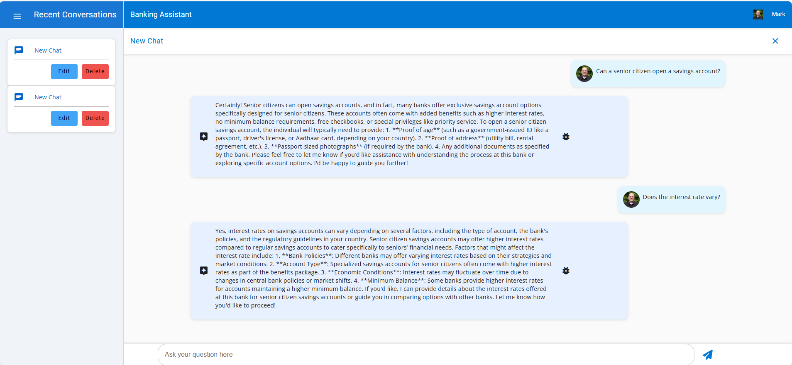

# Module 02 - Connecting Agents to Memory

## Introduction

In this module, you'll connect your agent to Azure Cosmos DB to provide persistent memory for chat history and state management. This enables your agents to maintain context across conversations and provide more coherent, context-aware interactions.

## Learning Objectives

- Understand Azure Cosmos DB integration for agent memory and state persistence
- Learn how to implement chat history management in agent frameworks
- Configure agents to maintain conversation context across multiple interactions
- Test connectivity and data persistence with Azure Cosmos DB

## Module Exercises

1. [Activity 1: Connecting Agent Frameworks to Azure Cosmos DB](#activity-1-connecting-agent-frameworks-to-azure-cosmos-db)
1. [Activity 2: Test your Work](#activity-2-test-your-work)


## Activity 1: Connecting Agent Frameworks to Azure Cosmos DB

In this activity, you will learn how to initialize Azure Cosmos DB and integrate with an agent framework to provide persistent memory for chat history and state management.

### Update GetResponse() function in AgentFrameworkService

The **GetResponse()** function is the main entry point for our multi-agent application. Within that function, a variable named **messageHistory** stores a list of historical messages from the chat session. The **chatHistory** object is used to construct this history and pass it to the Microsoft Agent Framework Chat Client. The **completionMessages** list is used to store the response received from the agent which then needs to be persisted in Cosmos DB for the next iteration of the agent.

We're going to modify this function to provide that persistence with Cosmos DB.

1. In VS Code, return to the **AgentFrameworkService.cs** in the **/Services** folder.
1. Replace the **GetResponse()** method with the code below:

This method handles message history management and creates a specialized banking agent. It converts message history to the appropriate format and maintains conversation context.

```csharp
     public async Task<Tuple<List<Message>, List<DebugLog>>> GetResponse(
         Message userMessage,
         List<Message> messageHistory,
         BankingDataService bankService,
         string tenantId,
         string userId)
     {
         try
         {
             messageHistory.Add(userMessage);
             var chatHistory = ConvertToAIChatMessages(messageHistory);
             chatHistory.Add(new ChatMessage(ChatRole.User, userMessage.Text));
    
             _promptDebugProperties.Clear();
    
              var agent = _chatClient.CreateAIAgent(
                 "You are a front desk agent in a bank. Respond to the user queries professionally. Provide professional and helpful responses to user queries.Use your knowledge of banking services and procedures to address user queries accurately.",
                 "Banker");
    
             var responseText= agent.RunAsync(chatHistory).GetAwaiter().GetResult().Text;
             return CreateResponseTuple(userMessage, responseText, "Banker");
         }
         catch (Exception ex)
         {
             _logger.LogError(ex, "Error when getting response: {ErrorMessage}", ex.Message);
             return new Tuple<List<Message>, List<DebugLog>>(new List<Message>(), new List<DebugLog>());
         }
     }
```

#### Chat Data models

We can now update our Chat Service to store the messages generated between users and agents. In this step, we will add a new function that first calls the Cosmos DB service to get a Session object from our database. The Session object is part of an object hierarchy that defines the conversations between users and agents. A session has a name and also an array of messages for that conversation topic.

Let's view the data model for our chat session object.

1. In VS Code, navigate to the **/Models/Chat** folder.
1. Review **Session.cs** and **Message.cs** classes.

#### Update Chat Service

With a reference to the current session returned from the CosmosDBService, this function calls our newly implemented function to update the messages within the session object with any new or updated messages. Typically, this would include a single user prompt, followed by one or more responses from the agents.

1. In VS Code, navigate to the **/Services** folder and open the **ChatService.cs** class.
1. Search for **//TO DO: Add AddPromptCompletionMessagesAsync** and paste the below code. 


This method handles the persistence of conversation messages to Cosmos DB. It retrieves the session, adds new messages, and performs a batch upsert operation.

```csharp
    /// <summary>
    /// Add user prompt and AI assistance response to the chat session message list object and insert into the data service as a transaction.
    /// </summary>
    ///
    private async Task AddPromptCompletionMessagesAsync(string tenantId, string userId, string sessionId, Message promptMessage, List<Message> completionMessages, List<DebugLog> completionMessageLogs)
    {
        var session = await _cosmosDBService.GetSessionAsync(tenantId, userId, sessionId);
    
        completionMessages.Insert(0, promptMessage);
        await _cosmosDBService.UpsertSessionBatchAsync(completionMessages, completionMessageLogs, session);
    }
```

#### Utilize and Store History in GetChatCompletionAsync

1. Next, locate the **GetChatCompletionAsync()** function.
1. Update the function by replacing the code **within** the **Try** block with the below:

This method orchestrates the complete chat flow: retrieving history, processing user input, generating agent responses, and persisting the conversation data to Cosmos DB.

```csharp
            ArgumentNullException.ThrowIfNull(sessionId);

            // Retrieve conversation, including latest prompt.
            var archivedMessages = await _cosmosDBService.GetSessionMessagesAsync(tenantId, userId, sessionId);

            // Add both prompt and completion to cache, then persist in Cosmos DB
            var userMessage = new Message(tenantId, userId, sessionId, "User", "User", userPrompt);

            // Generate the completion to return to the user
            var result = await _afService.GetResponse(userMessage, archivedMessages, _bankService, tenantId, userId);

            await AddPromptCompletionMessagesAsync(tenantId, userId, sessionId, userMessage, result.Item1, result.Item2);

            return result.Item1;
```

## Activity 2: Test your Work

With the activities in this module complete, it is time to test your work.

### Start the Backend

1. Return to the open terminal for the backend app in VS Code. Ensure you are in `01_exercises\csharp\src\MultiAgentCopilot`. Type `dotnet run`

### Start a Chat Session

We have a new agent now that thinks it works for a bank. So in our test here we are going to ask it banking-related questions.

1. Return to the frontend application in your browser.
1. Send the following message:

```text
Can a senior citizen open a savings account?
```

1. Wait for the Agent response.
1. Send another message:

```text
Does the interest rate vary?
```

1. Expected response: The Agent's response is contextually correct for the whole chat session.
1. You should see something like the output below.

    

### Stop the Application

1. Return to VS Code.
1. Press **Ctrl + C** to stop the backend application.

## Validation Checklist

Your implementation is successful if:

- [ ] Your app compiles with no errors.
- [ ] Your agent successfully responds with contextually correct information.

## Module Solution

The following sections include the completed code for this Module. Copy and paste these into your project if you run into issues and cannot resolve.

<details>
  <summary>Completed code for <strong>\Services\AgentFrameworkService.cs</strong></summary>
<br>

```csharp
using Azure.AI.OpenAI;
using Azure.Identity;
using Banking.Services;
using Microsoft.Agents.AI;
using Microsoft.Agents.AI.Workflows;
using Microsoft.Azure.Cosmos;
using Microsoft.Extensions.AI;
using Microsoft.Extensions.Logging;
using Microsoft.Extensions.Options;
using ModelContextProtocol.Protocol;
using MultiAgentCopilot.Factories;
using MultiAgentCopilot.Models.Chat;
using MultiAgentCopilot.Models.Configuration;
using MultiAgentCopilot.Models.Debug;
using MultiAgentCopilot.MultiAgentCopilot.Factories;
using MultiAgentCopilot.MultiAgentCopilot.Helper;
using MultiAgentCopilot.MultiAgentCopilot.Services;
using OpenAI;
using OpenAI.Chat;
using System.ClientModel.Primitives;
using System.Diagnostics.Metrics;
using System.Text.Json;
using static System.Net.Mime.MediaTypeNames;
using ChatMessage = Microsoft.Extensions.AI.ChatMessage;
using OpenAI.Embeddings;

namespace MultiAgentCopilot.Services;

/// <summary>
/// Service responsible for managing AI agents and orchestrating multi-agent conversations
/// using the Microsoft Agents AI framework.
/// </summary>
public class AgentFrameworkService : IDisposable
{
    #region Private Fields
    
    private readonly AgentFrameworkServiceSettings _settings;
    private readonly ILoggerFactory _loggerFactory;
    private readonly ILogger<AgentFrameworkService> _logger;
    private readonly IChatClient _chatClient;
    
    private BankingDataService? _bankService;
    private MCPToolService? _mcpService;
    private List<AIAgent>? _agents;
    private List<LogProperty> _promptDebugProperties;
    
    private bool _serviceInitialized = false;

    #endregion

    #region Properties

    public bool IsInitialized => _serviceInitialized;

    #endregion

    #region Constructor

    public AgentFrameworkService(
        IOptions<AgentFrameworkServiceSettings> options,
        ILoggerFactory loggerFactory)
    {
        _settings = options?.Value ?? throw new ArgumentNullException(nameof(options));
        _loggerFactory = loggerFactory ?? throw new ArgumentNullException(nameof(loggerFactory));
        _logger = _loggerFactory.CreateLogger<AgentFrameworkService>();
        _promptDebugProperties = new List<LogProperty>();


        _chatClient = CreateChatClient();

        _logger.LogInformation("Agent Framework Initialized.");

        Task.Run(Initialize).ConfigureAwait(false);
    }

    #endregion

    #region Private Methods


    /// <summary>
    /// Creates and configures the Azure OpenAI chat client.
    /// </summary>
    /// 
    //TO DO: CreateChatClient
    private IChatClient CreateChatClient()
    {
        try
        {
            var credential = CreateAzureCredential();
            var endpoint = new Uri(_settings.AzureOpenAISettings.Endpoint);
            var openAIClient = new AzureOpenAIClient(endpoint, credential, new AzureOpenAIClientOptions
            {
                Transport = new HttpClientPipelineTransport(),
            });
    
            return openAIClient
                .GetChatClient(_settings.AzureOpenAISettings.CompletionsDeployment)
                .AsIChatClient();
        }
        catch (Exception ex)
        {
            _logger.LogError(ex, "Failed to create chat client");
            throw;
        }
    }


    public string GetEmbeddingDeploymentName()
    {
        return _settings.AzureOpenAISettings.EmbeddingsDeployment;
    }

    /// <summary>
    /// Creates the appropriate Azure credential based on configuration.
    /// </summary>
    private DefaultAzureCredential CreateAzureCredential()
    {
        if (string.IsNullOrEmpty(_settings.AzureOpenAISettings.UserAssignedIdentityClientID))
        {
            return new DefaultAzureCredential();
        }
        
        return new DefaultAzureCredential(new DefaultAzureCredentialOptions
        {
            ManagedIdentityClientId = _settings.AzureOpenAISettings.UserAssignedIdentityClientID
        });
    }

    /// <summary>
    /// Logs messages for debugging purposes.
    /// </summary>
    private void LogMessage(string key, string value)
    {
        _promptDebugProperties.Add(new LogProperty(key, value));
    }

    /// <summary>
    /// Initializes the service asynchronously.
    /// </summary>
    private Task Initialize()
    {
        try
        {
            _serviceInitialized = true;
            _logger.LogInformation("Agent Framework service initialized.");
        }
        catch (Exception ex)
        {
            _logger.LogError(ex, "Agent Framework service was not initialized. Error: {ErrorMessage}", ex.Message);
        }
        return Task.CompletedTask;
    }

    #endregion


    #region Public Methods

    //TO DO: Add SetInProcessToolService


    //TO DO: Add SetMCPToolService

    ////TO DO: Add RunGroupChatOrchestration

    /// <summary>
    /// Initializes the AI agents based on available tool services.
    /// </summary>
    /// <returns>True if agents were initialized successfully.</returns>
    public bool InitializeAgents()
    {
        try
        {

            if (_agents == null || _agents.Count == 0)
            {
                //TO DO: Add In Process Tools

                //TO DO: Add MCP Service Option


                if (_agents == null || _agents.Count == 0)
                {
                    _logger.LogError("No agents available for orchestration");
                    return false;
                }

                _logger.LogInformation("Successfully initialized {AgentCount} agents", _agents.Count);

                // Log agent details
                foreach (var agent in _agents)
                {
                    _logger.LogInformation("Agent: {AgentName}, Description: {Description}",
                        agent.Name, agent.Description);
                }
            }
            else
            {
                _logger.LogInformation("Agents already initialized ({AgentCount} agents available)", _agents.Count);
            }
            return true;
        }
        catch (Exception ex)
        {
            _logger.LogError(ex, "Failed to initialize agents: {ExceptionMessage}", ex.Message);
            return false;
        }
    }

    /// <summary>
    /// Processes a user message and returns the agent's response.
    /// </summary>
    /// <param name="userMessage">The user's message.</param>
    /// <param name="messageHistory">The conversation history.</param>
    /// <param name="bankService">The banking data service.</param>
    /// <param name="tenantId">The tenant identifier.</param>
    /// <param name="userId">The user identifier.</param>
    /// <returns>A tuple containing the response messages and debug logs.</returns>
    /// 
    //TO DO: Add GetResponse function
    public async Task<Tuple<List<Message>, List<DebugLog>>> GetResponse(
         Message userMessage,
         List<Message> messageHistory,
         BankingDataService bankService,
         string tenantId,
         string userId)
     {
         try
         {
             messageHistory.Add(userMessage);
             var chatHistory = ConvertToAIChatMessages(messageHistory);
             chatHistory.Add(new ChatMessage(ChatRole.User, userMessage.Text));
    
             _promptDebugProperties.Clear();
    
              var agent = _chatClient.CreateAIAgent(
                 "You are a front desk agent in a bank. Respond to the user queries professionally. Provide professional and helpful responses to user queries.Use your knowledge of banking services and procedures to address user queries accurately.",
                 "Banker");
    
             var responseText= agent.RunAsync(chatHistory).GetAwaiter().GetResult().Text;
             return CreateResponseTuple(userMessage, responseText, "Banker");
         }
         catch (Exception ex)
         {
             _logger.LogError(ex, "Error when getting response: {ErrorMessage}", ex.Message);
             return new Tuple<List<Message>, List<DebugLog>>(new List<Message>(), new List<DebugLog>());
         }
     }

    /// <summary>
    /// Summarizes the given text.
    /// </summary>
    /// <param name="sessionId">The session identifier.</param>
    /// <param name="userPrompt">The text to summarize.</param>
    /// <returns>A summarized version of the text.</returns>
    /// 
    //TO DO: Add Summarize function
    
    public async Task<string> Summarize(string sessionId, string userPrompt)
    {
        try
        {
            var agent = _chatClient.CreateAIAgent(
                "Summarize the text into exactly two words:", 
                "Summarizer");

            return agent.RunAsync(userPrompt).GetAwaiter().GetResult().Text;        
        
        }
        catch (Exception ex)
        {
            _logger.LogError(ex, "Error when getting response: {ErrorMessage}", ex.Message);
            return string.Empty;
        }
    }   


    /// <summary>
    /// Disposes of the service resources.
    /// </summary>
    public void Dispose()
    {
        _mcpService?.Dispose();
        GC.SuppressFinalize(this);
    }

    #endregion

    #region Private Helper Methods

    /// <summary>
    /// Converts message history to AI chat message format.
    /// </summary>
    private List<ChatMessage> ConvertToAIChatMessages(List<Message> messageHistory)
    {
        var chatHistory = new List<ChatMessage>();
        
        foreach (var msg in messageHistory)
        {
            var role = msg.SenderRole.ToLowerInvariant() switch
            {
                "user" => ChatRole.User,
                "assistant" => ChatRole.Assistant,
                "system" => ChatRole.System,
                _ => ChatRole.User
            };

            chatHistory.Add(new ChatMessage(role, msg.Text));
        }

        return chatHistory;
    }

    /// <summary>
    /// Creates a response tuple with message and debug log.
    /// </summary>
    private Tuple<List<Message>, List<DebugLog>> CreateResponseTuple(
        Message userMessage, 
        string responseText, 
        string selectedAgentName)
    {
        var completionMessages = new List<Message>();
        var completionMessagesLogs = new List<DebugLog>();

        string messageId = Guid.NewGuid().ToString();
        string debugLogId = Guid.NewGuid().ToString();

        var responseMessage = new Message(
            userMessage.TenantId,
            userMessage.UserId,
            userMessage.SessionId,
            selectedAgentName,
            "Assistant",
            responseText,
            messageId,
            debugLogId);

        completionMessages.Add(responseMessage);

        if (_promptDebugProperties.Count > 0)
        {
            var debugLog = new DebugLog(userMessage.TenantId, userMessage.UserId, userMessage.SessionId, messageId, debugLogId)
            {
                PropertyBag = _promptDebugProperties.ToList()
            };
            completionMessagesLogs.Add(debugLog);
        }

        return new Tuple<List<Message>, List<DebugLog>>(completionMessages, completionMessagesLogs);
    }

    /// <summary>
    /// Runs the workflow asynchronously and returns the response messages and selected agent.
    /// </summary>
    private async Task<(List<ChatMessage> messages, string selectedAgent)> RunWorkflowAsync(
        Workflow workflow, 
        List<ChatMessage> messages)
    {
        try
        {

            string? lastExecutorId = null;
            string selectedAgent = "__";
            int counter = 0;

            while (selectedAgent == "__" && counter<5)
            {
                await using StreamingRun run = await InProcessExecution.StreamAsync(workflow, messages);
               
                await run.TrySendMessageAsync(new TurnToken(emitEvents: true));

                await foreach (WorkflowEvent evt in run.WatchStreamAsync().ConfigureAwait(false))               
                {
                    switch (evt)
                    {
                        case AgentRunUpdateEvent e when e.ExecutorId != lastExecutorId:
                            lastExecutorId = e.ExecutorId;
                            selectedAgent = ExtractAgentNameFromExecutorId(e.ExecutorId) ?? "__";
                            break;

                        case WorkflowOutputEvent output:
                            return (output.As<List<ChatMessage>>()!, selectedAgent);
                    }
                }
                
                counter++;
            }
            return ([], selectedAgent);
        }
        catch (Exception ex)
        {
            _logger.LogError(ex, "Error during workflow execution: {ErrorMessage}", ex.Message);
            return ([], "Error");
        }
    }


    /// <summary>
    /// Extracts the agent name from the executor ID by removing the GUID suffix.
    /// </summary>
    private static string? ExtractAgentNameFromExecutorId(string? executorId)
    {
        if (string.IsNullOrEmpty(executorId))
            return null;

        var parts = executorId.Split('_');
        return parts.Length > 0 ? parts[0] : executorId;
    }

    //TO DO: Add RunGroupChatOrchestration
    


    /// <summary>
    /// Creates a custom termination function for the group chat orchestrator.
    /// </summary>
    private Func<GroupChatWorkflowHelper, IEnumerable<ChatMessage>, CancellationToken, ValueTask<bool>> CreateCustomTerminationFunction()
    {
        return async (orchestrator, messages, token) =>
        {
            try
            {
                // The AI-based termination logic is implemented in the GroupChatOrchestrator
                // This function allows for additional business logic if needed
                return false; // Let the AI make the decision
            }
            catch (Exception ex)
            {
                _logger.LogError(ex, "Error in custom termination function");
                return false; // Continue conversation on error
            }
        };
    }

    /// <summary>
    /// Extracts the response text from the last assistant message.
    /// </summary>
    private static string ExtractResponseText(List<ChatMessage> responseMessages)
    {
        if (responseMessages?.Any() == true)
        {
            var lastAssistantMessage = responseMessages.LastOrDefault(m => m.Role == ChatRole.Assistant);
            return lastAssistantMessage?.Text ?? "";
        }
        return "";
    }

    #endregion

    public AzureOpenAIClient GetAzureOpenAIClient()
    {
        try
        {
            var credential = CreateAzureCredential();
            var endpoint = new Uri(_settings.AzureOpenAISettings.Endpoint);
            return new AzureOpenAIClient(endpoint, credential);
        }
        catch (Exception ex)
        {
            _logger.LogError(ex, "Failed to create AzureOpenAI client");
            throw;
        }
    }
}

```
</details>
<details>
  <summary>Completed code for <strong>\Services\ChatService.cs</strong></summary>
<br>

```csharp
using Banking.Services;
using Microsoft.Extensions.DependencyInjection;
using Microsoft.Extensions.Options;
using MultiAgentCopilot.Models.Chat;
using MultiAgentCopilot.Models.Configuration;
using MultiAgentCopilot.Models.Debug;
using MultiAgentCopilot.MultiAgentCopilot.Services;
using Newtonsoft.Json;
using Newtonsoft.Json.Linq;
using OpenAI.Embeddings;
using System.Text.Json;
using OpenAI;
namespace MultiAgentCopilot.Services;

public class ChatService
{
    private readonly CosmosDBService _cosmosDBService;
    private readonly BankingDataService _bankService;
    private readonly MCPToolService _mcpService;
    private readonly  AgentFrameworkService _afService;
    private readonly ILogger _logger;


    public ChatService(
        IOptions<CosmosDBSettings> cosmosOptions,
        IOptions<AgentFrameworkServiceSettings> afOptions,
        CosmosDBService cosmosDBService,
        AgentFrameworkService afService,
        MCPToolService mcpService,
        ILoggerFactory loggerFactory)
    {
        _cosmosDBService = cosmosDBService;
        _afService = afService;
        _mcpService = mcpService;

        _logger = loggerFactory.CreateLogger<ChatService>();

        // Initialize the Agent Framework with tool service
        if (afOptions.Value.UseMCPTools)
        {

            //MCP tools
            // TO DO: Invoke SetMCPToolService
        }
        else
        {
            //In-Process Tools
            //TO DO: Invoke SetInProcessToolService

        }

        if (!_afService.InitializeAgents())
            _logger.LogWarning("No agents initialized in ChatService.");

       
    }

    /// <summary>
    /// Returns list of chat session ids and names.
    /// </summary>
    public async Task<List<Session>> GetAllChatSessionsAsync(string tenantId, string userId)
    {
        return await _cosmosDBService.GetUserSessionsAsync(tenantId, userId);
    }

    /// <summary>
    /// Returns the chat messages related to an existing session.
    /// </summary>
    public async Task<List<Message>> GetChatSessionMessagesAsync(string tenantId, string userId, string sessionId)
    {
        ArgumentNullException.ThrowIfNull(sessionId);
        return await _cosmosDBService.GetSessionMessagesAsync(tenantId, userId, sessionId);
    }

    /// <summary>
    /// Creates a new chat session.
    /// </summary>
    public async Task<Session> CreateNewChatSessionAsync(string tenantId, string userId)
    {
        Session session = new(tenantId, userId);
        return await _cosmosDBService.InsertSessionAsync(session);
    }

    /// <summary>
    /// Rename the chat session from its default (eg., "New Chat") to the summary provided by OpenAI.
    /// </summary>
    public async Task<Session> RenameChatSessionAsync(string tenantId, string userId, string sessionId, string newChatSessionName)
    {
        ArgumentNullException.ThrowIfNull(sessionId);
        ArgumentException.ThrowIfNullOrEmpty(newChatSessionName);

        return await _cosmosDBService.UpdateSessionNameAsync(tenantId, userId, sessionId, newChatSessionName);
    }

    /// <summary>
    /// Delete a chat session and related messages.
    /// </summary>
    public async Task DeleteChatSessionAsync(string tenantId, string userId, string sessionId)
    {
        ArgumentNullException.ThrowIfNull(sessionId);
        await _cosmosDBService.DeleteSessionAndMessagesAsync(tenantId, userId, sessionId);
    }

    /// <summary>
    /// Receive a prompt from a user, vectorize it from the OpenAI service, and get a completion from the OpenAI service.
    /// </summary>
    public async Task<List<Message>> GetChatCompletionAsync(string tenantId, string userId, string? sessionId, string userPrompt)
    {
        try
        {
            ArgumentNullException.ThrowIfNull(sessionId);

            // Retrieve conversation, including latest prompt.
            var archivedMessages = await _cosmosDBService.GetSessionMessagesAsync(tenantId, userId, sessionId);

            // Add both prompt and completion to cache, then persist in Cosmos DB
            var userMessage = new Message(tenantId, userId, sessionId, "User", "User", userPrompt);

            // Generate the completion to return to the user
            var result = await _afService.GetResponse(userMessage, archivedMessages, _bankService, tenantId, userId);

            await AddPromptCompletionMessagesAsync(tenantId, userId, sessionId, userMessage, result.Item1, result.Item2);

            return result.Item1;
        }
        catch (Exception ex)
        {
            _logger.LogError(ex, $"Error getting completion in session {sessionId} for user prompt [{userPrompt}].");
            return new List<Message> { new Message(tenantId, userId, sessionId!, "Error", "Error", $"Error getting completion in session {sessionId} for user prompt [{userPrompt}].") };
        }
    }


    //TO DO: Add AddPromptCompletionMessagesAsync
    
    /// <summary>
    /// Add user prompt and AI assistance response to the chat session message list object and insert into the data service as a transaction.
    /// </summary>
    ///
    private async Task AddPromptCompletionMessagesAsync(string tenantId, string userId, string sessionId, Message promptMessage, List<Message> completionMessages, List<DebugLog> completionMessageLogs)
    {
        var session = await _cosmosDBService.GetSessionAsync(tenantId, userId, sessionId);
    
        completionMessages.Insert(0, promptMessage);
        await _cosmosDBService.UpsertSessionBatchAsync(completionMessages, completionMessageLogs, session);
    }

    /// <summary>
    /// Generate a name for a chat message, based on the passed in prompt.
    /// </summary>
    public async Task<string> SummarizeChatSessionNameAsync(string tenantId, string userId, string? sessionId, string prompt)
    {
        try
        {
            ArgumentNullException.ThrowIfNull(sessionId);

            var summary = await _afService.Summarize(sessionId, prompt);

            var session = await RenameChatSessionAsync(tenantId, userId, sessionId, summary);

            return session.Name;
        }
        catch (Exception ex)
        {

            _logger.LogError(ex, $"Error getting a summary in session {sessionId} for user prompt [{prompt}].");
            return $"Error getting a summary in session {sessionId} for user prompt [{prompt}].";
        }

    }


    /// <summary>
    /// Rate an assistant message. This can be used to discover useful AI responses for training, discoverability, and other benefits down the road.
    /// </summary>
    public async Task<Message> RateChatCompletionAsync(string tenantId, string userId, string messageId, string sessionId, bool? rating)
    {
        ArgumentNullException.ThrowIfNull(messageId);
        ArgumentNullException.ThrowIfNull(sessionId);

        return await _cosmosDBService.UpdateMessageRatingAsync(tenantId, userId, sessionId, messageId, rating);
    }

    public async Task<DebugLog> GetChatCompletionDebugLogAsync(string tenantId, string userId, string sessionId, string debugLogId)
    {
        ArgumentException.ThrowIfNullOrEmpty(sessionId);
        ArgumentException.ThrowIfNullOrEmpty(debugLogId);

        return await _cosmosDBService.GetChatCompletionDebugLogAsync(tenantId, userId, sessionId, debugLogId);
    }


}

```
</details>

##Next Steps

Proceed to Module 3: [Agent Specialization](./Module-03.md)
