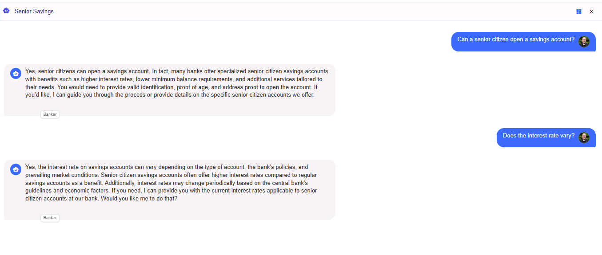

# Module 02 - Connecting Agents to Memory

## Introduction

In this module, you'll connect your agent to Azure Cosmos DB to provide persistent memory for chat history and state management. This enables your agents to maintain context across conversations and provide more coherent, context-aware interactions.

## Learning Objectives

- Understand Azure Cosmos DB integration for agent memory and state persistence
- Learn how to implement chat history management in agent frameworks
- Configure agents to maintain conversation context across multiple interactions
- Test connectivity and data persistence with Azure Cosmos DB

## Module Exercises

1. [Activity 1: Connecting Agent Frameworks to Azure Cosmos DB](#activity-1-connecting-agent-frameworks-to-azure-cosmos-db)
1. [Activity 2: Test your Work](#activity-2-test-your-work)


## Activity 1: Connecting Agent Frameworks to Azure Cosmos DB

In this activity, you will learn how to initialize Azure Cosmos DB and integrate with an agent framework to provide persistent memory for chat history and state management.

### Update GetResponse() function in AgentFrameworkService

The **GetResponse()** function is the main entry point for our multi-agent application. Within that function, a variable named **messageHistory** stores a list of historical messages from the chat session. The **chatHistory** object is used to construct this history and pass it to the Microsoft Agent Framework Chat Client. The **completionMessages** list is used to store the response received from the agent which then needs to be persisted in Cosmos DB for the next iteration of the agent.

We're going to modify this function to provide that persistence with Cosmos DB.

1. In VS Code, return to the **AgentFrameworkService.cs** in the **/Services** folder.
1. Replace the **GetResponse()** method with the code below:

This method handles message history management and creates a specialized banking agent. It converts message history to the appropriate format and maintains conversation context.

```csharp
     public async Task<Tuple<List<Message>, List<DebugLog>>> GetResponse(
         Message userMessage,
         List<Message> messageHistory,
         BankingDataService bankService,
         string tenantId,
         string userId)
     {
         try
         {
             messageHistory.Add(userMessage);
             var chatHistory = ConvertToAIChatMessages(messageHistory);
             chatHistory.Add(new ChatMessage(ChatRole.User, userMessage.Text));
    
             _promptDebugProperties.Clear();
    
              var agent = _chatClient.CreateAIAgent(
                 "You are a front desk agent in a bank. Respond to the user queries professionally. Provide professional and helpful responses to user queries.Use your knowledge of banking services and procedures to address user queries accurately.",
                 "Banker");
    
             var responseText= agent.RunAsync(chatHistory).GetAwaiter().GetResult().Text;
             return CreateResponseTuple(userMessage, responseText, "Banker");
         }
         catch (Exception ex)
         {
             _logger.LogError(ex, "Error when getting response: {ErrorMessage}", ex.Message);
             return new Tuple<List<Message>, List<DebugLog>>(new List<Message>(), new List<DebugLog>());
         }
     }
```

#### Chat Data models

We can now update our Chat Service to store the messages generated between users and agents. In this step, we will add a new function that first calls the Cosmos DB service to get a Session object from our database. The Session object is part of an object hierarchy that defines the conversations between users and agents. A session has a name and also an array of messages for that conversation topic.

Let's view the data model for our chat session object.

1. In VS Code, navigate to the **/Models/Chat** folder.
1. Review **Session.cs** and **Message.cs** classes.

#### Update Chat Service

With a reference to the current session returned from the CosmosDBService, this function calls our newly implemented function to update the messages within the session object with any new or updated messages. Typically, this would include a single user prompt, followed by one or more responses from the agents.

1. In VS Code, navigate to the **/Services** folder and open the **ChatService.cs** class.
1. Search for **//TO DO : Add AddPromptCompletionMessagesAsync** and paste the below code. 


This method handles the persistence of conversation messages to Cosmos DB. It retrieves the session, adds new messages, and performs a batch upsert operation.

```csharp
    /// <summary>
    /// Add user prompt and AI assistance response to the chat session message list object and insert into the data service as a transaction.
    /// </summary>
    ///
    private async Task AddPromptCompletionMessagesAsync(string tenantId, string userId, string sessionId, Message promptMessage, List<Message> completionMessages, List<DebugLog> completionMessageLogs)
    {
        var session = await _cosmosDBService.GetSessionAsync(tenantId, userId, sessionId);
    
        completionMessages.Insert(0, promptMessage);
        await _cosmosDBService.UpsertSessionBatchAsync(completionMessages, completionMessageLogs, session);
    }
```

#### Utilize and Store History in GetChatCompletionAsync

1. Next, locate the **GetChatCompletionAsync()** function.
1. Update the function by replacing the code **within** the **Try** block with the below:

This method orchestrates the complete chat flow: retrieving history, processing user input, generating agent responses, and persisting the conversation data to Cosmos DB.

```csharp
            ArgumentNullException.ThrowIfNull(sessionId);

            // Retrieve conversation, including latest prompt.
            var archivedMessages = await _cosmosDBService.GetSessionMessagesAsync(tenantId, userId, sessionId);

            // Add both prompt and completion to cache, then persist in Cosmos DB
            var userMessage = new Message(tenantId, userId, sessionId, "User", "User", userPrompt);

            // Generate the completion to return to the user
            var result = await _afService.GetResponse(userMessage, archivedMessages, _bankService, tenantId, userId);

            await AddPromptCompletionMessagesAsync(tenantId, userId, sessionId, userMessage, result.Item1, result.Item2);

            return result.Item1;
```

## Activity 2: Test your Work

With the activities in this module complete, it is time to test your work.

### Start the Backend

1. Return to the open terminal for the backend app in VS Code. Ensure you are in `01_exercises\csharp\src\MultiAgentCopilot`. Type `dotnet run`

### Start a Chat Session

We have a new agent now that thinks it works for a bank. So in our test here we are going to ask it banking-related questions.

1. Return to the frontend application in your browser.
1. Send the following message:

```text
Can a senior citizen open a savings account?
```

1. Wait for the Agent response.
1. Send another message:

```text
Does the interest rate vary?
```

1. Expected response: The Agent's response is contextually correct for the whole chat session.
1. You should see something like the output below.

    

### Stop the Application

1. Return to VS Code.
1. Press **Ctrl + C** to stop the backend application.

## Validation Checklist

Your implementation is successful if:

- [ ] Your app compiles with no errors.
- [ ] Your agent successfully responds with contextually correct information.

## Module Solution

The following sections include the completed code for this Module. Copy and paste these into your project if you run into issues and cannot resolve.

<details>
  <summary>Completed code for <strong>\Services\AgentFrameworkService.cs</strong></summary>
<br>

```csharp


```

<details>
  <summary>Completed code for <strong>\Services\ChatService.cs</strong></summary>
<br>

```csharp


```

## Next Steps

Proceed to Module 3: [Agent Specialization](./Module-03.md)
