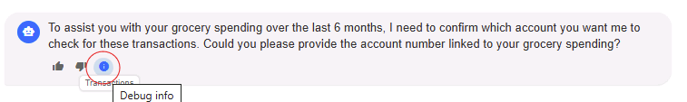

# Module 04 - Multi-Agent Orchestration

## Introduction

In this module, you'll learn how to implement multi-agent orchestration to coordinate multiple specialized agents within a single system. You'll also learn how to test the system as a whole, debug agent interactions, and monitor agent performance and behavior.

## Learning Objectives

- Understand multi-agent coordination patterns and orchestration strategies
- Learn how to implement agent routing and selection logic
- Define communication protocols and handoff mechanisms between agents
- Implement monitoring, debugging, and tracing capabilities for multi-agent systems

## Module Exercises

1. [Activity 1: Define Agents and Roles](#activity-1-define-agents-and-roles)
1. [Optional Activity 2: Implement Agent Tracing and Monitoring](#activity-2-implement-agent-tracing-and-monitoring)
1. [Activity 3: Test your Work](#activity-3-test-your-work)

## Activity 1: Define Agents and Roles

When dealing with multiple agents, clear agent roles are important to avoid conflicts and making sure the customer gets the most appropriate response.

### Add Selection Strategy for Agent Selection

SelectionStrategy is the mechanism in Microsoft Agent Framework that determines the next participant in a multi-agent conversation. By using the SelectionStrategy, we can identify the available agents and guide the LLM by defining the selection rule in natural language.

1. In VS Code, navigate to the **MultiAgentCopilot** project.
1. Navigate to the **/Prompts** folder
1. Review the contents of **SelectionStrategy.prompty**

This prompt template guides the LLM in selecting the most appropriate agent. It provides clear routing rules based on the conversation context and user intent.

### Add Termination Strategy for Agent response

Similar to how SelectionStrategy selects an agent, TerminationStrategy decides when agents should stop responding. This is crucial to prevent multiple unwanted agent responses in multi-agent conversations. TerminationStrategy is the mechanism in Microsoft Agent Framework that determines when to stop the conversation loop.

1. In VS Code, navigate to the **/Prompts** folder.
1. Review the contents of **TerminationStrategy.prompty**

This prompt template helps the LLM determine when a conversation should end. It identifies when user input is needed or when the query has been fully addressed.

### ChatResponseFormat

By default, the LLM responds to user prompts in natural language. However, we can enforce a structured format in its responses. A structured format allows us to parse the response and utilize it in our code for decision-making.

Let's define the models for the response.

1. In VS Code, navigate to the **/Models/ChatInfoFormats** folder.
1. Review the contents of **ContinuationInfo.cs**.

This model defines the structure for agent selection responses. It includes the selected agent name and the reasoning behind the selection.

1. Remain in the same **ChatInfoFormats** folder.
1. Review the contents of **TerminationInfo.cs**

This model defines the structure for termination decision responses. It includes a boolean flag and reasoning for whether the conversation should continue.

Let's create an Agent to decide the next agent in the conversation, using the ContinuationInfo model as the response format.

1. In VS Code, Navigate to the **/Helper** folder.
1. Navigate to **GroupChatWorkflowHelper.cs**.
1. Replace the **SelectNextAgentAsync()** with the below code.

This method implements the agent selection logic using a moderator agent. It analyzes conversation history and selects the most appropriate next agent.

```csharp
 protected override async ValueTask<AIAgent> SelectNextAgentAsync(IReadOnlyList<ChatMessage> history, CancellationToken cancellationToken = default(CancellationToken))
 {
     // Convert chat history to a string representation for the prompt
     var historyText = string.Join("\n", history.TakeLast(5).Select(msg => 
     {
         var role = msg.Role.ToString();
         var content = msg.Text ?? "";
         return $"{role}: {content}";
     }));
     
     // Create a moderator agent to decide which agent should respond next
     ChatClientAgentOptions agentOptions = new(name: "Moderator", instructions: PromptFactory.Selection(historyText, GetAgentNames()))
     {
         ChatOptions = new()
         {
             ResponseFormat = Microsoft.Extensions.AI.ChatResponseFormat.ForJsonSchema(
                 schema: AIJsonUtilities.CreateJsonSchema(typeof(ContinuationInfo)),
                 schemaName: "ContinuationInfo",
                 schemaDescription: "Information about selecting next agent in a conversation.")
         }
     };

     var moderatorAgent = _chatClient.CreateAIAgent(agentOptions);

     // Get the selection recommendation from the moderator
     var response = await moderatorAgent.RunAsync(history);
     var selectionInfo = response.Deserialize<ContinuationInfo>(JsonSerializerOptions.Web);

     var selectedAgentName = selectionInfo?.AgentName?.ToString();
     var reason = selectionInfo?.Reason;

     // Log the selection decision (uncomment if you have logging)
     _logCallback?.Invoke("SelectNextAgentAsync", $"{{Agent: {selectedAgentName}, Reason: {reason}}}");

     // Find the matching agent from your agents list
     var selectedAgent = _agents.FirstOrDefault(agent =>
         string.Equals(agent.Name, selectedAgentName, StringComparison.OrdinalIgnoreCase));

     // Return the selected agent, or default to the first agent if no match found
     return selectedAgent ?? _agents[0];
     
 }
```
### Termination Decider

1. Replace the **ShouldTerminateWithAI()** with the below code.

```csharp
 private async Task<bool> ShouldTerminateWithAI(IReadOnlyList<ChatMessage> history, CancellationToken cancellationToken)
 {
     if (history == null || !history.Any())
         return false;

     // Convert chat history to a string representation for the prompt
     var historyText = string.Join("\n", history.TakeLast(10).Select(msg =>
     {
         var role = msg.Role.ToString();
         var content = msg.Text ?? "";
         return $"{role}: {content}";
     }));

     // Create a termination decision agent using the TerminationStrategy.prompty
     ChatClientAgentOptions agentOptions = new(
         name: "TerminationDecider",
         instructions: PromptFactory.Termination(historyText))
     {
         ChatOptions = new()
         {
             ResponseFormat = Microsoft.Extensions.AI.ChatResponseFormat.ForJsonSchema(
                 schema: AIJsonUtilities.CreateJsonSchema(typeof(TerminationInfo)),
                 schemaName: "TerminationInfo",
                 schemaDescription: "Information about whether the conversation should continue or terminate.")
         }
     };

     var terminationAgent = _chatClient.CreateAIAgent(agentOptions);

     try
     {
         // Get the termination decision from the AI agent
         var response = await terminationAgent.RunAsync(history);
         var terminationInfo = response.Deserialize<TerminationInfo>(JsonSerializerOptions.Web);

         var shouldContinue = terminationInfo?.ShouldContinue ?? true;
         var reason = terminationInfo?.Reason ?? "No reason provided";

         // Log the termination decision
         _logCallback?.Invoke("ShouldTerminateAsync", $"{{Continue: {shouldContinue.ToString()}, Reason: {reason}}}");

         // Return true if we should terminate (i.e., should NOT continue)
         return !shouldContinue;
     }
     catch (Exception ex)
     {
         _logCallback?.Invoke("ShouldTerminateWithAI Error", ex.Message);
         // Default to continue if there's an error
         return false;
     }

 }
```

### Replace Agent with a GroupChat Workflow

Until now the responses we received were from a single agent, lets use AgentGroupChat to orchestrate a chat where multiple agents participate.

1. In VS Code, navigate to **Services/AgentFrameworkService.cs**
1. Search for **//TO DO: Add RunGroupChatOrchestration** and paste the code below
```csharp
    /// <summary>
    /// Orchestrates the group chat with AI agents.
    /// </summary>
    private async Task<(string responseText, string selectedAgentName)> RunGroupChatOrchestration(
        List<ChatMessage> chatHistory,
        string tenantId,
        string userId)
    {
        try
        {
            _logger.LogInformation("Starting Agent Framework Group Chat");
                       
            // Add system context
            chatHistory.Add(new ChatMessage(ChatRole.System, $"User Id: {userId}, Tenant Id: {tenantId}"));

            // Create custom termination function
            var customTerminationFunc = CreateCustomTerminationFunction();

            // Create the workflow
            var workflow = AgentWorkflowBuilder.CreateGroupChatBuilderWith(agents =>
                    new GroupChatWorkflowHelper(_agents!, _chatClient, LogMessage, customTerminationFunc)
                    {
                        MaximumIterationCount = 5
                    })
                    .AddParticipants(_agents!)
                    .Build();

            //run the workflow
            var (responseMessages, selectedAgentName) = await RunWorkflowAsync(workflow,chatHistory);

            //log the function calls from the response messages
            for (int i = chatHistory.Count; i < responseMessages.Count; i++)
            {
                if (responseMessages[i].Role.Value == "assistant")
                {
                    foreach (var content in responseMessages[i].Contents)
                    {
                        // Enhanced logging based on content type
                        switch (content)
                        {
                            case FunctionCallContent functionCall:
                                LogMessage("Function Call", $"Name: {functionCall.Name}, CallId: {functionCall.CallId}");
                                LogMessage("Function Arguments", JsonSerializer.Serialize(functionCall.Arguments, new JsonSerializerOptions { WriteIndented = true }));
                                break;
                        }
                    }
                }
            }

            if (selectedAgentName == "__")
            {
                _logger.LogError("Error in getting response");
                return ("Sorry, I encountered an error while processing your request. Please try again.", "Error");
            }
            // Extract response text
            string responseText = ExtractResponseText(responseMessages);

            _logger.LogInformation("Agent Framework orchestration completed with agent: {AgentName}", selectedAgentName);

            return (responseText, selectedAgentName);
        }
        catch (Exception ex)
        {
            _logger.LogError(ex, "Error in Agent Framework orchestration");
            return ("Sorry, I encountered an error while processing your request. Please try again.", "Error");
        }
    }

```

1. Next replace the **GetResponse()** method with the code below.


```csharp
public async Task<Tuple<List<Message>, List<DebugLog>>> GetResponse(
    Message userMessage,
    List<Message> messageHistory,
    BankingDataService bankService,
    string tenantId,
    string userId)
{
    try
    {
        messageHistory.Add(userMessage);
        var chatHistory = ConvertToAIChatMessages(messageHistory);
        chatHistory.Add(new ChatMessage(ChatRole.User, userMessage.Text));
        var (responseText, selectedAgentName) = await RunGroupChatOrchestration(chatHistory, tenantId, userId);

        return CreateResponseTuple(userMessage, responseText, selectedAgentName);
    }
    catch (Exception ex)
    {
        _logger.LogError(ex, "Error when getting response: {ErrorMessage}", ex.Message);
        return new Tuple<List<Message>, List<DebugLog>>(new List<Message>(), new List<DebugLog>());
    }
}
```

## Activity 3: Test your Work

In the previous module we tested each agent independently. With the code changes in this module we should now be able to orchestrate a multi-agent chat where agent selection is automated based on the SelectionStrategy and agent prompts. Lets go ahead and test if the code works as expected.

### Start the Backend

- Return to the open terminal for the backend app in VS Code. Ensure you are in `01_exercises\csharp\src\MultiAgentCopilot`. Type `dotnet run`

### Start a Chat Session

For each response in our testing below, click on the *Bug* icon to see the Debug log to understand the agent selection and termination strategy.


1. Return to the frontend application in your browser.
1. Start a new conversation.
1. Try the below prompts. Provide more information if prompted.
    1. Who can help me here?
    1. Transfer $50 to my friend.
    1. When prompted for account and email, enter, "Account is Acc001 and Email is sandeep@contoso.com"
    1. Looking for a Savings account with high interest rate.
    1. File a complaint about theft from my account.
    1. When prompted confirm its the same account or enter a new account (Acc001 to Acc009) and provide any details it asks for.
    1. How much did I spend on groceries? (If prompted, say over the last 6 months)
    1. Provide me a statement of my account. (If prompted, give it an account number ranging from *Acc001* to *Acc009*)

### Stop the Application

1. In the backend terminal, press **Ctrl + C** to stop the application.

## Validation Checklist

- [ ] Depending on the user prompt the agent selection is dynamic.
- [ ] All the agents have context of the previous messages in the conversation.
- [ ] The agents are able to invoke the right plugin function to interact with **BankingService**.
- [ ] Vector search works as expected.

## Common Issues and Solutions

1. Multiple agents respond together or Wrong agent responding:

   - View the 'DebugLog' by using the **Bug** icon in each impacted AI response.
   - Study the Termination Reason
   - Edit the appropriate Prompty files to resolve the conflict.

1. Agent responses are invalid:

   - Change in model and/or its version can cause invalid/irrelevant agent behavior.
   - Thorough testing with updated prompts will be required.

## Module Solution

The following sections include the completed code for this Module. Copy and paste these into your project if you run into issues and cannot resolve.

<details>
  <summary>Completed code for <strong>\MultiAgentCopilot\Helper\GroupChatWorkflowHelper.cs</strong></summary>
<br>

```csharp


```

<details>
  <summary>Completed code for <strong>\MultiAgentCopilot\Services\AgentFrameworkService.cs</strong></summary>
<br>

```csharp


```


## Next Steps

Proceed to Module 5 - [MCP Integration](./Module-05.md)
