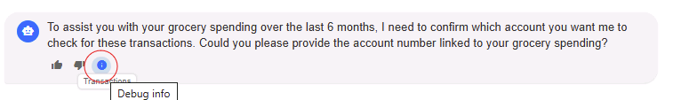

# Module 05 - External Tool Integration

## Introduction

In this module, you'll learn how to integrate external MCP (Model Context Protocol) server tools to extend your agents' capabilities beyond in-process functions. This enables your agents to interact with external services and systems through standardized protocols.

## Learning Objectives

- Understand MCP (Model Context Protocol) architecture and benefits
- Learn how to configure and consume external MCP server tools
- Implement agent-to-MCP server communication and authentication
- Test and debug external tool integration in multi-agent scenarios

## Module Exercises

1. [Activity 1: Configure MCP Client Integration](#activity-1-configure-mcp-client-integration)
1. [Activity 2: Implement MCP Tool Service](#activity-2-implement-mcp-tool-service)
1. [Activity 3: Test your Work](#activity-3-test-your-work)

## Activity 1: Configure MCP Client Integration

When dealing with multiple agents, integrating external tools through MCP servers allows for better scalability and separation of concerns. MCP (Model Context Protocol) is a standardized protocol that enables agents to securely access external tools and services.

### MCP Client Creation

MCP servers provide tools and resources that agents can consume remotely. This architecture allows for better modularity and enables agents to access specialized capabilities without embedding all functionality directly in the agent code.

1. In VS Code, navigate to the **/Services** folder
1. Navigate to **MCPToolService.cs**
1. Replace **CreateMcpClientAsync()** method with the code below

This method creates an authenticated MCP client for connecting to external tool servers. It handles transport configuration and authentication for secure communication.

```csharp
/// <summary>
/// Creates or retrieves a cached MCP client for the specified agent type
/// </summary>
private async Task<McpClient> CreateMcpClientAsync(AgentType agentType, MCPServerSettings settings)
{
    // Create authenticated transport with enhanced error handling
    IClientTransport clientTransport;
    try
    {
        // Create transport with authentication and streamable-http support
        var wrapper = new AuthenticatedHttpWrapper(settings.Url, settings.Key);
        clientTransport = wrapper.CreateTransport();
        
        // Configure transport for streamable-http if needed
        if (clientTransport is HttpClientTransport httpTransport)
        {
            await ConfigureTransportForStreamableHttp(httpTransport, settings);
        }

    }
    catch (Exception ex)
    {
        _logger.LogError(ex, "Failed to create transport for agent {AgentType}: {Message}", agentType, ex.Message);
        throw new InvalidOperationException($"Failed to create MCP transport for agent '{agentType}': {ex.Message}", ex);
    }

    // Create MCP client
    try
    {
        var mcpClient = await McpClient.CreateAsync(clientTransport);
        _logger.LogInformation("MCP client created successfully for agent: {AgentType}", agentType);
        return mcpClient;
    }
    catch (Exception ex)
    {
        _logger.LogError(ex, "Failed to create MCP client for agent {AgentType}: {Message}", agentType, ex.Message);
        
        
        throw new InvalidOperationException($"Failed to create MCP client for agent '{agentType}': {ex.Message}", ex);
    }
}
```

In our workshop, each agent can connect to a different MCP server based on their specialization. Let's configure the MCP server settings for each agent type.

1. Stay in **MCPToolService.cs**
1. Replace **GetMCPServerSettings()** method with the code below

This method retrieves MCP server configuration for specific agent types. It validates server settings and ensures proper authentication configuration.

```csharp
private MCPServerSettings GetMCPServerSettings(AgentType agentType)
{
    var agentName = AgentFactory.GetAgentName(agentType);

    
    // Find the server configuration for this agent type
    var serverSettings = _mcpSettings.Servers?.FirstOrDefault(s => 
        string.Equals(s.AgentName, agentName, StringComparison.OrdinalIgnoreCase));

    if (serverSettings == null)
    {
        throw new InvalidOperationException($"MCP server configuration for agent '{agentName}' not found in MCPSettings.Servers.");
    }

    // Validate the server settings
    if (string.IsNullOrWhiteSpace(serverSettings.Url))
    {
        throw new InvalidOperationException($"MCP server URL for agent '{agentName}' is not configured.");
    }

    if (string.IsNullOrWhiteSpace(serverSettings.Key))
    {
        throw new InvalidOperationException($"MCP server API key for agent '{agentName}' is not configured.");
    }

    return serverSettings;
}
``` 

## Activity 2: Implement MCP Tool Service

1. Stay in **MCPToolService.cs**
1. Replace the **GetMcpTools()** method with the code below

This method retrieves and filters MCP tools for specific agents. It handles connection errors gracefully and provides appropriate logging for debugging.

```csharp
public async Task<IList<McpClientTool>> GetMcpTools(AgentType agent)
{
    _logger.LogInformation("Getting MCP tools for agent: {AgentType}", agent);

    try
    {
        // Get agent configuration
        var settings = GetMCPServerSettings(agent);

        // Get or create MCP client with authentication and streamable-http support
        var mcpClient = await CreateMcpClientAsync(agent,settings);

        // List available tools from the MCP server
        var tools = await  mcpClient.ListToolsAsync();

        var filteredTools = FilterToolsByTags(tools, settings.Tags.Split(',', StringSplitOptions.RemoveEmptyEntries).Select(t => t.Trim()).ToArray());

        _logger.LogInformation("Filtered {ToolCount} tools for agent {AgentType} with {Tags}", filteredTools.Count, agent, settings.Tags);

        // Log each tool for debugging
        foreach (var tool in filteredTools)
        {
            _logger.LogDebug("Tool available - Name: {ToolName}, Description: {ToolDescription}", 
                tool.Name, tool.Description);
        }

        return filteredTools;
    }
    catch (InvalidOperationException)
    {
        // Configuration errors - already logged, re-throw
        throw;
    }
    catch (HttpRequestException httpEx)
    {
        _logger.LogError(httpEx, "HTTP error when connecting to MCP server for agent {AgentType}: {Message}", 
            agent, httpEx.Message);
        
        // Check if it's an authentication error
        if (httpEx.Message.Contains("401") || httpEx.Message.Contains("Unauthorized"))
        {
            _logger.LogError("Authentication failed - check X-MCP-API-Key configuration for agent {AgentType}", agent);
        }

        return new List<McpClientTool>();
    }
    catch (TaskCanceledException timeoutEx)
    {
        _logger.LogError(timeoutEx, "Timeout when connecting to MCP server for agent {AgentType}: {Message}", 
            agent, timeoutEx.Message);
        return new List<McpClientTool>();
    }
    catch (Exception ex)
    {
        _logger.LogError(ex, "Unexpected error getting MCP tools for agent {AgentType}: {Message} | StackTrace: {StackTrace}", 
            agent, ex.Message, ex.StackTrace);
        return new List<McpClientTool>();
    }    
}

```

### Update Agent Factory to Use MCP Tools

1. In VS Code, navigate to the **/Factories** folder
1. Navigate to in **AgentFactory.cs**
1. Search for **//TO DO: Add Agent Creation with Tools** and paste the code below

```csharp
public static async Task<List<AIAgent>> CreateAllAgentsWithMCPToolsAsync(IChatClient chatClient, MCPToolService mcpService, ILoggerFactory loggerFactory)
{ 
    var agents = new List<AIAgent>();
    ILogger logger = loggerFactory.CreateLogger("AgentFactory");

    // Get all agent types from the enum
    var agentTypes = Enum.GetValues<AgentType>();

    // Create agents for each agent type
    foreach (var agentType in agentTypes)
    {
        logger.LogInformation("Creating agent {AgentType} with MCP tools", agentType);

        var aiFunctions = await mcpService.GetMcpTools(agentType);

        var agent = chatClient.CreateAIAgent(
                instructions: GetAgentPrompt(agentType),
                name: GetAgentName(agentType),
                description: GetAgentDescription(agentType),
                tools: aiFunctions.ToArray()
            );

        agents.Add(agent);
        logger.LogInformation("Created agent {AgentName} with {ToolCount} MCP tools", agent.Name, aiFunctions.Count());
    }

    logger.LogInformation("Successfully created {AgentCount} banking agents", agents.Count);
    return agents;
}
```

## Integrate MCP Tools with Agent Framework

1. Navigate to in **AgentFrameworkService.cs**
1. Search for **// TO DO: Add MCP Service Option** and paste the code below

This code integrates MCP tool service as an option for agent creation. It provides a fallback mechanism when MCP tools are preferred over in-process tools.

```csharp
 else if (_mcpService != null)
 {
     _agents = AgentFactory.CreateAllAgentsWithMCPToolsAsync(_chatClient, _mcpService, _loggerFactory).GetAwaiter().GetResult();
 }                
 else
 {
     _logger.LogError("No tool services available - cannot create agents");
 }
```

1. Next search for **//TO DO: Add SetMCPToolService** and paste the code below

This method enables setting the MCP tool service for agent framework integration. It provides a way to configure external tool capabilities for agents.
```csharp
    /// <summary>
    /// Sets the MCP (Model Context Protocol) tool service.
    /// </summary>
    /// <param name="mcpService">The MCP tool service instance.</param>
    /// <returns>True if the service was set successfully.</returns>
    
    public bool SetMCPToolService(MCPToolService mcpService)
    {
        _mcpService = mcpService ?? throw new ArgumentNullException(nameof(mcpService));
        _logger.LogInformation("MCPToolService has been set");
        return true;
    }
```

## Set MCP Tools in Chat Service

1. Navigate to in **ChatService.cs**
1. Search for **TO DO: Invoke SetMCPToolService** and paste the code below

```csharp

_afService.SetMCPToolService(_mcpService);

``` 

### Enable MCP Tools as the Preferred Option

1. Finally, open **appsettings.json** and set the value of **UseMCPTools** to true.


## Activity 3: Test your Work

In the previous module we tested each agent independently. With the code changes in this module we should now be able to orchestrate a multi-agent chat where agent selection is automated based on the SelectionStrategy and agent prompts. Lets go ahead and test if the code works as expected.

### Start the Backend

- Return to the open terminal for the backend app in VS Code and type `dotnet run`

### Start a Chat Session

For each response in our testing below, click on the *Bug* icon to see the Debug log to understand the agent selection and termination strategy.


1. Return to the frontend application in your browser.
1. Start a new conversation.
1. Try the below prompts. Provide more infomration if prompted.
    1. Who can help me here?
    1. Transfer $50 to my friend.
    1. When prompted for account and email, enter, "Account is Acc001 and Email is Sandeep@contoso.com"
    1. Looking for a Savings account with high interest rate.
    1. File a complaint about theft from my account.
    1. When prompted confirm its the same account or enter a new account (Acc001 to Acc009) and provide any details it asks for.
    1. How much did I spend on groceries? (If prompted, say over the last 6 months)
    1. Provide me a statement of my account. (If prompted, give it an account number ranging from *Acc001* to *Acc009*)

### Stop the Application

1. In the backend terminal, press **Ctrl + C** to stop the application.

## Validation Checklist

- [ ] Depending on the user prompt the agent selection is dynamic.
- [ ] All the agents  context of the previous messages in teh conversation.
- [ ] The agents are able to invoke the right plugin function to interact with **BankingService**.
- [ ] Vector search  works as expected.

## Common Issues and Solutions

1. Multiple agents respond together or Wrong agent responding:

   - View the 'DebugLog' by using the **Bug** icon in each impacted AI response.
   - Study the Termination Reason
   - Edit the appropriate Prompty files to resolve the conflict.

1. Agent response are invalid:

   - Change in model and/or its version can cause invalid/irrelevant agent behavior.
   - Thorough testing with updated prompts will be required.

## Module Solution

The following sections include the completed code for this Module. Copy and paste these into your project if you run into issues and cannot resolve.

<details>
  <summary>Completed code for <strong>\Services\AgentFrameworkService.cs</strong></summary>
<br>

```csharp
using Microsoft.Extensions.Options;
using Microsoft.SemanticKernel;
using Microsoft.SemanticKernel.Connectors.OpenAI;
using MultiAgentCopilot.Helper;
using Microsoft.SemanticKernel.ChatCompletion;
using Microsoft.SemanticKernel.Embeddings;
using Microsoft.Extensions.AI;

using Azure.Identity;
using MultiAgentCopilot.Factories;
using MultiAgentCopilot.Models.Debug;
using MultiAgentCopilot.Models.Chat;
using MultiAgentCopilot.Models.Configuration;

using System.Text;
using MultiAgentCopilot.Models;
using Microsoft.SemanticKernel.Agents;
using AgentFactory = MultiAgentCopilot.Factories.AgentFactory;
namespace MultiAgentCopilot.Services;

public class SemanticKernelService :  IDisposable
{
    readonly SemanticKernelServiceSettings _skSettings;
    readonly ILoggerFactory _loggerFactory;
    readonly ILogger<SemanticKernelService> _logger;
    readonly Kernel _semanticKernel;


    bool _serviceInitialized = false;
    string _prompt = string.Empty;
    string _contextSelectorPrompt = string.Empty;

    List<LogProperty> _promptDebugProperties;

    public bool IsInitialized => _serviceInitialized;

    public SemanticKernelService(
        IOptions<SemanticKernelServiceSettings> skOptions,
        ILoggerFactory loggerFactory)
    {
        _skSettings = skOptions.Value;
        _loggerFactory = loggerFactory;
        _logger = _loggerFactory.CreateLogger<SemanticKernelService>();
        _promptDebugProperties = new List<LogProperty>();

        _logger.LogInformation("Initializing the Semantic Kernel service...");

        var builder = Kernel.CreateBuilder();

        //TO DO: Update SemanticKernelService constructor
        builder.Services.AddSingleton<ILoggerFactory>(loggerFactory);

        DefaultAzureCredential credential;
        if (string.IsNullOrEmpty(_skSettings.AzureOpenAISettings.UserAssignedIdentityClientID))
        {
            credential = new DefaultAzureCredential();
        }
        else
        {
            credential = new DefaultAzureCredential(new DefaultAzureCredentialOptions
            {
                ManagedIdentityClientId = _skSettings.AzureOpenAISettings.UserAssignedIdentityClientID
            });
        }

        builder.AddAzureOpenAIChatCompletion(
           _skSettings.AzureOpenAISettings.CompletionsDeployment,
           _skSettings.AzureOpenAISettings.Endpoint,
           credential);

        _semanticKernel = builder.Build();


        Task.Run(Initialize).ConfigureAwait(false);
    }


    private void LogMessage(string key, string value)
    {
        _promptDebugProperties.Add(new LogProperty(key, value));
    }

    //TO DO: Add GetResponse function

    public async Task<Tuple<List<Message>, List<DebugLog>>> GetResponse(Message userMessage, List<Message> messageHistory, BankingDataService bankService, string tenantId, string userId)
    {
        try
        {
            AgentFactory agentFactory = new AgentFactory();

            var agentGroupChat = agentFactory.BuildAgentGroupChat(_semanticKernel, _loggerFactory, LogMessage, bankService, tenantId, userId);

            // Load history
            foreach (var chatMessage in messageHistory)
            {
                AuthorRole? role = AuthorRoleHelper.FromString(chatMessage.SenderRole);
                var chatMessageContent = new ChatMessageContent
                {
                    Role = role ?? AuthorRole.User,
                    Content = chatMessage.Text
                };
                agentGroupChat.AddChatMessage(chatMessageContent);
            }

            _promptDebugProperties = new List<LogProperty>();

            List<Message> completionMessages = new();
            List<DebugLog> completionMessagesLogs = new();
            do
            {
                var userResponse = new ChatMessageContent(AuthorRole.User, userMessage.Text);
                agentGroupChat.AddChatMessage(userResponse);

                agentGroupChat.IsComplete = false;

                await foreach (ChatMessageContent response in agentGroupChat.InvokeAsync())
                {
                    string messageId = Guid.NewGuid().ToString();
                    string debugLogId = Guid.NewGuid().ToString();
                    completionMessages.Add(new Message(userMessage.TenantId, userMessage.UserId, userMessage.SessionId, response.AuthorName ?? string.Empty, response.Role.ToString(), response.Content ?? string.Empty, messageId, debugLogId));

                    // TO DO : Add DebugLog code here


                    if (_promptDebugProperties.Count > 0)
                    {
                        var completionMessagesLog = new DebugLog(userMessage.TenantId, userMessage.UserId, userMessage.SessionId, messageId, debugLogId);
                        completionMessagesLog.PropertyBag = _promptDebugProperties;
                        completionMessagesLogs.Add(completionMessagesLog);
                    }


                }
            }
            while (!agentGroupChat.IsComplete);


            return new Tuple<List<Message>, List<DebugLog>>(completionMessages, completionMessagesLogs);

        }
        catch (Exception ex)
        {
            _logger.LogError(ex, "Error when getting response: {ErrorMessage}", ex.ToString());
            return new Tuple<List<Message>, List<DebugLog>>(new List<Message>(), new List<DebugLog>());
        }
    }

    //TO DO: Add Summarize function
    public async Task<string> Summarize(string sessionId, string userPrompt)
    {
        try
        {
            // Use an AI function to summarize the text in 2 words
            var summarizeFunction = _semanticKernel.CreateFunctionFromPrompt(
                "Summarize the following text into exactly two words:\n\n{{$input}}",
                executionSettings: new OpenAIPromptExecutionSettings { MaxTokens = 10 }
            );

            // Invoke the function
            var summary = await _semanticKernel.InvokeAsync(summarizeFunction, new() { ["input"] = userPrompt });

            return summary.GetValue<string>() ?? "No summary generated";
        }
        catch (Exception ex)
        {
            _logger.LogError(ex, "Error when getting response: {ErrorMessage}", ex.ToString());
            return string.Empty;
        }
    }


    private Task Initialize()
    {
        try
        {
            _serviceInitialized = true;
            _logger.LogInformation("Semantic Kernel service initialized.");
        }
        catch (Exception ex)
        {
            _logger.LogError(ex, "Semantic Kernel service was not initialized. The following error occurred: {ErrorMessage}.", ex.ToString());
        }
        return Task.CompletedTask;
    }       

    public void Dispose()
    {
        // Dispose resources if any
    }
} 
```

</details>

<details>
  <summary>Completed code for <strong>\Factories\AgentFactory.cs</strong></summary>
<br>

```csharp
using Microsoft.SemanticKernel;
using Microsoft.SemanticKernel.Agents;
using Microsoft.SemanticKernel.Agents.Chat;
using Microsoft.SemanticKernel.ChatCompletion;
using Microsoft.SemanticKernel.Connectors.OpenAI;
using Microsoft.SemanticKernel.Connectors.AzureOpenAI;

using OpenAI.Chat;
using System.Text.Json;
using MultiAgentCopilot.StructuredFormats;
using MultiAgentCopilot.Models.ChatInfoFormats;
using MultiAgentCopilot.Logs;
using MultiAgentCopilot.Models;
using MultiAgentCopilot.Services;
using static MultiAgentCopilot.StructuredFormats.ChatResponseFormatBuilder;
using MultiAgentCopilot.Plugins;
using Microsoft.Identity.Client;


namespace MultiAgentCopilot.Factories
{
    internal class AgentFactory
    {
        public delegate void LogCallback(string key, string value);

        private string GetAgentName(AgentType agentType)
        {

            string name = string.Empty;
            switch (agentType)
            {
                case AgentType.Sales:
                    name = "Sales";
                    break;
                case AgentType.Transactions:
                    name = "Transactions";
                    break;
                case AgentType.CustomerSupport:
                    name = "CustomerSupport";
                    break;
                case AgentType.Coordinator:
                    name = "Coordinator";
                    break;
                default:
                    throw new ArgumentOutOfRangeException(nameof(agentType), agentType, null);
            }

            return name;
        }

        private string GetAgentPrompts(AgentType agentType)
        {

            string promptFile = string.Empty;
            switch (agentType)
            {
                case AgentType.Sales:
                    promptFile = "Sales.prompty";
                    break;
                case AgentType.Transactions:
                    promptFile = "Transactions.prompty";
                    break;
                case AgentType.CustomerSupport:
                    promptFile = "CustomerSupport.prompty";
                    break;
                case AgentType.Coordinator:
                    promptFile = "Coordinator.prompty";
                    break;
                default:
                    throw new ArgumentOutOfRangeException(nameof(agentType), agentType, null);
            }

            string prompt = $"{File.ReadAllText("Prompts/" + promptFile)}{File.ReadAllText("Prompts/CommonAgentRules.prompty")}";

            return prompt;
        }


        public ChatCompletionAgent BuildAgent(Kernel kernel, AgentType agentType, ILoggerFactory loggerFactory, BankingDataService bankService, string tenantId, string userId)
        {
            ChatCompletionAgent agent = new ChatCompletionAgent
            {
                Name = GetAgentName(agentType),
                Instructions = $"""{GetAgentPrompts(agentType)}""",
                Kernel = GetAgentKernel(kernel, agentType, loggerFactory, bankService, tenantId, userId),
                Arguments = new KernelArguments(new AzureOpenAIPromptExecutionSettings() { FunctionChoiceBehavior = FunctionChoiceBehavior.Auto() })
            };

            return agent;
        }

        private Kernel GetAgentKernel(Kernel kernel, AgentType agentType, ILoggerFactory loggerFactory, BankingDataService bankService, string tenantId, string userId)
        {
            Kernel agentKernel = kernel.Clone();
            switch (agentType)
            {
                case AgentType.Sales:
                    var salesPlugin = new SalesPlugin(loggerFactory.CreateLogger<SalesPlugin>(), bankService, tenantId, userId);
                    agentKernel.Plugins.AddFromObject(salesPlugin);
                    break;
                case AgentType.Transactions:
                    var transactionsPlugin = new TransactionPlugin(loggerFactory.CreateLogger<TransactionPlugin>(), bankService, tenantId, userId);
                    agentKernel.Plugins.AddFromObject(transactionsPlugin);
                    break;
                case AgentType.CustomerSupport:
                    var customerSupportPlugin = new CustomerSupportPlugin(loggerFactory.CreateLogger<CustomerSupportPlugin>(), bankService, tenantId, userId);
                    agentKernel.Plugins.AddFromObject(customerSupportPlugin);
                    break;
                case AgentType.Coordinator:
                    var CoordinatorPlugin = new CoordinatorPlugin(loggerFactory.CreateLogger<CoordinatorPlugin>(), bankService, tenantId, userId);
                    agentKernel.Plugins.AddFromObject(CoordinatorPlugin);
                    break;
                default:
                    throw new ArgumentException("Invalid plugin name");
            }

            return agentKernel;
        }


        public static string GetStrategyPrompts(ChatResponseStrategy strategyType)
        {
            string prompt = string.Empty;
            switch (strategyType)
            {
                case ChatResponseStrategy.Continuation:
                    prompt = File.ReadAllText("Prompts/SelectionStrategy.prompty");
                    break;
                case ChatResponseStrategy.Termination:
                    prompt = File.ReadAllText("Prompts/TerminationStrategy.prompty");
                    break;
            }
            return prompt;
        }

        public AgentGroupChat BuildAgentGroupChat(Kernel kernel, ILoggerFactory loggerFactory, LogCallback logCallback, BankingDataService bankService, string tenantId, string userId)
        {
            AgentGroupChat agentGroupChat = new AgentGroupChat();
            var chatModel = kernel.GetRequiredService<IChatCompletionService>();

            kernel.AutoFunctionInvocationFilters.Add(new AutoFunctionInvocationLoggingFilter(loggerFactory.CreateLogger<AutoFunctionInvocationLoggingFilter>()));

            foreach (AgentType agentType in Enum.GetValues(typeof(AgentType)))
            {
                agentGroupChat.AddAgent(BuildAgent(kernel, agentType, loggerFactory, bankService, tenantId, userId));
            }

            agentGroupChat.ExecutionSettings = GetAgentGroupChatSettings(kernel, logCallback);


            return agentGroupChat;
        }

        private OpenAIPromptExecutionSettings GetExecutionSettings(ChatResponseFormatBuilder.ChatResponseStrategy strategyType)
        {
            ChatResponseFormat infoFormat;
            infoFormat = ChatResponseFormat.CreateJsonSchemaFormat(
            jsonSchemaFormatName: $"agent_result_{strategyType.ToString()}",
            jsonSchema: BinaryData.FromString($"""
                {ChatResponseFormatBuilder.BuildFormat(strategyType)}
                """));
            var executionSettings = new OpenAIPromptExecutionSettings
            {
                ResponseFormat = infoFormat
            };

            return executionSettings;
        }

        private KernelFunction GetStrategyFunction(ChatResponseFormatBuilder.ChatResponseStrategy strategyType)
        {

            KernelFunction function =
                AgentGroupChat.CreatePromptFunctionForStrategy(
                    $$$"""
                    {{{GetStrategyPrompts(strategyType)}}}
                    
                    RESPONSE:
                    {{$lastmessage}}
                    """,
                    safeParameterNames: "lastmessage");

            return function;
        }

        private AgentGroupChatSettings GetAgentGroupChatSettings(Kernel kernel, LogCallback logCallback)
        {
            ChatHistoryTruncationReducer historyReducer = new(5);

            AgentGroupChatSettings ExecutionSettings = new AgentGroupChatSettings
            {
                SelectionStrategy =
                    new KernelFunctionSelectionStrategy(GetStrategyFunction(ChatResponseFormatBuilder.ChatResponseStrategy.Continuation), kernel)
                    {
                        Arguments = new KernelArguments(GetExecutionSettings(ChatResponseFormatBuilder.ChatResponseStrategy.Continuation)),
                        // Save tokens by only including the final few responses
                        HistoryReducer = historyReducer,
                        // The prompt variable name for the history argument.
                        HistoryVariableName = "lastmessage",
                        // Returns the entire result value as a string.
                        ResultParser = (result) =>
                        {
                            var resultString = result.GetValue<string>();
                            if (!string.IsNullOrEmpty(resultString))
                            {
                                var ContinuationInfo = JsonSerializer.Deserialize<ContinuationInfo>(resultString);
                                logCallback("SELECTION - Agent", ContinuationInfo!.AgentName); 
                                logCallback("SELECTION - Reason", ContinuationInfo!.Reason);                       
                                return ContinuationInfo!.AgentName;
                            }
                            else
                            {
                                return string.Empty;
                            }
                        }
                    },
                TerminationStrategy =
                    new KernelFunctionTerminationStrategy(GetStrategyFunction(ChatResponseFormatBuilder.ChatResponseStrategy.Termination), kernel)
                    {
                        Arguments = new KernelArguments(GetExecutionSettings(ChatResponseFormatBuilder.ChatResponseStrategy.Termination)),
                        // Save tokens by only including the final response
                        HistoryReducer = historyReducer,
                        // The prompt variable name for the history argument.
                        HistoryVariableName = "lastmessage",
                        // Limit total number of turns
                        MaximumIterations = 8,
                        // user result parser to determine if the response is "yes"
                        ResultParser = (result) =>
                        {
                            var resultString = result.GetValue<string>();
                            if (!string.IsNullOrEmpty(resultString))
                            {
                                var terminationInfo = JsonSerializer.Deserialize<TerminationInfo>(resultString);
                                logCallback("TERMINATION - Continue", terminationInfo!.ShouldContinue.ToString()); 
                                logCallback("TERMINATION - Reason", terminationInfo!.Reason); 
                                return !terminationInfo!.ShouldContinue;
                            }
                            else
                            {
                                return false;
                            }
                        }
                    },
            };

            return ExecutionSettings;
        }
    }
}
    
    
```

</details>

## Next Steps

Congratulations!!! You have completed this hands-on-lab!!!

You can see the full source code for this lab for both Semantic Kernel and LangGraph at <https://github.com/AzureCosmosDB/banking-multi-agent-workshop/>. You can also take this lab again or the LangGraph one at <https://github.com/AzureCosmosDB/banking-multi-agent-workshop/tree/hol>. We hope you enjoyed this lab.
