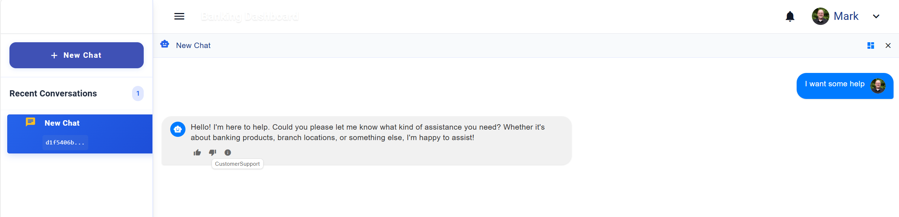

# Module 02 - Connecting Agents to Memory

**[< Creating Your First Agent](./Module-01.md)** - **[Agent Specialization >](./Module-03.md)**

## Introduction

In this module, you'll connect your agent to Azure DocumentDB for durable memory and state management, providing context awareness across agent interactions.

## Learning Objectives and Activities

- Learn the basics of Azure DocumentDB databases and collections for storing state and chat history
- Learn how to integrate LangGraph with Azure DocumentDB through its MongoDB-compatible endpoint
- Test connectivity to Azure DocumentDB using Microsoft Entra OIDC authentication

## Module Exercises

1. [Activity 1: Connecting LangGraph to Azure DocumentDB](#activity-1-connecting-langgraph-to-azure-documentdb)
2. [Activity 2: Test your Work](#activity-2-test-your-work)

## Activity 1: Connecting LangGraph to Azure DocumentDB

Here you will learn how the application initializes Azure DocumentDB through PyMongo and integrates it with LangGraph to provide persistent state.

The problem with our agents so far is that state is maintained only in memory and is lost when the graph restarts. Azure DocumentDB provides a MongoDB-compatible document database for durable checkpoints and chat history. The workshop deploys an M30 cluster and uses Microsoft Entra OIDC instead of database keys or connection strings.

LangGraph's MongoDB checkpointer stores this state in Azure DocumentDB.

### Checkpointer Plugin

The checkpointer plugin in LangGraph is a utility designed to facilitate the process of saving and restoring the state of an application at various points during its execution. This is particularly useful in multi-agent systems where maintaining consistent state across different agents and ensuring that progress can be resumed in case of failures or interruptions are critical.

Key Features of the Checkpointer Plugin:

- **State Management**: The checkpointer plugin allows developers to capture the current state of the agents and their interactions. This includes the data they are processing, their internal state, and any relevant context.
- **Persistence**: It provides mechanisms to persist this state to a durable storage medium, such as a database or file system. This ensures that the state can be reloaded even after a system crash or restart.
- **Restoration**: The plugin supports restoring the state to a previous checkpoint. This allows the system to resume operations from a known good state, reducing the need for reprocessing and minimizing downtime.
- **Consistency**: It ensures consistency across different agents by coordinating the checkpointing process. This is crucial in distributed systems where agents might be operating on different nodes or environments.
- **Configuration**: Developers can configure the frequency and conditions under which checkpoints are created. This flexibility allows for balancing between performance overhead and reliability.

### Storing Agent State

Let's add the Checkpointer Plugin to our application.

1. To begin, open the **banking_agents.py** file.
1. Copy the code below to the top of the file with the other imports:

```python
from langgraph.checkpoint.mongodb import AsyncMongoDBSaver, MongoDBSaver
from src.app.services.azure_document_db import DATABASE_NAME, async_documentdb_client, chat_container, documentdb_client, update_chat_container, \
    patch_active_agent
```

The imported `documentdb_client` is created in `src/app/services/azure_document_db.py`. That module uses `DefaultAzureCredential`, a PyMongo `OIDCCallback`, and the `MONGODB-OIDC` authentication mechanism against the cluster named by `DOCUMENTDB_CLUSTER_NAME`. `DOCUMENTDB_DATABASE_NAME` optionally overrides the default `MultiAgentBanking` database.

1. In the same **banking_agents.py** file, scroll down to locate the following lines:

```python
checkpointer = MemorySaver()
graph = builder.compile(checkpointer=checkpointer)
```

1. Replace those two lines with the code below:

```python
checkpointer = MongoDBSaver(
    documentdb_client,
    db_name=DATABASE_NAME,
    checkpoint_collection_name="Checkpoints",
    writes_collection_name="CheckpointWrites",
)
async_checkpointer = AsyncMongoDBSaver(
    async_documentdb_client,
    db_name=DATABASE_NAME,
    checkpoint_collection_name="Checkpoints",
    writes_collection_name="CheckpointWrites",
)
graph = builder.compile(checkpointer=async_checkpointer)
```

From this point on, `AsyncMongoDBSaver` saves agent checkpoints and intermediate writes for the async graph. The synchronous `MongoDBSaver` remains available to the API for administrative operations against the same collections.

### Enhance the agent routing

When you wired up the API layer in Module 1, Azure DocumentDB began storing chat messages. Chat records are stored for application use, while LangGraph state is stored in the checkpoint collections configured above.

In this application, we're taking an opinionated approach to agent routing. Instead of relying on the coordinator to use the LLM to route every message non-deterministically, we store the active agent in the `ChatsData` collection as one record per session. This lets the coordinator deterministically return to a known active agent in a multi-turn conversation.

1. Remain in the **banking_agents.py** file.
1. Locate the following code.

```python
def call_coordinator_agent(state: MessagesState, config) -> Command[Literal["coordinator_agent", "human"]]:
    response = coordinator_agent.invoke(state)
    return Command(update=response, goto="human")
```

1. Replace it with the following code.

```python
def call_coordinator_agent(state: MessagesState, config) -> Command[Literal["coordinator_agent", "human"]]:
    thread_id = config["configurable"].get("thread_id", "UNKNOWN_THREAD_ID")
    userId = config["configurable"].get("userId", "UNKNOWN_USER_ID")
    tenantId = config["configurable"].get("tenantId", "UNKNOWN_TENANT_ID")

    logging.debug(f"Calling coordinator agent with Thread ID: {thread_id}")

    activeAgent = None
    try:
        chat = chat_container.find_one(
            {"tenantId": tenantId, "userId": userId, "sessionId": thread_id},
            {"_id": 0, "activeAgent": 1},
        )
        activeAgent = (chat or {}).get("activeAgent", "unknown")

    except Exception as e:
        logging.debug(f"No active agent found: {e}")

    if activeAgent is None:
        if local_interactive_mode:
            update_chat_container({
                "id": thread_id,
                "tenantId": "Contoso",
                "userId": "Mark",
                "sessionId": thread_id,
                "name": "cli-test",
                "age": "cli-test",
                "address": "cli-test",
                "activeAgent": "unknown",
                "ChatName": "cli-test",
                "messages": []
            })

    logging.debug(f"Active agent from point lookup: {activeAgent}")

    # If active agent is something other than unknown or coordinator_agent, transfer directly to that agent
    if activeAgent is not None and activeAgent not in ["unknown", "coordinator_agent"]:
        logging.debug(f"Routing straight to last active agent: {activeAgent}")
        return Command(update=state, goto=activeAgent)
    else:
        response = coordinator_agent.invoke(state)
        return Command(update=response, goto="human")
```

Finally, we add changes for interactive mode to the customer service agent as well (these changes are only need for testing the backend directly - if you have wired up the front end they are redundant, but we add them for posterity here).

1. Locate the following code in the **banking_agents.py** file.

```python
def call_customer_support_agent(state: MessagesState, config) -> Command[Literal["customer_support_agent", "human"]]:
    response = customer_support_agent.invoke(state)
    return Command(update=response, goto="human")
```

1. Replace it with the following code.

```python
def call_customer_support_agent(state: MessagesState, config) -> Command[Literal["customer_support_agent", "human"]]:
    thread_id = config["configurable"].get("thread_id", "UNKNOWN_THREAD_ID")
    if local_interactive_mode:
        patch_active_agent(
            tenantId="Contoso", 
            userId="Mark", 
            sessionId=thread_id,
            activeAgent="customer_support_agent")

    response = customer_support_agent.invoke(state)
    return Command(update=response, goto="human")
```

The *patch_active_agent* function is used to store which agent is currently active within the application.

### Let's review

In this activity, we completed the following key steps:

- **Stored the active agent in Azure DocumentDB**:
    We added logic to persist the current active agent in the `ChatsData` collection. Before routing, we check whether an agent is already active. If so, the system routes the conversation directly to that agent without further reasoning.

- **Enabled persistent state**:  
    We configured the application to store conversation state in the `Checkpoints` and `CheckpointWrites` collections, ensuring the data persists beyond the current runtime session.

- **Patched the active agent after agent transfer**:  
    After handing off to a new agent, we update the `activeAgent` field in the Azure DocumentDB `ChatsData` collection. This ensures deterministic, turn-by-turn routing when the last active agent is known.

> **Note**: While it's technically possible to rely on the LLM to determine the next agent using reasoning alone, this approach is generally less reliable and may not be suitable for scenarios requiring consistency and control.

## Activity 2: Test your Work

With the activities in this module complete, it is time to test your work! Let's test our agents!

### Start a Conversation

1. In you browser, return to the frontend and hit refresh.
1. Type the following text:

```text
I want some help
```

You should see your query being routed to the customer support agent and a response generated:



Let's prove that agent state is preserved.

1. Stay in your browser, and return to the Azure Portal.
1. Open the Azure DocumentDB cluster deployed with this lab.
1. Use a MongoDB-compatible data explorer or client authenticated with Microsoft Entra ID.
1. Open the `MultiAgentBanking` database and inspect the `ChatHistory` collection.
1. You should see the chat history stored there.

Also inspect the `Checkpoints` and `CheckpointWrites` collections. LangGraph generates these documents to preserve graph state and intermediate writes between transfers, allowing the full agent state to be restored across turns and process restarts.

## Validation Checklist

Your implementation is successful if:

- [ ] Your app compiles with no warnings or errors.
- [ ] Your agent successfully connects to Azure DocumentDB through Entra OIDC.

### Module Solution

The following sections include the completed code for this Module. Copy and paste these into your project if you run into issues and cannot resolve.

<details>
  <summary>Completed code for <strong>src/app/banking_agents.py</strong></summary>

<br>

```python
import logging
import os
import uuid
from langchain.schema import AIMessage
from typing import Literal
from langgraph.graph import StateGraph, START, MessagesState
from langgraph.prebuilt import create_react_agent
from langgraph.types import Command, interrupt
from langgraph.checkpoint.memory import MemorySaver
from src.app.services.azure_open_ai import model
from src.app.tools.coordinator import create_agent_transfer
from langgraph.checkpoint.mongodb import AsyncMongoDBSaver, MongoDBSaver
from src.app.services.azure_document_db import DATABASE_NAME, async_documentdb_client, chat_container, documentdb_client, update_chat_container, \
    patch_active_agent

local_interactive_mode = False

logging.basicConfig(level=logging.ERROR)

PROMPT_DIR = os.path.join(os.path.dirname(__file__), 'prompts')


def load_prompt(agent_name):
    """Loads the prompt for a given agent from a file."""
    file_path = os.path.join(PROMPT_DIR, f"{agent_name}.prompty")
    print(f"Loading prompt for {agent_name} from {file_path}")
    try:
        with open(file_path, "r", encoding="utf-8") as file:
            return file.read().strip()
    except FileNotFoundError:
        print(f"Prompt file not found for {agent_name}, using default placeholder.")
        return "You are an AI banking assistant."  # Fallback default prompt


coordinator_agent_tools = [
    create_agent_transfer(agent_name="customer_support_agent"),
]
coordinator_agent = create_react_agent(
    model,
    tools=coordinator_agent_tools,
    state_modifier=load_prompt("coordinator_agent"),
)

customer_support_agent_tools = []
customer_support_agent = create_react_agent(
    model,
    customer_support_agent_tools,
    state_modifier=load_prompt("customer_support_agent"),
)


def call_coordinator_agent(state: MessagesState, config) -> Command[Literal["coordinator_agent", "human"]]:
    thread_id = config["configurable"].get("thread_id", "UNKNOWN_THREAD_ID")
    userId = config["configurable"].get("userId", "UNKNOWN_USER_ID")
    tenantId = config["configurable"].get("tenantId", "UNKNOWN_TENANT_ID")

    logging.debug(f"Calling coordinator agent with Thread ID: {thread_id}")

    activeAgent = None
    try:
        chat = chat_container.find_one(
            {"tenantId": tenantId, "userId": userId, "sessionId": thread_id},
            {"_id": 0, "activeAgent": 1},
        )
        activeAgent = (chat or {}).get("activeAgent", "unknown")

    except Exception as e:
        logging.debug(f"No active agent found: {e}")

    if activeAgent is None:
        if local_interactive_mode:
            update_chat_container({
                "id": thread_id,
                "tenantId": "Contoso",
                "userId": "Mark",
                "sessionId": thread_id,
                "name": "cli-test",
                "age": "cli-test",
                "address": "cli-test",
                "activeAgent": "unknown",
                "ChatName": "cli-test",
                "messages": []
            })

    logging.debug(f"Active agent from point lookup: {activeAgent}")

    # If active agent is something other than unknown or coordinator_agent, transfer directly to that agent
    if activeAgent is not None and activeAgent not in ["unknown", "coordinator_agent"]:
        logging.debug(f"Routing straight to last active agent: {activeAgent}")
        return Command(update=state, goto=activeAgent)
    else:
        response = coordinator_agent.invoke(state)
        return Command(update=response, goto="human")


def call_customer_support_agent(state: MessagesState, config) -> Command[Literal["customer_support_agent", "human"]]:
    thread_id = config["configurable"].get("thread_id", "UNKNOWN_THREAD_ID")
    if local_interactive_mode:
        patch_active_agent(
            tenantId="Contoso",
            userId="Mark",
            sessionId=thread_id,
            activeAgent="customer_support_agent")

    response = customer_support_agent.invoke(state)
    return Command(update=response, goto="human")


# The human_node with interrupt function serves as a mechanism to stop
# the graph and collect user input for multi-turn conversations.
def human_node(state: MessagesState, config) -> None:
    """A node for collecting user input."""
    interrupt(value="Ready for user input.")
    return None


builder = StateGraph(MessagesState)
builder.add_node("coordinator_agent", call_coordinator_agent)
builder.add_node("customer_support_agent", call_customer_support_agent)
builder.add_node("human", human_node)

builder.add_edge(START, "coordinator_agent")

checkpointer = MongoDBSaver(
    documentdb_client,
    db_name=DATABASE_NAME,
    checkpoint_collection_name="Checkpoints",
    writes_collection_name="CheckpointWrites",
)
async_checkpointer = AsyncMongoDBSaver(
    async_documentdb_client,
    db_name=DATABASE_NAME,
    checkpoint_collection_name="Checkpoints",
    writes_collection_name="CheckpointWrites",
)
graph = builder.compile(checkpointer=async_checkpointer)
hardcoded_thread_id = "hardcoded-thread-id-01"


def interactive_chat():
    thread_config = {"configurable": {"thread_id": hardcoded_thread_id, "userId": "Mark", "tenantId": "Contoso"}}
    global local_interactive_mode
    local_interactive_mode = True
    print("Welcome to the single-agent banking assistant.")
    print("Type 'exit' to end the conversation.\n")

    user_input = input("You: ")
    conversation_turn = 1

    while user_input.lower() != "exit":

        input_message = {"messages": [{"role": "user", "content": user_input}]}

        response_found = False  # Track if we received an AI response

        for update in graph.stream(
                input_message,
                config=thread_config,
                stream_mode="updates",
        ):
            for node_id, value in update.items():
                if isinstance(value, dict) and value.get("messages"):
                    last_message = value["messages"][-1]  # Get last message
                    if isinstance(last_message, AIMessage):
                        print(f"{node_id}: {last_message.content}\n")
                        response_found = True

        if not response_found:
            print("DEBUG: No AI response received.")

        # Get user input for the next round
        user_input = input("You: ")
        conversation_turn += 1


if __name__ == "__main__":
    interactive_chat()

```

</details>

## Next Steps

Proceed to [Agent Specialization](./Module-03.md)

## Resources

- [LangGraph](https://langchain-ai.github.io/langgraph/concepts/)
- [Azure OpenAI Service documentation](https://learn.microsoft.com/azure/cognitive-services/openai/)
- [Integrated Vector Store - Azure DocumentDB](https://learn.microsoft.com/azure/documentdb/vector-search)
