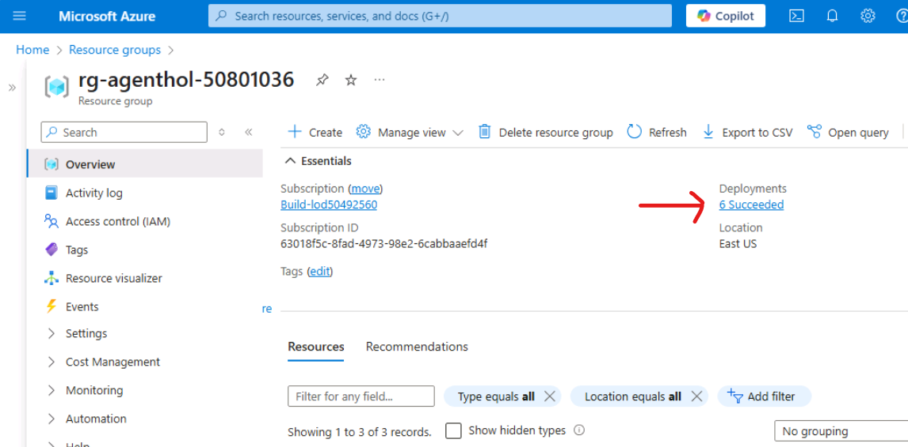

# Module 00 - Configure local lab resources

## Introduction

In this Module, you'll configure the lab resources then start the application to ensure everything has been properly configured.

1. Open a browser locally on the VM and navigate to +++https://portal.azure.com+++
1. Login using the credentials below
1. User name +++@lab.CloudPortalCredential(User1).Username+++
1. Password +++@lab.CloudPortalCredential(User1).Password+++
1. In the Search box at the top of the Azure Portal, type in `resource group`. Open the Resource groups blade
1. Open the resource group that starts with: *rg-agenthol-*.
1. If the resource group does not appear wait a few moments then refresh.
1. When the new resource group appears, expand the Overview tab and click deployments.

1. If all resources have been deployed successfully, you are ready to begin the lab. Your screen should look like this.

1. Open the Cosmos DB account and navigate to Data Explorer.
1. Leave this browser open to the Azure Portal. We will refer to it again later in this lab.
1. Proceed to [Run the Solution](#run-the-solution)

## Run the solution

### Start the Backend App

1. Open VS Code from the desktop.
1. This should open this folder by default, *"C:\Users\LabUser\multi-agent-hol\"*. If not, navigate to and open this folder.
1. From the menu, select Terminal, New Terminal, then open a new PowerShell terminal.
1. Navigate to the *python* folder.

```shell
cd python
```

1. Start the fastapi server.

```shell
uvicorn src.app.banking_agents_api:app --reload --host 0.0.0.0 --port 63280
```

**Note:** If prompted, allow Python to access the public and private network for this app.

The API will be available at <http://localhost:63280/docs>. This has been pre-built with boilerplate code that will create chat sessions and store the chat history in Cosmos DB.

### Start the Frontend App

1. In VS Code, open a new PowerShell terminal.
1. Navigate to the *frontend* folder

```shell
cd frontend
```

1. Run the following to install npm and start the application:

```shell
npm install
npm start
```

### Start a Conversation

1. Open your browser and navigate to `http://localhost:4200/`
1. In the Login dialog, select a user and company and click, Login.
1. Send the message:

  ```text
  Hello, how are you?
  ```

1. This should return a response saying "Hello, I am not yet implemented".

### Keep the backend and frontend running

Thoughout this lab we will keep the frontend and backend applications in this lab running. The backend will reload on every change we make throughout this lab. The frontend will reload when refreshed in the browser.

Next, we will start building the agents that will be served by the API layer and interact with Cosmos DB and Azure OpenAI using LangGraph!

## Next Steps

Proceed to Module 1 - Creating Your First Agent
