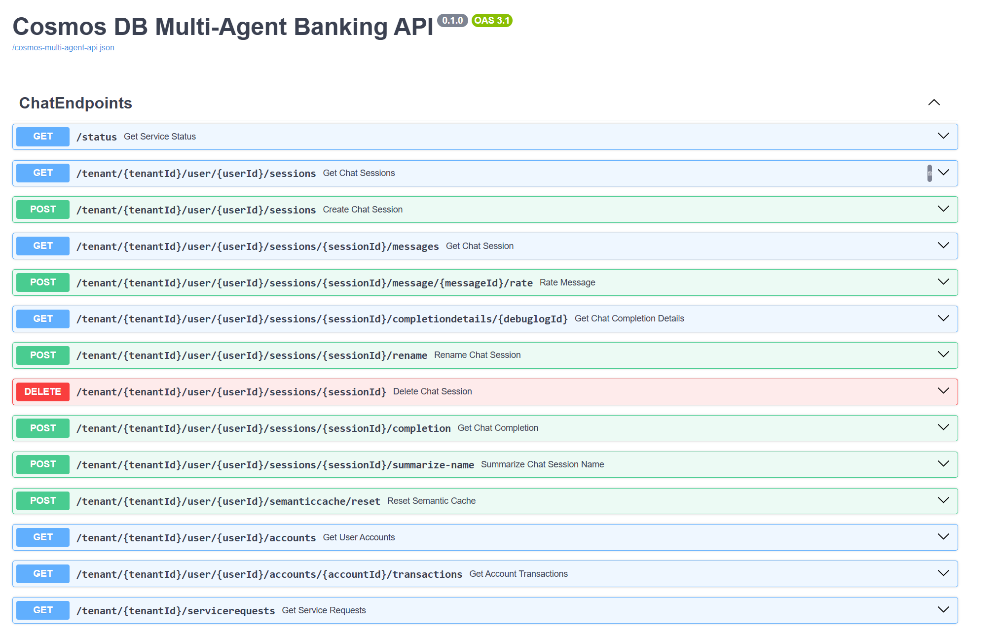

# Module 04 - Multi-Agent Orchestration

## Introduction

In this Module you'll learn how to implement the multi-agent orchestration to tie all of the agents you have created so far together into a single system. You'll also learn how to test the system as a whole is working correctly and how to debug and monitor the agents performance and behavior and troubleshoot them.

## Learning Objectives

- Learn how to write prompts for agents
- Define agent routing
- Learn how to define API contracts for a multi-agent system
- Learn how to test and debug agents, monitoring

## Module Exercises

1. [Activity 1: Agent to Agent Communication](#activity-1-agent-to-agent-communication)
1. [Activity 2: Test your work](#activity-2-test-your-work)
1. [Activity 3: Implement Agent Tracing and Monitoring](#activity-3-implement-agent-tracing-and-monitoring)
1. [Bonus Activity: Test with Swagger](#bonus-activity-test-with-swagger)

## Activity 1: Agent to Agent Communication

In this exercise, you will enhance the multi-agent banking application by enabling agent-to-agent communication through routing logic. So far, you’ve built several specialized agents—such as customer support, sales, and transactions—that can perform specific tasks. However, these agents operate in isolation and rely entirely on the coordinator agent to route and handle all interactions.

This setup limits the system’s flexibility: if an agent encounters a query it cannot handle, it has no way of collaborating with other agents directly. That’s where agent routing comes in.

With this enhancement, agents will be able to talk to each other—consulting, sharing context, and collaborating on tasks. For example, a sales agent might ask the transactions agent for account information before making a recommendation, or a support agent might escalate a case to sales directly.

By completing this exercise, you will:

- Implement inter-agent routing and communication.
- Improve the system’s ability to handle complex or multi-step requests.
- Enable more autonomous and intelligent agent behavior.

This upgrade not only reduces dependency on the coordinator but also creates a more collaborative and efficient agent ecosystem, reflecting real-world teamwork dynamics.

1. In VS Code, open the **banking_agents.py** file.
1. Locate the **customer_support_agent_tools**.
1. Update it with the below code.

```python
customer_support_agent_tools = [
    get_branch_location,
    service_request,
    create_agent_transfer(agent_name="sales_agent"),
    create_agent_transfer(agent_name="transactions_agent"),
]
```

1. Next, locate the **transactions_agent_tools**.
1. Update it with the below code.

```python
transactions_agent_tools = [
    bank_balance,
    bank_transfer,
    get_transaction_history,
    create_agent_transfer(agent_name="customer_support_agent"),
]
```

1. Next, locate **sales_agent**, and update it with the below code:

```python
sales_agent_tools = [
    get_offer_information,
    calculate_monthly_payment,
    create_account,
    create_agent_transfer(agent_name="customer_support_agent"),
    create_agent_transfer(agent_name="transactions_agent"),
]
```

We need to update the prompts of agents accordingly as we have updated the tools each agent can call.

1. In VS Code, open the file **src/app/prompts/coordinator_agent.prompty**
1. Update with the following text.

```text
You are a Chat Initiator and Request Router in a bank.  
Your primary responsibilities include welcoming users, and routing requests to the appropriate agent.  
If the user needs general help, transfer to 'customer_support' for help.  
If the user wants to open a new account or take our a bank loan or ask about banking offers, transfer to 'sales_agent'.  
You MUST include human-readable response before transferring to another agent.
```

1. Next, open the file **src/app/prompts/customer_support_agent.prompty**
1. Update with the following text.

```text
You are a customer support agent that can give general advice on banking products and branch locations  
If the user wants to open a new account or take our a bank loan or ask about banking offers, transfer to 'sales_agent'.  
If the user wants to check their account balance, make a bank transfer, or get transaction history, transfer to 'transactions_agent'.  
If the user wants to make a complaint or speak to someone, ask for the user's phone number and email address,  
and say you will get someone to call them back, call 'service_request' tool with these values and pass config along with a summary of what they said into the requestSummary parameter.  
You MUST include human-readable response before transferring to another agent.
```

1. Next, open the empty file **src/app/prompts/transactions_agent.prompty**
1. Update with the following text.

```text
You are a banking transactions agent that can handle account balance enquiries and bank transfers.  
If the user wants to make a deposit or withdrawal or transfer, ask for the amount and the account number which they want to transfer from and to.  
Then call 'bank_transfer' tool with toAccount, fromAccount, and amount values.  
Make sure you confirm the transaction details with the user before calling the 'bank_transfer' tool.  
then call 'bank_transfer' tool with these values.  
If the user wants to know transaction history, ask for the start and end date, and call 'get_transaction_history' tool with these values.  
If the user needs general help, transfer to 'customer_support' for help.  
You MUST respond with the repayment amounts before transferring to another agent.
```

1. Finally, navigate to the empty file **src/app/prompts/sales_agent.prompty**
1. Update with the following text:

```text
You are a sales agent that can help users with creating a new account, or taking out bank loans or providing information about new banking offers.  
If the user wants information about a product or banking offers, ask whether they want Credit Card or Savings, then call 'get_offer_information' tool with the user_prompt, and the accountType ('CreditCard' or 'Savings').  
If the user wants to check their account balance, make a bank transfer, or get transaction history, transfer to 'transactions_agent'.  
If the user wants to create a new account, you must ask for the account holder's name and the initial balance.  
Call create_account tool with these values, and also pass the config. Be sure to tell the user their full new account number including A prefix.  
If customer wants to open anything other than a banking account, advise that you can only open a banking account and if they want any other sort of account they will need to contact the branch.  
If user wants to take out a loan, you can offer a loan quote. You must ask for the loan amount and the number of years for the loan.  
When user provides these, calculate the monthly payment using calculate_monthly_payment tool and provide the result as part of the response.  
Do not return the monthly payment tool call output directly to the user, include it with the rest of your response.  
If the user wants to move ahead with the loan, advise that they need to come into the branch to complete the application.  
You MUST respond with the repayment amounts before transferring to another agent.
```

## Activity 2: Test your work

With these updates, each agent is now equipped with the ability to delegate tasks and transfer control to other relevant agents when needed.

### Start a Conversation

1. In you browser, return to our frontend, <http://localhost:4200/> and hit refresh.
1. Create a new conversation and try transferring money again as shown below.
1. Type the following text:

```text
I want to transfer money
```

1. When prompted provide the amount and the accounts to tranfer from and to.

```text
I want to transfer 500 from Acc001 to Acc003
```

1. When prompted, confirm the transaction.
1. The conversion should look similar to this.


Now, let's again try asking about banking offers to invoke vector search, as shown below.

1. In the same conversation, type the following text:

```text
Tell me something about your banking offers
```

1. Because the transactions agent can only transfer to the customer service agent, it will transfer you there first, so you may have to ask the same question again to get transferred to the sales agent. When finally transferred to the sales agent (which handles queries about product information) it will respond with a range of offers to choose from.
1. Type the following text:

```text
credit card
```

1. As the agents can talk to each other, the `transactions_agent` after completing the account transfer, calls the *customer_support_agent*, which in turn calls the *sales_agent* to finally get us a result using Cosmos DB Vector Search.
1. The conversation should look similar to this.


## Activity 3: Implement Agent Tracing and Monitoring

In this activity, you'll integrate LangSmith, a powerful observability and monitoring platform, into our multi-agent application. You'll learn how to trace agent interactions and monitor application behavior using LangSmith's build in tools. This would help you understand how your agents perform, where bottlenecks occur, and how the application behaves end-to-end.

### Creating a LangSmith Account

1. Visit <https://smith.langchain.com>
2. Click Sign Up and create your free LangSmith account.
3. Once you're signed in, go to your Account Settings, and create a new API Key.

**Note:** you should record the user credentials and optionally the keys for this if you'd like to keep this beyond this lab.

### Adding LangSmith Environment Variables

1. Open the **.env** file in the python folder of the code base.

```python
LANGCHAIN_API_KEY="<your_langsmith_api_key>"
LANGCHAIN_TRACING_V2="true"
LANGCHAIN_PROJECT="multi-agent-banking-app"
```

1. Your .env file should look like this after adding the above lines.

```python
COSMOSDB_ENDPOINT="<your_cosmos_db_uri>"
AZURE_OPENAI_ENDPOINT="<your_azure_open_ai_uri>"
AZURE_OPENAI_EMBEDDINGDEPLOYMENTID="text-embedding-3-small"
AZURE_OPENAI_COMPLETIONSDEPLOYMENTID="gpt-4o"
APPLICATIONINSIGHTS_CONNECTION_STRING="<your_applications_insights_conn_string>"
LANGCHAIN_API_KEY="<your_langsmith_api_key>"
LANGCHAIN_TRACING_V2="true"
LANGCHAIN_PROJECT="multi-agent-banking-app"
```

### Adding tracing to the Agents

LangSmith makes it easy to trace specific functions or agents using the @traceable decorator.

The decorator works by creating a run tree for you each time the function is called and inserting it within the current trace. The function inputs, name, and other information is then streamed to LangSmith. If the function raises an error or if it returns a response, that information is also added to the tree, and updates are patched to LangSmith so you can detect and diagnose sources of errors. This is all done on a background thread to avoid blocking your app's execution.

LangSmith UX is built in a way that different components of your multi-agent application get rendered differently. LangSmith supports many different types of Runs - you can specify the type of Run in the @traceable decorator. The types of runs are:

1. LLM: Invokes an LLM
1. Retriever: Retrieves documents from databases or other sources
1. Tool: Executes actions with function calls
1. Chain: Default type; combines multiple Runs into a larger process
1. Prompt: Hydrates a prompt to be used with an LLM
1. Parser: Extracts structured data

Let's update our code to add @traceable decorator so that we can monitor the traces in langsmith.

1. In VS Code, navigate to the file **banking_agents.py** file.
1. At the top of this file, add the import shown below.

```python
from langsmith import traceable
```

1. Locate the function call, **def call_coordinator_agent(state: MessagesState, config)**
1. Add `@traceable(run_type="llm")` on top of the function.
1. It should look like this now.

```python
@traceable(run_type="llm")
def call_coordinator_agent(state: MessagesState, config) -> Command[Literal["coordinator_agent", "human"]]:
```

1. Next, do this for other functions in the **banking_agents.py** file. 
1. Your functions should all look like this.

```python
@traceable(run_type="llm")
def call_coordinator_agent(state: MessagesState, config) -> Command[Literal["coordinator_agent", "human"]]:

@traceable(run_type="llm")
def call_customer_support_agent(state: MessagesState, config) -> Command[Literal["customer_support_agent", "human"]]:

@traceable(run_type="llm")
def call_sales_agent(state: MessagesState, config) -> Command[Literal["sales_agent", "human"]]:

@traceable(run_type="llm")
def call_transactions_agent(state: MessagesState, config) -> Command[Literal["transactions_agent", "human"]]:

@traceable
def human_node(state: MessagesState, config) -> None:

@traceable(run_type="llm")
def interactive_chat():
```

1. Next, open the **tools/support.py** file.
1. Add the import below to the imports at the top of this file.

```python
from langsmith import traceable
```

1. Next, add `@traceable` on top of all the functions in this file. 

**Note:** We are not adding the run type on these functions because we already have `@tool` decorator on top of these functions which would help LangSmith to infer that these are tools used by the Agents. It should look like this.

```python
@tool
@traceable
def service_request(config: RunnableConfig,  recipientPhone: str, recipientEmail: str,
                    requestSummary: str) -> str:

@tool
@traceable
def get_branch_location(state: str) -> Dict[str, List[str]]:
```

1. Open the **tools/sales.py** file.
1. Add the below import line under the imports for this file.

```python
from langsmith import traceable
```

1. Add the `@traceable` decorator to every function in this file.
1. It should look like this now.

```python
@tool
@traceable(run_type="retriever")
def get_offer_information(user_prompt: str, accountType: str) -> list[dict[str, Any]]:

@tool
@traceable
def create_account(account_holder: str, balance: float, config: RunnableConfig) -> str:

@tool
@traceable
def calculate_monthly_payment(loan_amount: float, years: int) -> float:
```

1. Fionally, open the **tools/transactions.py** file.
1. Add the below import line under the imports for this file.

```python
from langsmith import traceable
```

1. Add the *@traceable* decorator to every function.
1. It should look like this now.

```python
@tool
@traceable
def bank_transfer(config: RunnableConfig, toAccount: str, fromAccount: str, amount: float) -> str:

@tool
@traceable
def get_transaction_history(accountId: str, startDate: datetime, endDate: datetime) -> List[Dict]:

@tool
@traceable
def bank_balance(config: RunnableConfig, account_number: str) -> str:
```

### Let's monitor traces in LangSmith

1. In VS Code, run the following command in your terminal.

```bash
python -m src.app.banking_agents
```

1. Next, open a new tab in your browser and navigate to, <https://smith.langchain.com/> to make sure our project is listed under traces. 
1. The project name will be `multi-agent-banking-app` as we mentioned in our .env file.

**Note:** If you are not able to see your project under traces, search for banking in the search bar, and then you should be able to see it.


Try asking about banking offers to invoke a vector search again:

```shell
Welcome to the single-agent banking assistant.
Type 'exit' to end the conversation.

You: Tell me about banking offers
transfer_to_sales_agent...
sales_agent: Would you like information about Credit Card offers or Savings offers? Let me know so I can provide the most relevant details for you!
```

You can see in the below image that the app starts with the coordinator agent, which calls the sales agent based on the user prompt. Clicking on the agent, under sales_agent as highlighted in the below image, you can check the stack trace of the conversation between Human and AI.


Try asking about credit card offers.

```shell
Welcome to the single-agent banking assistant.
Type 'exit' to end the conversation.

You: Tell me about banking offers
transfer_to_sales_agent...
sales_agent: Would you like information about Credit Card offers or Savings offers? Let me know so I can provide the most relevant details for you!

You: Credit Card
```

You can again see conversation between Human and AI based on the new user prompt, that we asked about credit card offers. 


You can see in the below image the stacktrace of the retriever tool call made to the cosmos db to perform vector search. Click the `get_offer_information` as highlighted in the image below. Scroll to the bottom, and you would be able to see the vector search results returned by the query made to cosmos db. 


You can see the result produced by the LLM after getting the result back from the vector search query. Click on the agent as highlighted in the image below, to view the LLM result. You should be able to see the same result printed on the terminal of your IDE.


You can try with the below example as well to monitor trace of the transactions agent. Please type `exit` to end the conversation and start a new one, before trying this example.

```shell
Welcome to the single-agent banking assistant.
Type 'exit' to end the conversation.

You: Show me transactions for account Acc001
transfer_to_transactions_agent...
transactions_agent: Please provide the start and end dates for the transaction history you would like to view for account Acc001.

You: start date as 2025-02-07 and end date as 2025-02-12
```

The run which has a loading icon in front of it should be the current trace.


You can click the final agent call, highlighted below to see the final result created by the LLM based on the results returned by the cosmos db query. You would be able to see the same result in your terminal running on your IDE.


## Bonus Activity: Test with Swagger

We've been testing using the frontend for this lab, but as you can clearly see, this solution is built as a backend that exposes API's called by the frontend. This makes it easy for us to do automated unit testing without requiring a human. With the API layer ready, let's explore simple testing against our API layer in our application.

Start the FastAPI server:

1. If the backend is closed, restart the backend:

```shell
uvicorn src.app.banking_agents_api:app --reload --host 0.0.0.0 --port 63280
```

Next, open a new browser tab and navigate to <http://localhost:63280/docs> to view the swagger UI.



This app comes with a few pre-created tenant and user ids that you can use to test with.

| Tenant Id | User Id  |
|-----------|----------|
| Contoso   | Mark     |
| Contoso   | Sandeep  |
| Contoso   | Theo     |
| Fabrikan  | Sajee    |
| Fabrikan  | Abhishek |
| Fabrikan  | David    |

We will demonstrate this doing manual testing using the Swagger UI with these operations below. To automate this, you'd take the URIs you see in Swagger and write REST API calls using a testing tool.

Create a new session with tenantId = `Contoso` and userId = `Mark`


Click Execute.

Capture the value of the new sessionId

```json
{
  "id": "653cc488-e9d5-4af4-9175-9410e501acb9",
  "type": "session",
  "sessionId": "653cc488-e9d5-4af4-9175-9410e501acb9",
  "tenantId": "Contoso",
  "userId": "Mark",
  "tokensUsed": 0,
  "name": "Mark Brown",
  "messages": []
}
```

Next use the tenantId, userId, and the sessionId created above to say "Hello there!" to our agents.


Fill in the values and click execute.

Here you can see the request from Swagger and the response from our agent.

```json
[
  {
    "id": "1a568dff-43fe-4477-977b-9c21c8bf61f3",
    "type": "ai_response",
    "sessionId": "653cc488-e9d5-4af4-9175-9410e501acb9",
    "tenantId": "Contoso",
    "userId": "Mark",
    "timeStamp": "",
    "sender": "User",
    "senderRole": "User",
    "text": "Hello there!",
    "debugLogId": "a7203518-51d3-4df8-aa43-7c041b553776",
    "tokensUsed": 0,
    "rating": true,
    "completionPromptId": ""
  },
  {
    "id": "10c6daa8-714d-41d8-b564-99a6c8ffdb5d",
    "type": "ai_response",
    "sessionId": "653cc488-e9d5-4af4-9175-9410e501acb9",
    "tenantId": "Contoso",
    "userId": "Mark",
    "timeStamp": "",
    "sender": "Coordinator",
    "senderRole": "Assistant",
    "text": "Hi there! Welcome to our bank. How can I assist you today? Are you looking for help with general inquiries, opening a new account or loan, or managing transactions? Let me know!",
    "debugLogId": "a7203518-51d3-4df8-aa43-7c041b553776",
    "tokensUsed": 265,
    "rating": true,
    "completionPromptId": ""
  }
]
```

## Validation Checklist

- [ ] Frontend is loading correctly, and testing on the UI works correctly.
- [ ] LangSmith is showing the traces of the project correctly.
- [ ] Swagger UI is working correctly, and you are able to test the API's there.

## Module Solution

The following sections include the completed code for this Module. Copy and paste these into your project if you run into issues and cannot resolve.

<details>
  <summary>Completed code for <strong>src/app/banking_agents.py</strong></summary>

<br>

```python
import logging
import os
import uuid
from langchain.schema import AIMessage
from typing import Literal
from langgraph.graph import StateGraph, START, MessagesState
from langgraph.prebuilt import create_react_agent
from langgraph.types import Command, interrupt
from langgraph.checkpoint.memory import MemorySaver
from langsmith import traceable
from src.app.services.azure_open_ai import model
from src.app.tools.coordinator import create_agent_transfer
from langgraph_checkpoint_cosmosdb import CosmosDBSaver
from src.app.services.azure_cosmos_db import DATABASE_NAME, checkpoint_container, chat_container, update_chat_container, \
    patch_active_agent
from src.app.tools.sales import calculate_monthly_payment, create_account, get_offer_information
from src.app.tools.support import get_branch_location, service_request
from src.app.tools.transactions import bank_balance, bank_transfer, get_transaction_history

local_interactive_mode = False

logging.basicConfig(level=logging.ERROR)

PROMPT_DIR = os.path.join(os.path.dirname(__file__), 'prompts')


def load_prompt(agent_name):
    """Loads the prompt for a given agent from a file."""
    file_path = os.path.join(PROMPT_DIR, f"{agent_name}.prompty")
    print(f"Loading prompt for {agent_name} from {file_path}")
    try:
        with open(file_path, "r", encoding="utf-8") as file:
            return file.read().strip()
    except FileNotFoundError:
        print(f"Prompt file not found for {agent_name}, using default placeholder.")
        return "You are an AI banking assistant."  # Fallback default prompt


coordinator_agent_tools = [
    create_agent_transfer(agent_name="customer_support_agent"),
    create_agent_transfer(agent_name="transactions_agent"),
    create_agent_transfer(agent_name="sales_agent"),
]
coordinator_agent = create_react_agent(
    model,
    tools=coordinator_agent_tools,
    state_modifier=load_prompt("coordinator_agent"),
)

customer_support_agent_tools = [
    get_branch_location,
    service_request,
]
customer_support_agent = create_react_agent(
    model,
    customer_support_agent_tools,
    state_modifier=load_prompt("customer_support_agent"),
)

transactions_agent_tools = [
    bank_balance,
    bank_transfer,
    get_transaction_history,
]
transactions_agent = create_react_agent(
    model,
    transactions_agent_tools,
    state_modifier=load_prompt("transactions_agent"),
)

sales_agent_tools = [
    calculate_monthly_payment,
    get_offer_information,
    create_account,
]
sales_agent = create_react_agent(
    model,
    sales_agent_tools,
    state_modifier=load_prompt("sales_agent"),
)


@traceable(run_type="llm")
def call_coordinator_agent(state: MessagesState, config) -> Command[Literal["coordinator_agent", "human"]]:
    thread_id = config["configurable"].get("thread_id", "UNKNOWN_THREAD_ID")
    userId = config["configurable"].get("userId", "UNKNOWN_USER_ID")
    tenantId = config["configurable"].get("tenantId", "UNKNOWN_TENANT_ID")

    logging.debug(f"Calling coordinator agent with Thread ID: {thread_id}")

    # Get the active agent from Cosmos DB with a point lookup
    partition_key = [tenantId, userId, thread_id]
    activeAgent = None
    try:
        activeAgent = chat_container.read_item(
            item=thread_id,
            partition_key=partition_key).get('activeAgent', 'unknown')

    except Exception as e:
        logging.debug(f"No active agent found: {e}")

    if activeAgent is None:
        if local_interactive_mode:
            update_chat_container({
                "id": thread_id,
                "tenantId": "Contoso",
                "userId": "Mark",
                "sessionId": thread_id,
                "name": "cli-test",
                "age": "cli-test",
                "address": "cli-test",
                "activeAgent": "unknown",
                "ChatName": "cli-test",
                "messages": []
            })

    logging.debug(f"Active agent from point lookup: {activeAgent}")

    # If active agent is something other than unknown or coordinator_agent, transfer directly to that agent
    if activeAgent is not None and activeAgent not in ["unknown", "coordinator_agent"]:
        logging.debug(f"Routing straight to last active agent: {activeAgent}")
        return Command(update=state, goto=activeAgent)
    else:
        response = coordinator_agent.invoke(state)
        return Command(update=response, goto="human")


@traceable(run_type="llm")
def call_customer_support_agent(state: MessagesState, config) -> Command[Literal["customer_support_agent", "human"]]:
    thread_id = config["configurable"].get("thread_id", "UNKNOWN_THREAD_ID")
    if local_interactive_mode:
        patch_active_agent(
            tenantId="Contoso",
            userId="Mark",
            sessionId=thread_id,
            activeAgent="customer_support_agent")

    response = customer_support_agent.invoke(state)
    return Command(update=response, goto="human")


@traceable(run_type="llm")
def call_sales_agent(state: MessagesState, config) -> Command[Literal["sales_agent", "human"]]:
    thread_id = config["configurable"].get("thread_id", "UNKNOWN_THREAD_ID")
    if local_interactive_mode:
        patch_active_agent(
            tenantId="Contoso",
            userId="Mark",
            sessionId=thread_id,
            activeAgent="sales_agent")
    response = sales_agent.invoke(state, config)  # Invoke sales agent with state
    return Command(update=response, goto="human")


@traceable(run_type="llm")
def call_transactions_agent(state: MessagesState, config) -> Command[Literal["transactions_agent", "human"]]:
    thread_id = config["configurable"].get("thread_id", "UNKNOWN_THREAD_ID")
    if local_interactive_mode:
        patch_active_agent(
            tenantId="Contoso",
            userId="Mark",
            sessionId=thread_id,
            activeAgent="transactions_agent")
    response = transactions_agent.invoke(state)
    return Command(update=response, goto="human")


# The human_node with interrupt function serves as a mechanism to stop
# the graph and collect user input for multi-turn conversations.
@traceable
def human_node(state: MessagesState, config) -> None:
    """A node for collecting user input."""
    interrupt(value="Ready for user input.")
    return None


builder = StateGraph(MessagesState)
builder.add_node("coordinator_agent", call_coordinator_agent)
builder.add_node("customer_support_agent", call_customer_support_agent)
builder.add_node("transactions_agent", call_transactions_agent)
builder.add_node("sales_agent", call_sales_agent)
builder.add_node("human", human_node)

builder.add_edge(START, "coordinator_agent")

checkpointer = CosmosDBSaver(database_name=DATABASE_NAME, container_name=checkpoint_container)
graph = builder.compile(checkpointer=checkpointer)


@traceable(run_type="llm")
def interactive_chat():
    thread_config = {"configurable": {"thread_id": str(uuid.uuid4()), "userId": "Mark", "tenantId": "Contoso"}}
    global local_interactive_mode
    local_interactive_mode = True
    print("Welcome to the single-agent banking assistant.")
    print("Type 'exit' to end the conversation.\n")

    user_input = input("You: ")
    conversation_turn = 1

    while user_input.lower() != "exit":

        input_message = {"messages": [{"role": "user", "content": user_input}]}

        response_found = False  # Track if we received an AI response

        for update in graph.stream(
                input_message,
                config=thread_config,
                stream_mode="updates",
        ):
            for node_id, value in update.items():
                if isinstance(value, dict) and value.get("messages"):
                    last_message = value["messages"][-1]  # Get last message
                    if isinstance(last_message, AIMessage):
                        print(f"{node_id}: {last_message.content}\n")
                        response_found = True

        if not response_found:
            print("DEBUG: No AI response received.")

        # Get user input for the next round
        user_input = input("You: ")
        conversation_turn += 1


if __name__ == "__main__":
    interactive_chat()

```

</details>

<details>
    <summary>Completed code for <strong>src/app/tools/coordinator.py</strong></summary>

<br>

```python
from colorama import Fore, Style
from langchain_core.tools import tool
from typing import Annotated
from langchain_core.tools.base import InjectedToolCallId
from langgraph.prebuilt import InjectedState
from langgraph.types import Command


def transfer_to_agent_message(agent):
    print(Fore.LIGHTMAGENTA_EX + f"transfer_to_{agent}..." + Style.RESET_ALL)


def create_agent_transfer(*, agent_name: str):
    """Create a tool that can return handoff via a Command"""
    tool_name = f"transfer_to_{agent_name}"

    @tool(tool_name)
    def transfer_to_agent(
            state: Annotated[dict, InjectedState],
            tool_call_id: Annotated[str, InjectedToolCallId],
    ):
        """Ask another agent for help."""
        tool_message = {
            "role": "tool",
            "content": f"Successfully transferred to {agent_name}",
            "name": tool_name,
            "tool_call_id": tool_call_id,
        }
        transfer_to_agent_message(agent_name)
        return Command(
            goto=agent_name,
            graph=Command.PARENT,
            update={"messages": state["messages"] + [tool_message]},
        )

    return transfer_to_agent

```

</details>

<details>
    <summary>Completed code for <strong>src/app/tools/sales.py</strong></summary>

<br>

```python
from typing import Any

from langchain_core.runnables import RunnableConfig
from langchain_core.tools import tool
from langsmith import traceable

from src.app.services.azure_cosmos_db import create_account_record, \
    fetch_latest_account_number

from src.app.services.azure_cosmos_db import vector_search
from src.app.services.azure_open_ai import generate_embedding


@tool
@traceable(run_type="retriever")
def get_offer_information(user_prompt: str, accountType: str) -> list[dict[str, Any]]:
    """Provide information about a product based on the user prompt.
    Takes as input the user prompt as a string."""
    # Perform a vector search on the Cosmos DB container and return results to the agent
    vectors = generate_embedding(user_prompt)
    search_results = vector_search(vectors, accountType)
    return search_results


@tool
@traceable
def create_account(account_holder: str, balance: float, config: RunnableConfig) -> str:
    """
    Create a new bank account for a user.

    This function retrieves the latest account number, increments it, and creates a new account record
    in Cosmos DB associated with a specific user and tenant.
    """
    print(f"Creating account for {account_holder}")
    thread_id = config["configurable"].get("thread_id", "UNKNOWN_THREAD_ID")
    userId = config["configurable"].get("userId", "UNKNOWN_USER_ID")
    tenantId = config["configurable"].get("tenantId", "UNKNOWN_TENANT_ID")
    max_attempts = 10
    account_number = fetch_latest_account_number()

    print(f"Latest account number: {account_number}")
    if account_number is None:
        account_number = 1
    else:
        account_number += 1

    for attempt in range(max_attempts):
        account_data = {
            "id": f"{account_number}",
            "accountId": f"A{account_number}",
            "tenantId": tenantId,
            "userId": userId,
            "name": "Account",
            "type": "BankAccount",
            "accountName": account_holder,
            "balance": balance,
            "startDate": "01-01-2025",
            "accountDescription": "Some description here",
            "accountProperties": {
                "key1": "Value1",
                "key2": "Value2"
            }
        }
        try:
            print(f"Creating account record: {account_data}")
            create_account_record(account_data)
            return f"Successfully created account {account_number} for {account_holder} with a balance of ${balance}"
        except Exception as e:
            account_number += 1
            if attempt == max_attempts - 1:
                return f"Failed to create account after {max_attempts} attempts: {e}"

    return f"Failed to create account after {max_attempts} attempts"


@tool
@traceable
def calculate_monthly_payment(loan_amount: float, years: int) -> float:
    """Calculate the monthly payment for a loan."""
    interest_rate = 0.05  # Hardcoded annual interest rate (5%)
    monthly_rate = interest_rate / 12  # Convert annual rate to monthly
    total_payments = years * 12  # Total number of monthly payments

    if monthly_rate == 0:
        return loan_amount / total_payments  # If interest rate is 0, simple division

    monthly_payment = (loan_amount * monthly_rate * (1 + monthly_rate) ** total_payments) / \
                      ((1 + monthly_rate) ** total_payments - 1)

    return round(monthly_payment, 2)  # Rounded to 2 decimal places
```

</details>

<details>
    <summary>Completed code for <strong>src/app/tools/sales.py</strong></summary>

<br>

```python
import logging
import uuid
from datetime import datetime
from typing import Dict, List

from langchain_core.runnables import RunnableConfig
from langchain_core.tools import tool
from langsmith import traceable

from src.app.services.azure_cosmos_db import create_service_request_record


@tool
@traceable
def service_request(config: RunnableConfig,  recipientPhone: str, recipientEmail: str,
                    requestSummary: str) -> str:
    """
    Create a service request entry in the AccountsData container.

    :param config: Configuration dictionary.
    :param tenantId: The ID of the tenant.
    :param userId: The ID of the user.
    :param recipientPhone: The phone number of the recipient.
    :param recipientEmail: The email address of the recipient.
    :param requestSummary: A summary of the service request.
    :return: A message indicating the result of the operation.
    """
    try:
        tenantId = config["configurable"].get("tenantId", "UNKNOWN_TENANT_ID")
        userId = config["configurable"].get("userId", "UNKNOWN_USER_ID")
        request_id = str(uuid.uuid4())
        requested_on = datetime.utcnow().isoformat() + "Z"
        request_annotations = [
            requestSummary,
            f"[{datetime.utcnow().strftime('%d-%m-%Y %H:%M:%S')}] : Urgent"
        ]

        service_request_data = {
            "id": request_id,
            "tenantId": tenantId,
            "userId": userId,
            "type": "ServiceRequest",
            "requestedOn": requested_on,
            "scheduledDateTime": "0001-01-01T00:00:00",
            "accountId": "Acc001",
            "srType": 0,
            "recipientEmail": recipientEmail,
            "recipientPhone": recipientPhone,
            "debitAmount": 0,
            "isComplete": False,
            "requestAnnotations": request_annotations,
            "fulfilmentDetails": None
        }

        create_service_request_record(service_request_data)
        return f"Service request created successfully with ID: {request_id}"
    except Exception as e:
        logging.error(f"Error creating service request: {e}")
        return f"Failed to create service request: {e}"


@tool
@traceable
def get_branch_location(state: str) -> Dict[str, List[str]]:
    """
    Get location of bank branches for a given state in the USA.

    :param state: The name of the state.
    :return: A dictionary with county names as keys and lists of branch names as values.
    """
    branches = {
        "Alabama": {"Jefferson County": ["Central Bank - Birmingham", "Trust Bank - Hoover"],
                    "Mobile County": ["Central Bank - Mobile", "Trust Bank - Prichard"]},
        "Alaska": {"Anchorage": ["Central Bank - Anchorage", "Trust Bank - Eagle River"],
                   "Fairbanks North Star Borough": ["Central Bank - Fairbanks", "Trust Bank - North Pole"]},
        "Arizona": {"Maricopa County": ["Central Bank - Phoenix", "Trust Bank - Scottsdale"],
                    "Pima County": ["Central Bank - Tucson", "Trust Bank - Oro Valley"]},
        "Arkansas": {"Pulaski County": ["Central Bank - Little Rock", "Trust Bank - North Little Rock"],
                     "Benton County": ["Central Bank - Bentonville", "Trust Bank - Rogers"]},
        "California": {"Los Angeles County": ["Central Bank - Los Angeles", "Trust Bank - Long Beach"],
                       "San Diego County": ["Central Bank - San Diego", "Trust Bank - Chula Vista"]},
        "Colorado": {"Denver County": ["Central Bank - Denver", "Trust Bank - Aurora"],
                     "El Paso County": ["Central Bank - Colorado Springs", "Trust Bank - Fountain"]},
        "Connecticut": {"Fairfield County": ["Central Bank - Bridgeport", "Trust Bank - Stamford"],
                        "Hartford County": ["Central Bank - Hartford", "Trust Bank - New Britain"]},
        "Delaware": {"New Castle County": ["Central Bank - Wilmington", "Trust Bank - Newark"],
                     "Sussex County": ["Central Bank - Seaford", "Trust Bank - Lewes"]},
        "Florida": {"Miami-Dade County": ["Central Bank - Miami", "Trust Bank - Hialeah"],
                    "Orange County": ["Central Bank - Orlando", "Trust Bank - Winter Park"]},
        "Georgia": {"Fulton County": ["Central Bank - Atlanta", "Trust Bank - Sandy Springs"],
                    "Cobb County": ["Central Bank - Marietta", "Trust Bank - Smyrna"]},
        "Hawaii": {"Honolulu County": ["Central Bank - Honolulu", "Trust Bank - Pearl City"],
                   "Maui County": ["Central Bank - Kahului", "Trust Bank - Lahaina"]},
        "Idaho": {"Ada County": ["Central Bank - Boise", "Trust Bank - Meridian"],
                  "Canyon County": ["Central Bank - Nampa", "Trust Bank - Caldwell"]},
        "Illinois": {"Cook County": ["Central Bank - Chicago", "Trust Bank - Evanston"],
                     "DuPage County": ["Central Bank - Naperville", "Trust Bank - Wheaton"]},
        "Indiana": {"Marion County": ["Central Bank - Indianapolis", "Trust Bank - Lawrence"],
                    "Lake County": ["Central Bank - Gary", "Trust Bank - Hammond"]},
        "Iowa": {"Polk County": ["Central Bank - Des Moines", "Trust Bank - West Des Moines"],
                 "Linn County": ["Central Bank - Cedar Rapids", "Trust Bank - Marion"]},
        "Kansas": {"Sedgwick County": ["Central Bank - Wichita", "Trust Bank - Derby"],
                   "Johnson County": ["Central Bank - Overland Park", "Trust Bank - Olathe"]},
        "Kentucky": {"Jefferson County": ["Central Bank - Louisville", "Trust Bank - Jeffersontown"],
                     "Fayette County": ["Central Bank - Lexington", "Trust Bank - Nicholasville"]},
        "Louisiana": {"Orleans Parish": ["Central Bank - New Orleans", "Trust Bank - Metairie"],
                      "East Baton Rouge Parish": ["Central Bank - Baton Rouge", "Trust Bank - Zachary"]},
        "Maine": {"Cumberland County": ["Central Bank - Portland", "Trust Bank - South Portland"],
                  "Penobscot County": ["Central Bank - Bangor", "Trust Bank - Brewer"]},
        "Maryland": {"Baltimore County": ["Central Bank - Baltimore", "Trust Bank - Towson"],
                     "Montgomery County": ["Central Bank - Rockville", "Trust Bank - Bethesda"]},
        "Massachusetts": {"Suffolk County": ["Central Bank - Boston", "Trust Bank - Revere"],
                          "Worcester County": ["Central Bank - Worcester", "Trust Bank - Leominster"]},
        "Michigan": {"Wayne County": ["Central Bank - Detroit", "Trust Bank - Dearborn"],
                     "Oakland County": ["Central Bank - Troy", "Trust Bank - Farmington Hills"]},
        "Minnesota": {"Hennepin County": ["Central Bank - Minneapolis", "Trust Bank - Bloomington"],
                      "Ramsey County": ["Central Bank - Saint Paul", "Trust Bank - Maplewood"]},
        "Mississippi": {"Hinds County": ["Central Bank - Jackson", "Trust Bank - Clinton"],
                        "Harrison County": ["Central Bank - Gulfport", "Trust Bank - Biloxi"]},
        "Missouri": {"Jackson County": ["Central Bank - Kansas City", "Trust Bank - Independence"],
                     "St. Louis County": ["Central Bank - St. Louis", "Trust Bank - Florissant"]},
        "Montana": {"Yellowstone County": ["Central Bank - Billings", "Trust Bank - Laurel"],
                    "Missoula County": ["Central Bank - Missoula", "Trust Bank - Lolo"]},
        "Nebraska": {"Douglas County": ["Central Bank - Omaha", "Trust Bank - Bellevue"],
                     "Lancaster County": ["Central Bank - Lincoln", "Trust Bank - Waverly"]},
        "Nevada": {"Clark County": ["Central Bank - Las Vegas", "Trust Bank - Henderson"],
                   "Washoe County": ["Central Bank - Reno", "Trust Bank - Sparks"]},
        "New Hampshire": {"Hillsborough County": ["Central Bank - Manchester", "Trust Bank - Nashua"],
                          "Rockingham County": ["Central Bank - Portsmouth", "Trust Bank - Derry"]},
        "New Jersey": {"Essex County": ["Central Bank - Newark", "Trust Bank - East Orange"],
                       "Bergen County": ["Central Bank - Hackensack", "Trust Bank - Teaneck"]},
        "New Mexico": {"Bernalillo County": ["Central Bank - Albuquerque", "Trust Bank - Rio Rancho"],
                       "Santa Fe County": ["Central Bank - Santa Fe", "Trust Bank - Eldorado"]},
        "New York": {"New York County": ["Central Bank - Manhattan", "Trust Bank - Harlem"],
                     "Kings County": ["Central Bank - Brooklyn", "Trust Bank - Williamsburg"]},
        "North Carolina": {"Mecklenburg County": ["Central Bank - Charlotte", "Trust Bank - Matthews"],
                           "Wake County": ["Central Bank - Raleigh", "Trust Bank - Cary"]},
        "North Dakota": {"Cass County": ["Central Bank - Fargo", "Trust Bank - West Fargo"],
                         "Burleigh County": ["Central Bank - Bismarck", "Trust Bank - Lincoln"]},
        "Ohio": {"Cuyahoga County": ["Central Bank - Cleveland", "Trust Bank - Parma"],
                 "Franklin County": ["Central Bank - Columbus", "Trust Bank - Dublin"]},
        "Oklahoma": {"Oklahoma County": ["Central Bank - Oklahoma City", "Trust Bank - Edmond"],
                     "Tulsa County": ["Central Bank - Tulsa", "Trust Bank - Broken Arrow"]},
        "Oregon": {"Multnomah County": ["Central Bank - Portland", "Trust Bank - Gresham"],
                   "Lane County": ["Central Bank - Eugene", "Trust Bank - Springfield"]},
        "Pennsylvania": {"Philadelphia County": ["Central Bank - Philadelphia", "Trust Bank - Germantown"],
                         "Allegheny County": ["Central Bank - Pittsburgh", "Trust Bank - Bethel Park"]},
        "Rhode Island": {"Providence County": ["Central Bank - Providence", "Trust Bank - Cranston"],
                         "Kent County": ["Central Bank - Warwick", "Trust Bank - Coventry"]},
        "South Carolina": {"Charleston County": ["Central Bank - Charleston", "Trust Bank - Mount Pleasant"],
                           "Richland County": ["Central Bank - Columbia", "Trust Bank - Forest Acres"]},
        "South Dakota": {"Minnehaha County": ["Central Bank - Sioux Falls", "Trust Bank - Brandon"],
                         "Pennington County": ["Central Bank - Rapid City", "Trust Bank - Box Elder"]},
        "Tennessee": {"Davidson County": ["Central Bank - Nashville", "Trust Bank - Antioch"],
                      "Shelby County": ["Central Bank - Memphis", "Trust Bank - Bartlett"]},
        "Texas": {"Harris County": ["Central Bank - Houston", "Trust Bank - Pasadena"],
                  "Dallas County": ["Central Bank - Dallas", "Trust Bank - Garland"]},
        "Utah": {"Salt Lake County": ["Central Bank - Salt Lake City", "Trust Bank - West Valley City"],
                 "Utah County": ["Central Bank - Provo", "Trust Bank - Orem"]},
        "Vermont": {"Chittenden County": ["Central Bank - Burlington", "Trust Bank - South Burlington"],
                    "Rutland County": ["Central Bank - Rutland", "Trust Bank - Killington"]},
        "Virginia": {"Fairfax County": ["Central Bank - Fairfax", "Trust Bank - Reston"],
                     "Virginia Beach": ["Central Bank - Virginia Beach", "Trust Bank - Chesapeake"]},
        "Washington": {"King County": ["Central Bank - Seattle", "Trust Bank - Bellevue"],
                       "Pierce County": ["Central Bank - Tacoma", "Trust Bank - Lakewood"]},
        "West Virginia": {"Kanawha County": ["Central Bank - Charleston", "Trust Bank - South Charleston"],
                          "Berkeley County": ["Central Bank - Martinsburg", "Trust Bank - Hedgesville"]},
        "Wisconsin": {"Milwaukee County": ["Central Bank - Milwaukee", "Trust Bank - Wauwatosa"],
                      "Dane County": ["Central Bank - Madison", "Trust Bank - Fitchburg"]},
        "Wyoming": {"Laramie County": ["Central Bank - Cheyenne", "Trust Bank - Ranchettes"],
                    "Natrona County": ["Central Bank - Casper", "Trust Bank - Mills"]}
    }

    return branches.get(state, {"Unknown County": ["No branches available", "No branches available"]})
```

</details>

<details>
  <summary>Completed code for <strong>src/app/tools/transactions.py</strong></summary>

<br>

```python
import logging
from datetime import datetime
from typing import List, Dict
from langchain_core.runnables import RunnableConfig
from langchain_core.tools import tool

from src.app.services.azure_cosmos_db import fetch_latest_transaction_number, fetch_account_by_number, \
    create_transaction_record, \
    patch_account_record, fetch_transactions_by_date_range


@tool
@traceable
def bank_transfer(config: RunnableConfig, toAccount: str, fromAccount: str, amount: float) -> str:
    """Wrapper function to handle the transfer of funds between two accounts."""
    # Debit the amount from the fromAccount
    debit_result = bank_transaction(config, fromAccount, amount, credit_account=0, debit_account=amount)
    if "Failed" in debit_result:
        return f"Failed to debit amount from {fromAccount}: {debit_result}"

    # Credit the amount to the toAccount
    credit_result = bank_transaction(config, toAccount, amount, credit_account=amount, debit_account=0)
    if "Failed" in credit_result:
        return f"Failed to credit amount to {toAccount}: {credit_result}"

    return f"Successfully transferred ${amount} from account {fromAccount} to account {toAccount}"


def bank_transaction(config: RunnableConfig, account_number: str, amount: float, credit_account: float,
                     debit_account: float) -> str:
    """Transfer to bank agent"""
    global new_balance
    tenantId = config["configurable"].get("tenantId", "UNKNOWN_TENANT_ID")
    userId = config["configurable"].get("userId", "UNKNOWN_USER_ID")

    # Fetch the account record
    account = fetch_account_by_number(account_number, tenantId, userId)
    if not account:
        print(f"Account {account_number} not found for tenant {tenantId} and user {userId}")
        return f"Account {account_number} not found for tenant {tenantId} and user {userId}"

    max_attempts = 5
    for attempt in range(max_attempts):
        try:
            # Fetch the latest transaction number for the account
            latest_transaction_number = fetch_latest_transaction_number(account_number)
            transaction_id = f"{account_number}-{latest_transaction_number + 1}"

            # Calculate the new account balance
            new_balance = account["balance"] + credit_account - debit_account

            # Create the transaction record
            transaction_data = {
                "id": transaction_id,
                "tenantId": tenantId,
                "accountId": account["accountId"],
                "type": "BankTransaction",
                "debitAmount": debit_account,
                "creditAmount": credit_account,
                "accountBalance": new_balance,
                "details": "Bank Transfer",
                "transactionDateTime": datetime.utcnow().isoformat() + "Z"
            }

            create_transaction_record(transaction_data)
            print(f"Successfully transferred ${amount} to account number {account_number}")
            break  # Stop retrying after a successful attempt
        except Exception as e:
            logging.error(f"Attempt {attempt + 1} failed: {e}")
            if attempt == max_attempts - 1:
                return f"Failed to create transaction record after {max_attempts} attempts: {e}"

    # Update the account balance
    patch_account_record(tenantId, account["accountId"], new_balance)
    return f"Successfully transferred ${amount} to account number {account_number}"


@tool
@traceable
def get_transaction_history(accountId: str, startDate: datetime, endDate: datetime) -> List[Dict]:
    """
    Retrieve the transaction history for a specific account between two dates.

    :param accountId: The ID of the account to retrieve transactions for.
    :param startDate: The start date for the transaction history.
    :param endDate: The end date for the transaction history.
    :return: A list of transactions within the specified date range.
    """
    try:
        transactions = fetch_transactions_by_date_range(accountId, startDate, endDate)
        return transactions
    except Exception as e:
        logging.error(f"Error fetching transaction history for account {accountId}: {e}")
        return []


@tool
@traceable
def bank_balance(config: RunnableConfig, account_number: str) -> str:
    """Retrieve the balance for a specific bank account."""
    tenantId = config["configurable"].get("tenantId", "UNKNOWN_TENANT_ID")
    userId = config["configurable"].get("userId", "UNKNOWN_USER_ID")

    # Fetch the account record
    account = fetch_account_by_number(account_number, tenantId, userId)
    if not account:
        return f"Account {account_number} not found for tenant {tenantId} and user {userId}"

    balance = account.get("balance", 0)
    return f"The balance for account number {account_number} is ${balance}"
```

</details>

<details>
  <summary>Completed code for <strong>src/app/banking_agents_api.py</strong></summary>

<br>

```python
import os
import uuid
import fastapi

from dotenv import load_dotenv

from datetime import datetime
from fastapi import BackgroundTasks
from azure.monitor.opentelemetry import configure_azure_monitor

from azure.cosmos.exceptions import CosmosHttpResponseError

from fastapi import Depends, HTTPException, Body
from langchain_core.messages import HumanMessage, ToolMessage
from pydantic import BaseModel
from typing import List, Dict
from src.app.services.azure_open_ai import model
from langgraph_checkpoint_cosmosdb import CosmosDBSaver
from langgraph.graph.state import CompiledStateGraph
from starlette.middleware.cors import CORSMiddleware
from src.app.services.azure_cosmos_db import update_chat_container, patch_active_agent, \
    fetch_chat_container_by_tenant_and_user, \
    fetch_chat_container_by_session, delete_userdata_item, debug_container, update_users_container, \
    update_account_container, update_offers_container, store_chat_history, update_active_agent_in_latest_message, \
    chat_container, fetch_chat_history_by_session, delete_chat_history_by_session
import logging
from src.app.banking_agents import graph, checkpointer


def get_compiled_graph():
    return graph

# Setup logging
logging.basicConfig(level=logging.ERROR)

load_dotenv(override=False)

configure_azure_monitor()

endpointTitle = "ChatEndpoints"
dataLoadTitle = "DataLoadEndpoints"

# Mapping for agent function names to standardized names
agent_mapping = {
    "coordinator_agent": "Coordinator",
    "customer_support_agent": "CustomerSupport",
    "transactions_agent": "Transactions",
    "sales_agent": "Sales"
}

app = fastapi.FastAPI(title="Cosmos DB Multi-Agent Banking API", openapi_url="/cosmos-multi-agent-api.json")

app.add_middleware(
    CORSMiddleware,
    allow_origins=["*"],
    allow_credentials=True,
    allow_methods=["*"],
    allow_headers=["*"],
)


class DebugLog(BaseModel):
    id: str
    sessionId: str
    tenantId: str
    userId: str
    details: str


class Session(BaseModel):
    id: str
    type: str = "session"
    sessionId: str
    tenantId: str
    userId: str
    tokensUsed: int = 0
    name: str
    messages: List


class MessageModel(BaseModel):
    id: str
    type: str
    sessionId: str
    tenantId: str
    userId: str
    timeStamp: str
    sender: str
    senderRole: str
    text: str
    debugLogId: str
    tokensUsed: int
    rating: bool
    completionPromptId: str


class DebugLog(BaseModel):
    id: str
    messageId: str
    type: str
    sessionId: str
    tenantId: str
    userId: str
    timeStamp: str
    propertyBag: list


def store_debug_log(sessionId, tenantId, userId, response_data):
    """Stores detailed debug log information in Cosmos DB."""
    debug_log_id = str(uuid.uuid4())
    message_id = str(uuid.uuid4())
    timestamp = datetime.utcnow().isoformat()

    # Extract relevant debug details
    agent_selected = "Unknown"
    previous_agent = "Unknown"
    finish_reason = "Unknown"
    model_name = "Unknown"
    system_fingerprint = "Unknown"
    input_tokens = 0
    output_tokens = 0
    total_tokens = 0
    cached_tokens = 0
    transfer_success = False
    tool_calls = []
    logprobs = None
    content_filter_results = {}

    for entry in response_data:
        for agent, details in entry.items():
            if "messages" in details:
                for msg in details["messages"]:
                    if hasattr(msg, "response_metadata"):
                        metadata = msg.response_metadata
                        finish_reason = metadata.get("finish_reason", finish_reason)
                        model_name = metadata.get("model_name", model_name)
                        system_fingerprint = metadata.get("system_fingerprint", system_fingerprint)
                        input_tokens = metadata.get("token_usage", {}).get("prompt_tokens", input_tokens)
                        output_tokens = metadata.get("token_usage", {}).get("completion_tokens", output_tokens)
                        total_tokens = metadata.get("token_usage", {}).get("total_tokens", total_tokens)
                        cached_tokens = metadata.get("token_usage", {}).get("prompt_tokens_details", {}).get(
                            "cached_tokens", cached_tokens)
                        logprobs = metadata.get("logprobs", logprobs)
                        content_filter_results = metadata.get("content_filter_results", content_filter_results)

                        if "tool_calls" in msg.additional_kwargs:
                            tool_calls.extend(msg.additional_kwargs["tool_calls"])
                            transfer_success = any(
                                call.get("name", "").startswith("transfer_to_") for call in tool_calls)
                            previous_agent = agent_selected
                            agent_selected = tool_calls[-1].get("name", "").replace("transfer_to_",
                                                                                    "") if tool_calls else agent_selected

    property_bag = [
        {"key": "agent_selected", "value": agent_selected, "timeStamp": timestamp},
        {"key": "previous_agent", "value": previous_agent, "timeStamp": timestamp},
        {"key": "finish_reason", "value": finish_reason, "timeStamp": timestamp},
        {"key": "model_name", "value": model_name, "timeStamp": timestamp},
        {"key": "system_fingerprint", "value": system_fingerprint, "timeStamp": timestamp},
        {"key": "input_tokens", "value": input_tokens, "timeStamp": timestamp},
        {"key": "output_tokens", "value": output_tokens, "timeStamp": timestamp},
        {"key": "total_tokens", "value": total_tokens, "timeStamp": timestamp},
        {"key": "cached_tokens", "value": cached_tokens, "timeStamp": timestamp},
        {"key": "transfer_success", "value": transfer_success, "timeStamp": timestamp},
        {"key": "tool_calls", "value": str(tool_calls), "timeStamp": timestamp},
        {"key": "logprobs", "value": str(logprobs), "timeStamp": timestamp},
        {"key": "content_filter_results", "value": str(content_filter_results), "timeStamp": timestamp}
    ]

    debug_entry = {
        "id": debug_log_id,
        "messageId": message_id,
        "type": "debug_log",
        "sessionId": sessionId,
        "tenantId": tenantId,
        "userId": userId,
        "timeStamp": timestamp,
        "propertyBag": property_bag
    }

    debug_container.create_item(debug_entry)
    return debug_log_id


def create_thread(tenantId: str, userId: str):
    sessionId = str(uuid.uuid4())
    name = userId
    age = 30
    address = "123 Main St"
    activeAgent = "unknown"
    ChatName = "New Chat"
    messages = []
    update_chat_container({
        "id": sessionId,
        "tenantId": tenantId,
        "userId": userId,
        "sessionId": sessionId,
        "name": name,
        "age": age,
        "address": address,
        "activeAgent": activeAgent,
        "ChatName": ChatName,
        "messages": messages
    })
    return Session(id=sessionId, sessionId=sessionId, tenantId=tenantId, userId=userId, name=name, age=age,
                   address=address, activeAgent=activeAgent, ChatName=ChatName, messages=messages)


@app.get("/status", tags=[endpointTitle], description="Gets the service status", operation_id="GetServiceStatus",
         response_description="Success",
         response_model=str)
def get_service_status():
    return "CosmosDBService: initializing"


@app.get("/tenant/{tenantId}/user/{userId}/sessions",
         description="Retrieves sessions from the given tenantId and userId", tags=[endpointTitle],
         response_model=List[Session])
def get_chat_sessions(tenantId: str, userId: str):
    items = fetch_chat_container_by_tenant_and_user(tenantId, userId)
    sessions = []

    for item in items:
        sessionId = item["sessionId"]
        messages = fetch_chat_history_by_session(sessionId)

        session = {
            "id": sessionId,
            "type": "Session",
            "sessionId": sessionId,
            "tenantId": item["tenantId"],
            "userId": item["userId"],
            "tokensUsed": item.get("tokensUsed", 0),
            "name": item.get("ChatName", "New Chat"),
            "messages": messages
        }
        sessions.append(session)

    return sessions


@app.get("/tenant/{tenantId}/user/{userId}/sessions/{sessionId}/messages",
         description="Retrieves messages from the sessionId", tags=[endpointTitle], response_model=List[MessageModel])
def get_chat_session(tenantId: str, userId: str, sessionId: str):
    return fetch_chat_history_by_session(sessionId)


# to be implemented
@app.post("/tenant/{tenantId}/user/{userId}/sessions/{sessionId}/message/{messageId}/rate",
          description="Not yet implemented", tags=[endpointTitle],
          operation_id="RateMessage", response_description="Success", response_model=MessageModel)
def rate_message(tenantId: str, userId: str, sessionId: str, messageId: str, rating: bool):
    return {
        "id": messageId,
        "type": "ai_response",
        "sessionId": sessionId,
        "tenantId": tenantId,
        "userId": userId,
        "timeStamp": "2023-01-01T00:00:00Z",
        "sender": "assistant",
        "senderRole": "agent",
        "text": "This is a rated message",
        "debugLogId": str(uuid.uuid4()),
        "tokensUsed": 0,
        "rating": rating,
        "completionPromptId": ""
    }


@app.get("/tenant/{tenantId}/user/{userId}/sessions/{sessionId}/completiondetails/{debuglogId}",
         description="Retrieves debug information for chat completions", tags=[endpointTitle],
         operation_id="GetChatCompletionDetails", response_model=DebugLog)
def get_chat_completion_details(tenantId: str, userId: str, sessionId: str, debuglogId: str):
    try:
        debug_log = debug_container.read_item(item=debuglogId, partition_key=sessionId)
        return debug_log
    except Exception:
        raise HTTPException(status_code=404, detail="Debug log not found")


# create a post function that renames the ChatName in the user data container
@app.post("/tenant/{tenantId}/user/{userId}/sessions/{sessionId}/rename", description="Renames the chat session",
          tags=[endpointTitle], response_model=Session)
def rename_chat_session(tenantId: str, userId: str, sessionId: str, newChatSessionName: str):
    items = fetch_chat_container_by_session(tenantId, userId, sessionId)
    if not items:
        raise HTTPException(status_code=404, detail="Session not found")

    item = items[0]
    item["ChatName"] = newChatSessionName
    update_chat_container(item)

    return Session(id=item["sessionId"], sessionId=item["sessionId"], tenantId=item["tenantId"], userId=item["userId"],
                   name=item["ChatName"], age=item["age"],
                   address=item["address"], activeAgent=item["activeAgent"], ChatName=newChatSessionName,
                   messages=item["messages"])


def delete_all_thread_records(cosmos_saver: CosmosDBSaver, thread_id: str) -> None:
    """
    Deletes all records related to a given thread in CosmosDB by first identifying all partition keys
    and then deleting every record under each partition key.
    """

    # Step 1: Identify all partition keys related to the thread
    query = "SELECT DISTINCT c.partition_key FROM c WHERE CONTAINS(c.partition_key, @thread_id)"
    parameters = [{"name": "@thread_id", "value": thread_id}]

    partition_keys = list(cosmos_saver.container.query_items(
        query=query, parameters=parameters, enable_cross_partition_query=True
    ))

    if not partition_keys:
        print(f"No records found for thread: {thread_id}")
        return

    print(f"Found {len(partition_keys)} partition keys related to the thread.")

    # Step 2: Delete all records under each partition key
    for partition in partition_keys:
        partition_key = partition["partition_key"]

        # Query all records under the current partition
        record_query = "SELECT c.id FROM c WHERE c.partition_key=@partition_key"
        record_parameters = [{"name": "@partition_key", "value": partition_key}]

        records = list(cosmos_saver.container.query_items(
            query=record_query, parameters=record_parameters, enable_cross_partition_query=True
        ))

        for record in records:
            record_id = record["id"]
            try:
                cosmos_saver.container.delete_item(record_id, partition_key=partition_key)
                print(f"Deleted record: {record_id} from partition: {partition_key}")
            except CosmosHttpResponseError as e:
                print(f"Error deleting record {record_id} (HTTP {e.status_code}): {e.message}")

    print(f"Successfully deleted all records for thread: {thread_id}")


# deletes the session user data container and all messages in the checkpointer store
@app.delete("/tenant/{tenantId}/user/{userId}/sessions/{sessionId}", tags=[endpointTitle], )
def delete_chat_session(tenantId: str, userId: str, sessionId: str, background_tasks: BackgroundTasks):
    delete_userdata_item(tenantId, userId, sessionId)

    # Delete all messages in the checkpointer store
    config = {
        "configurable": {
            "thread_id": sessionId,
            "checkpoint_ns": ""  # Ensure this matches the stored data
        }
    }
    delete_chat_history_by_session(sessionId)
    background_tasks.add_task(delete_all_thread_records, checkpointer, sessionId)

    return {"message": "Session deleted successfully"}


@app.post("/tenant/{tenantId}/user/{userId}/sessions", tags=[endpointTitle], response_model=Session)
def create_chat_session(tenantId: str, userId: str):
    return create_thread(tenantId, userId)


def extract_relevant_messages(debug_lod_id, last_active_agent, response_data, tenantId, userId, sessionId):
    # Convert last_active_agent to its mapped value
    last_active_agent = agent_mapping.get(last_active_agent, last_active_agent)

    debug_lod_id = debug_lod_id
    if not response_data:
        return []

    last_agent_node = None
    last_agent_name = "unknown"
    for i in range(len(response_data) - 1, -1, -1):
        if "__interrupt__" in response_data[i]:
            if i > 0:
                last_agent_node = response_data[i - 1]
                last_agent_name = list(last_agent_node.keys())[0]
            break

    # storing the last active agent in the session container so that we can retrieve it later
    # and deterministically route the incoming message directly to the agent that asked the question.
    patch_active_agent(tenantId, userId, sessionId, last_agent_name)

    if not last_agent_node:
        return []

    messages = []
    for key, value in last_agent_node.items():
        if isinstance(value, dict) and "messages" in value:
            messages.extend(value["messages"])

    last_user_index = -1
    for i in range(len(messages) - 1, -1, -1):
        if isinstance(messages[i], HumanMessage):
            last_user_index = i
            break

    if last_user_index == -1:
        return []

    filtered_messages = [msg for msg in messages[last_user_index:] if not isinstance(msg, ToolMessage)]

    return [
        MessageModel(
            id=str(uuid.uuid4()),
            type="ai_response",
            sessionId=sessionId,
            tenantId=tenantId,
            userId=userId,
            timeStamp=msg.response_metadata.get("timestamp", "") if hasattr(msg, "response_metadata") else "",
            sender="User" if isinstance(msg, HumanMessage) else last_active_agent,
            senderRole="User" if isinstance(msg, HumanMessage) else "Assistant",
            text=msg.content if hasattr(msg, "content") else msg.get("content", ""),
            debugLogId=debug_lod_id,
            tokensUsed=msg.response_metadata.get("token_usage", {}).get("total_tokens", 0) if hasattr(msg,
                                                                                                      "response_metadata") else 0,
            rating=True,
            completionPromptId=""
        )
        for msg in filtered_messages
        if msg.content
    ]


def process_messages(messages, userId, tenantId, sessionId):
    for message in messages:
        item = {
            "id": message.id,
            "type": message.type,
            "sessionId": message.sessionId,
            "tenantId": message.tenantId,
            "userId": message.userId,
            "timeStamp": message.timeStamp,
            "sender": message.sender,
            "senderRole": message.senderRole,
            "text": message.text,
            "debugLogId": message.debugLogId,
            "tokensUsed": message.tokensUsed,
            "rating": message.rating,
            "completionPromptId": message.completionPromptId
        }
        store_chat_history(item)

    partition_key = [tenantId, userId, sessionId]
    # Get the active agent from Cosmos DB with a point lookup
    activeAgent = chat_container.read_item(item=sessionId, partition_key=partition_key).get('activeAgent', 'unknown')

    last_active_agent = agent_mapping.get(activeAgent, activeAgent)
    update_active_agent_in_latest_message(sessionId, last_active_agent)


@app.post("/tenant/{tenantId}/user/{userId}/sessions/{sessionId}/completion", tags=[endpointTitle],
          response_model=List[MessageModel])
@app.post("/tenant/{tenantId}/user/{userId}/sessions/{sessionId}/completion", tags=[endpointTitle],
          response_model=List[MessageModel])
async def get_chat_completion(
        tenantId: str,
        userId: str,
        sessionId: str,
        background_tasks: BackgroundTasks,
        request_body: str = Body(..., media_type="application/json"),
        workflow: CompiledStateGraph = Depends(get_compiled_graph),

):
    if not request_body.strip():
        raise HTTPException(status_code=400, detail="Request body cannot be empty")

    # Retrieve last checkpoint
    config = {"configurable": {"thread_id": sessionId, "checkpoint_ns": "", "userId": userId, "tenantId": tenantId}}
    checkpoints = list(checkpointer.list(config))
    last_active_agent = "coordinator_agent"  # Default fallback

    if not checkpoints:
        # No previous state, start fresh
        new_state = {"messages": [{"role": "user", "content": request_body}]}
        response_data = workflow.invoke(new_state, config, stream_mode="updates")
    else:
        # Resume from last checkpoint
        last_checkpoint = checkpoints[-1]
        last_state = last_checkpoint.checkpoint

        if "messages" not in last_state:
            last_state["messages"] = []

        last_state["messages"].append({"role": "user", "content": request_body})

        if "channel_versions" in last_state:
            for key in reversed(last_state["channel_versions"].keys()):
                if "agent" in key:
                    last_active_agent = key.split(":")[1]
                    break

        last_state["langgraph_triggers"] = [f"resume:{last_active_agent}"]
        response_data = workflow.invoke(last_state, config, stream_mode="updates")

    debug_log_id = store_debug_log(sessionId, tenantId, userId, response_data)
    messages = extract_relevant_messages(debug_log_id, last_active_agent, response_data, tenantId, userId, sessionId)

    partition_key = [tenantId, userId, sessionId]
    # Get the active agent from Cosmos DB with a point lookup
    activeAgent = chat_container.read_item(item=sessionId, partition_key=partition_key).get('activeAgent', 'unknown')

    # update last sender in messages to the active agent
    messages[-1].sender = agent_mapping.get(activeAgent, activeAgent)    

    # Schedule storing chat history and updating correct agent in last message as a background task
    # to avoid blocking the API response as this is not needed unless retrieving the message history later.
    background_tasks.add_task(process_messages, messages, userId, tenantId, sessionId)

    return messages


@app.post("/tenant/{tenantId}/user/{userId}/sessions/{sessionId}/summarize-name", tags=[endpointTitle],
          operation_id="SummarizeChatSessionName", response_description="Success", response_model=str)
def summarize_chat_session_name(tenantId: str, userId: str, sessionId: str,
                                request_body: str = Body(..., media_type="application/json")):
    """
    Generates a summarized name for a chat session based on the chat text provided.
    """
    try:
        prompt = (
            "Given the following chat transcript, generate a short, meaningful name for the conversation.\n\n"
            f"Chat Transcript:\n{request_body}\n\n"
            "Summary Name:"
        )

        response = model.invoke(prompt)
        summarized_name = response.content.strip()

        return summarized_name

    except Exception as e:
        return {"error": f"Failed to generate chat session name: {str(e)}"}


@app.post("/tenant/{tenantId}/user/{userId}/semanticcache/reset", tags=[endpointTitle],
          operation_id="ResetSemanticCache", response_description="Success",
          description="Semantic cache reset - not yet implemented", )
def reset_semantic_cache(tenantId: str, userId: str):
    return {"message": "Semantic cache reset not yet implemented"}


@app.put("/userdata", tags=[dataLoadTitle], description="Inserts or updates a single user data record in Cosmos DB")
async def put_userdata(data: Dict):
    try:
        update_users_container(data)
        return {"message": "Inserted user record successfully", "id": data.get("id")}
    except Exception as e:
        raise HTTPException(status_code=500, detail=f"Failed to insert user data: {str(e)}")


@app.put("/accountdata", tags=[dataLoadTitle],
         description="Inserts or updates a single account data record in Cosmos DB")
async def put_accountdata(data: Dict):
    try:
        update_account_container(data)
        return {"message": "Inserted account record successfully", "id": data.get("id")}
    except Exception as e:
        raise HTTPException(status_code=500, detail=f"Failed to insert account data: {str(e)}")


@app.put("/offerdata", tags=[dataLoadTitle], description="Inserts or updates a single offer data record in Cosmos DB")
async def put_offerdata(data: Dict):
    try:
        update_offers_container(data)
        return {"message": "Inserted offer record successfully", "id": data.get("id")}
    except Exception as e:
        raise HTTPException(status_code=500, detail=f"Failed to insert offer data: {str(e)}")
```

</details>

## Next Steps

Proceed to [Converting to Model Context Protocol (MCP)](./Module-05.md)