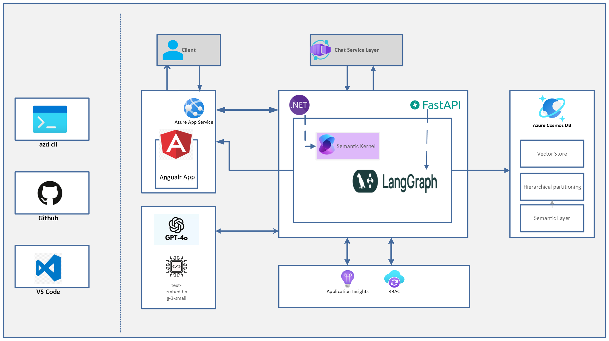

# Multi Agent Workshop

Welcome to our multi-agent samples repository showcasing a retail banking scenario. This repository demonstrates several approaches to building multi-agent applications using Azure Cosmos DB.

This branch is still being built and may not be ready yet. Please check back later.

## Build a Multi-Agent AI application using Semantic Kernel Agents or LangGraph

This branch of the repo shows how to build a multi-tenant, multi-agent, banking application with containerized applications built using 

- Semantic Kernel Agents in C#
- LangGraph in Python

To explore the other scenarios showcased in this repository. [Go to main branch](https://github.com/banking-multi-agent-workshop/tree/main)

## Architecture Diagram

Here’s the deployment architecture and components of the workshop!

## User Experience

https://github.com/user-attachments/assets/0e943130-13c5-4bb5-a40b-51b6c85dd58c

# Branch Overview

This branch contains both exercise starter files and completed solutions for the sample multi-agent application in a retail banking scenario. You can either work through the exercises step by step or use the completed files to run the demo directly.

## 1. Exercises

Work through the exercises to build the application step by step:

- [LangGraph (Python)](01_exercises/python/workshop/Module-0.md)  
- [Semantic Kernel (C#)](01_exercises/csharp/workshop/Module-0.md)  

## 2. Completed Files

If you prefer to skip the exercises and run as demo directly, use the final code and artifacts:

- [LangGraph (Python)](02_completed/python/README.md)  
- [Semantic Kernel (C#)](02_completed/csharp/README.md)
