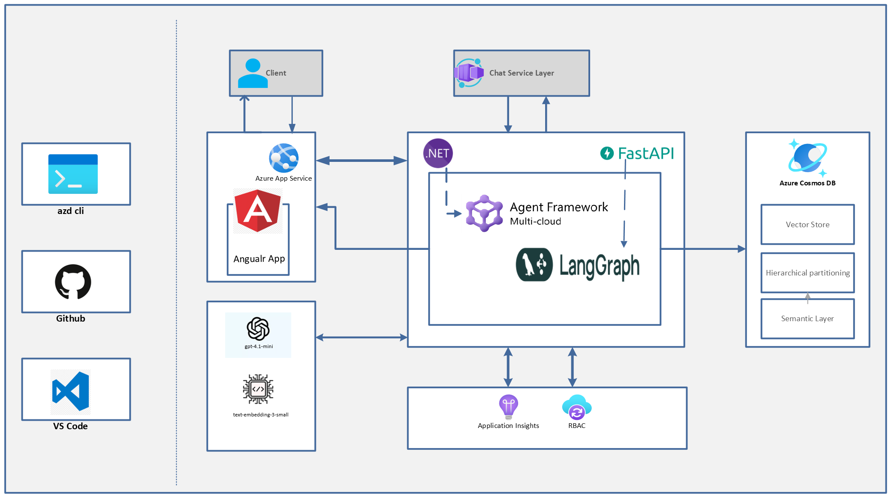
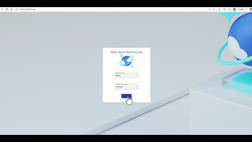

# Multi-Agent Banking Workshop with Azure DocumentDB

Welcome to our multi-agent sample showcasing a retail banking scenario. This branch is the Azure DocumentDB version of `HOL_v2_AFandLangGraph`.

## Build a Multi-Agent AI application using Agent Framework Agents or LangGraph

This branch of the repo shows how to build a multi-tenant, multi-agent, banking application with containerized applications built using 

- Agent Framework Agents in C#
- LangGraph in Python
- Azure DocumentDB with Microsoft Entra ID passwordless authentication

To explore the other scenarios showcased in this repository. [Go to main branch](https://github.com/AzureCosmosDB/banking-multi-agent-workshop/tree/main)

## Architecture Diagram

Here’s the deployment architecture and components of the workshop!

## User Experience

# Branch Overview

The `HOL_v2_AFandLangGraph_DocumentDB` branch contains both exercise starter files and completed solutions for the sample multi-agent application. You can either work through the exercises step by step or use the completed files to run the demo directly.

## 1. Exercises

Work through the exercises to build the application step by step:

- [LangGraph (Python)](01_exercises/python/langgraph/workshop/Module-0.md)  
- [Agent Framework (C#)](01_exercises/csharp/workshop/Module-0.md)  

## 2. Completed Files

If you prefer to skip the exercises and run as demo directly, use the final code and artifacts:

- [LangGraph (Python)](02_completed/python/langgraph/README.md)  
- [Agent Framework (C#)](02_completed/csharp/README.md)

## DocumentDB Firewall

The workshop deployment creates an `AllowAllWorkshopTesting` firewall rule that permits connections from `0.0.0.0` through `255.255.255.255` so participants can test from any network. This opens the cluster network boundary globally; Microsoft Entra authentication is still required.

After testing, update `documentDbFirewallStartIpAddress` and `documentDbFirewallEndIpAddress` in your deployment parameters to an approved IPv4 range and redeploy. For one workstation, set both values to the same public IPv4 address. For production, remove public access and use private networking rather than the workshop allow-all rule.
