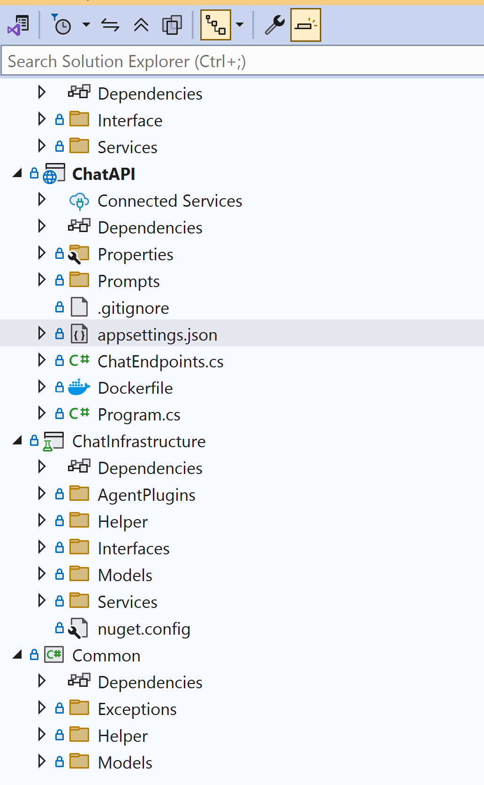

# Module 01 - Creating Your First Agent

## Introduction

In this Module, you'll implement your first agent as part of a multi-agent banking system implemented using either Semantic Kernel Agent Framework. You will get an introduction to Semantic Kernel and their plug-in integration with OpenAI for generating completions.

## Learning Objectives and Activities

- Learn the basics for Semantic Kernel Agent Framework
- Learn how to integrate agent frameworks to Azure OpenAI
- Build a simple chat agent

## Module Exercises

1. [Activity 1: Instantiate Agent Framework](#activity-1-instantiate-semantic-kernel-agent-framework)
1. [Activity 2: Create a Simple Agent](#activity-2-create-a-simple-agent)
1. [Activity 3: Test your Work](#activity-3-test-your-work)

## Activity 1: Instantiate Semantic Kernel Agent Framework

In this hands-on exercise, you will learn how to initialize an agent framework and integrate it with a Large Language Model(LLM).

The Semantic Kernel Agent Framework is a platform within Microsoft's Semantic Kernel ecosystem designed to facilitate the creation and orchestration of AI agents. It enables developers to incorporate agentic patterns into applications, leveraging the core features of the Semantic Kernel framework. Agents built using this framework can collaborate, manage multiple concurrent conversations, and integrate human input, making it suitable for complex, multi-agent workflows.

There are a few key components and concepts necessary to build multi-agent apps using this framework.

- **AgentChat** - In the Semantic Kernel framework, AgentChat is an abstract class designed to facilitate interactions among multiple agents, even if they are of different types. This design allows, for example, a *ChatCompletionAgent* and an *OpenAIAssistantAgent* which are concrete implementations to collaborate within the same conversation. The AgentChat class defines entry points for initiating collaboration between agents, supporting scenarios where multiple responses or a single agent response are required. As an abstract class, AgentChat can be subclassed to support custom scenarios.

- **Functions** - Functions in Semantic Kernel are discrete units of work that can be executed within the AI application. They come in two primary forms:
  - **Native** - These are standard methods written in a programming language like C# or Python. They perform specific tasks, such as accessing a database, calling an external API, or processing data. To define a native function, you create a method in your codebase and annotate it with attributes that describe its purpose and parameters. This metadata allows the Semantic Kernel to understand and utilize the function appropriately.
  - **Semantic** - These functions are defined using natural language prompts and are designed to interact with LLMs. They guide the model to generate responses or perform tasks based on the provided prompt. Semantic functions are typically stored as text files, (for example, Prompty) containing the prompt and are loaded into the application at runtime. They can include variables and expressions to make the prompts dynamic and context-aware.

- **Plugins** - A plugin in Semantic Kernel is a collection of related functions—both native and semantic—that are grouped to provide a cohesive set of capabilities. Plugins serve as modular components that can be easily integrated into AI applications to extend their functionality.​ A plugin is typically implemented as a class containing multiple functions. Each function within the plugin is annotated with descriptive metadata, enabling the Semantic Kernel to understand its purpose and how to invoke it. Plugins encapsulate functionality that can be reused across different parts of an application or even across multiple applications. They promote modularity and maintainability by organizing related functions into a single, coherent unit. To use a plugin, it is imported into the Semantic Kernel, which then makes its functions available for invocation. This integration allows AI applications to dynamically utilize the plugin's capabilities as needed.

- **Connectors** - ​In the Semantic Kernel framework, Connectors serve as essential bridges that facilitate seamless integration between the kernel and various external services and AI models. These connectors enable developers to incorporate diverse AI functionalities—such as text generation, chat completion, embeddings, Vector Search, and more—into their applications without delving into the complexities of each AI provider's API. There are two types of connectors we will use in this workshop, AI Connectors and Vector Store Connectors.
  - **AI Connectors** - AI Connectors provide a uniform interface to interact with multiple AI services, such as Chat Completion and Embedding Generation, allowing developers to switch between different AI providers effortlessly. This flexibility is particularly beneficial for experimenting with various models to determine the best fit for specific use cases.
  - **Vector Store Connectors** - Beyond direct AI service integrations, Semantic Kernel provides connectors for various vector databases, including Azure Cosmos DB, facilitating tasks like semantic search and retrieval-augmented generation (RAG).

Let's dive into the starter solution for our workshop and get started completing the implementation for our multi-agent application.

The following steps are completed in your IDE.

### Project Structure

Here is what the structure of this solution appears like in Visual Studio. Spend a few moments to familiarize yourself with the structure as it will help you navigate as we go through the activities.



### Implement the SemanticKernelService

We are going to define two functions as part of our multi-agent application.

- **GetResponse()** will be the entry point called by the front end to interact with the multi-agent service. Everything happens behind this function.
- **Summarize()** will be used to summarize the conversations users are having with the agent service.

#### Update SemanticKernelService

In your IDE, within the `\Services\` folder navigate to `SemanticKernelService.cs`.

Search for **//TO DO: Update SemanticKernelService constructor** and paste the code below.

**Note:** To paste code, place your cursor exactly where you want it in the code, including any tabs or spaces, then click the `T` in the lab guide. This will paste the code directly into your app. You may need to tab or format the code a little after pasting.

```csharp
builder.Services.AddSingleton<ILoggerFactory>(loggerFactory);

        DefaultAzureCredential credential;
        if (string.IsNullOrEmpty(_skSettings.AzureOpenAISettings.UserAssignedIdentityClientID))
        {
            credential = new DefaultAzureCredential();
        }
        else
        {
            credential = new DefaultAzureCredential(new DefaultAzureCredentialOptions
            {
                ManagedIdentityClientId = _skSettings.AzureOpenAISettings.UserAssignedIdentityClientID
            });
        }

        builder.AddAzureOpenAIChatCompletion(
           _skSettings.AzureOpenAISettings.CompletionsDeployment,
           _skSettings.AzureOpenAISettings.Endpoint,
           credential);
```

## Activity 2: Create a Simple Agent

Let's create a very simple agent for our workshop that is powered by an LLM. This agent will simply greet users and translate their requests into French. We will also implement a summarize function that renames the current chat session based upon the current topic from the user.

Search for **//TO DO: Add GetResponse function** and paste the code below.

```csharp
 public async Task<Tuple<List<Message>, List<DebugLog>>> GetResponse(Message userMessage, List<Message> messageHistory, BankingDataService bankService, string tenantId, string userId)
 {
     try
     {
         ChatCompletionAgent agent = new ChatCompletionAgent
         {
             Name = "BasicAgent",
             Instructions = "Greet the user and translate the request into French",
             Kernel = _semanticKernel.Clone()
         };

         
         // Create an null AgentThread 
         AgentThread agentThread = null;

         _promptDebugProperties = new List<LogProperty>();

         List<Message> completionMessages = new();
         List<DebugLog> completionMessagesLogs = new();


         await foreach (ChatMessageContent response in agent.InvokeAsync(userMessage.Text, agentThread))
         {
             string messageId = Guid.NewGuid().ToString();
             completionMessages.Add(new Message(userMessage.TenantId, userMessage.UserId, userMessage.SessionId, response.AuthorName ?? string.Empty, response.Role.ToString(), response.Content ?? string.Empty, messageId));
         }
         return new Tuple<List<Message>, List<DebugLog>>(completionMessages, completionMessagesLogs);
     }
     catch (Exception ex)
     {
         _logger.LogError(ex, "Error when getting response: {ErrorMessage}", ex.ToString());
         return new Tuple<List<Message>, List<DebugLog>>(new List<Message>(), new List<DebugLog>());
     }
 }
```

Search for **//TO DO: Add Summarize function** and  paste the code below.

```csharp
public async Task<string> Summarize(string sessionId, string userPrompt)
    {
        try
        {
            // Use an AI function to summarize the text in 2 words
            var summarizeFunction = _semanticKernel.CreateFunctionFromPrompt(
                "Summarize the following text into exactly two words:\n\n{{$input}}",
                executionSettings: new OpenAIPromptExecutionSettings { MaxTokens = 10 }
            );

            // Invoke the function
            var summary = await _semanticKernel.InvokeAsync(summarizeFunction, new() { ["input"] = userPrompt });

            return summary.GetValue<string>() ?? "No summary generated";
        }
        catch (Exception ex)
        {
            _logger.LogError(ex, "Error when getting response: {ErrorMessage}", ex.ToString());
            return string.Empty;
        }
    }

```

### Update ChatService

In your IDE, within the `\Services\` folder navigate to `ChatService.cs`.

Replace the code for **GetChatCompletionAsync** method with code below.

```csharp
  public async Task<List<Message>> GetChatCompletionAsync(string tenantId, string userId, string? sessionId, string userPrompt)
 {
     try
     {
         ArgumentNullException.ThrowIfNull(sessionId);

         // Add both prompt and completion to cache, then persist in Cosmos DB
         var userMessage = new Message(tenantId, userId, sessionId, "User", "User", userPrompt);

         // Generate the completion to return to the user
         var result = await _skService.GetResponse(userMessage, new List<Message>(), _bankService, tenantId, userId);

         return result.Item1;
     }
     catch (Exception ex)
     {
         _logger.LogError(ex, $"Error getting completion in session {sessionId} for user prompt [{userPrompt}].");
         return new List<Message> { new Message(tenantId, userId, sessionId!, "Error", "Error", $"Error getting completion in session {sessionId} for user prompt [{userPrompt}].") };
     }
 }

```

Replace the code for **SummarizeChatSessionNameAsync** method with code below.

```csharp
 public async Task<string> SummarizeChatSessionNameAsync(string tenantId, string userId,string? sessionId, string prompt)
    {
        try
        {
            ArgumentNullException.ThrowIfNull(sessionId);

            var summary = await _skService.Summarize(sessionId, prompt);

            var session = await RenameChatSessionAsync(tenantId, userId,sessionId, summary);

            return session.Name;
        }
        catch (Exception ex)
        {
            _logger.LogError(ex, $"Error getting a summary in session {sessionId} for user prompt [{prompt}].");
            return $"Error getting a summary in session {sessionId} for user prompt [{prompt}].";
        }

    }

```

## Activity 3: Test your Work

With the activities in this module complete, it is time to test your work.

### Start the Backend

- Return to the open terminal for the backend app in VS Code and type `dotnet run`

### Start the Frontend

- Return to the frontend terminal and type `ng serve`
- Navigate to, <http://localhost:4200> in your browser

### Start a Chat Session

1. Login to the frontend app.
1. Start a new conversation.
1. Send the message:  

   ```text
   Hello, how are you?
   ```

1. You should see something like the output below.

    

### Stop the Application

- Return to VS Code.
- In the frontend terminal, press **Ctrl + C** to stop the frontend application.
- Select the backend terminal, press **Ctrl + C** to stop the backend application.

## Validation Checklist

Your implementation is successful if:

- [ ] Your app compiles with no errors.
- [ ] Your agent successfully processes user input and generates and appropriate response.

## Module Solution

The following sections include the completed code for this Module. Copy and paste these into your project if you run into issues and cannot resolve.

<details>
  <summary>Completed code for <strong>ChatInfrastructure/Interfaces/ISemanticKernelService.cs</strong></summary>
<br>

```csharp
using MultiAgentCopilot.Common.Models.Chat;
using MultiAgentCopilot.Common.Models.Debug;

namespace MultiAgentCopilot.ChatInfrastructure.Interfaces
{
    public interface ISemanticKernelService
    {
        Task<Tuple<List<Message>, List<DebugLog>>> GetResponse(Message userMessage, List<Message> messageHistory, string tenantId, string userId);
        Task<string> Summarize(string sessionId, string userPrompt);
        Task<float[]> GenerateEmbedding(string text);
    }
}
```

</details>

<details>
  <summary>Completed code for <strong>ChatInfrastructure/Services/SemanticKernelService.cs</strong></summary>
<br>

```csharp
using System;
using System.Runtime;
using System.Data;
using Newtonsoft.Json;
using Azure.Identity;
using Microsoft.Extensions.DependencyInjection;
using Microsoft.Extensions.Logging;
using Microsoft.Extensions.Options;

using Microsoft.SemanticKernel;
using Microsoft.SemanticKernel.Agents;
using Microsoft.SemanticKernel.Connectors.OpenAI;
using Microsoft.SemanticKernel.ChatCompletion;
using Microsoft.SemanticKernel.Embeddings;

using MultiAgentCopilot.Common.Models.Chat;
using MultiAgentCopilot.ChatInfrastructure.Interfaces;
using MultiAgentCopilot.Common.Models.Configuration;
using MultiAgentCopilot.Common.Models.Debug;
using Message = MultiAgentCopilot.Common.Models.Chat.Message;

namespace MultiAgentCopilot.ChatInfrastructure.Services;

public class SemanticKernelService : ISemanticKernelService, IDisposable
{
    readonly SemanticKernelServiceSettings _settings;
    readonly ILoggerFactory _loggerFactory;
    readonly ILogger<SemanticKernelService> _logger;
    readonly Kernel _semanticKernel;

    bool _serviceInitialized = false;
    string _prompt = string.Empty;
    string _contextSelectorPrompt = string.Empty;

    List<LogProperty> _promptDebugProperties;

    public bool IsInitialized => _serviceInitialized;

    public SemanticKernelService(
        IOptions<SemanticKernelServiceSettings> options,
        ILoggerFactory loggerFactory)
    {
        _settings = options.Value;
        _loggerFactory = loggerFactory;
        _logger = _loggerFactory.CreateLogger<SemanticKernelService>();
        _promptDebugProperties = new List<LogProperty>();

        _logger.LogInformation("Initializing the Semantic Kernel service...");

        var builder = Kernel.CreateBuilder();

        builder.Services.AddSingleton<ILoggerFactory>(loggerFactory);

        DefaultAzureCredential credential;
        if (string.IsNullOrEmpty(_settings.AzureOpenAISettings.UserAssignedIdentityClientID))
        {
            credential = new DefaultAzureCredential();
        }
        else
        {
            credential = new DefaultAzureCredential(new DefaultAzureCredentialOptions
            {
                ManagedIdentityClientId = _settings.AzureOpenAISettings.UserAssignedIdentityClientID
            });
        }
        builder.AddAzureOpenAIChatCompletion(
            _settings.AzureOpenAISettings.CompletionsDeployment,
            _settings.AzureOpenAISettings.Endpoint,
            credential);

        builder.AddAzureOpenAITextEmbeddingGeneration(
               _settings.AzureOpenAISettings.EmbeddingsDeployment,
               _settings.AzureOpenAISettings.Endpoint,
               credential);

        _semanticKernel = builder.Build();

        Task.Run(Initialize).ConfigureAwait(false);
    }

    public void Dispose()
    {
        // Dispose resources if any
    }

    private Task Initialize()
    {
        try
        {
            _serviceInitialized = true;
            _logger.LogInformation("Semantic Kernel service initialized.");
        }
        catch (Exception ex)
        {
            _logger.LogError(ex, "Semantic Kernel service was not initialized. The following error occurred: {ErrorMessage}.", ex.ToString());
        }
        return Task.CompletedTask;
    }

    private void LogMessage(string key, string value)
    {
        _promptDebugProperties.Add(new LogProperty(key, value));
    }

    public async Task<Tuple<List<Message>, List<DebugLog>>> GetResponse(Message userMessage, List<Message> messageHistory, string tenantId, string userId)
    {

        try
        {
            ChatCompletionAgent agent = new ChatCompletionAgent
            {
                Name = "BasicAgent",
                Instructions = "Greet the user and translate the request into French",
                Kernel = _semanticKernel.Clone()
            };

            ChatHistory chatHistory = [];

            chatHistory.AddUserMessage(userMessage.Text);

            _promptDebugProperties = new List<LogProperty>();

            List<Message> completionMessages = new();
            List<DebugLog> completionMessagesLogs = new();

            ChatMessageContent message = new(AuthorRole.User, userMessage.Text);
            chatHistory.Add(message);

            await foreach (ChatMessageContent response in agent.InvokeAsync(chatHistory))
            {
                string messageId = Guid.NewGuid().ToString();
                completionMessages.Add(new Message(userMessage.TenantId, userMessage.UserId, userMessage.SessionId, response.AuthorName ?? string.Empty, response.Role.ToString(), response.Content ?? string.Empty, messageId));
            }
            return new Tuple<List<Message>, List<DebugLog>>(completionMessages, completionMessagesLogs);

        }
        catch (Exception ex)
        {
            _logger.LogError(ex, "Error when getting response: {ErrorMessage}", ex.ToString());
            return new Tuple<List<Message>, List<DebugLog>>(new List<Message>(), new List<DebugLog>());
        }
    }

    public async Task<string> Summarize(string sessionId, string userPrompt)
    {
        try
        {
            // Use an AI function to summarize the text in 2 words
            var summarizeFunction = _semanticKernel.CreateFunctionFromPrompt(
                "Summarize the following text into exactly two words:\n\n{{$input}}",
                executionSettings: new OpenAIPromptExecutionSettings { MaxTokens = 10 }
            );

            // Invoke the function
            var summary = await _semanticKernel.InvokeAsync(summarizeFunction, new() { ["input"] = userPrompt });

            return summary.GetValue<string>() ?? "No summary generated";
        }
        catch (Exception ex)
        {
            _logger.LogError(ex, "Error when getting response: {ErrorMessage}", ex.ToString());
            return string.Empty;
        }
    }

    public async Task<float[]> GenerateEmbedding(string text)
    {
        // Generate Embedding
        var embeddingModel = _semanticKernel.Services.GetRequiredService<ITextEmbeddingGenerationService>();

        var embedding = await embeddingModel.GenerateEmbeddingAsync(text);

        // Convert ReadOnlyMemory<float> to IList<float>
        return embedding.ToArray();
    }
}
```

</details>

<details>
  <summary>Completed code for <strong>ChatInfrastructure/Services/DependencyInjection.cs</strong></summary>
<br>

```csharp
using MultiAgentCopilot.Common.Models.Configuration;
using MultiAgentCopilot.ChatInfrastructure.Interfaces;
using MultiAgentCopilot.ChatInfrastructure.Services;
using Microsoft.Extensions.DependencyInjection;
using Microsoft.Extensions.Hosting;
using Microsoft.ApplicationInsights.AspNetCore.Extensions;
using Microsoft.ApplicationInsights.Extensibility;
using Azure.Identity;
using Microsoft.Extensions.Logging;
using Microsoft.Extensions.Configuration;
using Microsoft.Extensions.Logging.ApplicationInsights;
namespace MultiAgentCopilot
{
    /// <summary>
    /// General purpose dependency injection extensions.
    /// </summary>
    public static partial class DependencyInjection
    {
        /// <summary>
        /// Registers the <see cref="ICosmosDBService"/> implementation with the dependency injection container.
        /// </summary>
        /// <param name="builder">The hosted applications and services builder.</param>
        public static void AddCosmosDBService(this IHostApplicationBuilder builder)
        {
            builder.Services.AddOptions<CosmosDBSettings>()
                .Bind(builder.Configuration.GetSection("CosmosDBSettings"));

            Console.WriteLine("Adding CosmosDBService:" + builder.Configuration["CosmosDBSettings:CosmosUri"]);
            builder.Services.AddSingleton<ICosmosDBService, CosmosDBService>();
        }


        /// <summary>
        /// Registers the <see cref="IChatService"/> implementation with the dependency injection container.
        /// </summary>
        /// <param name="builder">The hosted applications and services builder.</param>
        public static void AddChatService(this IHostApplicationBuilder builder)
        {
            builder.Services.AddOptions<CosmosDBSettings>()
                .Bind(builder.Configuration.GetSection("CosmosDBSettings"));
            builder.Services.AddSingleton<IChatService, ChatService>();
        }

        /// <summary>
        /// Registers the <see cref="ISemanticKernelService"/> implementation with the dependency injection container.
        /// </summary>
        /// <param name="builder">The hosted applications and services builder.</param>
        public static void AddSemanticKernelService(this IHostApplicationBuilder builder)
        {
            builder.Services.AddOptions<SemanticKernelServiceSettings>()
                .Bind(builder.Configuration.GetSection("SemanticKernelServiceSettings"));
            builder.Services.AddSingleton<ISemanticKernelService, SemanticKernelService>();
        }
    }
}
```

</details>

<details>
  <summary>Completed code for <strong>ChatInfrastructure/Services/ChatService.cs</strong></summary>
<br>

```csharp
using MultiAgentCopilot.Common.Models.Chat;
using MultiAgentCopilot.ChatInfrastructure.Interfaces;
using Microsoft.Extensions.Logging;
using Microsoft.SemanticKernel.ChatCompletion;
using MultiAgentCopilot.Common.Models.Debug;
using System.Collections.Generic;
using Microsoft.Extensions.Options;
using MultiAgentCopilot.Common.Models.Configuration;
using Newtonsoft.Json.Linq;
using System.Text.Json;
using Newtonsoft.Json;
using Microsoft.Identity.Client;
using BankingServices.Interfaces;


namespace MultiAgentCopilot.ChatInfrastructure.Services;

public class ChatService : IChatService
{
    private readonly ICosmosDBService _cosmosDBService;
    private readonly ILogger _logger;
    private readonly IBankDataService _bankService;
    private readonly ISemanticKernelService _skService;

    public ChatService(
        IOptions<CosmosDBSettings> cosmosOptions,
        IOptions<SemanticKernelServiceSettings> skOptions,
        ICosmosDBService cosmosDBService,
        ISemanticKernelService ragService,
        ILoggerFactory loggerFactory)
    {
        _cosmosDBService = cosmosDBService;
        _skService = ragService;
        _logger = loggerFactory.CreateLogger<ChatService>();
    }

    /// <summary>
    /// Returns list of chat session ids and names.
    /// </summary>
    public async Task<List<Session>> GetAllChatSessionsAsync(string tenantId, string userId)
    {
        return await _cosmosDBService.GetUserSessionsAsync(tenantId, userId);
    }

    /// <summary>
    /// Returns the chat messages related to an existing session.
    /// </summary>
    public async Task<List<Message>> GetChatSessionMessagesAsync(string tenantId, string userId,string sessionId)
    {
        ArgumentNullException.ThrowIfNull(sessionId);
        return await _cosmosDBService.GetSessionMessagesAsync(tenantId,userId,sessionId);
    }

    /// <summary>
    /// Creates a new chat session.
    /// </summary>
    public async Task<Session> CreateNewChatSessionAsync(string tenantId, string userId)
    {
        Session session = new(tenantId, userId);
        return await _cosmosDBService.InsertSessionAsync(session);
    }

    /// <summary>
    /// Rename the chat session from its default (eg., "New Chat") to the summary provided by OpenAI.
    /// </summary>
    public async Task<Session> RenameChatSessionAsync(string tenantId, string userId,string sessionId, string newChatSessionName)
    {
        ArgumentNullException.ThrowIfNull(sessionId);
        ArgumentException.ThrowIfNullOrEmpty(newChatSessionName);

        return await _cosmosDBService.UpdateSessionNameAsync( tenantId, userId,sessionId, newChatSessionName);
    }

    /// <summary>
    /// Delete a chat session and related messages.
    /// </summary>
    public async Task DeleteChatSessionAsync(string tenantId, string userId,string sessionId)
    {
        ArgumentNullException.ThrowIfNull(sessionId);
        await _cosmosDBService.DeleteSessionAndMessagesAsync(tenantId, userId,sessionId);
    }

    /// <summary>
    /// Receive a prompt from a user, vectorize it from the OpenAI service, and get a completion from the OpenAI service.
    /// </summary>
    public async Task<List<Message>> GetChatCompletionAsync(string tenantId, string userId, string? sessionId, string userPrompt)
    {
        try
        {
            ArgumentNullException.ThrowIfNull(sessionId);

            // Add both prompt and completion to cache, then persist in Cosmos DB
            var userMessage = new Message(tenantId, userId, sessionId, "User", "User", userPrompt);

            // Generate the completion to return to the user
            var result = await _skService.GetResponse(userMessage, new List<Message>(), tenantId, userId);

            return result.Item1;
        }
        catch (Exception ex)
        {
            _logger.LogError(ex, $"Error getting completion in session {sessionId} for user prompt [{userPrompt}].");
            return new List<Message> { new Message(tenantId, userId, sessionId!, "Error", "Error", $"Error getting completion in session {sessionId} for user prompt [{userPrompt}].") };
        }
    }

    /// <summary>
    /// Generate a name for a chat message, based on the passed in prompt.
    /// </summary>
    public async Task<string> SummarizeChatSessionNameAsync(string tenantId, string userId, string? sessionId, string prompt)
    {
        try
        {
            ArgumentNullException.ThrowIfNull(sessionId);

            var summary = await _skService.Summarize(sessionId, prompt);

            var session = await RenameChatSessionAsync(tenantId, userId, sessionId, summary);

            return session.Name;
        }
        catch (Exception ex)
        {
            _logger.LogError(ex, $"Error getting a summary in session {sessionId} for user prompt [{prompt}].");
            return $"Error getting a summary in session {sessionId} for user prompt [{prompt}].";
        }
    }

    /// <summary>
    /// Rate an assistant message. This can be used to discover useful AI responses for training, discoverability, and other benefits down the road.
    /// </summary>
    public async Task<Message> RateChatCompletionAsync(string tenantId, string userId,string messageId, string sessionId, bool? rating)
    {
        ArgumentNullException.ThrowIfNull(messageId);
        ArgumentNullException.ThrowIfNull(sessionId);

        return await _cosmosDBService.UpdateMessageRatingAsync(tenantId,userId, sessionId, messageId,rating);
    }

    public async Task<DebugLog> GetChatCompletionDebugLogAsync(string tenantId, string userId,string sessionId, string debugLogId)
    {
        ArgumentException.ThrowIfNullOrEmpty(sessionId);
        ArgumentException.ThrowIfNullOrEmpty(debugLogId);

        return await _cosmosDBService.GetChatCompletionDebugLogAsync(tenantId,userId, sessionId, debugLogId);
    }

    public async Task<bool> AddDocument(string containerName, JsonElement document)
    {
        try
        {
            // Extract raw JSON from JsonElement
            var json = document.GetRawText();
            var docJObject = JsonConvert.DeserializeObject<JObject>(json);

            // Ensure "id" exists
            if (!docJObject.ContainsKey("id"))
            {
                throw new ArgumentException("Document must contain an 'id' property.");
            }
           
            return await _cosmosDBService.InsertDocumentAsync(containerName, docJObject);

        }
        catch (Exception ex)
        {
            _logger.LogError(ex, $"Error adding document to container {containerName}.");
            return false;
        }
    }
}
```

</details>

<details>
  <summary>Completed code for <strong>ChatAPI/Program.cs</strong></summary>
<br>

```csharp
using MultiAgentCopilot;
using Microsoft.Extensions.Configuration;

namespace ChatAPI
{
    public class Program
    {
        public static void Main(string[] args)
        {
            var builder = WebApplication.CreateBuilder(args);

            // Load configuration from appsettings.json and environment variables
            builder.Configuration.SetBasePath(Directory.GetCurrentDirectory())
                                 .AddJsonFile("appsettings.json", optional: true, reloadOnChange: true)
                                 .AddJsonFile("appsettings.development.json", optional: true, reloadOnChange: true)
                                 .AddEnvironmentVariables();

            // Add CORS policy
            builder.Services.AddCors(options =>
            {
                options.AddPolicy("AllowAllOrigins",
                    policy =>
                    {
                        policy.AllowAnyOrigin()
                              .AllowAnyMethod()
                              .AllowAnyHeader();
                    });
            });


            builder.Logging.ClearProviders();
            builder.Logging.AddConsole();

            if (!builder.Environment.IsDevelopment())                
                builder.Services.AddApplicationInsightsTelemetry();

            builder.Logging.SetMinimumLevel(LogLevel.Trace);
            builder.Services.Configure<LoggerFilterOptions>(options =>
            {
                options.MinLevel = LogLevel.Trace;
            });

            //builder.AddApplicationInsightsTelemetry();

            builder.AddCosmosDBService();
            builder.AddSemanticKernelService();

            builder.AddChatService();
            builder.Services.AddScoped<ChatEndpoints>();

            // Add services to the container.
            builder.Services.AddAuthorization();

            // Learn more about configuring Swagger/OpenAPI at https://aka.ms/aspnetcore/swashbuckle
            builder.Services.AddEndpointsApiExplorer();
            builder.Services.AddSwaggerGen();

            var app = builder.Build();
            app.UseCors("AllowAllOrigins");

            app.UseExceptionHandler(exceptionHandlerApp
                    => exceptionHandlerApp.Run(async context
                        => await Results.Problem().ExecuteAsync(context)));

            // Configure the HTTP request pipeline.
            app.UseSwagger();
            app.UseSwaggerUI();

            app.UseAuthorization();

            // Map the chat REST endpoints:
            using (var scope = app.Services.CreateScope())
            {
                var service = scope.ServiceProvider.GetService<ChatEndpoints>();
                service?.Map(app);
            }

            app.Run();
        }
    }
}
```

</details>

## Next Steps

Proceed to Module 2: Connecting Agents to Memory
