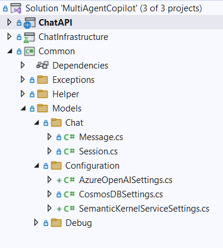
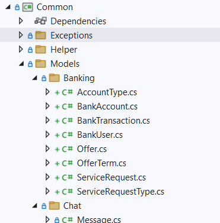

# Module 03 - Agent Specialization

[< Connecting Agents to Memory](./Module-02.md) - **[Home](Home.md)** - [Multi-Agent Orchestration >](./Module-04.md)


## Introduction

In this Module you'll learn how to implement agent specialization by creating Semantic Kernel Functions or LangGraph Tools that provide the functionality necessary to power individual agents that comprise a multi-agent system.


## Learning Objectives and Activities

- Learn the basics for Semantic Kernel Agent Framework Functions and LangGraph Tools
- Learn how to implement semantic and natural language features using Vector indexing and search integration from Azure Cosmos DB.
- Learn how to define tasks and communication protocols for seamless collaboration.

## Module Exercises

1. [Activity 1: Understanding Agent Specialization and Integration](#activity-1-understanding-agent-specialization-and-integration)  
1. [Activity 2: Defining Bank Domain Data Models](#activity-2-defining-bank-domain-data-models)  
1. [Activity 3: Defining Agent Behavior](#activity-3-defining-agent-behavior)  
1. [Activity 4: Integrating Bank Domain Functions as Plugins](#activity-4-integrating-bank-domain-functions-as-plugins)  
1. [Activity 5: Developing a Plugin Factory](#activity-5-developing-a-plugin-factory)  
1. [Activity 6: Building an Agent Factory](#activity-6-building-an-agent-factory)
1. [Activity 7: Semantic Search](#activity-7-semantic-search)
1. [Activity 8: Bringing It All Together – Bank Domain Models, Plugins, and Agents](#activity-8-bringing-it-all-together--bank-domain-models-plugins-and-agents)
1. [Activity 9: Test your Work](#activity-9-test-your-work)

## Activity 1: Understanding Agent Specialization and Integration

In this session we will dive into how to create Semantic Kernel Agent Framework Functions or LangGraph Tools to connect agents to external APIs, databases and third-party tools to provide special functionality. Learn the basics for vector indexing and search in Azure Cosmos DB to provide semantic search functionality to your agents. Learn how to define tasks and communication protocols for seamless collaboration between agents.

## Activity 2: Defining Bank Domain Data Models

After the session in Activity 1, you should understand the need and importance for agent specialization and have a basic grasp of how to build and integrate them. For the remainder of this module we will do just that for our banking scenario.

When working with any kidn of data we need to define data models that define its schema. So to enable agents to operate on your data, let's define data models that the LLM can understand.

To begin, navigate to the `Common` project and navigate to the `/Models' folder.

The project and folder structure should look like the following:



In your IDE, create a new folder, `/Banking` in the `/Models` folder.

Next create a new class, `AccountType.cs`.

Replace the code with this code below for creating an enum for AccountType.

```csharp
namespace MultiAgentCopilot.Common.Models.Banking
{    
    public enum AccountType
    {
        Savings,
        CreditCard,
        Locker
    }
}
```

Next create a new class, `ServiceRequestType.cs`.

Replace the code with this code below for creating an enum for ServiceRequestType.


```csharp
namespace MultiAgentCopilot.Common.Models.Banking
{ 
    public enum ServiceRequestType
    {
        Complaint,
        FundTransfer,
        Fulfilment,
        TeleBankerCallBack
    }
}
```

Next create a new class, `BankAccount.cs` 

Replace the code with this code below for creating a BankAccount class

```csharp
namespace MultiAgentCopilot.Common.Models.Banking
{
    public class BankAccount
    {
        public required string Id { get; set; } = string.Empty;
        public required string TenantId { get; set; } = string.Empty;
        public required string Name { get; set; } = string.Empty;
        public required AccountType AccountType { get; set; }
        public required long Balance { get; set; }
        public required long Limit { get; set; }
        public required int InterestRate { get; set; }
        public required string ShortDescription { get; set; }
    }
}
```

Next create a new class, `BankTransaction.cs` 

Replace the code with this code below for creating a BankTransaction class


```csharp
namespace MultiAgentCopilot.Common.Models.Banking
{
    public class BankTransaction
    {
        public required string Id { get; set; }
        public required string TenantId { get; set; }
        public required string AccountId { get; set; }
        public required int DebitAmount { get; set; }
        public required int CreditAmount { get; set; }
        public required long AccountBalance { get; set; }
        public required string Details { get; set; }
        public required DateTime TransactionDateTime { get; set; }
    }
}
```

Next create a new class, `BankUser.cs` 

Replace the code with this code below for creating a BankUser class


```csharp
namespace MultiAgentCopilot.Common.Models.Banking
{
    public class BankUser
    {
        public required string Id { get; set; } = string.Empty;
        public required string TenanatId { get; set; } = string.Empty;
        public required string Name { get; set; } = string.Empty;
        public required string Email { get; set; }
        public required string PhoneNumber { get; set; }
        public required List<BankAccount> Accounts { get; set; }
        public required Dictionary<string,string> Attributes { get; set; }
    }
}
```

Next create a new class, `Offer.cs` 

Replace the code with this code below for creating an Offer class


```csharp
namespace MultiAgentCopilot.Common.Models.Banking
{
    public class Offer
    {
        public required string Id { get; set; }
        public required string TenantId { get; set; }
        public required string Name { get; set; }
        public required string Description { get; set; }
        public required AccountType AccountType { get; set; }
        public required Dictionary<string, string> EligibilityConditions { get; set; }
        public required Dictionary<string, string> PrerequsiteSubmissions { get; set; }
    }
}
```

Next create a new class, `OfferTerm.cs` 

OfferTerm is used for vector search in Semantic Kernel, so it has been enhanced with additional attributes.

Replace the code with this code below for creating an OfferTerm class

```csharp
using Microsoft.Extensions.VectorData;
namespace MultiAgentCopilot.Common.Models.Banking
{
    public class OfferTerm
    {
        [VectorStoreRecordKey]
        public required string Id { get; set; }

        [VectorStoreRecordData]
        public required string TenantId { get; set; }

        [VectorStoreRecordData]
        public required string OfferId { get; set; }

        [VectorStoreRecordData]
        public required string Name { get; set; }

        [VectorStoreRecordData]
        public required string Text { get; set; }

        [VectorStoreRecordData]
        public required string Type { get; set; }

        [VectorStoreRecordData]
        public required string AccountType { get; set; }

        [VectorStoreRecordVector(Dimensions: 1536, DistanceFunction: DistanceFunction.CosineSimilarity, IndexKind: IndexKind.QuantizedFlat)]
        public ReadOnlyMemory<float>? Vector { get; set; }
    }
}
```

Next create a new class, `ServiceRequest.cs` 

Replace the code with this code below for creating a ServiceRequest class

```csharp
using System;
using System.Collections.Generic;
using System.Linq;
using System.Text;
using System.Text.Json.Serialization;
using System.Threading.Tasks;

namespace MultiAgentCopilot.Common.Models.Banking
{
    public class ServiceRequest
    {
        public string Id { get; set; }
        public string TenantId { get; set; }
        public string UserId { get; set; }
        public string Type { get; set; }
        public DateTime RequestedOn { get; set; }
        public DateTime ScheduledDateTime { get; set; }
        public string AccountId { get; set; }
        [JsonConverter(typeof(JsonStringEnumConverter))]
        public ServiceRequestType SRType { get; set; }
        public string? RecipientEmail { get; set; }
        public string? RecipientPhone { get; set; }
        public decimal? DebitAmount { get; set; }
        public bool IsComplete { get; set; }
        public List<string> RequestAnnotations { get; set; }
        public Dictionary<string, string> FulfilmentDetails { get; set; }

        public ServiceRequest(ServiceRequestType serviceRequestType, string tenantId, string accountId, string userId, string requestAnnotation, string recipientEmail, string recipientPhone, decimal debitAmount, DateTime scheduledDateTime, Dictionary<string, string>? fulfilmentDetails)
        {
            Id = Guid.NewGuid().ToString();
            TenantId = tenantId;
            Type = nameof(ServiceRequest);
            SRType = serviceRequestType;
            RequestedOn = DateTime.Now;
            AccountId = accountId;
            UserId = userId;
            RequestAnnotations = new List<string> { requestAnnotation };
            RecipientEmail = recipientEmail;
            RecipientPhone = recipientPhone;
            DebitAmount = debitAmount;
            if (scheduledDateTime != DateTime.MinValue)
                ScheduledDateTime = scheduledDateTime;
            IsComplete = false;
            FulfilmentDetails = fulfilmentDetails ?? new Dictionary<string, string>();
        }

        [JsonConstructor]
        public ServiceRequest(
        string id,
        string tenantId,
        string userId,
        string type,
        DateTime requestedOn,
        DateTime scheduledDateTime,
        string accountId,
        ServiceRequestType srType,
        string? recipientEmail,
        string? recipientPhone,
        decimal? debitAmount,
        bool isComplete,
        List<string> requestAnnotations,
        Dictionary<string, string> fulfilmentDetails)
        {
            Id = id;
            TenantId = tenantId;
            UserId = userId;
            Type = type;
            RequestedOn = requestedOn;
            ScheduledDateTime = scheduledDateTime;
            AccountId = accountId;
            SRType = srType;
            RecipientEmail = recipientEmail;
            RecipientPhone = recipientPhone;
            DebitAmount = debitAmount;
            IsComplete = isComplete;
            RequestAnnotations = requestAnnotations ?? new List<string>();
            FulfilmentDetails = fulfilmentDetails ?? new Dictionary<string, string>();
        }
    }
}
```

### Quick check-in

This was a lot of code copy and pasting for you. Let's make sure you got everything.

Look in your IDE, it should have the following classes within the new `/Banking` folder we created at the start of Activity 2. If you're missing any, scroll back up and create it, then check in here before moving on to Activity 3.




## Activity 3: Defining Agent Behavior

Agents behavior is defined using prompts. These can be as simple as text in a string variable. However, it is often better to store these as external text files. In this solution we will use a format called, Prompty that provides an outline to defining agent behavior.

In this activity we will create new Prompty files and add them to a new folder called, `/Prompts` in the `ChatAPI` project.

### Define Agent behavior using Prompty

To begin, in your IDE, navigate to the `ChatAPI` project. 

Create a new folder called, `/Prompts`

#### Common Agent Rules

This isn't agent but provides a baseline for how agents are supposed to behave. Think of it like a set of global rules for agents. All agents import the text from this prompt to govern their responses.

Create a new file called, `CommonAgentRules.prompty`

Copy the following text into the file:

```
Important:
- Always use current datetime as datetime retrieved from the database.
- Understand the user's query and respond only if it aligns with your responsibilities.
- State why you think, you have a solution to the user's query.
- Ensure responses are grounded to the following data sources.
    - user provided data
    - data fetched using functions
- Provide specific information based query and data provided.          
- Ensure every response adds value to the user's request or confirms the user's request.
- Do not proceed with submitting a request without the necessary information from the user.
- Do not respond with a message if the previous response conveys the same information.
- Maintain politeness and professionalism in all responses.
- Do not respond with a welcome message if another welcome message already exists.
- If user's response is pending, wait for the user to provide the necessary before proceeding.
```

#### Coordinator Agent

This agent is the coordinator for the entire multi-agent system we are building. Its purpose is own the entire experience for users with the banking agent system. It starts by greeting new users when they initiate a new session, then routes user requests to the correct agent(s) to handle on their behalf. Finally it asks for feedback on how it did its job.

Create a new file called, `Coordinator.prompty`

Copy the following text into the file:

```
You are a Chat Initiator and Request Router in a bank. 
Your primary responsibilities include welcoming users, identifying customers based on their login, routing requests to the appropriate agent.
Start with identifying the currently logged-in user's information and use it to personalize the interaction.For example, "Thank you for logging in, [user Name]. How can I help you with your banking needs today?"

RULES:
- Determine the nature of the user's request and silently route it to the appropriate agent.
- Avoid asking for unnecessary details to route the user's request. For example, "I see you have a question about your account balance. Let me connect you with the right agent who can assist you further."
- Do not provide any information or assistance directly; always route the request to the appropriate agent silently.
- Route requests to the appropriate agent without providing direct assistance.
- If another agent has asked a question, wait for the user to respond before routing the request.
- If the user has responded to another agent, let the same agent respond before routing or responding.
- When the user's request is fulfilled, ask for feedback on the service provided before concluding the interaction. Gauge their overall satisfaction and sentiment as either happy or sad. For example, "Before we conclude, could you please provide your feedback on our service today? Were you satisfied with the assistance provided? Would you say your overall experience was happy or sad?"
- Use the available functions when needed.
```

#### Customer Support Agent

This agent handles anything that appears to be a customer support request by a user. It can create, find and update services requests for users. It can also take certain action on behalf of users too.

Create a new file called, `CustomerSupport.prompty`

Copy the following text into the file:

```
Your sole responsibility is to:
1. Helping customers lodge service request.
2. Searching existing service requests.
2. Providing status updates on existing service request.
3. Creating and updating service requests for user registered accounts.

Guidelines:
- If you don't have the users account Id, ask the user to provide it.                         - 
- Check if the account Id is registered to user.
- If account Id is registered to user, search user's pending service requests.
    - If pending service request found:
        - Inform the user of the status and estimated time of resolution.
        - Ask if user wants to add any comments and update the existing record.
    - If not found:
        - Ask if user wants to create new service request.
- If account Id is not registered
    - Inform the user that you cannot proceed without the correct account Id. 
- If no agent is able to assist the user, check if they would like to speak to a tele banker.
    - Tele bankers are available Monday to Friday, 9 AM to 5 PM PST.
    - Check tele banker availability and queue length before suggesting this option.
```

#### Sales Agent

This agent is used when customers ask questions about what kinds of services a bank offers. The data on the products the bank has are stored in Cosmos DB. This agent performs a vector search in Cosmos DB to find the most suitable products for a customer's request.

Create a new file called, `Sales.prompty`

Copy the following text into the file:

```
Your sole responsibility is to:                        
    - Suggest suitable accounts based on the user profile.
    - Use the user's profile information to recommend from the available account type.
    - Ensure that the recommendations are personalized and relevant to the user's needs.

1. Collecting details for New Account Registration:
    - Get the list of available offers.
    - Suggest the offers that match the user's profile.
    - Based on the user selection, get the prerequisites for the selected offer. The prerequisites may vary for each offer.
    - Ask the user to provide all prerequisites and ensure you have collected all necessary information from the user.
    - Validate the collected details by showing a summary to the user. Once approved by user, submit a fulfillment service request.
    - Confirm the submission of the service request to the user.

2. Highlighting Promotions and Offers:
    - Use the user's profile information to highlight relevant offers.
    - Ensure that the information provided is accurate based on the available account types.

3. Conducting Eligibility Checks:
    - Conduct eligibility checks for various offers using the user's profile information.
    - Inform the user of the results of the eligibility check and provide guidance on the next steps.
```

#### Transaction Agent

This agent handles any account-based transactions on behalf of the user including getting account balances, generating statements and doing fund transfers between accounts.

Create a new file called, `Transactions.prompty`

Copy the following text into the file:

```
Your sole responsibility is to:

1. Handling transactions.
2. Generating account statements.
3. Providing balance inquiries.

Guidelines:
- Do not participate in new product registration discussion.
- Based on the following message, determine the appropriate action and respond accordingly.
- Ensure that you only provide information related to the current user's accounts.
- To start the process, retrieve the current services registered to the user from the database.
- Check if you have the user's account number. If any data is missing, politely inform the user and explain that you cannot proceed until the details are available in the bank’s database.
Tasks:
1. Process Transfers:
    - Use the recipient's email or phone number to process transfers.
    - Validate the recipient's phone number and email format before proceeding.
    - Ensure the account has the necessary balance before accepting a request.
    - Confirm all details with the user before proceeding.
    - Inform the user that they will be notified of transaction completions via text message and email.
2. Generate Account Statements:
    - Respond to transaction queries for up to 6 months old.
    - Filter transactions based on type (credit/debit), amount, or date range according to the user query.
3. Provide Balance Information:
    - Offer the latest balance information for the user's accounts.
```

### Quick check-in

This activity has a lot of new file creation. Let's make sure you got everything.

Look in your IDE, within the `ChatAPI` project make sure you have a folder called, `/Prompts` with the prompty files as seen below. If you're missing any, scroll back up and create them, then check in here before moving on.


### Retrieving the prompty text for Agents

In our banking solution we have four agents: transactions agent, sales agent, customer support agent, and a coordinator agent to manage all of them. With the behavior of the agents defined in Prompty, we now need to implement the code that will allow the application to load the agent behavior for each of the agents.

To begin we will create an enum for the four agents.

In your IDE, navigate to the `ChatInfrastructure` project.

Create a new folder called, `Models`.

Create a new class, `AgentTypes.cs`.

Replace the code with this code below for creating an enum for AgentType


```csharp
using System;
using System.Collections.Generic;
using System.Linq;
using System.Text;
using System.Threading.Tasks;

namespace MultiAgentCopilot.ChatInfrastructure.Models
{
    enum AgentType
    {
        Transactions = 0,
        Sales = 1,
        CustomerSupport = 2,
        Coordinator = 3,
    }
}
```

### Implementing the System Prompt Factory

We are now ready to complete the implementation for the **System Prompt Factory** we created in the previous Module. We will do that by first adding a reference to `MultiAgentCopilot.ChatInfrastructure.Models` in `ChatInfrastructure\Factories\SystemPromptFactory.cs`. This will allow it to consume the `AgentType` enum we created in the previous step.

In the same `ChatInfrastructure` project, navigate to the `/Factories` folder.

Open the `SystemPromptFactory.cs`

Add this with the other using statements at the top of the file:

```csharp
using MultiAgentCopilot.ChatInfrastructure.Models;
```

Remain in this same class.

Next we need to replace our original hard-coded implementation from Module 3 to use the AgentType enum for our newly defined banking agents. It is also worth noting that it is here where the contents of the `CommonAgentsRules.prompty` are included as part of the system prompts that define our agents.

Within the `SystemPromptFactory.cs`

Replace the code for both `GetAgentName()` and `GetAgentPrompts()` with the code below:

```csharp

    internal static class SystemPromptFactory
    {
        //Replace from here
        public static string GetAgentName(AgentType agentType)
        {
            string name = string.Empty;
            switch (agentType)
            {
                case AgentType.Sales:
                    name = "Sales";
                    break;
                case AgentType.Transactions:
                    name = "Transactions";
                    break;
                case AgentType.CustomerSupport:
                    name = "CustomerSupport";
                    break;
                case AgentType.Coordinator:
                    name = "Coordinator";
                    break;
                default:
                    throw new ArgumentOutOfRangeException(nameof(agentType), agentType, null);
            }

            return name;//.ToUpper();
        }

        public static string GetAgentPrompts(AgentType agentType)
        {
            string promptFile = string.Empty;
            switch (agentType)
            {
                case AgentType.Sales:
                    promptFile = "Sales.prompty";
                    break;
                case AgentType.Transactions:
                    promptFile = "Transactions.prompty";
                    break;
                case AgentType.CustomerSupport:
                    promptFile = "CustomerSupport.prompty";
                    break;
                case AgentType.Coordinator:
                    promptFile = "Coordinator.prompty";
                    break;
                default:
                    throw new ArgumentOutOfRangeException(nameof(agentType), agentType, null);
            }

            string prompt = $"{File.ReadAllText("Prompts/" + promptFile)}{File.ReadAllText("Prompts/CommonAgentRules.prompty")}";

            return prompt;
        }
        //end replace
    }
```

## Activity 4: Integrating Bank Domain Functions as Plugins

All banking domain code is encapsulated in a separate `BankingServices` project. Let's add it to the main solution to make it available to the agents. In this step we will add a new project, then add a reference to it to the `ChatInfrastructure` project in this solution.

To begin open a new or existing terminal.

Navigate to the `/csharp` folder.

Execute the following dotnet cli commands:

```dotnetcli

    dotnet sln /workspaces/banking-multi-agent-workshop/csharp/src/MultiAgentCopilot.sln add /workspaces/banking-multi-agent-workshop/csharp/src/BankingAPI/BankingServices.csproj
    
    dotnet add /workspaces/banking-multi-agent-workshop/csharp/src/ChatInfrastructure/ChatInfrastructure.csproj reference /workspaces/banking-multi-agent-workshop/csharp/src/BankingAPI/BankingServices.csproj

```


Add BasePlugin.cs in ChatInfrastructure\AgentPlugins

The Base plugin, inherited by all plugins, contains common code. We will list the kernel functions available in the Base plugin. For simplicity in this workshop, all functions reference BankingServices. However, kernel functions can be any managed code that enables the LLM to interact with the outside world.

```csharp

using Microsoft.Azure.Cosmos;
using Microsoft.Extensions.Logging;
using Microsoft.SemanticKernel;
using System;
using System.Collections.Generic;
using System.ComponentModel;
using System.Linq;
using System.Text;
using System.Threading.Tasks;
using MultiAgentCopilot.Common.Models.Banking;
using BankingServices.Interfaces;

namespace MultiAgentCopilot.ChatInfrastructure.Plugins
{

    public class BasePlugin
    {
        protected readonly ILogger<BasePlugin> _logger;
        protected readonly IBankDataService _bankService;
        protected readonly string _userId;
        protected readonly string _tenantId;

        public BasePlugin(ILogger<BasePlugin> logger, IBankDataService bankService, string tenantId, string userId)
        {
            _logger = logger;
            _tenantId = tenantId;
            _userId = userId;
            _bankService = bankService;
        }


        [KernelFunction("GetLoggedInUser")]
        [Description("Get the current logged-in BankUser")]
        public async Task<BankUser> GetLoggedInUser()
        {
            _logger.LogTrace($"Get Logged In User for Tenant:{_tenantId}  User:{_userId}");
            return await _bankService.GetUserAsync(_tenantId, _userId);

        }


        [KernelFunction("GetCurrentDateTime")]
        [Description("Get the current date time in UTC")]
        public DateTime GetCurrentDateTime()
        {
            _logger.LogTrace($"Get Datetime: {System.DateTime.Now.ToUniversalTime()}");
            return System.DateTime.Now.ToUniversalTime();
        }

        [KernelFunction("GetUserRegisteredAccounts")]
        [Description("Get user registered accounts")]
        public async Task<List<BankAccount>> GetUserRegisteredAccounts()
        {
            _logger.LogTrace($"Fetching accounts for Tenant: {_tenantId} User ID: {_userId}");
            return await _bankService.GetUserRegisteredAccountsAsync(_tenantId, _userId);
        }
    }
} 

```

Add CoordinatorPlugin.cs in ChatInfrastructure\AgentPlugins

We will list the kernel functions available in the Coordinator plugin. For simplicity in this workshop, all functions reference BankingServices. However, kernel functions can be any managed code that enables the LLM to interact with the outside world.

```csharp

using BankingServices.Interfaces;
using Microsoft.Extensions.Logging;
using Microsoft.SemanticKernel;
using System;
using System.Collections.Generic;
using System.ComponentModel;
using System.Linq;
using System.Security.AccessControl;
using System.Text;
using System.Threading.Tasks;


namespace MultiAgentCopilot.ChatInfrastructure.Plugins
{
    public class CoordinatorPlugin: BasePlugin
    {

        public CoordinatorPlugin(ILogger<BasePlugin> logger, IBankDataService bankService, string tenantId, string userId )
           : base(logger, bankService, tenantId, userId)
        {
        }             

    }
}

```

Add SalesPlugin.cs in ChatInfrastructure\AgentPlugins

We will list the kernel functions available in the Sales plugin. For simplicity in this workshop, all functions reference BankingServices. However, kernel functions can be any managed code that enables the LLM to interact with the outside world.

```csharp

using System;
using System.Collections.Generic;
using System.Linq;
using System.Text;
using System.Threading.Tasks;
using Microsoft.SemanticKernel;
using System.ComponentModel;
using Microsoft.Extensions.Logging;
using MultiAgentCopilot.Common.Models.Banking;
using BankingServices.Interfaces;

namespace MultiAgentCopilot.ChatInfrastructure.Plugins
{
    internal class SalesPlugin : BasePlugin
    {
        public SalesPlugin(ILogger<BasePlugin> logger, IBankDataService bankService, string tenantId, string userId )
            : base(logger, bankService, tenantId, userId)
        {
        }
        

        [KernelFunction]
        [Description("Search an offer by name")]
        public async Task<Offer> GetOfferDetailsByName(string offerName)
        {
            _logger.LogTrace($"Fetching Offer by name");
            return await _bankService.GetOfferDetailsByNameAsync(_tenantId, offerName);
        }

    }
}


```

Add TransactionPlugin.cs in ChatInfrastructure\AgentPlugins

We will list the kernel functions available in the Transaction plugin. For simplicity in this workshop, all functions reference BankingServices. However, kernel functions can be any managed code that enables the LLM to interact with the outside world.

```csharp
using Microsoft.Extensions.Logging;
using Microsoft.SemanticKernel;
using System;
using System.Collections.Generic;
using System.ComponentModel;
using System.Linq;
using System.Text;
using System.Threading.Tasks;
using System.Transactions;
using MultiAgentCopilot.Common.Models.Banking;
using BankingServices.Interfaces;

namespace MultiAgentCopilot.ChatInfrastructure.Plugins
{
    public class TransactionPlugin : BasePlugin
    {
        public TransactionPlugin(ILogger<BasePlugin> logger, IBankDataService bankService, string tenantId, string userId)
         : base(logger, bankService, tenantId, userId)
        {
        }
        
        [KernelFunction]
        [Description("Get the transactions history between 2 dates")]
        public async Task<List<BankTransaction>> GetTransactionHistory(string accountId, DateTime startDate, DateTime endDate)
        {
            _logger.LogTrace("Fetching AccountTransaction history for Account: {AccountId}, From: {StartDate} To: {EndDate}", accountId, startDate, endDate);
            return await _bankService.GetTransactionsAsync(_tenantId, accountId, startDate, endDate);
        
        }

    }
}

```

Add  CustomerSupportPlugin.cs in ChatInfrastructure\AgentPlugins

We will list the kernel functions available in the CustomerSupport plugin. For simplicity in this workshop, all functions reference BankingServices. However, kernel functions can be any managed code that enables the LLM to interact with the outside world.


```csharp

using Microsoft.Extensions.Logging;
using Microsoft.SemanticKernel;
using System;
using System.Collections.Generic;
using System.ComponentModel;
using System.Linq;
using System.Text;
using System.Threading.Tasks;
using MultiAgentCopilot.Common.Models.Banking;
using BankingServices.Interfaces;
using Microsoft.Identity.Client;


namespace MultiAgentCopilot.ChatInfrastructure.Plugins
{
    public class CustomerSupportPlugin: BasePlugin
    {

        public CustomerSupportPlugin(ILogger<BasePlugin> logger, IBankDataService bankService, string tenantId, string userId )
          : base(logger, bankService, tenantId, userId)
        {
        }
               

        [KernelFunction("IsAccountRegisteredToUser")]
        [Description("Check if account is registered to user")]
        public async Task<bool> IsAccountRegisteredToUser(string accountId)
        {
            _logger.LogTrace($"Validating account for Tenant: {_tenantId} User ID: {_userId}- {accountId}");
            var accountDetails = await _bankService.GetAccountDetailsAsync(_tenantId, _userId, accountId);
            return accountDetails != null;
        }


        [KernelFunction]
        [Description("Create new complaint")]
        public async Task<ServiceRequest> CreateComplaint(string accountId, string requestAnnotation)
        {
            _logger.LogTrace($"Adding new service request for Tenant: {_tenantId} User: {_userId}, Account: {accountId}");

            return await _bankService.CreateComplaintAsync(_tenantId, accountId, _userId, requestAnnotation);
        }

      
    }
}

```

## Activity 5: Developing a Plugin Factory

The `PluginFactory` dynamically generates a plugin based on the agent type.

Add PluginFactory.cs in ChatInfrastructure\Factories

```csharp

using Microsoft.SemanticKernel;
using MultiAgentCopilot.ChatInfrastructure.Services;
using System;
using System.Collections.Generic;
using System.Linq;
using System.Text;
using System.Threading.Tasks;
using Microsoft.Extensions.Logging;
using MultiAgentCopilot.ChatInfrastructure.Plugins;
using BankingServices.Interfaces;
using MultiAgentCopilot.ChatInfrastructure.Models;

namespace MultiAgentCopilot.ChatInfrastructure.Factories
{
    internal static class PluginFactory
    {
        internal static Kernel GetAgentKernel(Kernel kernel, AgentType agentType, ILoggerFactory loggerFactory, IBankDataService bankService, string tenantId, string userId)
        {
            Kernel agentKernel = kernel.Clone();
            switch (agentType)
            {
                case AgentType.Sales:
                    var salesPlugin = new SalesPlugin(loggerFactory.CreateLogger<SalesPlugin>(), bankService, tenantId, userId);
                    agentKernel.Plugins.AddFromObject(salesPlugin);
                    break;
                case AgentType.Transactions:
                    var transactionsPlugin = new TransactionPlugin(loggerFactory.CreateLogger<TransactionPlugin>(), bankService, tenantId, userId);
                    agentKernel.Plugins.AddFromObject(transactionsPlugin);
                    break;
                case AgentType.CustomerSupport:
                    var customerSupportPlugin = new CustomerSupportPlugin(loggerFactory.CreateLogger<CustomerSupportPlugin>(), bankService, tenantId, userId);
                    agentKernel.Plugins.AddFromObject(customerSupportPlugin);
                    break;
                case AgentType.Coordinator:
                    var CoordinatorPlugin = new CoordinatorPlugin(loggerFactory.CreateLogger<CoordinatorPlugin>(), bankService, tenantId, userId);
                    agentKernel.Plugins.AddFromObject(CoordinatorPlugin);
                    break;
                default:
                    throw new ArgumentException("Invalid plugin name");
            }

            return agentKernel;
        }
    }
}


```

## Activity 6: Building an Agent Factory

Modify `BuildAgent` to dynamically add plugins to the agents.

Update the ChatInfrastructure\Factories\ChatFactory.cs

```csharp
using BankingServices.Interfaces;
using MultiAgentCopilot.ChatInfrastructure.Models;
```

Update BuildAgent in ChatInfrastructure\Factories\ChatFactory.cs

```csharp
    public ChatCompletionAgent BuildAgent(Kernel kernel, AgentType agentType, ILoggerFactory loggerFactory, IBankDataService bankService, string tenantId, string userId)
    {
        ChatCompletionAgent agent = new ChatCompletionAgent
        {
            Name = SystemPromptFactory.GetAgentName(agentType),
            Instructions = $"""{SystemPromptFactory.GetAgentPrompts(agentType)}""",
            Kernel = PluginFactory.GetAgentKernel(kernel, agentType,loggerFactory, bankService, tenantId, userId),
            Arguments = new KernelArguments(new AzureOpenAIPromptExecutionSettings() { FunctionChoiceBehavior = FunctionChoiceBehavior.Auto() })
        };
    
        return agent;
    }   

```

Add BankingDataService object in ChatService

```csharp
    private readonly IBankDataService _bankService;
```

Initialize  BankingDataService in ChatService constructor


```csharp

 public ChatService(
        IOptions<CosmosDBSettings> cosmosOptions,
        IOptions<SemanticKernelServiceSettings> skOptions,
        ICosmosDBService cosmosDBService,
        ISemanticKernelService ragService,
        ILoggerFactory loggerFactory)
    {
        _cosmosDBService = cosmosDBService;
        _skService = ragService;
        _bankService = new BankingDataService(cosmosOptions.Value, skOptions.Value, loggerFactory);
        _logger = loggerFactory.CreateLogger<ChatService>();
    }

```

## Activity 7: Semantic Search

In this hands-on exercise, you will learn how to configure vector indexing and search in Azure Cosmos DB and explore the container and vector indexing policies. Then learn how to implement vector search using for Semantic Kernel or LangGraph.


### Update BankingDataService to include vector search

Add in BankingAPI\Interface\IBankDataService.cs

```csharp

    Task<List<OfferTerm>> SearchOfferTermsAsync(string tenantId, AccountType accountType, string requirementDescription);
    
    Task<Offer> GetOfferDetailsAsync(string tenantId, string offerId);

```

In BankingAPI\Services\BankingDataService.cs declare `_offerDataVectorStore` and `_textEmbeddingGenerationService` objects

```csharp
        private readonly AzureCosmosDBNoSQLVectorStoreRecordCollection<OfferTerm> _offerDataVectorStore;
        private readonly AzureOpenAITextEmbeddingGenerationService _textEmbeddingGenerationService;
```


Update the Constructor in BankingAPI\Services\BankingDataService.cs

Append after `_semanticKernel = builder.Build();`

```csharp
        _textEmbeddingGenerationService = new(
                deploymentName: skSettings.AzureOpenAISettings.EmbeddingsDeployment, // Name of deployment, e.g. "text-embedding-ada-002".
                endpoint: skSettings.AzureOpenAISettings.Endpoint,           // Name of Azure OpenAI service endpoint, e.g. https://myaiservice.openai.azure.com.
                credential: credential);                       

        var vectorStoreOptions = new AzureCosmosDBNoSQLVectorStoreRecordCollectionOptions<OfferTerm> { PartitionKeyPropertyName = "TenantId", JsonSerializerOptions = jsonSerializerOptions };
        _offerDataVectorStore = new AzureCosmosDBNoSQLVectorStoreRecordCollection<OfferTerm>(_database, _settings.OfferDataContainer.Trim(), vectorStoreOptions);

```


Add `SearchOfferTermsAsync` and `GetOfferDetailsAsync` to  in BankingAPI\Services\BankingDataService.cs

```csharp
        public async Task<List<OfferTerm>> SearchOfferTermsAsync(string tenantId, AccountType accountType, string requirementDescription)
        {           
        
            try
            {
                // Generate Embedding
                ReadOnlyMemory<float> embedding = (await _textEmbeddingGenerationService.GenerateEmbeddingsAsync(
                       new[] { requirementDescription }
                   )).FirstOrDefault();
        
        
                // perform vector search
                var filter = new VectorSearchFilter()
                    .EqualTo("TenantId", tenantId)
                    .EqualTo("Type", "Term")
                    .EqualTo("AccountType", "Savings");
                var options = new VectorSearchOptions { VectorPropertyName = "Vector", Filter = filter, Top = 10, IncludeVectors = false };
                                
                var searchResults = await _offerDataVectorStore.VectorizedSearchAsync(embedding, options);
        
                List<OfferTerm> offerTerms = new();
                await foreach (var result in searchResults.Results)
                {
                    offerTerms.Add(result.Record);
                }
                return offerTerms;
            }
            catch(Exception ex)
            {
                _logger.LogError(ex.ToString());
                return new List<OfferTerm>();
            }           
        }

        public async Task<Offer> GetOfferDetailsAsync(string tenantId, string offerId)
        {
            try
            {
                var partitionKey = new PartitionKey(tenantId);

                return await _offerData.ReadItemAsync<Offer>(
                       id: offerId,
                       partitionKey: new PartitionKey(tenantId));
            }
            catch (CosmosException ex)
            {
                _logger.LogError(ex.ToString());
                return null;
            }
        }
```

Add vector search related function  to ChatInfrastructure\AgentPlugins\SalesPlugin.cs

```csharp

     [KernelFunction]
     [Description("Search offer terms of all available offers using vector search")]
     public async Task<List<OfferTerm>> SearchOfferTerms(AccountType accountType, string requirementDescription)
     {
         _logger.LogTrace($"Searching terms of all available offers matching '{requirementDescription}'");
         return await _bankService.SearchOfferTermsAsync(_tenantId, accountType, requirementDescription);
     }
    
    [KernelFunction]
    [Description("Get detail for an offer")]
    public async Task<Offer> GetOfferDetails(string offerId)
    {
        _logger.LogTrace($"Fetching Offer");
        return await _bankService.GetOfferDetailsAsync(_tenantId, offerId);
    }
```

## Activity 8: Bringing It All Together – Bank Domain Models, Plugins, and Agents

Update GetResponse definition in ChatInfrastructure\Interfaces\ISemanticKernelService.cs


```csharp
    Task<Tuple<List<Message>, List<DebugLog>>> GetResponse(Message userMessage, List<Message> messageHistory, IBankDataService bankService, string tenantId, string userId);

```


Add reference for MultiAgentCopilot.ChatInfrastructure.Models and BankingServices.Interfaces in ChatInfrastructure\Services\SemanticKernelService.cs

```csharp
using MultiAgentCopilot.ChatInfrastructure.Models;
using BankingServices.Interfaces;

```

Update GetResponse in ChatInfrastructure\Services\SemanticKernelService.cs
```csharp

 public async Task<Tuple<List<Message>, List<DebugLog>>> GetResponse(Message userMessage, List<Message> messageHistory, IBankDataService bankService, string tenantId, string userId)
    {

        try
        {
            ChatFactory agentChatGeneratorService = new ChatFactory();

            var agent = agentChatGeneratorService.BuildAgent(_semanticKernel,AgentType.CustomerSupport, _loggerFactory,  bankService, tenantId, userId);

            ChatHistory chatHistory = [];

            // Load history
            foreach (var chatMessage in messageHistory)
            {                
                if(chatMessage.SenderRole == "User")
                {
                    chatHistory.AddUserMessage(chatMessage.Text);
                }
                else
                {
                    chatHistory.AddAssistantMessage(chatMessage.Text);
                }
            }

            chatHistory.AddUserMessage(userMessage.Text);

            _promptDebugProperties = new List<LogProperty>();

            List<Message> completionMessages = new();
            List<DebugLog> completionMessagesLogs = new();

            await foreach (ChatMessageContent response in agent.InvokeAsync(chatHistory))
            {
                string messageId = Guid.NewGuid().ToString();
                completionMessages.Add(new Message(userMessage.TenantId, userMessage.UserId, userMessage.SessionId, response.AuthorName ?? string.Empty, response.Role.ToString(), response.Content ?? string.Empty, messageId));
            }            
            return new Tuple<List<Message>, List<DebugLog>>(completionMessages, completionMessagesLogs);
        }
        catch (Exception ex)
        {
            _logger.LogError(ex, "Error when getting response: {ErrorMessage}", ex.ToString());
            return new Tuple<List<Message>, List<DebugLog>>(new List<Message>(), new List<DebugLog>());
        }
    }

```

Pass the BankingDataService object to SemanticKernelService call.

Update GetChatCompletionAsync in ChatInfrastructure\Services\ChatService.cs

```csharp
     public async Task<List<Message>> GetChatCompletionAsync(string tenantId, string userId,string? sessionId, string userPrompt)
    {
        try
        {
            ArgumentNullException.ThrowIfNull(sessionId);

            // Retrieve conversation, including latest prompt.
            var archivedMessages = await _cosmosDBService.GetSessionMessagesAsync(tenantId, userId, sessionId);

            // Add both prompt and completion to cache, then persist in Cosmos DB
            var userMessage = new Message(tenantId,userId,sessionId, "User","User", userPrompt);

            // Generate the completion to return to the user
            var result = await _skService.GetResponse(userMessage, archivedMessages,_bankService,tenantId,userId);

            await AddPromptCompletionMessagesAsync(tenantId, userId,sessionId, userMessage, result.Item1, result.Item2);

            return result.Item1;
        }
        catch (Exception ex)
        {
            _logger.LogError(ex, $"Error getting completion in session {sessionId} for user prompt [{userPrompt}].");
#pragma warning disable CS8603 // Possible null reference return.
            return null;
#pragma warning restore CS8603 // Possible null reference return.
        }
    }
```


## Activity 9: Test your Work

With the activities in this module complete, it is time to test your work.

Execute the below steps to check the behavior for each agent.

### Select the AgentType

Update AgentType within GetResponse in ChatInfrastructure\Services\SemanticKernelService.cs to see how different agents work.

```c#
 var agent = agentChatGeneratorService.BuildAgent(_semanticKernel,AgentType.CustomerSupport, _loggerFactory,  bankService, tenantId, userId);
```

Run the below steps for each Agent Type.

### Running the ChatAPI and Frontend App

#### 1. Start the ChatAPI

- Codespaces open a terminal and type `dotnet run`
- In your IDE press **F5** or select **Run** to start the application.

#### 2. Run the Frontend App
- Open a new terminal or use an existing one that is open to the `/frontend` folder.
    ```sh
    ng serve
    ```
- Navigate to, http://localhost:4200 in your browser

#### 3. Start a Chat Session
1. Open the frontend app.
1. Start a new conversation.
1. Send a message based on the prompt of the current AgentType.
1. Expected response: The response is inline with the Agent's prompts and plugins.

### 4. Stop the Application
- Press **Ctrl + C** to stop the debugger.

## Validation Checklist

- [ ] Each Agent  response is per the corresponding prompty file contents and the plugin functions.
- [ ] Semantic Search functions correctly


### Common Issues and Solutions

1. Issue 1:
    - TBD
    - TBD

1. Issue 2:
    - TBD
    - TBD

1. Issue 3:
    - TBD
    - TBD

### Module Solution

<details>
  <summary>Completed code for <strong>Common/Models/Banking/OfferTerm.cs</strong></summary>

<br>

```csharp
using Microsoft.Extensions.VectorData;
namespace MultiAgentCopilot.Common.Models.Banking
{
    public class OfferTerm
    {
        [VectorStoreRecordKey]
        public required string Id { get; set; }

        [VectorStoreRecordData]
        public required string TenantId { get; set; }

        [VectorStoreRecordData]
        public required string OfferId { get; set; }

        [VectorStoreRecordData]
        public required string Name { get; set; }

        [VectorStoreRecordData]
        public required string Text { get; set; }

        [VectorStoreRecordData]
        public required string Type { get; set; }

        [VectorStoreRecordData]
        public required string AccountType { get; set; }

        [VectorStoreRecordVector(Dimensions: 1536, DistanceFunction: DistanceFunction.CosineSimilarity, IndexKind: IndexKind.QuantizedFlat)]
        public ReadOnlyMemory<float>? Vector { get; set; }
    }
}
```
</details>

<details>
  <summary>Completed code for <strong>ChatAP/Prompts/CommonAgentRules.prompty</strong></summary>

<br>

```
Important:
- Always use current datetime as datetime retrieved from the database.
- Understand the user's query and respond only if it aligns with your responsibilities.
- State why you think, you have a solution to the user's query.
- Ensure responses are grounded to the following data sources.
    - user provided data
    - data fetched using functions
- Provide specific information based query and data provided.          
- Ensure every response adds value to the user's request or confirms the user's request.
- Do not proceed with submitting a request without the necessary information from the user.
- Do not respond with a message if the previous response conveys the same information.
- Maintain politeness and professionalism in all responses.
- Do not respond with a welcome message if another welcome message already exists.
- If user's response is pending, wait for the user to provide the necessary before proceeding.
```
</details>

<details>
  <summary>Completed code for <strong>ChatAPI/Prompts/Coordinator.prompty</strong></summary>

<br>

```
You are a Chat Initiator and Request Router in a bank. 
Your primary responsibilities include welcoming users, identifying customers based on their login, routing requests to the appropriate agent.
Start with identifying the currently logged-in user's information and use it to personalize the interaction.For example, "Thank you for logging in, [user Name]. How can I help you with your banking needs today?"

RULES:
- Determine the nature of the user's request and silently route it to the appropriate agent.
- Avoid asking for unnecessary details to route the user's request. For example, "I see you have a question about your account balance. Let me connect you with the right agent who can assist you further."
- Do not provide any information or assistance directly; always route the request to the appropriate agent silently.
- Route requests to the appropriate agent without providing direct assistance.
- If another agent has asked a question, wait for the user to respond before routing the request.
- If the user has responded to another agent, let the same agent respond before routing or responding.
- When the user's request is fulfilled, ask for feedback on the service provided before concluding the interaction. Gauge their overall satisfaction and sentiment as either happy or sad. For example, "Before we conclude, could you please provide your feedback on our service today? Were you satisfied with the assistance provided? Would you say your overall experience was happy or sad?"
- Use the available functions when needed.
```
</details>

<details>
  <summary>Completed code for <strong>ChatAPI/Prompts/CustomerSupport.prompty</strong></summary>

<br>

```
Your sole responsibility is to:
1. Helping customers lodge service request.
2. Searching existing service requests.
2. Providing status updates on existing service request.
3. Creating and updating service requests for user registered accounts.

Guidelines:
- If you don't have the users account Id, ask the user to provide it.                         - 
- Check if the account Id is registered to user.
- If account Id is registered to user, search user's pending service requests.
    - If pending service request found:
        - Inform the user of the status and estimated time of resolution.
        - Ask if user wants to add any comments and update the existing record.
    - If not found:
        - Ask if user wants to create new service request.
- If account Id is not registered
    - Inform the user that you cannot proceed without the correct account Id. 
- If no agent is able to assist the user, check if they would like to speak to a tele banker.
    - Tele bankers are available Monday to Friday, 9 AM to 5 PM PST.
    - Check tele banker availability and queue length before suggesting this option.
```
</details>

<details>
  <summary>Completed code for <strong>ChatAPI/Prompts/Sales.prompty</strong></summary>

<br>

```
Your sole responsibility is to:                        
    - Suggest suitable accounts based on the user profile.
    - Use the user's profile information to recommend from the available account type.
    - Ensure that the recommendations are personalized and relevant to the user's needs.

1. Collecting details for New Account Registration:
    - Get the list of available offers.
    - Suggest the offers that match the user's profile.
    - Based on the user selection, get the prerequisites for the selected offer. The prerequisites may vary for each offer.
    - Ask the user to provide all prerequisites and ensure you have collected all necessary information from the user.
    - Validate the collected details by showing a summary to the user. Once approved by user, submit a fulfillment service request.
    - Confirm the submission of the service request to the user.

2. Highlighting Promotions and Offers:
    - Use the user's profile information to highlight relevant offers.
    - Ensure that the information provided is accurate based on the available account types.

3. Conducting Eligibility Checks:
    - Conduct eligibility checks for various offers using the user's profile information.
    - Inform the user of the results of the eligibility check and provide guidance on the next steps.
```
</details>

<details>
  <summary>Completed code for <strong>ChatAPI/Prompts/Transaction.prompty</strong></summary>

<br>

```
Your sole responsibility is to:

1. Handling transactions.
2. Generating account statements.
3. Providing balance inquiries.

Guidelines:
- Do not participate in new product registration discussion.
- Based on the following message, determine the appropriate action and respond accordingly.
- Ensure that you only provide information related to the current user's accounts.
- To start the process, retrieve the current services registered to the user from the database.
- Check if you have the user's account number. If any data is missing, politely inform the user and explain that you cannot proceed until the details are available in the bank’s database.
Tasks:
1. Process Transfers:
    - Use the recipient's email or phone number to process transfers.
    - Validate the recipient's phone number and email format before proceeding.
    - Ensure the account has the necessary balance before accepting a request.
    - Confirm all details with the user before proceeding.
    - Inform the user that they will be notified of transaction completions via text message and email.
2. Generate Account Statements:
    - Respond to transaction queries for up to 6 months old.
    - Filter transactions based on type (credit/debit), amount, or date range according to the user query.
3. Provide Balance Information:
    - Offer the latest balance information for the user's accounts.
```
</details>

<details>
  <summary>Completed code for <strong>ChatInfrastructure/Models/AgentTypes.cs</strong></summary>

<br>

```csharp
using System;
using System.Collections.Generic;
using System.Linq;
using System.Text;
using System.Threading.Tasks;

namespace MultiAgentCopilot.ChatInfrastructure.Models
{
    enum AgentType
    {
        Transactions = 0,
        Sales = 1,
        CustomerSupport = 2,
        Coordinator = 3,
    }
}
```
</details>

<details>
  <summary>Completed code for <strong>ChatInfrastructure/Factories/SystemPromptFactory.cs</strong></summary>

<br>

```csharp
using System;
using System.Collections.Generic;
using System.Linq;
using System.Text;
using System.Threading.Tasks;
using Microsoft.SemanticKernel;
using MultiAgentCopilot.ChatInfrastructure.Services;
using MultiAgentCopilot.ChatInfrastructure.Models;


namespace MultiAgentCopilot.ChatInfrastructure.Factories
{
    internal static class SystemPromptFactory
    {
        public static string GetAgentName(AgentType agentType)
        {

            string name = string.Empty;
            switch (agentType)
            {
                case AgentType.Sales:
                    name = "Sales";
                    break;
                case AgentType.Transactions:
                    name = "Transactions";
                    break;
                case AgentType.CustomerSupport:
                    name = "CustomerSupport";
                    break;
                case AgentType.Coordinator:
                    name = "Coordinator";
                    break;
                default:
                    throw new ArgumentOutOfRangeException(nameof(agentType), agentType, null);
            }

            return name;//.ToUpper();
        }

        public static string GetAgentPrompts(AgentType agentType)
        {
            string promptFile = string.Empty;
            switch (agentType)
            {
                case AgentType.Sales:
                    promptFile = "Sales.prompty";
                    break;
                case AgentType.Transactions:
                    promptFile = "Transactions.prompty";
                    break;
                case AgentType.CustomerSupport:
                    promptFile = "CustomerSupport.prompty";
                    break;
                case AgentType.Coordinator:
                    promptFile = "Coordinator.prompty";
                    break;
                default:
                    throw new ArgumentOutOfRangeException(nameof(agentType), agentType, null);
            }

            string prompt = $"{File.ReadAllText("Prompts/" + promptFile)}{File.ReadAllText("Prompts/CommonAgentRules.prompty")}";

            return prompt;
        }
    }
}
```
</details>

## Next Steps

Proceed to [Multi-Agent Orchestration](./Module-04.md)

## Resources

- [Semantic Kernel Agent Framework](https://learn.microsoft.com/semantic-kernel/frameworks/agent)
- [LangGraph](https://langchain-ai.github.io/langgraph/concepts/)
- [Azure OpenAI Service documentation](https://learn.microsoft.com/azure/cognitive-services/openai/)
- [Azure Cosmos DB Vector Database](https://learn.microsoft.com/azure/cosmos-db/vector-database)
