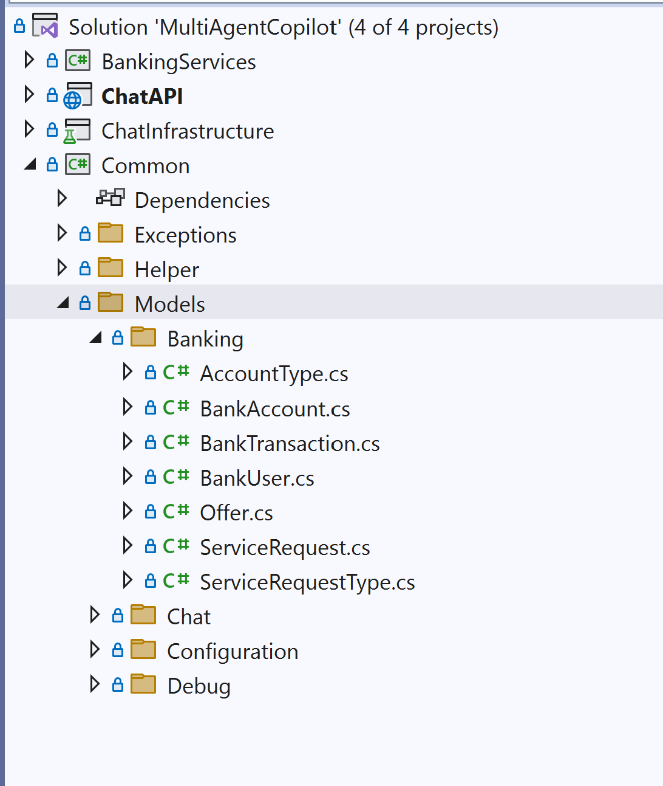
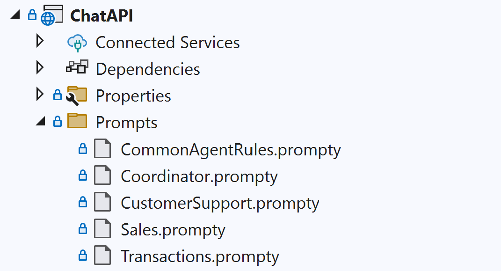

# Module 03 - Agent Specialization

## Introduction

In this Module you'll learn how to implement agent specialization by creating Semantic Kernel Functions that provide the functionality necessary to power individual agents that comprise a multi-agent system.

## Learning Objectives and Activities

- Learn the basics for Semantic Kernel Agent Framework Functions
- Learn how to implement semantic and natural language features using Vector indexing and search integration from Azure Cosmos DB.
- Learn how to define tasks and communication protocols for seamless collaboration.

## Module Exercises

1. [Activity 1: Defining Bank Domain Data Models](#activity-1-defining-bank-domain-data-models)  
1. [Activity 2: Defining Agent Behavior](#activity-2-defining-agent-behavior)  
1. [Activity 3: Integrating Bank Domain Functions as Plugins](#activity-3-integrating-bank-domain-functions-as-plugins)  
1. [Activity 4: Adding a Plugin to the Agent](#activity-4-adding-a-plugin-to-the-agent)  
1. [Activity 5: Building an Agent Dynamically](#activity-5-building-an-agent-dynamically)
1. [Activity 6: Semantic Search](#activity-6-semantic-search)
1. [Activity 7: Test your Work](#activity-7-test-your-work)

## Activity 1: Defining Bank Domain Data Models

It is important to understand the need for agent specialization and have a basic grasp of how to build and integrate them. For the remainder of this module we will do just that for our banking scenario.

When working with any kind of data we need to review our data models.

To begin, navigate to the `Common` project and navigate to the `/Models/Banking` folder. Familiarize yourself with the models used here.

The project and folder structure should look like the following:



## Activity 2: Defining Agent Behavior

Agent behavior is defined using prompts. These can be as simple as text in a string variable. However, it is often better to store these as external text files. In this solution we will use a format called, Prompty to manage our prompts.

Prompty is an asset class and file format designed to streamline the development and management of prompts for Large Language Models (LLMs). By combining configuration settings, sample data, and prompt templates into a single .prompty file, Prompty enhances observability, understandability, and portability for developers, thereby accelerating the prompt engineering process.

### Understand Agent behavior using Prompty

In this activity we will review the existing Prompty files.

In your IDE, navigate to the `/Prompts` folder.

The contents of this folder should look like this below.



#### Common Agent Rules

Review the contents of `CommonAgentRules.prompty`.

The contents of this file doesn't define a single agent's behavior but provides a baseline for how all agents are supposed to behave. Think of it like a set of global rules for agents. All agents import the text from this prompt to govern their responses.

#### Coordinator Agent

Review the contents of `Coordinator.prompty`.

This agent is the coordinator for the entire multi-agent system we are building. Its purpose is own the entire experience for users with the banking agent system. It starts by greeting new users when they initiate a new session, then routes user requests to the correct agent(s) to handle on their behalf. Finally it asks for feedback on how it did its job.

#### Customer Support Agent

Review the contents of `CustomerSupport.prompty`.

This agent handles anything that appears to be a customer support request by a user. It can create, find and update services requests for users. It can also take certain action on behalf of users too.

#### Sales Agent

Review the contents of `Sales.prompty`.

This agent is used when customers ask questions about what kinds of services a bank offers. The data on the products the bank has are stored in Cosmos DB. This agent performs a vector search in Cosmos DB to find the most suitable products for a customer's request.

#### Transaction Agent

Review the contents of `Transactions.prompty`.

This agent handles any account-based transactions on behalf of the user including getting account balances, generating statements and doing fund transfers between accounts.

### Retrieving the prompty text for Agents

In our banking solution we have four agents: transactions agent, sales agent, customer support agent, and a coordinator agent to manage all of them. With the behavior of the agents defined in Prompty, we now need to implement the code that will allow the application to load the agent behavior for each of the agents.

In your IDE, navigate to the `Models` folder and review the contents of `AgentTypes.cs`.

### Implementing the Agent Factory

We are now ready to complete the implementation for the **Agent Factory** created in the previous module. The `AgentFactory` will generate prompts based on the `agentType` parameter, allowing us to reuse the code and add more agents. 

Navigate to the `/Factories` folder, open the `AgentFactory.cs`

Next we need to replace our original hard-coded implementation from Module 2 to use the AgentType enum for our banking agents. It is also worth noting that it is here where the contents of the `CommonAgentsRules.prompty` are included as part of the system prompts that define our agents.

Replace the code for both `GetAgentName()` and `GetAgentPrompts()` with the code below:

```csharp
        private string GetAgentName(AgentType agentType)
        {

            string name = string.Empty;
            switch (agentType)
            {
                case AgentType.Sales:
                    name = "Sales";
                    break;
                case AgentType.Transactions:
                    name = "Transactions";
                    break;
                case AgentType.CustomerSupport:
                    name = "CustomerSupport";
                    break;
                case AgentType.Coordinator:
                    name = "Coordinator";
                    break;
                default:
                    throw new ArgumentOutOfRangeException(nameof(agentType), agentType, null);
            }

            return name;
        }

        private string GetAgentPrompts(AgentType agentType)
        {

            string promptFile = string.Empty;
            switch (agentType)
            {
                case AgentType.Sales:
                    promptFile = "Sales.prompty";
                    break;
                case AgentType.Transactions:
                    promptFile = "Transactions.prompty";
                    break;
                case AgentType.CustomerSupport:
                    promptFile = "CustomerSupport.prompty";
                    break;
                case AgentType.Coordinator:
                    promptFile = "Coordinator.prompty";
                    break;
                default:
                    throw new ArgumentOutOfRangeException(nameof(agentType), agentType, null);
            }

            string prompt = $"{File.ReadAllText("Prompts/" + promptFile)}{File.ReadAllText("Prompts/CommonAgentRules.prompty")}";

            return prompt;
        }

    }
```

## Activity 3: Integrating Bank Domain Functions as Plugins

All banking domain code is encapsulated in a separate `BankingDataService` class. Let's add the banking domain functions to the agent plugins. For simplicity in this workshop, all functions reference BankingServices. However, kernel functions can be any managed code that enables the LLM to interact with the outside world. The Base plugin, inherited by all plugins, contains common code for all plugins. For best results the `KernelFunction` available in the agent plugin should be consistent with the agent system prompts.

To save time, the code for BasePlugin, SalesPlugin, and CustomerSupportPlugin are already implemented. The code for TransactionPlugin is left for you to implement.

In your IDE, navigate to the `AgentPlugins` folder.

Navigate to and open the `TransactionPlugin.cs` file

Paste the following code into the class definition below the constructor.

```csharp
    [KernelFunction]
    [Description("Adds a new Account Transaction request")]
    public async Task<ServiceRequest> AddFunTransferRequest(
        string debitAccountId,
        decimal amount,
        string requestAnnotation,
        string? recipientPhoneNumber = null,
        string? recipientEmailId = null)
    {
       _logger.LogTrace("Adding AccountTransaction request for User ID: {UserId}, Debit Account: {DebitAccountId}", _userId, debitAccountId);
    
       // Ensure non-null values for recipientEmailId and recipientPhoneNumber
       string emailId = recipientEmailId ?? string.Empty;
       string phoneNumber = recipientPhoneNumber ?? string.Empty;
    
       return await _bankService.CreateFundTransferRequestAsync(_tenantId, debitAccountId, _userId, requestAnnotation, emailId, phoneNumber, amount);
    }
    
    [KernelFunction]
    [Description("Get the transactions history between 2 dates")]
    public async Task<List<BankTransaction>> GetTransactionHistory(string accountId, DateTime startDate, DateTime endDate)
    {
       _logger.LogTrace("Fetching AccountTransaction history for Account: {AccountId}, From: {StartDate} To: {EndDate}", accountId, startDate, endDate);
       return await _bankService.GetTransactionsAsync(_tenantId, accountId, startDate, endDate);
    }
```

## Activity 4: Adding a Plugin to the Agent

Similar to generating system prompts based on agent type, we need the plugins to be created dynamically. Next, we will implement a  a `GetAgentKernel` function that dynamically generates a plugin based on the agent type.

Navigate to the `/Factories` folder, open the `AgentFactory.cs`

Paste the code below to the  end of the class.

```csharp
        private Kernel GetAgentKernel(Kernel kernel, AgentType agentType, ILoggerFactory loggerFactory, BankingDataService bankService, string tenantId, string userId)
        {
            Kernel agentKernel = kernel.Clone();
            switch (agentType)
            {
                case AgentType.Sales:
                    var salesPlugin = new SalesPlugin(loggerFactory.CreateLogger<SalesPlugin>(), bankService, tenantId, userId);
                    agentKernel.Plugins.AddFromObject(salesPlugin);
                    break;
                case AgentType.Transactions:
                    var transactionsPlugin = new TransactionPlugin(loggerFactory.CreateLogger<TransactionPlugin>(), bankService, tenantId, userId);
                    agentKernel.Plugins.AddFromObject(transactionsPlugin);
                    break;
                case AgentType.CustomerSupport:
                    var customerSupportPlugin = new CustomerSupportPlugin(loggerFactory.CreateLogger<CustomerSupportPlugin>(), bankService, tenantId, userId);
                    agentKernel.Plugins.AddFromObject(customerSupportPlugin);
                    break;
                case AgentType.Coordinator:
                    var CoordinatorPlugin = new CoordinatorPlugin(loggerFactory.CreateLogger<CoordinatorPlugin>(), bankService, tenantId, userId);
                    agentKernel.Plugins.AddFromObject(CoordinatorPlugin);
                    break;
                default:
                    throw new ArgumentException("Invalid plugin name");
            }

            return agentKernel;
        }
```

## Activity 5: Building an Agent Dynamically

Now that we have  Agent Prompt and  Agent Kernel that are dynamically generated , we can make the agent build process dynamic based on the `agentType` parameter. Next, we will modify the `BuildAgent()` function within the `AgentFactory` class to dynamically add plugins to the agents.

Replace the `BuildAgent()` function with this code below.

```csharp
        public ChatCompletionAgent BuildAgent(Kernel kernel, AgentType agentType, ILoggerFactory loggerFactory, BankingDataService bankService, string tenantId, string userId)
        {
            ChatCompletionAgent agent = new ChatCompletionAgent
            {
                Name = GetAgentName(agentType),
                Instructions = $"""{GetAgentPrompts(agentType)}""",
                Kernel = GetAgentKernel(kernel, agentType, loggerFactory, bankService, tenantId, userId),
                Arguments = new KernelArguments(new AzureOpenAIPromptExecutionSettings() { FunctionChoiceBehavior = FunctionChoiceBehavior.Auto() })
            };

            return agent;
        }
```

## Activity 6: Semantic Search

In this activity, you will learn how to configure vector indexing and search in Azure Cosmos DB and explore the container and vector indexing policies. Then learn how to implement vector search using for Semantic Kernel.

### Create Data Model for Vector Search

Data Models used for Vector Search in Semantic Kernel need to be enhanced with additional attributes. We will use `OfferTerm` as vector search enabled data model.

In your IDE, navigate to the '/Models/Banking' folder

Open `OfferTerm.cs`

Paste the code with this code below for creating an OfferTerm class

```csharp

        [VectorStoreRecordKey]
        public required string Id { get; set; }

        [VectorStoreRecordData]
        public required string TenantId { get; set; }

        [VectorStoreRecordData]
        public required string OfferId { get; set; }

        [VectorStoreRecordData]
        public required string Name { get; set; }

        [VectorStoreRecordData]
        public required string Text { get; set; }

        [VectorStoreRecordData]
        public required string Type { get; set; }

        [VectorStoreRecordData]
        public required string AccountType { get; set; }

        [VectorStoreRecordVector(Dimensions: 1536, DistanceFunction: DistanceFunction.CosineSimilarity, IndexKind: IndexKind.QuantizedFlat)]
        public ReadOnlyMemory<float>? Vector { get; set; }
    
```

### Update BankingDataService to include vector search

In your IDE, within the '\Services' folder navigate to the `BankingDataService.cs` file.

in the constructor of the class search for **//To DO: Add vector search initialization code here** and replace  with the below code

```csharp
      DefaultAzureCredential credential;
     if (string.IsNullOrEmpty(skSettings.AzureOpenAISettings.UserAssignedIdentityClientID))
     {
         credential = new DefaultAzureCredential();
     }
     else
     {
         credential = new DefaultAzureCredential(new DefaultAzureCredentialOptions
         {
             ManagedIdentityClientId = skSettings.AzureOpenAISettings.UserAssignedIdentityClientID
         });
    
     }
    
     _textEmbeddingGenerationService = new(
             deploymentName: skSettings.AzureOpenAISettings.EmbeddingsDeployment, // Name of deployment, e.g. "text-embedding-ada-002".
             endpoint: skSettings.AzureOpenAISettings.Endpoint,           // Name of Azure OpenAI service endpoint, e.g. https://myaiservice.openai.azure.com.
             credential: credential);
    
     var jsonSerializerOptions = new JsonSerializerOptions { PropertyNamingPolicy = JsonNamingPolicy.CamelCase };
     var vectorStoreOptions = new AzureCosmosDBNoSQLVectorStoreRecordCollectionOptions<OfferTerm> { PartitionKeyPropertyName = "TenantId", JsonSerializerOptions = jsonSerializerOptions };
     _offerDataVectorStore = new AzureCosmosDBNoSQLVectorStoreRecordCollection<OfferTerm>(_database, _offerData.Id, vectorStoreOptions);
```

Below the function in which you just pasted the code above, paste the following two functions.

```csharp
        public async Task<List<OfferTerm>> SearchOfferTermsAsync(string tenantId, AccountType accountType, string requirementDescription)
        {
            try
            {
                // Generate Embedding
                ReadOnlyMemory<float> embedding = (await _textEmbeddingGenerationService.GenerateEmbeddingsAsync(
                       new[] { requirementDescription }
                   )).FirstOrDefault();
        
        
               string accountTypeString = accountType.ToString();
        
                // filters as LINQ expression
                Expression<Func<OfferTerm, bool>> linqFilter = term =>
                    term.TenantId == tenantId &&
                    term.Type == "Term" &&
                    term.AccountType == "Savings";
        
                var options = new VectorSearchOptions<OfferTerm>
                {
                    VectorProperty = term => term.Vector, // Correctly specify the vector property as a lambda expression
                    Filter = linqFilter, // Use the LINQ expression here
                    Top = 10,
                    IncludeVectors = false
                };
        
        
                var searchResults = await _offerDataVectorStore.VectorizedSearchAsync(embedding, options);
        
                List<OfferTerm> offerTerms = new();
                await foreach (var result in searchResults.Results)
                {
                    offerTerms.Add(result.Record);
                }
                return offerTerms;
            }
            catch (Exception ex)
            {
                _logger.LogError(ex.ToString());
                return new List<OfferTerm>();
            }
        }

        public async Task<Offer> GetOfferDetailsAsync(string tenantId, string offerId)
        {
            try
            {
                var partitionKey = new PartitionKey(tenantId);

                return await _offerData.ReadItemAsync<Offer>(
                       id: offerId,
                       partitionKey: new PartitionKey(tenantId));
            }
            catch (CosmosException ex)
            {
                _logger.LogError(ex.ToString());
                return null;
            }
        }
```

In your IDE, navigate to the `/AgentPlugins` folder.

Open the `SalesPlugin.cs` file.

Add these two functions to perform vector searches

```csharp
    [KernelFunction]
    [Description("Search offer terms of all available offers using vector search")]
    public async Task<List<OfferTerm>> SearchOfferTerms(AccountType accountType, string requirementDescription)
    {
        _logger.LogTrace($"Searching terms of all available offers matching '{requirementDescription}'");
        return await _bankService.SearchOfferTermsAsync(_tenantId, accountType, requirementDescription);
    }
    
    [KernelFunction]
    [Description("Get detail for an offer")]
    public async Task<Offer> GetOfferDetails(string offerId)
    {
        _logger.LogTrace($"Fetching Offer");
        return await _bankService.GetOfferDetailsAsync(_tenantId, offerId);
    }
```

### Select the Agent to get response

In your IDE, navigate to the `/Services` folder.

Open the `SalesPSemanticKernelService.cs` file.

Locate the `GetResponse()` function.

Replace `var agent = agentFactory.BuildAgent(_semanticKernel, _loggerFactory, bankService, tenantId, userId);` with the line of code below.

```c#
var agent = agentFactory.BuildAgent(_semanticKernel, AgentType.CustomerSupport, _loggerFactory, bankService, tenantId, userId);
```

## Activity 7: Test your Work

With the activities in this module complete, it is time to test your work.

Execute the below steps to check the behavior for each agent.

### Test the Response for Each AgentType

So far, we have created four agents, each with its own specialized role. However, we don't have any code to decide which agent to invoke in what scenario. That's something we will do in the next module. For now, let's test each agent independently and make sure all agents are functional.

To perform the tests, we will repeat the steps below for each agent type.

To begin, navigate to the `ChatInfrastructure` project.

Open the `Services` folder.

Locate the `GetResponse()` function.

Within this function update `AgentType` on this line of code below to see how different agents work.

```c#
var agent = agentChatGeneratorService.BuildAgent(_semanticKernel, AgentType.CustomerSupport, _loggerFactory, bankService, tenantId, userId);
```

Use this combination of AgentTypes and prompts for your test.

| Agent Type | User Prompt |
|-|-|
| AgentType.Coordinator | Hi |
| AgentType.Transactions | How much did I spend on groceries? |
| AgentType.Sales | Looking for a high interest savings account |
| AgentType.CustomerSupport | File a complaint for theft in Acc001 |

Note: For each of these combinations above, you only need stop the Backend service. You can keep the front end up.

### Start the Backend

- Return to the open terminal for the backend app in VS Code and type `dotnet run`

### Start the Frontend

- Return to the frontend terminal and type `ng serve`
- Navigate to, <http://localhost:4200> in your browser

### Start a Chat Session

1. Open the frontend app.
1. Start a new conversation.
1. Send a message based on the prompt of the current AgentType.
1. Expected response: The response is inline with the Agent's prompts and plugins.

### Stop the Application

- Return to VS Code.
- In the frontend terminal, press **Ctrl + C** to stop the frontend application.
- Select the backend terminal, press **Ctrl + C** to stop the backend application.

## Validation Checklist

- [ ] Each Agent response is per the corresponding prompty file contents and the plugin functions.
- [ ] Semantic Search functions correctly

## Common Issues and Solutions

1. No response to your prompt (on local):
    - Check if you are getting throttled by Azure OpenAI model.
    - Increase Azure open AI tokens if required.

1. Invalid/incomplete response:
    - Check if the Azure Cosmos DB containers have valid data.

1. No response to your prompt (hosted):
    - Navigate to the Application Insights account.
    - Navigate to `Live metrics` blade under `Investigate` section.
    - [Learn more] (<https://learn.microsoft.com/azure/azure-monitor/app/live-stream?tabs=otel>)

## Module Solution

The following sections include the completed code for this Module. Copy and paste these into your project if you run into issues and cannot resolve.

<details>
  <summary>Completed code for <strong>ChatInfrastructure/Models/AgentTypes.cs</strong></summary>

<br>

```csharp
using System;
using System.Collections.Generic;
using System.Linq;
using System.Text;
using System.Threading.Tasks;

namespace MultiAgentCopilot.ChatInfrastructure.Models
{
    enum AgentType
    {
        Transactions = 0,
        Sales = 1,
        CustomerSupport = 2,
        Coordinator = 3,
    }
}
```

</details>

<details>
  <summary>Completed code for <strong>ChatInfrastructure/Factories/SystemPromptFactory.cs</strong></summary>

<br>

```csharp
using System;
using System.Collections.Generic;
using System.Linq;
using System.Text;
using System.Threading.Tasks;
using Microsoft.SemanticKernel;
using MultiAgentCopilot.ChatInfrastructure.Services;
using MultiAgentCopilot.ChatInfrastructure.Models;


namespace MultiAgentCopilot.ChatInfrastructure.Factories
{
    internal static class SystemPromptFactory
    {
        public static string GetAgentName(AgentType agentType)
        {
            string name = string.Empty;
            switch (agentType)
            {
                case AgentType.Sales:
                    name = "Sales";
                    break;
                case AgentType.Transactions:
                    name = "Transactions";
                    break;
                case AgentType.CustomerSupport:
                    name = "CustomerSupport";
                    break;
                case AgentType.Coordinator:
                    name = "Coordinator";
                    break;
                default:
                    throw new ArgumentOutOfRangeException(nameof(agentType), agentType, null);
            }

            return name;//.ToUpper();
        }

        public static string GetAgentPrompts(AgentType agentType)
        {
            string promptFile = string.Empty;
            switch (agentType)
            {
                case AgentType.Sales:
                    promptFile = "Sales.prompty";
                    break;
                case AgentType.Transactions:
                    promptFile = "Transactions.prompty";
                    break;
                case AgentType.CustomerSupport:
                    promptFile = "CustomerSupport.prompty";
                    break;
                case AgentType.Coordinator:
                    promptFile = "Coordinator.prompty";
                    break;
                default:
                    throw new ArgumentOutOfRangeException(nameof(agentType), agentType, null);
            }

            string prompt = $"{File.ReadAllText("Prompts/" + promptFile)}{File.ReadAllText("Prompts/CommonAgentRules.prompty")}";

            return prompt;
        }
    }
}
```

</details>

<details>
  <summary>Completed code for <strong>ChatInfrastructure/Plugins/BasePlugin.cs</strong></summary>

<br>

```csharp
using Microsoft.Azure.Cosmos;
using Microsoft.Extensions.Logging;
using Microsoft.SemanticKernel;
using System;
using System.Collections.Generic;
using System.ComponentModel;
using System.Linq;
using System.Text;
using System.Threading.Tasks;
using MultiAgentCopilot.Common.Models.Banking;
using BankingServices.Interfaces;

namespace MultiAgentCopilot.ChatInfrastructure.Plugins
{

    public class BasePlugin
    {
        protected readonly ILogger<BasePlugin> _logger;
        protected readonly IBankDataService _bankService;
        protected readonly string _userId;
        protected readonly string _tenantId;

        public BasePlugin(ILogger<BasePlugin> logger, IBankDataService bankService, string tenantId, string userId)
        {
            _logger = logger;
            _tenantId = tenantId;
            _userId = userId;
            _bankService = bankService;
        }

        [KernelFunction("GetLoggedInUser")]
        [Description("Get the current logged-in BankUser")]
        public async Task<BankUser> GetLoggedInUser()
        {
            _logger.LogTrace($"Get Logged In User for Tenant:{_tenantId}  User:{_userId}");
            return await _bankService.GetUserAsync(_tenantId, _userId);
        }

        [KernelFunction("GetCurrentDateTime")]
        [Description("Get the current date time in UTC")]
        public DateTime GetCurrentDateTime()
        {
            _logger.LogTrace($"Get Datetime: {System.DateTime.Now.ToUniversalTime()}");
            return System.DateTime.Now.ToUniversalTime();
        }

        [KernelFunction("GetUserRegisteredAccounts")]
        [Description("Get user registered accounts")]
        public async Task<List<BankAccount>> GetUserRegisteredAccounts()
        {
            _logger.LogTrace($"Fetching accounts for Tenant: {_tenantId} User ID: {_userId}");
            return await _bankService.GetUserRegisteredAccountsAsync(_tenantId, _userId);
        }
    }
}
```

</details>

<details>
  <summary>Completed code for <strong>ChatInfrastructure/Plugins/SalesPlugin.cs</strong></summary>

<br>

```csharp
using System;
using System.Collections.Generic;
using System.Linq;
using System.Text;
using System.Threading.Tasks;
using Microsoft.SemanticKernel;
using System.ComponentModel;
using Microsoft.Extensions.Logging;
using MultiAgentCopilot.Common.Models.Banking;
using BankingServices.Interfaces;

namespace MultiAgentCopilot.ChatInfrastructure.Plugins
{
    internal class SalesPlugin : BasePlugin
    {
        public SalesPlugin(ILogger<BasePlugin> logger, IBankDataService bankService, string tenantId, string userId)
            : base(logger, bankService, tenantId, userId)
        {
        }
        [KernelFunction]
        [Description("Search an offer by name")]
        public async Task<Offer> GetOfferDetailsByName(string offerName)
        {
            _logger.LogTrace($"Fetching Offer by name");
            return await _bankService.GetOfferDetailsByNameAsync(_tenantId, offerName);
        }
        [KernelFunction]
        [Description("Search offer terms of all available offers using vector search")]
        public async Task<List<OfferTerm>> SearchOfferTerms(AccountType accountType, string requirementDescription)
        {
            _logger.LogTrace($"Searching terms of all available offers matching '{requirementDescription}'");
            return await _bankService.SearchOfferTermsAsync(_tenantId, accountType, requirementDescription);
        }

        [KernelFunction]
        [Description("Get detail for an offer")]
        public async Task<Offer> GetOfferDetails(string offerId)
        {
            _logger.LogTrace($"Fetching Offer");
            return await _bankService.GetOfferDetailsAsync(_tenantId, offerId);
        }
    }
}
```

</details>

<details>
  <summary>Completed code for <strong>ChatInfrastructure/Plugins/CustomerSupportPlugin.cs</strong></summary>

<br>

```csharp
using BankingServices.Interfaces;
using Microsoft.Extensions.Logging;
using Microsoft.SemanticKernel;
using System.ComponentModel;
using System;
using System.Collections.Generic;
using System.Linq;
using System.Security.AccessControl;
using System.Text;
using System.Threading.Tasks;
using MultiAgentCopilot.Common.Models.Banking;

namespace MultiAgentCopilot.ChatInfrastructure.Plugins
{
    public class CustomerSupportPlugin : BasePlugin
    {
        public CustomerSupportPlugin(ILogger<BasePlugin> logger, IBankDataService bankService, string tenantId, string userId)
          : base(logger, bankService, tenantId, userId)
        {
        }

        [KernelFunction("IsAccountRegisteredToUser")]
        [Description("Check if account is registered to user")]
        public async Task<bool> IsAccountRegisteredToUser(string accountId)
        {
            _logger.LogTrace($"Validating account for Tenant: {_tenantId} User ID: {_userId}- {accountId}");
            var accountDetails = await _bankService.GetAccountDetailsAsync(_tenantId, _userId, accountId);
            return accountDetails != null;
        }

        [KernelFunction]
        [Description("Create new complaint")]
        public async Task<ServiceRequest> CreateComplaint(string accountId, string requestAnnotation)
        {
            _logger.LogTrace($"Adding new service request for Tenant: {_tenantId} User: {_userId}, Account: {accountId}");
            return await _bankService.CreateComplaintAsync(_tenantId, accountId, _userId, requestAnnotation);
        }
    }
}
```

</details>

<details>
  <summary>Completed code for <strong>ChatInfrastructure/Plugins/TransactionPlugin.cs</strong></summary>

<br>

```csharp
using Microsoft.Extensions.Logging;
using Microsoft.SemanticKernel;
using System;
using System.Collections.Generic;
using System.ComponentModel;
using System.Linq;
using System.Text;
using System.Threading.Tasks;
using System.Transactions;
using MultiAgentCopilot.Common.Models.Banking;
using BankingServices.Interfaces;

namespace MultiAgentCopilot.ChatInfrastructure.Plugins
{
    public class TransactionPlugin : BasePlugin
    {
        public TransactionPlugin(ILogger<BasePlugin> logger, IBankDataService bankService, string tenantId, string userId)
         : base(logger, bankService, tenantId, userId)
        {
        }

        [KernelFunction]
        [Description("Adds a new Account Transaction request")]
        public async Task<ServiceRequest> AddFunTransferRequest(
           string debitAccountId,
           decimal amount,
           string requestAnnotation,
           string? recipientPhoneNumber = null,
           string? recipientEmailId = null)
        {
            _logger.LogTrace("Adding AccountTransaction request for User ID: {UserId}, Debit Account: {DebitAccountId}", _userId, debitAccountId);

            // Ensure non-null values for recipientEmailId and recipientPhoneNumber
            string emailId = recipientEmailId ?? string.Empty;
            string phoneNumber = recipientPhoneNumber ?? string.Empty;

            return await _bankService.CreateFundTransferRequestAsync(_tenantId, debitAccountId, _userId, requestAnnotation, emailId, phoneNumber, amount);
        }

        [KernelFunction]
        [Description("Get the transactions history between 2 dates")]
        public async Task<List<BankTransaction>> GetTransactionHistory(string accountId, DateTime startDate, DateTime endDate)
        {
            _logger.LogTrace("Fetching AccountTransaction history for Account: {AccountId}, From: {StartDate} To: {EndDate}", accountId, startDate, endDate);
            return await _bankService.GetTransactionsAsync(_tenantId, accountId, startDate, endDate);
        }
    }
}
```

</details>

<details>
  <summary>Completed code for <strong>ChatInfrastructure/Factories/PluginFactory.cs</strong></summary>

<br>

```csharp
using Microsoft.SemanticKernel;
using MultiAgentCopilot.ChatInfrastructure.Services;
using System;
using System.Collections.Generic;
using System.Linq;
using System.Text;
using System.Threading.Tasks;
using Microsoft.Extensions.Logging;
using MultiAgentCopilot.ChatInfrastructure.Plugins;
using BankingServices.Interfaces;
using MultiAgentCopilot.ChatInfrastructure.Models;

namespace MultiAgentCopilot.ChatInfrastructure.Factories
{
    internal static class PluginFactory
    {
        internal static Kernel GetAgentKernel(Kernel kernel, AgentType agentType, ILoggerFactory loggerFactory, IBankDataService bankService, string tenantId, string userId)
        {
            Kernel agentKernel = kernel.Clone();
            switch (agentType)
            {
                case AgentType.Sales:
                    var salesPlugin = new SalesPlugin(loggerFactory.CreateLogger<SalesPlugin>(), bankService, tenantId, userId);
                    agentKernel.Plugins.AddFromObject(salesPlugin);
                    break;
                case AgentType.Transactions:
                    var transactionsPlugin = new TransactionPlugin(loggerFactory.CreateLogger<TransactionPlugin>(), bankService, tenantId, userId);
                    agentKernel.Plugins.AddFromObject(transactionsPlugin);
                    break;
                case AgentType.CustomerSupport:
                    var customerSupportPlugin = new CustomerSupportPlugin(loggerFactory.CreateLogger<CustomerSupportPlugin>(), bankService, tenantId, userId);
                    agentKernel.Plugins.AddFromObject(customerSupportPlugin);
                    break;
                case AgentType.Coordinator:
                    var CoordinatorPlugin = new CoordinatorPlugin(loggerFactory.CreateLogger<CoordinatorPlugin>(), bankService, tenantId, userId);
                    agentKernel.Plugins.AddFromObject(CoordinatorPlugin);
                    break;
                default:
                    throw new ArgumentException("Invalid plugin name");
            }

            return agentKernel;
        }
    }
}
```

</details>

<details>
  <summary>Completed code for <strong>ChatInfrastructure/Factories/ChatFactory.cs</strong></summary>

<br>

```csharp
using BankingServices.Interfaces;
using Microsoft.Extensions.Logging;
using Microsoft.SemanticKernel;
using Microsoft.SemanticKernel.Agents;
using Microsoft.SemanticKernel.Connectors.AzureOpenAI;
using MultiAgentCopilot.ChatInfrastructure.Models;

namespace MultiAgentCopilot.ChatInfrastructure.Factories
{
    internal class ChatFactory
    {
        public delegate void LogCallback(string key, string value);

        public ChatCompletionAgent BuildAgent(Kernel kernel, AgentType agentType, ILoggerFactory loggerFactory, IBankDataService bankService, string tenantId, string userId)
        {
            ChatCompletionAgent agent = new ChatCompletionAgent
            {
                Name = SystemPromptFactory.GetAgentName(agentType),
                Instructions = $"""{SystemPromptFactory.GetAgentPrompts(agentType)}""",
                Kernel = PluginFactory.GetAgentKernel(kernel, agentType, loggerFactory, bankService, tenantId, userId),
                Arguments = new KernelArguments(new AzureOpenAIPromptExecutionSettings() { FunctionChoiceBehavior = FunctionChoiceBehavior.Auto() })
            };

            return agent;
        }
    }
}
```

</details>

<details>
  <summary>Completed code for <strong>ChatInfrastructure/Services/ChatService.cs</strong></summary>

<br>

```csharp
using MultiAgentCopilot.Common.Models.Chat;
using MultiAgentCopilot.ChatInfrastructure.Interfaces;
using Microsoft.Extensions.Logging;
using Microsoft.SemanticKernel.ChatCompletion;
using MultiAgentCopilot.Common.Models.Debug;
using System.Collections.Generic;
using Microsoft.Extensions.Options;
using MultiAgentCopilot.Common.Models.Configuration;
using Newtonsoft.Json.Linq;
using System.Text.Json;
using Newtonsoft.Json;
using Microsoft.Identity.Client;
using BankingServices.Interfaces;
using BankingServices.Services;

namespace MultiAgentCopilot.ChatInfrastructure.Services;

public class ChatService : IChatService
{
    private readonly ICosmosDBService _cosmosDBService;
    private readonly ILogger _logger;
    private readonly IBankDataService _bankService;
    private readonly ISemanticKernelService _skService;

    public ChatService(
        IOptions<CosmosDBSettings> cosmosOptions,
        IOptions<SemanticKernelServiceSettings> skOptions,
        ICosmosDBService cosmosDBService,
        ISemanticKernelService skService,
        ILoggerFactory loggerFactory)
    {
        _cosmosDBService = cosmosDBService;
        _skService = skService;
        _bankService = new BankingDataService(cosmosOptions.Value, skOptions.Value, loggerFactory);
        _logger = loggerFactory.CreateLogger<ChatService>();
    }

    /// <summary>
    /// Returns list of chat session ids and names.
    /// </summary>
    public async Task<List<Session>> GetAllChatSessionsAsync(string tenantId, string userId)
    {
        return await _cosmosDBService.GetUserSessionsAsync(tenantId, userId);
    }

    /// <summary>
    /// Returns the chat messages related to an existing session.
    /// </summary>
    public async Task<List<Message>> GetChatSessionMessagesAsync(string tenantId, string userId,string sessionId)
    {
        ArgumentNullException.ThrowIfNull(sessionId);
        return await _cosmosDBService.GetSessionMessagesAsync(tenantId,userId,sessionId);
    }

    /// <summary>
    /// Creates a new chat session.
    /// </summary>
    public async Task<Session> CreateNewChatSessionAsync(string tenantId, string userId)
    {
        Session session = new(tenantId, userId);
        return await _cosmosDBService.InsertSessionAsync(session);
    }

    /// <summary>
    /// Rename the chat session from its default (eg., "New Chat") to the summary provided by OpenAI.
    /// </summary>
    public async Task<Session> RenameChatSessionAsync(string tenantId, string userId,string sessionId, string newChatSessionName)
    {
        ArgumentNullException.ThrowIfNull(sessionId);
        ArgumentException.ThrowIfNullOrEmpty(newChatSessionName);

        return await _cosmosDBService.UpdateSessionNameAsync( tenantId, userId,sessionId, newChatSessionName);
    }

    /// <summary>
    /// Delete a chat session and related messages.
    /// </summary>
    public async Task DeleteChatSessionAsync(string tenantId, string userId,string sessionId)
    {
        ArgumentNullException.ThrowIfNull(sessionId);
        await _cosmosDBService.DeleteSessionAndMessagesAsync(tenantId, userId,sessionId);
    }

    /// <summary>
    /// Receive a prompt from a user, vectorize it from the OpenAI service, and get a completion from the OpenAI service.
    /// </summary>
    public async Task<List<Message>> GetChatCompletionAsync(string tenantId, string userId, string? sessionId, string userPrompt)
    {
        try
        {
            ArgumentNullException.ThrowIfNull(sessionId);

            // Retrieve conversation, including latest prompt.
            var archivedMessages = await _cosmosDBService.GetSessionMessagesAsync(tenantId, userId, sessionId);

            // Add both prompt and completion to cache, then persist in Cosmos DB
            var userMessage = new Message(tenantId, userId, sessionId, "User", "User", userPrompt);

            // Generate the completion to return to the user
            var result = await _skService.GetResponse(userMessage, archivedMessages, _bankService, tenantId, userId);

            await AddPromptCompletionMessagesAsync(tenantId, userId, sessionId, userMessage, result.Item1, result.Item2);

            return result.Item1;
        }
        catch (Exception ex)
        {
            _logger.LogError(ex, $"Error getting completion in session {sessionId} for user prompt [{userPrompt}].");
            return new List<Message> { new Message(tenantId, userId, sessionId!, "Error", "Error", $"Error getting completion in session {sessionId} for user prompt [{userPrompt}].") };
        }
    }

    /// <summary>
    /// Generate a name for a chat message, based on the passed in prompt.
    /// </summary>
    public async Task<string> SummarizeChatSessionNameAsync(string tenantId, string userId, string? sessionId, string prompt)
    {
        try
        {
            ArgumentNullException.ThrowIfNull(sessionId);

            var summary = await _skService.Summarize(sessionId, prompt);

            var session = await RenameChatSessionAsync(tenantId, userId, sessionId, summary);

            return session.Name;
        }
        catch (Exception ex)
        {
            _logger.LogError(ex, $"Error getting a summary in session {sessionId} for user prompt [{prompt}].");
            return $"Error getting a summary in session {sessionId} for user prompt [{prompt}].";
        }
    }


    /// <summary>
    /// Rate an assistant message. This can be used to discover useful AI responses for training, discoverability, and other benefits down the road.
    /// </summary>
    public async Task<Message> RateChatCompletionAsync(string tenantId, string userId,string messageId, string sessionId, bool? rating)
    {
        ArgumentNullException.ThrowIfNull(messageId);
        ArgumentNullException.ThrowIfNull(sessionId);

        return await _cosmosDBService.UpdateMessageRatingAsync(tenantId,userId, sessionId, messageId,rating);
    }

    public async Task<DebugLog> GetChatCompletionDebugLogAsync(string tenantId, string userId,string sessionId, string debugLogId)
    {
        ArgumentException.ThrowIfNullOrEmpty(sessionId);
        ArgumentException.ThrowIfNullOrEmpty(debugLogId);

        return await _cosmosDBService.GetChatCompletionDebugLogAsync(tenantId,userId, sessionId, debugLogId);
    }


    public async Task<bool> AddDocument(string containerName, JsonElement document)
    {
        try
        {
            // Extract raw JSON from JsonElement
            var json = document.GetRawText();
            var docJObject = JsonConvert.DeserializeObject<JObject>(json);

            // Ensure "id" exists
            if (!docJObject.ContainsKey("id"))
            {
                throw new ArgumentException("Document must contain an 'id' property.");
            }
           
            return await _cosmosDBService.InsertDocumentAsync(containerName, docJObject);

        }
        catch (Exception ex)
        {
            _logger.LogError(ex, $"Error adding document to container {containerName}.");
            return false;
        }
    }
    /// <summary>
    /// Add user prompt and AI assistance response to the chat session message list object and insert into the data service as a transaction.
    /// </summary>
    private async Task AddPromptCompletionMessagesAsync(string tenantId, string userId, string sessionId, Message promptMessage, List<Message> completionMessages, List<DebugLog> completionMessageLogs)
    {
        var session = await _cosmosDBService.GetSessionAsync(tenantId, userId, sessionId);

        completionMessages.Insert(0, promptMessage);
        await _cosmosDBService.UpsertSessionBatchAsync(completionMessages, completionMessageLogs, session);
    }
}
```

</details>

<details>
  <summary>Completed code for <strong>Common/Models/Banking/OfferTerm.cs</strong></summary>

<br>

```csharp
using Microsoft.Extensions.VectorData;
namespace MultiAgentCopilot.Common.Models.Banking
{
    public class OfferTerm
    {
        [VectorStoreRecordKey]
        public required string Id { get; set; }

        [VectorStoreRecordData]
        public required string TenantId { get; set; }

        [VectorStoreRecordData]
        public required string OfferId { get; set; }

        [VectorStoreRecordData]
        public required string Name { get; set; }

        [VectorStoreRecordData]
        public required string Text { get; set; }

        [VectorStoreRecordData]
        public required string Type { get; set; }

        [VectorStoreRecordData]
        public required string AccountType { get; set; }

        [VectorStoreRecordVector(Dimensions: 1536, DistanceFunction: DistanceFunction.CosineSimilarity, IndexKind: IndexKind.QuantizedFlat)]
        public ReadOnlyMemory<float>? Vector { get; set; }
    }
}
```

</details>

<details>
  <summary>Completed code for <strong>BankingServices/Interfaces/IBankDataService.cs</strong></summary>

<br>

```csharp
using Microsoft.Azure.Cosmos;
using System;
using System.Collections.Generic;
using System.Linq;
using System.Text;
using System.Threading.Tasks;
using MultiAgentCopilot.Common.Models.Banking;

namespace BankingServices.Interfaces
{
    public interface IBankDataService
    {
        Task<BankUser> GetUserAsync(string tenantId, string userId);
        Task<BankAccount> GetAccountDetailsAsync(string tenantId, string userId, string accountId);
        Task<List<BankAccount>> GetUserRegisteredAccountsAsync(string tenantId, string userId);
        Task<List<BankTransaction>> GetTransactionsAsync(string tenantId, string accountId, DateTime startDate, DateTime endDate);
        Task<ServiceRequest> CreateFundTransferRequestAsync(string tenantId, string accountId, string userId, string requestAnnotation, string recipientEmail, string recipientPhone, decimal debitAmount);
        Task<ServiceRequest> CreateTeleBankerRequestAsync(string tenantId, string accountId, string userId, string requestAnnotation, DateTime scheduledDateTime);
        Task<ServiceRequest> CreateComplaintAsync(string tenantId, string accountId, string userId, string requestAnnotation);
        Task<ServiceRequest> CreateFulfilmentRequestAsync(string tenantId, string accountId, string userId, string requestAnnotation, Dictionary<string, string> fulfilmentDetails);
        Task<List<ServiceRequest>> GetServiceRequestsAsync(string tenantId, string accountId, string? userId = null, ServiceRequestType? SRType = null);
        Task<bool> AddServiceRequestDescriptionAsync(string tenantId, string accountId, string requestId, string annotationToAdd);
        Task<Offer> GetOfferDetailsByNameAsync(string tenantId, string offerName);
        Task<String> GetTeleBankerAvailabilityAsync();
        Task<List<OfferTerm>> SearchOfferTermsAsync(string tenantId, AccountType accountType, string requirementDescription);
        Task<Offer> GetOfferDetailsAsync(string tenantId, string offerId);
    }
}
```

</details>

<details>
  <summary>Completed code for <strong>BankingServices/Services/BankingDataService.cs</strong></summary>

<br>

```csharp
using System.Diagnostics;
using System.Text;
using System.Text.Json;
using Azure.Identity;

using Microsoft.Extensions.DependencyInjection;
using Microsoft.Extensions.Logging;
using Microsoft.Extensions.VectorData;

using Microsoft.Azure.Cosmos;
using Microsoft.Azure.Cosmos.Fluent;
using Container = Microsoft.Azure.Cosmos.Container;
using PartitionKey = Microsoft.Azure.Cosmos.PartitionKey;

using Microsoft.SemanticKernel;
using Microsoft.SemanticKernel.Connectors.AzureCosmosDBNoSQL;
using Microsoft.SemanticKernel.Connectors.AzureOpenAI;

using MultiAgentCopilot.Common.Helper;
using MultiAgentCopilot.Common.Models.Banking;
using MultiAgentCopilot.Common.Models.Configuration;
using BankingServices.Interfaces;

namespace BankingServices.Services
{
    public class BankingDataService: IBankDataService
    {
        private readonly Container _accountData;
        private readonly Container _userData;
        private readonly Container _requestData;
        private readonly Container _offerData;

        private readonly Database _database;
        private readonly CosmosDBSettings _settings;
        private readonly ILogger _logger;

        private readonly AzureCosmosDBNoSQLVectorStoreRecordCollection<OfferTerm> _offerDataVectorStore;
        private readonly AzureOpenAITextEmbeddingGenerationService _textEmbeddingGenerationService;

        public bool IsInitialized { get; private set; }

        readonly Kernel _semanticKernel;

        public BankingDataService(
            CosmosDBSettings settings,
            SemanticKernelServiceSettings skSettings,
            ILoggerFactory loggerFactory )
        {
            _settings = settings; 
            ArgumentException.ThrowIfNullOrEmpty(_settings.CosmosUri);

            _logger = loggerFactory.CreateLogger<BankingDataService>();

            _logger.LogInformation("Initializing Banking service.");

            if (!_settings.EnableTracing)
            {
                Type? defaultTrace = Type.GetType("Microsoft.Azure.Cosmos.Core.Trace.DefaultTrace,Microsoft.Azure.Cosmos.Direct");
               
                if (defaultTrace != null)
                {
                    TraceSource? traceSource = (TraceSource?)defaultTrace.GetProperty("TraceSource")?.GetValue(null);
                    if (traceSource != null)
                    {
                        traceSource.Switch.Level = SourceLevels.All;
                        traceSource.Listeners.Clear();
                    }
                }                 
            }

            CosmosSerializationOptions options = new()
            {
                PropertyNamingPolicy = CosmosPropertyNamingPolicy.CamelCase
            };

            DefaultAzureCredential credential;
            if (string.IsNullOrEmpty(_settings.UserAssignedIdentityClientID))
            {
                credential = new DefaultAzureCredential();
            }
            else
            {
                credential = new DefaultAzureCredential(new DefaultAzureCredentialOptions
                {
                    ManagedIdentityClientId = _settings.UserAssignedIdentityClientID
                });
            }

            var jsonSerializerOptions = new JsonSerializerOptions { PropertyNamingPolicy = JsonNamingPolicy.CamelCase };

            CosmosClient client = new CosmosClientBuilder(_settings.CosmosUri, credential)
                .WithSystemTextJsonSerializerOptions(jsonSerializerOptions)
                .WithConnectionModeGateway()
            .Build();

            _database = client?.GetDatabase(_settings.Database) ??
                        throw new ArgumentException("Unable to connect to existing Azure Cosmos DB database.");

            _accountData = _database.GetContainer(_settings.AccountsContainer.Trim());
            _userData = _database.GetContainer(_settings.UserDataContainer.Trim());
            _requestData = _database.GetContainer(_settings.RequestDataContainer.Trim());
            _offerData= _database.GetContainer(_settings.OfferDataContainer.Trim());

            _logger.LogInformation("Banking service initialized for Cosmos DB.");

            // Set up Semantic Kernel with Azure OpenAI and Managed Identity
            var builder = Kernel.CreateBuilder();

            builder.Services.AddSingleton<ILoggerFactory>(loggerFactory);

            _semanticKernel = builder.Build();

            _textEmbeddingGenerationService = new(
                deploymentName: skSettings.AzureOpenAISettings.EmbeddingsDeployment,
                endpoint: skSettings.AzureOpenAISettings.Endpoint,
                credential: credential);

            var vectorStoreOptions = new AzureCosmosDBNoSQLVectorStoreRecordCollectionOptions<OfferTerm> { PartitionKeyPropertyName = "TenantId", JsonSerializerOptions = jsonSerializerOptions };
            _offerDataVectorStore = new AzureCosmosDBNoSQLVectorStoreRecordCollection<OfferTerm>(_database, _settings.OfferDataContainer.Trim(), vectorStoreOptions);

            _logger.LogInformation("Banking service initialized.");
        }

        public async Task<List<OfferTerm>> SearchOfferTermsAsync(string tenantId, AccountType accountType, string requirementDescription)
        {
            try
            {
                // Generate Embedding
                ReadOnlyMemory<float> embedding = (await _textEmbeddingGenerationService.GenerateEmbeddingsAsync(
                       new[] { requirementDescription }
                   )).FirstOrDefault();

                // perform vector search
                var filter = new VectorSearchFilter()
                    .EqualTo("TenantId", tenantId)
                    .EqualTo("Type", "Term")
                    .EqualTo("AccountType", "Savings");
                var options = new VectorSearchOptions { VectorPropertyName = "Vector", Filter = filter, Top = 10, IncludeVectors = false };

                var searchResults = await _offerDataVectorStore.VectorizedSearchAsync(embedding, options);

                List<OfferTerm> offerTerms = new();
                await foreach (var result in searchResults.Results)
                {
                    offerTerms.Add(result.Record);
                }
                return offerTerms;
            }
            catch (Exception ex)
            {
                _logger.LogError(ex.ToString());
                return new List<OfferTerm>();
            }
        }

        public async Task<Offer> GetOfferDetailsAsync(string tenantId, string offerId)
        {
            try
            {
                var partitionKey = new PartitionKey(tenantId);

                return await _offerData.ReadItemAsync<Offer>(
                       id: offerId,
                       partitionKey: new PartitionKey(tenantId));
            }
            catch (CosmosException ex)
            {
                _logger.LogError(ex.ToString());
                return null;
            }
        }

        public async Task<BankUser> GetUserAsync(string tenantId, string userId)
        {
            try
            {
                var partitionKey = PartitionManager.GetUserDataFullPK(tenantId);

                return await _userData.ReadItemAsync<BankUser>(
                       id: userId,
                       partitionKey: partitionKey);
            }
            catch (CosmosException ex)
            {
                _logger.LogError(ex.ToString());
                return null;
            }
        }

        public async Task<List<BankAccount>> GetUserRegisteredAccountsAsync(string tenantId, string userId)
        {
            try
            {
                QueryDefinition query = new QueryDefinition("SELECT * FROM c WHERE c.type = @type and c.userId=@userId")
                     .WithParameter("@type", nameof(BankAccount))
                     .WithParameter("@userId", userId);

                var partitionKey = PartitionManager.GetAccountsPartialPK(tenantId);
                FeedIterator<BankAccount> response = _accountData.GetItemQueryIterator<BankAccount>(query, null, new QueryRequestOptions() { PartitionKey = partitionKey });

                List<BankAccount> output = new();
                while (response.HasMoreResults)
                {
                    FeedResponse<BankAccount> results = await response.ReadNextAsync();
                    output.AddRange(results);
                }

                return output;
            }
            catch (CosmosException ex)
            {
                _logger.LogError(ex.ToString());
                return null;
            }
        }

        public async Task<BankAccount> GetAccountDetailsAsync(string tenantId, string userId, string accountId)
        {
            try
            {
                var partitionKey = PartitionManager.GetAccountsDataFullPK(tenantId, accountId);

                return await _accountData.ReadItemAsync<BankAccount>(
                       id: accountId,
                       partitionKey: partitionKey);
            }
            catch (CosmosException ex)
            {
                _logger.LogError(ex.ToString());
                return null;
            }
        }

        public async Task<List<BankTransaction>> GetTransactionsAsync(string tenantId, string accountId, DateTime startDate, DateTime endDate)
        {
            try
            {
                var partitionKey = PartitionManager.GetAccountsDataFullPK(tenantId, accountId);

                QueryDefinition queryDefinition = new QueryDefinition(
                       "SELECT * FROM c WHERE c.accountId = @accountId AND c.transactionDateTime >= @startDate AND c.transactionDateTime <= @endDate AND c.type = @type")
                       .WithParameter("@accountId", accountId)
                       .WithParameter("@type", nameof(BankTransaction))
                       .WithParameter("@startDate", startDate)
                       .WithParameter("@endDate", endDate);

                List<BankTransaction> transactions = new List<BankTransaction>();
                using (FeedIterator<BankTransaction> feedIterator = _accountData.GetItemQueryIterator<BankTransaction>(queryDefinition, requestOptions: new QueryRequestOptions { PartitionKey = partitionKey }))
                {
                    while (feedIterator.HasMoreResults)
                    {
                        //var abc= await feedIterator.ReadNextAsync();
                        FeedResponse<BankTransaction> response = await feedIterator.ReadNextAsync();
                        transactions.AddRange(response);
                    }
                }

                return transactions;
            }
            catch (CosmosException ex) when (ex.StatusCode == System.Net.HttpStatusCode.NotFound)
            {
                _logger.LogError(ex.ToString());
                return new List<BankTransaction>();
            }
        }

        public async Task<ServiceRequest> CreateFundTransferRequestAsync(string tenantId, string accountId, string userId, string requestAnnotation, string recipientEmail, string recipientPhone, decimal debitAmount)
        {
            var req = new ServiceRequest(ServiceRequestType.FundTransfer, tenantId, accountId, userId, requestAnnotation, recipientEmail, recipientPhone, debitAmount, DateTime.MinValue, null);
            return await AddServiceRequestAsync(req);
        }

        public async Task<ServiceRequest> CreateTeleBankerRequestAsync(string tenantId, string accountId, string userId, string requestAnnotation, DateTime scheduledDateTime)
        {
            var req = new ServiceRequest(ServiceRequestType.TeleBankerCallBack, tenantId, accountId, userId, requestAnnotation, string.Empty, string.Empty, 0, scheduledDateTime, null);
            return await AddServiceRequestAsync(req);
        }

        public Task<string> GetTeleBankerAvailabilityAsync()
        {
            return Task.FromResult("Monday to Friday, 8 AM to 8 PM Pacific Time");
        }

        public async Task<ServiceRequest> CreateComplaintAsync(string tenantId, string accountId, string userId, string requestAnnotation)
        {
            var req = new ServiceRequest(ServiceRequestType.Complaint, tenantId, accountId, userId, requestAnnotation, string.Empty, string.Empty, 0, DateTime.MinValue, null);
            return await AddServiceRequestAsync(req);
        }

        public async Task<ServiceRequest> CreateFulfilmentRequestAsync(string tenantId, string accountId, string userId, string requestAnnotation, Dictionary<string, string> fulfilmentDetails)
        {
            var req = new ServiceRequest(ServiceRequestType.Fulfilment, tenantId, accountId, userId, requestAnnotation, string.Empty, string.Empty, 0, DateTime.MinValue, fulfilmentDetails);
            return await AddServiceRequestAsync(req);
        }

        private async Task<ServiceRequest> AddServiceRequestAsync(ServiceRequest req)
        {
            try
            {
                var partitionKey = PartitionManager.GetAccountsDataFullPK(req.TenantId, req.AccountId);
                ItemResponse<ServiceRequest> response = await _accountData.CreateItemAsync(req, partitionKey);
                return response.Resource;
            }
            catch (CosmosException ex)
            {
                _logger.LogError(ex.ToString());
                return null;
            }
        }

        public async Task<List<ServiceRequest>> GetServiceRequestsAsync(string tenantId, string accountId, string? userId = null, ServiceRequestType? SRType = null)
        {
            try
            {
                var partitionKey = PartitionManager.GetAccountsDataFullPK(tenantId, accountId);
                var queryBuilder = new StringBuilder("SELECT * FROM c WHERE c.type = @type");
                var queryDefinition = new QueryDefinition(queryBuilder.ToString())
                      .WithParameter("@type", nameof(ServiceRequest));

                if (!string.IsNullOrEmpty(userId))
                {
                    queryBuilder.Append(" AND c.userId = @userId");
                    queryDefinition = queryDefinition.WithParameter("@userId", userId);
                }

                if (SRType.HasValue)
                {
                    queryBuilder.Append(" AND c.SRType = @SRType");
                    queryDefinition = queryDefinition.WithParameter("@SRType", SRType);
                }

                List<ServiceRequest> reqs = new List<ServiceRequest>();
                using (FeedIterator<ServiceRequest> feedIterator = _requestData.GetItemQueryIterator<ServiceRequest>(queryDefinition, requestOptions: new QueryRequestOptions { PartitionKey = partitionKey }))
                {
                    while (feedIterator.HasMoreResults)
                    {
                        FeedResponse<ServiceRequest> response = await feedIterator.ReadNextAsync();
                        reqs.AddRange(response);
                    }
                }

                return reqs;
            }
            catch (CosmosException ex)
            {
                _logger.LogError(ex.ToString());
                return new List<ServiceRequest>();
            }
        }

        public async Task<bool> AddServiceRequestDescriptionAsync(string tenantId, string accountId, string requestId, string annotationToAdd)
        {
            try
            {
                var partitionKey = PartitionManager.GetAccountsDataFullPK(tenantId, accountId);
                var patchOperations = new List<PatchOperation>
                {
                    PatchOperation.Add("/requestAnnotations/-", $"[{DateTime.Now.ToUniversalTime().ToString()}] : {annotationToAdd}")
                };

                ItemResponse<ServiceRequest> response = await _requestData.PatchItemAsync<ServiceRequest>(
                    id: requestId,
                    partitionKey: partitionKey,
                    patchOperations: patchOperations
                );

                return true;
            }
            catch (CosmosException ex)
            {
                _logger.LogError(ex.ToString());
                return false;
            }
        }

        public async Task<Offer> GetOfferDetailsByNameAsync(string tenantId, string offerName)
        {
            try
            {
                QueryDefinition query = new QueryDefinition("SELECT * FROM c WHERE c.name = @offerName and c.type='Offer'")
                     .WithParameter("@offerName", offerName);

                var partitionKey = new PartitionKey(tenantId);
                FeedIterator<Offer> response = _offerData.GetItemQueryIterator<Offer>(query, null, new QueryRequestOptions() { PartitionKey = partitionKey });

                await response.ReadNextAsync();

                while (response.HasMoreResults)
                {
                    FeedResponse<Offer> results = await response.ReadNextAsync();
                    return results.FirstOrDefault();
                }
                return null;
            }
            catch (CosmosException ex)
            {
                _logger.LogError(ex.ToString());
                return null;
            }
        }
    }
}
```

</details>

<details>
  <summary>Completed code for <strong>ChatInfrastructure/Interfaces/ISemanticKernelService.cs</strong></summary>

<br>

```csharp
using BankingServices.Interfaces;
using MultiAgentCopilot.Common.Models.Chat;
using MultiAgentCopilot.Common.Models.Debug;

namespace MultiAgentCopilot.ChatInfrastructure.Interfaces
{
    public interface ISemanticKernelService
    {
        Task<Tuple<List<Message>, List<DebugLog>>> GetResponse(Message userMessage, List<Message> messageHistory, IBankDataService bankService, string tenantId, string userId);
        Task<string> Summarize(string sessionId, string userPrompt);
        Task<float[]> GenerateEmbedding(string text);
    }
}
```

</details>

<details>
  <summary>Completed code for <strong>ChatInfrastructure/Services/SemanticKernelService.cs</strong></summary>

<br>

```csharp
using System;
using System.Runtime;
using System.Data;
using Newtonsoft.Json;
using Azure.Identity;
using Microsoft.Extensions.DependencyInjection;
using Microsoft.Extensions.Logging;
using Microsoft.Extensions.Options;

using Microsoft.SemanticKernel;
using Microsoft.SemanticKernel.Agents;
using Microsoft.SemanticKernel.Connectors.OpenAI;
using Microsoft.SemanticKernel.ChatCompletion;
using Microsoft.SemanticKernel.Embeddings;

using MultiAgentCopilot.Common.Models.Chat;
using MultiAgentCopilot.ChatInfrastructure.Interfaces;
using MultiAgentCopilot.Common.Models.Configuration;
using MultiAgentCopilot.Common.Models.Debug;
using Message = MultiAgentCopilot.Common.Models.Chat.Message;
using MultiAgentCopilot.ChatInfrastructure.Factories;

using MultiAgentCopilot.ChatInfrastructure.Models;
using BankingServices.Interfaces;

namespace MultiAgentCopilot.ChatInfrastructure.Services;

public class SemanticKernelService : ISemanticKernelService, IDisposable
{
    readonly SemanticKernelServiceSettings _settings;
    readonly ILoggerFactory _loggerFactory;
    readonly ILogger<SemanticKernelService> _logger;
    readonly Kernel _semanticKernel;

    bool _serviceInitialized = false;
    string _prompt = string.Empty;
    string _contextSelectorPrompt = string.Empty;

    List<LogProperty> _promptDebugProperties;

    public bool IsInitialized => _serviceInitialized;

    public SemanticKernelService(
        IOptions<SemanticKernelServiceSettings> options,
        ILoggerFactory loggerFactory)
    {
        _settings = options.Value;
        _loggerFactory = loggerFactory;
        _logger = _loggerFactory.CreateLogger<SemanticKernelService>();
        _promptDebugProperties = new List<LogProperty>();

        _logger.LogInformation("Initializing the Semantic Kernel service...");

        var builder = Kernel.CreateBuilder();

        builder.Services.AddSingleton<ILoggerFactory>(loggerFactory);

        DefaultAzureCredential credential;
        if (string.IsNullOrEmpty(_settings.AzureOpenAISettings.UserAssignedIdentityClientID))
        {
            credential = new DefaultAzureCredential();
        }
        else
        {
            credential = new DefaultAzureCredential(new DefaultAzureCredentialOptions
            {
                ManagedIdentityClientId = _settings.AzureOpenAISettings.UserAssignedIdentityClientID
            });
        }
        builder.AddAzureOpenAIChatCompletion(
            _settings.AzureOpenAISettings.CompletionsDeployment,
            _settings.AzureOpenAISettings.Endpoint,
            credential);

        builder.AddAzureOpenAITextEmbeddingGeneration(
               _settings.AzureOpenAISettings.EmbeddingsDeployment,
               _settings.AzureOpenAISettings.Endpoint,
               credential);

        _semanticKernel = builder.Build();

        Task.Run(Initialize).ConfigureAwait(false);
    }

    public void Dispose()
    {
        // Dispose resources if any
    }

    private Task Initialize()
    {
        try
        {
            _serviceInitialized = true;
            _logger.LogInformation("Semantic Kernel service initialized.");
        }
        catch (Exception ex)
        {
            _logger.LogError(ex, "Semantic Kernel service was not initialized. The following error occurred: {ErrorMessage}.", ex.ToString());
        }
        return Task.CompletedTask;
    }

    private void LogMessage(string key, string value)
    {
        _promptDebugProperties.Add(new LogProperty(key, value));
    }

    public async Task<Tuple<List<Message>, List<DebugLog>>> GetResponse(Message userMessage, List<Message> messageHistory, IBankDataService bankService, string tenantId, string userId)
    {
        try
        {
            ChatFactory agentChatGeneratorService = new ChatFactory();

            var agent = agentChatGeneratorService.BuildAgent(_semanticKernel, AgentType.Coordinator, _loggerFactory, bankService, tenantId, userId);

            ChatHistory chatHistory = [];

            // Load history
            foreach (var chatMessage in messageHistory)
            {
                if (chatMessage.SenderRole == "User")
                {
                    chatHistory.AddUserMessage(chatMessage.Text);
                }
                else
                {
                    chatHistory.AddAssistantMessage(chatMessage.Text);
                }
            }

            chatHistory.AddUserMessage(userMessage.Text);

            _promptDebugProperties = new List<LogProperty>();

            List<Message> completionMessages = new();
            List<DebugLog> completionMessagesLogs = new();

            await foreach (ChatMessageContent response in agent.InvokeAsync(chatHistory))
            {
                string messageId = Guid.NewGuid().ToString();
                completionMessages.Add(new Message(userMessage.TenantId, userMessage.UserId, userMessage.SessionId, response.AuthorName ?? string.Empty, response.Role.ToString(), response.Content ?? string.Empty, messageId));
            }
            return new Tuple<List<Message>, List<DebugLog>>(completionMessages, completionMessagesLogs);
        }
        catch (Exception ex)
        {
            _logger.LogError(ex, "Error when getting response: {ErrorMessage}", ex.ToString());
            return new Tuple<List<Message>, List<DebugLog>>(new List<Message>(), new List<DebugLog>());
        }
    }

    public async Task<string> Summarize(string sessionId, string userPrompt)
    {
        try
        {
            // Use an AI function to summarize the text in 2 words
            var summarizeFunction = _semanticKernel.CreateFunctionFromPrompt(
                "Summarize the following text into exactly two words:\n\n{{$input}}",
                executionSettings: new OpenAIPromptExecutionSettings { MaxTokens = 10 }
            );

            // Invoke the function
            var summary = await _semanticKernel.InvokeAsync(summarizeFunction, new() { ["input"] = userPrompt });

            return summary.GetValue<string>() ?? "No summary generated";
        }
        catch (Exception ex)
        {
            _logger.LogError(ex, "Error when getting response: {ErrorMessage}", ex.ToString());
            return string.Empty;
        }
    }

    public async Task<float[]> GenerateEmbedding(string text)
    {
        // Generate Embedding
        var embeddingModel = _semanticKernel.Services.GetRequiredService<ITextEmbeddingGenerationService>();

        var embedding = await embeddingModel.GenerateEmbeddingAsync(text);

        // Convert ReadOnlyMemory<float> to IList<float>
        return embedding.ToArray();
    }
}
```

</details>

## Next Steps

Proceed to Module 4 - Multi-Agent Orchestration
