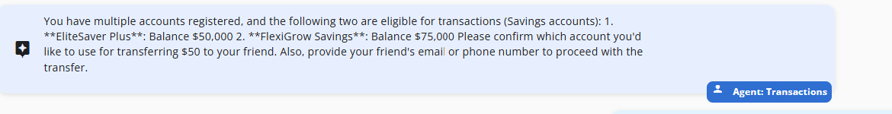

# Module 04 - Multi-Agent Orchestration

## Introduction

In this Module you'll learn how to implement the multi-agent orchestration to tie all of the agents you have created so far together into a single system. You'll also learn how to test the system as a whole is working correctly and how to debug and monitor the agents performance and behavior and troubleshoot them.

## Learning Objectives

- Learn how to write prompts for agents
- Define agent routing
- Learn how to define API contracts for a multi-agent system
- Learn how to test and debug agents, monitoring

## Module Exercises

1. [Activity 1: Define Agents and Roles](#activity-1-define-agents-and-roles)
1. [Activity 2: Implement Agent Tracing and Monitoring](#activity-2-implement-agent-tracing-and-monitoring)
1. [Activity 3: Test your Work](#activity-3-test-your-work)

## Activity 1: Define Agents and Roles

When dealing with multiple agents, clear agent roles is important to avoid conflicts and making sure  customer gets the most appropriate response.

### Add Selection Strategy for Agent Selection

SelectionStrategy is the mechanism in SemanticKernel that determines the next participant. By using the SelectionStrategy, we can identify the available agents and guide the LLM by defining the selection rule in natural language.

Navigate to the `/Prompts` folder and review the contents of `SelectionStrategy.prompty`

```text
Examine RESPONSE and choose the next participant.

Choose only from these participants:
- Coordinator
- CustomerSupport
- Sales
- Transactions

Always follow these rules when choosing the next participant:
- Determine the nature of the user's request and route it to the appropriate agent
- If the user is responding to an agent, select that same agent.
- If the agent is responding after fetching or verifying data , select that same agent.
- If unclear, select Coordinator.

```

### Add Termination Strategy for Agent response

Similar to how SelectionStrategy selects an agent, TerminationStrategy decides when agents should stop responding. This is crucial to prevent multiple unwanted agent chatter in response to a user prompt. TerminationStrategy is the mechanism in SemanticKernel that determines when to stop. It is defined in natural language and instructs the LLM to return YES if more agent participation is required, otherwise it should return NO.

Navigate to the `/Prompts` folder and review the contents of `TerminationStrategy.prompty`

```text
Determine if agent has requested user input or has responded to the user's query.
Respond with the word NO (without explanation) if agent has requested user input.
Otherwise, respond with the word YES (without explanation) if any the following conditions are met:
- An action is pending by an agent.
- Further participation from an agent is required
- The information requested by the user was not provided by the current agent.
```

### ChatResponseFormat

By default, the LLM responds to user prompts in natural language. However, we can enforce a structured format in its responses. A structured format allows us to parse the response and utilize it in our code for decision-making.

Lets define the models for the response

#### ContinuationInfo

Navigate to the `/Models/ChatInfoFormats` folder.

Review the contents of `ContinuationInfo.cs`

```c#
namespace MultiAgentCopilot.Models.ChatInfoFormats
{
    public class ContinuationInfo
    {
        public string AgentName { get; set; } = string.Empty;
        public string Reason { get; set; } = string.Empty;
    }
}
```

### TerminationInfo

Remain in the same `ChatInfoFormats` folder.

Review the contents of `TerminationInfo.cs`

```csharp
namespace MultiAgentCopilot.Models.ChatInfoFormats
{
    internal class TerminationInfo
    {
        public bool ShouldContinue { get; set; }
        public string Reason { get; set; } = string.Empty;
    }
}

```

Let's define a format builder that the LLM can use to output the Continuation and Termination models as responses.

In the folder `StructuredFormats`. REview the  contents of  `ChatResponseFormat.cs`

```csharp
namespace MultiAgentCopilot.StructuredFormats
{
    internal static class ChatResponseFormatBuilder
    {
        internal enum ChatResponseStrategy
        {
            Continuation,
            Termination

        }

        internal static string BuildFormat(ChatResponseStrategy strategyType)
        {
            switch (strategyType)
            {
                case ChatResponseStrategy.Continuation:
                    string jsonSchemaFormat_Continuation = """
                    {

                        "type": "object", 
                            "properties": {
                                "AgentName": { "type": "string", "description":"name of the selected agent" },
                                "Reason": { "type": "string","description":"reason for selecting the agent" }
                            },
                            "required": ["AgentName", "Reason"],
                            "additionalProperties": false

                    }
                    """;

                    return jsonSchemaFormat_Continuation;
                case ChatResponseStrategy.Termination:
                    string jsonSchemaFormat_termination = """
                    {

                        "type": "object", 
                            "properties": {
                                "ShouldContinue": { "type": "boolean", "description":"Does conversation require further agent participation" },
                                "Reason": { "type": "string","description":"List the conditions that evaluated to true for further agent participation" }
                            },
                            "required": ["ShouldContinue", "Reason"],
                            "additionalProperties": false

                    }
                    """;

                    return jsonSchemaFormat_termination;
                default:
                    return "";
            }

        }
    }


}

```

### StrategyPrompts

Just like Agent System Prompts lets return StrategyPrompts based on strategyType.

Navigate to the `/Factories` folder, open the `AgentFactory.cs`

Navigate to the bottom of the file and locate the end of the `GetAgentKernel()` function.

Add the following code as five new functions to the bottom of the class.

```csharp
    

       public static string GetStrategyPrompts(ChatResponseStrategy strategyType)
       {
          string prompt = string.Empty;
          switch (strategyType)
          {
                case ChatResponseStrategy.Continuation:
                   prompt = File.ReadAllText("Prompts/SelectionStrategy.prompty");
                   break;
                case ChatResponseStrategy.Termination:
                   prompt = File.ReadAllText("Prompts/TerminationStrategy.prompty");
                   break;
          }
          return prompt;
       }

       public AgentGroupChat BuildAgentGroupChat(Kernel kernel, ILoggerFactory loggerFactory, LogCallback logCallback, BankingDataService bankService, string tenantId, string userId)
        {
            AgentGroupChat agentGroupChat = new AgentGroupChat();
            var chatModel = kernel.GetRequiredService<IChatCompletionService>();

            //kernel.AutoFunctionInvocationFilters.Add(new AutoFunctionInvocationLoggingFilter(loggerFactory.CreateLogger<AutoFunctionInvocationLoggingFilter>()));

            foreach (AgentType agentType in Enum.GetValues(typeof(AgentType)))
            {
                agentGroupChat.AddAgent(BuildAgent(kernel, agentType, loggerFactory, bankService, tenantId, userId));
            }

            agentGroupChat.ExecutionSettings = GetAgentGroupChatSettings(kernel, logCallback);


            return agentGroupChat;
        }

        private OpenAIPromptExecutionSettings GetExecutionSettings(ChatResponseFormatBuilder.ChatResponseStrategy strategyType)
        {
            ChatResponseFormat infoFormat;
            infoFormat = ChatResponseFormat.CreateJsonSchemaFormat(
            jsonSchemaFormatName: $"agent_result_{strategyType.ToString()}",
            jsonSchema: BinaryData.FromString($"""
                {ChatResponseFormatBuilder.BuildFormat(strategyType)}
                """));
            var executionSettings = new OpenAIPromptExecutionSettings
            {
                ResponseFormat = infoFormat
            };

            return executionSettings;
        }

        private KernelFunction GetStrategyFunction(ChatResponseFormatBuilder.ChatResponseStrategy strategyType)
        {

            KernelFunction function =
                AgentGroupChat.CreatePromptFunctionForStrategy(
                    $$$"""
                    {{{GetStrategyPrompts(strategyType)}}}
                    
                    RESPONSE:
                    {{$lastmessage}}
                    """,
                    safeParameterNames: "lastmessage");

            return function;
        }

        private AgentGroupChatSettings GetAgentGroupChatSettings(Kernel kernel, LogCallback logCallback)
        {
            ChatHistoryTruncationReducer historyReducer = new(5);

            AgentGroupChatSettings ExecutionSettings = new AgentGroupChatSettings
            {
                SelectionStrategy =
                    new KernelFunctionSelectionStrategy(GetStrategyFunction(ChatResponseFormatBuilder.ChatResponseStrategy.Continuation), kernel)
                    {
                        Arguments = new KernelArguments(GetExecutionSettings(ChatResponseFormatBuilder.ChatResponseStrategy.Continuation)),
                        // Save tokens by only including the final few responses
                        HistoryReducer = historyReducer,
                        // The prompt variable name for the history argument.
                        HistoryVariableName = "lastmessage",
                        // Returns the entire result value as a string.
                        ResultParser = (result) =>
                        {
                            var resultString = result.GetValue<string>();
                            if (!string.IsNullOrEmpty(resultString))
                            {
                                var ContinuationInfo = JsonSerializer.Deserialize<ContinuationInfo>(resultString);
                                //logCallback("SELECTION - Agent", ContinuationInfo!.AgentName); 
                                //logCallback("SELECTION - Reason", ContinuationInfo!.Reason);                       
                                return ContinuationInfo!.AgentName;
                            }
                            else
                            {
                                return string.Empty;
                            }
                        }
                    },
                TerminationStrategy =
                    new KernelFunctionTerminationStrategy(GetStrategyFunction(ChatResponseFormatBuilder.ChatResponseStrategy.Termination), kernel)
                    {
                        Arguments = new KernelArguments(GetExecutionSettings(ChatResponseFormatBuilder.ChatResponseStrategy.Termination)),
                        // Save tokens by only including the final response
                        HistoryReducer = historyReducer,
                        // The prompt variable name for the history argument.
                        HistoryVariableName = "lastmessage",
                        // Limit total number of turns
                        MaximumIterations = 8,
                        // user result parser to determine if the response is "yes"
                        ResultParser = (result) =>
                        {
                            var resultString = result.GetValue<string>();
                            if (!string.IsNullOrEmpty(resultString))
                            {
                                var terminationInfo = JsonSerializer.Deserialize<TerminationInfo>(resultString);
                                //logCallback("TERMINATION - Continue", terminationInfo!.ShouldContinue.ToString()); 
                                //logCallback("TERMINATION - Reason", terminationInfo!.Reason); 
                                return terminationInfo!.ShouldContinue;
                            }
                            else
                            {
                                return false;
                            }
                        }
                    },
            };

            return ExecutionSettings;
        }
```

### Replace Agent with AgentGroupChat in SemanticKernel

Until now the responses we received were from a single agent, lets us use AgentGroupChat to orchestrate a chat were multiple agents participate.

Navigate to `Services\SemanticKernelService.cs`

Locate `GetResponse()`. Add the below code after the `GetResponse()` function

```csharp
    private void LogMessage(string key, string value)
    {
        _promptDebugProperties.Add(new LogProperty(key, value));
    }

```

Update the the `GetResponse()` function with the code in the `Try` block below:

```csharp
            AgentFactory agentFactory = new AgentFactory();

            var agentGroupChat = agentFactory.BuildAgentGroupChat(_semanticKernel, _loggerFactory, LogMessage, bankService, tenantId, userId);

            // Load history
            foreach (var chatMessage in messageHistory)
            {
                AuthorRole? role = AuthorRoleHelper.FromString(chatMessage.SenderRole);
                var chatMessageContent = new ChatMessageContent
                {
                    Role = role ?? AuthorRole.User,
                    Content = chatMessage.Text
                };
                agentGroupChat.AddChatMessage(chatMessageContent);
            }

            _promptDebugProperties = new List<LogProperty>();

            List<Message> completionMessages = new();
            List<DebugLog> completionMessagesLogs = new();
            do
            {
                var userResponse = new ChatMessageContent(AuthorRole.User, userMessage.Text);
                agentGroupChat.AddChatMessage(userResponse);

                agentGroupChat.IsComplete = false;

                await foreach (ChatMessageContent response in agentGroupChat.InvokeAsync())
                {
                    string messageId = Guid.NewGuid().ToString();
                    string debugLogId = Guid.NewGuid().ToString();
                    completionMessages.Add(new Message(userMessage.TenantId, userMessage.UserId, userMessage.SessionId, response.AuthorName ?? string.Empty, response.Role.ToString(), response.Content ?? string.Empty, messageId, debugLogId));

                    // TO DO : Add DebugLog code here

                }
            }
            while (!agentGroupChat.IsComplete);
          

            return new Tuple<List<Message>, List<DebugLog>>(completionMessages, completionMessagesLogs);
```

## Activity 2: Implement Agent Tracing and Monitoring

In this hands-on exercise, you will learn how to define an API service layer for a multi-agent backend and learn how to configure tracing and monitoring to enable testing and debugging for agents.

Before executing the below steps, try chatting with the agents. Note that  you are unable to see what what the LLM select an agent. Now lets add some code to bring visibility to behind the scene decision making process.

### Log the kernel function selection

To log the data used by the LLM to invoke functions, we will create a class named `AutoFunctionInvocationLoggingFilter`.

Navigate  to `LogFilter` folder and review the contents of  `AutoFunctionInvocationLoggingFilter.cs`

```c#
using Microsoft.SemanticKernel;
using System.Text.Json;

namespace MultiAgentCopilot.Logs
{
    public sealed class AutoFunctionInvocationLoggingFilter : IAutoFunctionInvocationFilter
    {
        private readonly ILogger<AutoFunctionInvocationLoggingFilter> _logger;

        public AutoFunctionInvocationLoggingFilter(ILogger<AutoFunctionInvocationLoggingFilter> logger)
        {
            _logger = logger;

        }

        public async Task OnAutoFunctionInvocationAsync(AutoFunctionInvocationContext context, Func<AutoFunctionInvocationContext, Task> next)
        {

            var functionCalls = FunctionCallContent.GetFunctionCalls(context.ChatHistory.Last()).ToList();

            if (_logger.IsEnabled(LogLevel.Trace))
            {
                functionCalls.ForEach(functionCall
                    => _logger.LogTrace(
                        "Function call requests: {PluginName}-{FunctionName}({Arguments})",
                        functionCall.PluginName,
                        functionCall.FunctionName,
                        JsonSerializer.Serialize(functionCall.Arguments)));
            }

            await next(context);
        }
    }
}
```

#### Update Semantic Kernel's AutoFunctionInvocationFilters

Navigate to `AgentFactory.cs`

Uncomment the following line in the `BuildAgentGroupChat` function.

```csharp
    //kernel.AutoFunctionInvocationFilters.Add(new AutoFunctionInvocationLoggingFilter(loggerFactory.CreateLogger<AutoFunctionInvocationLoggingFilter>()));
```

#### Logging the Termination and selection Strategy

Add the below declaration to the AgentFactory class

```csharp
public delegate void LogCallback(string key, string value);

```

Search for `\\logCallback` inside `GetAgentGroupChatSettings()` function uncomment it at 4 places.

### Store the log information along with the chat response

Now that we have log information for AgentSelection and Termination, we also need to persist these logs for later retrieval. Storing these DebugLogs in the ChatData container of Cosmos DB along with the other chat data will help us view the logs in the context of the conversation.

Navigate to `Services\SemanticKernelService.cs`

Locate `GetResponse()`, then search for **// TO DO : Add DebugLog code here**  and add the code below:

```csharp

    if (_promptDebugProperties.Count > 0)
    {
        var completionMessagesLog = new DebugLog(userMessage.TenantId, userMessage.UserId, userMessage.SessionId, messageId, debugLogId);
        completionMessagesLog.PropertyBag = _promptDebugProperties;
        completionMessagesLogs.Add(completionMessagesLog);
    }

```

## Activity 3: Test your Work

In the previous module we tested each agent independently. With the code changes in this module we should now be able to orchestrate a multi-agent chat where agent selection is automated based on the SelectionStrategy and agent prompts. Lets go ahead and test if the code works as expected.

### Start the Backend

- Return to the open terminal for the backend app in VS Code and type `dotnet run`

### Start the Frontend

- Return to the frontend terminal and type `ng serve`
- Navigate to, <http://localhost:4200> in your browser

### Start a Chat Session

1. Open the frontend app.
1. Start a new conversation.
1. Try the below prompts and respond according to the AI response. For each response use the Debug log to understand the agent selection and termination strategy.
   
    1. Who can help me here?
    1. Transfer $50 to my friend. (When prompted, give it an account number ranging from `Acc001` to `Acc009` and any email address)
    1. Looking for a Savings account with high interest rate.
    1. File a complaint about theft from my account.
    1. How much did I spend on groceries? (If prompted, say over the last 6 months)
    1. Provide me a statement of my account. (If prompted, give it an account number ranging from `Acc001` to `Acc009`)
1. Expected response: The response is inline with the Agent's prompts and plugins.

### Stop the Application

- In the frontend terminal, press **Ctrl + C** to stop the application.
- In your IDE press **Shift + F5** or stop the debugger.

## Validation Checklist

- [ ] Depending on the user prompt the agent selection is dynamic.
- [ ] All the agents  context of the previous messages in teh conversation.
- [ ] The agents are able to invoke the right plugin function to interact with `BankingService`.
- [ ] Vector search  works as expected.

## Common Issues and Solutions

1. Multiple agents respond together or Wrong agent responding:

   - View the 'DebugLog' by using the **Bug** icon in each impacted AI response.
   - Study the Termination Reason
   - Edit the appropriate Prompty files to resolve the conflict.

1. Agent response are invalid:

   - Change in model and/or its version can cause invalid/irrelevant agent behavior.
   - Thorough testing with updated prompts will be required.

## Module Solution

The following sections include the completed code for this Module. Copy and paste these into your project if you run into issues and cannot resolve.

<details>
  <summary>Completed code for <strong>ChatAPI\Prompts\SelectionStrategy.prompty</strong></summary>

<br>

```text
Examine RESPONSE and choose the next participant.

Choose only from these participants:
- Coordinator
- CustomerSupport
- Sales
- Transactions

Always follow these rules when choosing the next participant:
- Determine the nature of the user's request and route it to the appropriate agent
- If the user is responding to an agent, select that same agent.
- If the agent is responding after fetching or verifying data , select that same agent.
- If unclear, select Coordinator.
```

</details>

<details>
  <summary>Completed code for <strong>ChatAPI\Prompts\TerminationStrategy.prompty</strong></summary>

<br>

```text
Determine if agent has requested user input or has responded to the user's query.
Respond with the word NO (without explanation) if agent has requested user input.
Otherwise, respond with the word YES (without explanation) if any the following conditions are met:
- An action is pending by an agent.
- Further participation from an agent is required
- The information requested by the user was not provided by the current agent.
```

</details>

<details>
  <summary>Completed code for <strong>ChatInfrastructure\Models\ContinuationInfo.cs</strong></summary>

<br>

```csharp

using System;
using System.Collections.Generic;
using System.Linq;
using System.Text;
using System.Threading.Tasks;

namespace MultiAgentCopilot.ChatInfrastructure.Models.ChatInfoFormats
{
    public class ContinuationInfo
    {
        public string AgentName { get; set; } = string.Empty;
        public string Reason { get; set; } = string.Empty;
    }
}

```

</details>

<details>
  <summary>Completed code for <strong>ChatInfrastructure\Models\TerminationInfo.cs</strong></summary>

<br>

```csharp
using System;
using System.Collections.Generic;
using System.Linq;
using System.Text;
using System.Threading.Tasks;

namespace MultiAgentCopilot.ChatInfrastructure.Models.ChatInfoFormats
{
    internal class TerminationInfo
    {
        public bool ShouldContinue { get; set; }
        public string Reason { get; set; } = string.Empty;
    }
}
```

</details>

<details>
  <summary>Completed code for <strong>ChatInfrastructure\StructuredFormats\ChatResponseFormat.cs</strong></summary>

<br>

```csharp
using System;
using System.Collections.Generic;
using System.Linq;
using System.Text;
using System.Threading.Tasks;


namespace MultiAgentCopilot.ChatInfrastructure.StructuredFormats
{
    internal static class ChatResponseFormatBuilder
    {
        internal enum ChatResponseStrategy
        {
            Continuation,
            Termination

        }

        internal static string BuildFormat(ChatResponseStrategy strategyType)
        {
            switch (strategyType)
            {
                case ChatResponseStrategy.Continuation:
                    string jsonSchemaFormat_Continuation = """
                    {

                        "type": "object", 
                            "properties": {
                                "AgentName": { "type": "string", "description":"name of the selected agent" },
                                "Reason": { "type": "string","description":"reason for selecting the agent" }
                            },
                            "required": ["AgentName", "Reason"],
                            "additionalProperties": false

                    }
                    """;

                    return jsonSchemaFormat_Continuation;
                case ChatResponseStrategy.Termination:
                    string jsonSchemaFormat_termination = """
                    {

                        "type": "object", 
                            "properties": {
                                "ShouldContinue": { "type": "boolean", "description":"Does conversation require further agent participation" },
                                "Reason": { "type": "string","description":"List the conditions that evaluated to true for further agent participation" }
                            },
                            "required": ["ShouldContinue", "Reason"],
                            "additionalProperties": false

                    }
                    """;

                    return jsonSchemaFormat_termination;
                default:
                    return "";
            }
        }
    }
}
```

</details>

<details>
  <summary>Completed code for <strong>ChatInfrastructure\Factories\SystemPromptFactory.cs</strong></summary>

<br>

```csharp
using MultiAgentCopilot.ChatInfrastructure.Models;
using static MultiAgentCopilot.ChatInfrastructure.StructuredFormats.ChatResponseFormatBuilder;

internal static class SystemPromptFactory
{
    //Replace from here
    public static string GetAgentName(AgentType agentType)
    {
        string name = string.Empty;
        switch (agentType)
        {
            case AgentType.Sales:
                name = "Sales";
                break;
            case AgentType.Transactions:
                name = "Transactions";
                break;
            case AgentType.CustomerSupport:
                name = "CustomerSupport";
                break;
            case AgentType.Coordinator:
                name = "Coordinator";
                break;
            default:
                throw new ArgumentOutOfRangeException(nameof(agentType), agentType, null);
        }

        return name;//.ToUpper();
    }

    public static string GetAgentPrompts(AgentType agentType)
    {
        string promptFile = string.Empty;
        switch (agentType)
        {
            case AgentType.Sales:
                promptFile = "Sales.prompty";
                break;
            case AgentType.Transactions:
                promptFile = "Transactions.prompty";
                break;
            case AgentType.CustomerSupport:
                promptFile = "CustomerSupport.prompty";
                break;
            case AgentType.Coordinator:
                promptFile = "Coordinator.prompty";
                break;
            default:
                throw new ArgumentOutOfRangeException(nameof(agentType), agentType, null);
        }

        string prompt = $"{File.ReadAllText("Prompts/" + promptFile)}{File.ReadAllText("Prompts/CommonAgentRules.prompty")}";

        return prompt;
    }
    //end replace

    public static string GetStrategyPrompts(ChatResponseStrategy strategyType)
    {
        string prompt = string.Empty;
        switch (strategyType)
        {
            case ChatResponseStrategy.Continuation:
                prompt = File.ReadAllText("Prompts/SelectionStrategy.prompty");
                break;
            case ChatResponseStrategy.Termination:
                prompt = File.ReadAllText("Prompts/TerminationStrategy.prompty");
                break;

        }
        return prompt;
    }

}
```

</details>

<details>
  <summary>Completed code for <strong>ChatInfrastructure\Factories\ChatFactory.cs</strong></summary>

<br>

```csharp
using System;
using System.Collections.Generic;
using System.Linq;
using System.Text;
using System.Threading.Tasks;
using Microsoft.SemanticKernel;
using Microsoft.SemanticKernel.Agents;
using Microsoft.SemanticKernel.Agents.Chat;
using Microsoft.SemanticKernel.ChatCompletion;
using Microsoft.SemanticKernel.Connectors.OpenAI;
using Microsoft.SemanticKernel.Connectors.AzureOpenAI;
using MultiAgentCopilot.ChatInfrastructure.Helper;
using MultiAgentCopilot.ChatInfrastructure.Models;
using BankingServices.Interfaces;
using OpenAI.Chat;
using System.Text.Json;
using Microsoft.Extensions.Logging;
using System.Reflection.Metadata;
using MultiAgentCopilot.ChatInfrastructure.StructuredFormats;
using MultiAgentCopilot.ChatInfrastructure.Models.ChatInfoFormats;
using MultiAgentCopilot.ChatInfrastructure.Models;
using MultiAgentCopilot.ChatInfrastructure.Logs;


namespace MultiAgentCopilot.ChatInfrastructure.Factories
{
    internal class ChatFactory
    {
        public delegate void LogCallback(string key, string value);

        public ChatCompletionAgent BuildAgent(Kernel kernel, AgentType agentType, ILoggerFactory loggerFactory, IBankDataService bankService, string tenantId, string userId)
        {
            ChatCompletionAgent agent = new ChatCompletionAgent
            {
                Name = SystemPromptFactory.GetAgentName(agentType),
                Instructions = $"""{SystemPromptFactory.GetAgentPrompts(agentType)}""",
                Kernel = PluginFactory.GetAgentKernel(kernel, agentType, loggerFactory, bankService, tenantId, userId),
                Arguments = new KernelArguments(new AzureOpenAIPromptExecutionSettings() { FunctionChoiceBehavior = FunctionChoiceBehavior.Auto() })
            };

            return agent;
        }

        private OpenAIPromptExecutionSettings GetExecutionSettings(ChatResponseFormatBuilder.ChatResponseStrategy strategyType)
        {
            ChatResponseFormat infoFormat;
            infoFormat = ChatResponseFormat.CreateJsonSchemaFormat(
            jsonSchemaFormatName: $"agent_result_{strategyType.ToString()}",
            jsonSchema: BinaryData.FromString($"""
                {ChatResponseFormatBuilder.BuildFormat(strategyType)}
                """));
            var executionSettings = new OpenAIPromptExecutionSettings
            {
                ResponseFormat = infoFormat
            };

            return executionSettings;
        }

        private KernelFunction GetStrategyFunction(ChatResponseFormatBuilder.ChatResponseStrategy strategyType)
        {

            KernelFunction function =
                AgentGroupChat.CreatePromptFunctionForStrategy(
                    $$$"""
                    {{{SystemPromptFactory.GetStrategyPrompts(strategyType)}}}
                    
                    RESPONSE:
                    {{$lastmessage}}
                    """,
                    safeParameterNames: "lastmessage");

            return function;
        }

        public AgentGroupChat BuildAgentGroupChat(Kernel kernel, ILoggerFactory loggerFactory, LogCallback logCallback, IBankDataService bankService, string tenantId, string userId)
        {
            AgentGroupChat agentGroupChat = new AgentGroupChat();
            var chatModel = kernel.GetRequiredService<IChatCompletionService>();

            kernel.AutoFunctionInvocationFilters.Add(new AutoFunctionInvocationLoggingFilter(loggerFactory.CreateLogger<AutoFunctionInvocationLoggingFilter>()));

            foreach (AgentType agentType in Enum.GetValues(typeof(AgentType)))
            {
                agentGroupChat.AddAgent(BuildAgent(kernel, agentType, loggerFactory, bankService, tenantId, userId));
            }

            agentGroupChat.ExecutionSettings = GetAgentGroupChatSettings(kernel, logCallback);

            return agentGroupChat;
        }


        private AgentGroupChatSettings GetAgentGroupChatSettings(Kernel kernel, LogCallback logCallback)
        {
            ChatHistoryTruncationReducer historyReducer = new(5);

            AgentGroupChatSettings ExecutionSettings = new AgentGroupChatSettings
            {
                SelectionStrategy =
                    new KernelFunctionSelectionStrategy(GetStrategyFunction(ChatResponseFormatBuilder.ChatResponseStrategy.Continuation), kernel)
                    {
                        Arguments = new KernelArguments(GetExecutionSettings(ChatResponseFormatBuilder.ChatResponseStrategy.Continuation)),
                        // Save tokens by only including the final few responses
                        HistoryReducer = historyReducer,
                        // The prompt variable name for the history argument.
                        HistoryVariableName = "lastmessage",
                        // Returns the entire result value as a string.
                        ResultParser = (result) =>
                        {
                            var resultString = result.GetValue<string>();
                            if (!string.IsNullOrEmpty(resultString))
                            {
                                var ContinuationInfo = JsonSerializer.Deserialize<ContinuationInfo>(resultString);
                                logCallback("SELECTION - Agent", ContinuationInfo.AgentName);
                                logCallback("SELECTION - Reason", ContinuationInfo.Reason);
                                return ContinuationInfo.AgentName;
                            }
                            else
                            {
                                return string.Empty;
                            }
                        }
                    },
                TerminationStrategy =
                    new KernelFunctionTerminationStrategy(GetStrategyFunction(ChatResponseFormatBuilder.ChatResponseStrategy.Termination), kernel)
                    {
                        Arguments = new KernelArguments(GetExecutionSettings(ChatResponseFormatBuilder.ChatResponseStrategy.Termination)),
                        // Save tokens by only including the final response
                        HistoryReducer = historyReducer,
                        // The prompt variable name for the history argument.
                        HistoryVariableName = "lastmessage",
                        // Limit total number of turns
                        MaximumIterations = 8,
                        // user result parser to determine if the response is "yes"
                        ResultParser = (result) =>
                        {
                            var resultString = result.GetValue<string>();
                            if (!string.IsNullOrEmpty(resultString))
                            {
                                var terminationInfo = JsonSerializer.Deserialize<TerminationInfo>(resultString);
                                logCallback("TERMINATION - Continue", terminationInfo.ShouldContinue.ToString());
                                logCallback("TERMINATION - Reason", terminationInfo.Reason);
                                return !terminationInfo.ShouldContinue;
                            }
                            else
                            {
                                return false;
                            }
                        }
                    },
            };

            return ExecutionSettings;
        }
    }
}
```

</details>

<details>
  <summary>Completed code for <strong>ChatInfrastructure\Services\SemanticKernelService.cs</strong></summary>

<br>

```csharp
using System;
using System.Runtime;
using System.Data;
using Newtonsoft.Json;
using Azure.Identity;
using Microsoft.Extensions.DependencyInjection;
using Microsoft.Extensions.Logging;
using Microsoft.Extensions.Options;

using Microsoft.SemanticKernel;
using Microsoft.SemanticKernel.Agents;
using Microsoft.SemanticKernel.Connectors.OpenAI;
using Microsoft.SemanticKernel.ChatCompletion;
using Microsoft.SemanticKernel.Embeddings;

using MultiAgentCopilot.Common.Models.Chat;
using MultiAgentCopilot.ChatInfrastructure.Interfaces;
using MultiAgentCopilot.Common.Models.Configuration;
using MultiAgentCopilot.Common.Models.Debug;
using Message = MultiAgentCopilot.Common.Models.Chat.Message;
using MultiAgentCopilot.ChatInfrastructure.Factories;
using MultiAgentCopilot.ChatInfrastructure.Models;
using BankingServices.Interfaces;
using MultiAgentCopilot.ChatInfrastructure.Helper;


namespace MultiAgentCopilot.ChatInfrastructure.Services;

public class SemanticKernelService : ISemanticKernelService, IDisposable
{
    readonly SemanticKernelServiceSettings _settings;
    readonly ILoggerFactory _loggerFactory;
    readonly ILogger<SemanticKernelService> _logger;
    readonly Kernel _semanticKernel;

    bool _serviceInitialized = false;
    string _prompt = string.Empty;
    string _contextSelectorPrompt = string.Empty;

    List<LogProperty> _promptDebugProperties;

    public bool IsInitialized => _serviceInitialized;

    public SemanticKernelService(
        IOptions<SemanticKernelServiceSettings> options,
        ILoggerFactory loggerFactory)
    {
        _settings = options.Value;
        _loggerFactory = loggerFactory;
        _logger = _loggerFactory.CreateLogger<SemanticKernelService>();
        _promptDebugProperties = new List<LogProperty>();

        _logger.LogInformation("Initializing the Semantic Kernel service...");

        var builder = Kernel.CreateBuilder();

        builder.Services.AddSingleton<ILoggerFactory>(loggerFactory);

        DefaultAzureCredential credential;
        if (string.IsNullOrEmpty(_settings.AzureOpenAISettings.UserAssignedIdentityClientID))
        {
            credential = new DefaultAzureCredential();
        }
        else
        {
            credential = new DefaultAzureCredential(new DefaultAzureCredentialOptions
            {
                ManagedIdentityClientId = _settings.AzureOpenAISettings.UserAssignedIdentityClientID
            });
        }
        builder.AddAzureOpenAIChatCompletion(
            _settings.AzureOpenAISettings.CompletionsDeployment,
            _settings.AzureOpenAISettings.Endpoint,
            credential);

        builder.AddAzureOpenAITextEmbeddingGeneration(
               _settings.AzureOpenAISettings.EmbeddingsDeployment,
               _settings.AzureOpenAISettings.Endpoint,
               credential);

        _semanticKernel = builder.Build();

        Task.Run(Initialize).ConfigureAwait(false);
    }

    public void Dispose()
    {
        // Dispose resources if any
    }

    private Task Initialize()
    {
        try
        {
            _serviceInitialized = true;
            _logger.LogInformation("Semantic Kernel service initialized.");
        }
        catch (Exception ex)
        {
            _logger.LogError(ex, "Semantic Kernel service was not initialized. The following error occurred: {ErrorMessage}.", ex.ToString());
        }
        return Task.CompletedTask;
    }

    private void LogMessage(string key, string value)
    {
        _promptDebugProperties.Add(new LogProperty(key, value));
    }

    public async Task<Tuple<List<Message>, List<DebugLog>>> GetResponse(Message userMessage, List<Message> messageHistory, IBankDataService bankService, string tenantId, string userId)
    {
        try
        {
            ChatFactory multiAgentChatGeneratorService = new ChatFactory();

            var agentGroupChat = multiAgentChatGeneratorService.BuildAgentGroupChat(_semanticKernel, _loggerFactory, LogMessage, bankService, tenantId, userId);

            // Load history
            foreach (var chatMessage in messageHistory)
            {
                AuthorRole? role = AuthorRoleHelper.FromString(chatMessage.SenderRole);
                var chatMessageContent = new ChatMessageContent
                {
                    Role = role ?? AuthorRole.User,
                    Content = chatMessage.Text
                };
                agentGroupChat.AddChatMessage(chatMessageContent);
            }

            _promptDebugProperties = new List<LogProperty>();

            List<Message> completionMessages = new();
            List<DebugLog> completionMessagesLogs = new();
            do
            {
                var userResponse = new ChatMessageContent(AuthorRole.User, userMessage.Text);
                agentGroupChat.AddChatMessage(userResponse);

                agentGroupChat.IsComplete = false;

                await foreach (ChatMessageContent response in agentGroupChat.InvokeAsync())
                {
                    string messageId = Guid.NewGuid().ToString();
                    string debugLogId = Guid.NewGuid().ToString();
                    completionMessages.Add(new Message(userMessage.TenantId, userMessage.UserId, userMessage.SessionId, response.AuthorName ?? string.Empty, response.Role.ToString(), response.Content ?? string.Empty, messageId, debugLogId));

                    if (_promptDebugProperties.Count > 0)
                    {
                        var completionMessagesLog = new DebugLog(userMessage.TenantId, userMessage.UserId, userMessage.SessionId, messageId, debugLogId);
                        completionMessagesLog.PropertyBag = _promptDebugProperties;
                        completionMessagesLogs.Add(completionMessagesLog);
                    }

                }
            }
            while (!agentGroupChat.IsComplete);

            return new Tuple<List<Message>, List<DebugLog>>(completionMessages, completionMessagesLogs);
        }
        catch (Exception ex)
        {
            _logger.LogError(ex, "Error when getting response: {ErrorMessage}", ex.ToString());
            return new Tuple<List<Message>, List<DebugLog>>(new List<Message>(), new List<DebugLog>());
        }
    }

    public async Task<string> Summarize(string sessionId, string userPrompt)
    {
        try
        {
            // Use an AI function to summarize the text in 2 words
            var summarizeFunction = _semanticKernel.CreateFunctionFromPrompt(
                "Summarize the following text into exactly two words:\n\n{{$input}}",
                executionSettings: new OpenAIPromptExecutionSettings { MaxTokens = 10 }
            );

            // Invoke the function
            var summary = await _semanticKernel.InvokeAsync(summarizeFunction, new() { ["input"] = userPrompt });

            return summary.GetValue<string>() ?? "No summary generated";
        }
        catch (Exception ex)
        {
            _logger.LogError(ex, "Error when getting response: {ErrorMessage}", ex.ToString());
            return string.Empty;
        }
    }

    public async Task<float[]> GenerateEmbedding(string text)
    {
        // Generate Embedding
        var embeddingModel = _semanticKernel.Services.GetRequiredService<ITextEmbeddingGenerationService>();

        var embedding = await embeddingModel.GenerateEmbeddingAsync(text);

        // Convert ReadOnlyMemory<float> to IList<float>
        return embedding.ToArray();
    }
}
```

</details>

<details>
  <summary>Completed code for <strong>ChatInfrastructure\Logs\AutoFunctionInvocationLoggingFilter.cs</strong></summary>

<br>

```csharp
using Microsoft.Extensions.Logging;
using Microsoft.SemanticKernel;
using System;
using System.Collections.Generic;
using System.Linq;
using System.Text;
using System.Text.Json;
using System.Threading.Tasks;

namespace MultiAgentCopilot.ChatInfrastructure.Logs
{
    public sealed class AutoFunctionInvocationLoggingFilter : IAutoFunctionInvocationFilter
    {
        private readonly ILogger<AutoFunctionInvocationLoggingFilter> _logger;

        public AutoFunctionInvocationLoggingFilter(ILogger<AutoFunctionInvocationLoggingFilter> logger)
        {
            _logger = logger;
        }

        public async Task OnAutoFunctionInvocationAsync(AutoFunctionInvocationContext context, Func<AutoFunctionInvocationContext, Task> next)
        {
            var functionCalls = FunctionCallContent.GetFunctionCalls(context.ChatHistory.Last()).ToList();

            if (_logger.IsEnabled(LogLevel.Trace))
            {
                functionCalls.ForEach(functionCall
                    => _logger.LogTrace(
                        "Function call requests: {PluginName}-{FunctionName}({Arguments})",
                        functionCall.PluginName,
                        functionCall.FunctionName,
                        JsonSerializer.Serialize(functionCall.Arguments)));
            }

            await next(context);
        }
    }
}
```

</details>

## Next Steps

Congratulations!!! You have completed this workshop!!!
