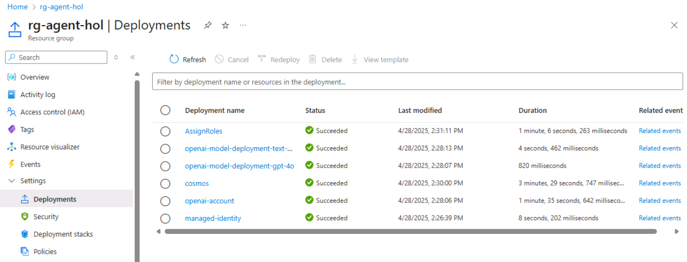

# Module 00 - Deployment and Setup

## Introduction

In this Module, you'll confirm the deployment of Azure Services needed to run this workshop then start the application to ensure everything has been properly configured.

1. Open the folder on the desktop *LabUser - Shortcut*
1. Navigate to the *multi-agent-hol* folder.
1. If it is empty or does not exist, proceed to [Git Clone](#git-clone)
1. If the folder exists and has files within it proceed to the next step.
1. Open a browser locally on the VM and navigate to +++https://portal.azure.com+++
1. Login using the credentials below
   1. User name +++@lab.CloudPortalCredential(User1).Username+++
   1. Password +++@lab.CloudPortalCredential(User1).Password+++
1. In the Search box at the top of the Azure Portal, type in resource group. Open the Resource groups blade
1. Look for a resource group that starts with: *rg-agenthol-*.
1. If the resource group does not appear wait a few moments then refresh.
1. If after a few minutes, the resource group does not appear, proceed to [Lab Provisioning](#lab-provisioning)
1. When the new resource group appears, expand the Overview tab and click deployments.

1. If all resources have been deployed successfully, you are ready to begin the lab. Your screen should look like this.

1. Proceed to [Running the App](#running-the-app)

## Git Clone

1. Open the PowerShell terminal on the Start bar.
1. Navigate to the LabUser folder.
1. Clone the GitHub repository for this lab.

```shell
git clone --branch hol --single-branch https://github.com/AzureCosmosDB/banking-multi-agent-workshop.git C:\Users\LabUser\multi-agent-hol
```

1. Proceed to [Lab Provisioning](#lab-provisioning)

## Lab Provisioning

1. Open the PowerShell terminal on the Start Bar and navigate to the multi-agent-hol folder.

```shell
cd C:\Users\LabUser\multi-agent-hol\
```

1. Authenticate the local user using the credentials provided here
   1. User name +++@lab.CloudPortalCredential(User1).Username+++
   1. Password +++@lab.CloudPortalCredential(User1).Password+++

```shell
azd auth login
```

1. Deploy the Azure services using `azd up`

```shell
azd up
```

1. For environment name enter: `agenthol`
1. Press enter to select the subscription listed.
1. Press enter to select the default region listed.

1. Return to the Azure Portal and refresh the list of resource groups. You may need to refresh a few times.
1. Select the *rg-agenthol* resource group.
1. Find the collapsed *Essentials* section at the top of the page and expand.
1. Click on the Deployments and watch until the status of all deployed resources shows as Succeeded.
1. Your screen should appear as below.


## Configure Environment Variables

When you deploy this solution it automatically injects endpoints and configuration values for the required resources into a `.env` file at root (python) folder.

But you will still need to install dependencies to run the solution locally.

1. Open a terminal and navigate to the python HOL folder.

```shell
cd C:\Users\LabUser\multi-agent-hol\python
```

1. Type `code .` to open VS Code to that folder
1. From the menu in VS Code, open a new PowerShell Terminal
1. Create a virtual environment

   ```shell
   python -m venv .venv
   ```

1. Activate the virtual environment

   ```shell
   .venv\Scripts\Activate.ps1
   ```

1. Install the required dependencies for the project.

   ```shell
   pip install -r C:\Users\LabUser\multi-agent-hol\python\src\app\requirements.txt
   ```

## Running the app

### Run the Backend App

1. Remain in the terminal in the python folder.
2. Start the fastapi server.

   ```shell
   uvicorn src.app.banking_agents_api:app --reload --host 0.0.0.0 --port 63279
   ```

**Note:** If prompted, allow Python to allow public and private network access to this app.

The API will be available at <http://localhost:63279/docs>. This has been pre-built with boilerplate code that will create chat sessions and store the chat history in Cosmos DB.

#### Run the Frontend App

1. In VS Code, open a new PowerShell terminal, navigate to the `frontend` folder and run the following to start the application:

   ```shell
   npm install
   npm start
   ```

1. Open your browser and navigate to <http://localhost:4200/>.

Lets try a couple of things:

- Try out the API by creating a chat session in the front end. This should return a response saying "Hello, I am not yet implemented".
- Navigate to the Cosmos DB account in the Azure portal to view the containers. You should see an entry in the `Chat` container. If you selected "yes" to the option during `azd up`, there will also be some transactional data in the `OffersData`, `AccountsData`, and `Users` containers as well.
- Take a look at the files in the `src/app/services` folder - these are the boilerplate code for interacting with the Cosmos DB and Azure OpenAI services.
- You will also see an empty file `src/app/banking_agents.py` as well as empty files in the `src/app/tools` and `src/app/prompts` folder. This is where you will build your multi-agent system!

Next, we will start building the agents that will be served by the API layer and interact with Cosmos DB and Azure OpenAI using LangGraph!

### Deployment Validation

Use the steps below to validate that the solution was deployed successfully.

- [ ] All Azure resources are deployed successfully
- [ ] You can compile the solution
- [ ] You can start the project and it runs without errors

### Common Issues and Troubleshooting

1. Errors during azd deployment:

   - Service principal "not found" error.
   - Rerun `azd up`

1. Frontend issues:
   - If frontend doesn't fully start, navigate to `/frontend/src/environments/environment.ts` and update `apiUrl: 'https://localhost:63279/'`
   - Frontend will restart

## Success Criteria

To complete this Module successfully, you should be able to:

- Verify that all services have been deployed successfully.
- Have VS Code open with the source code and environment variables loaded.
- Be able to compile and run the application with no warnings or errors.

## Next Steps

Proceed to Module 1 - Creating Your First Agent
