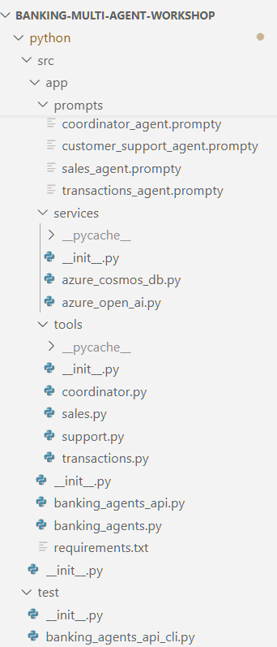
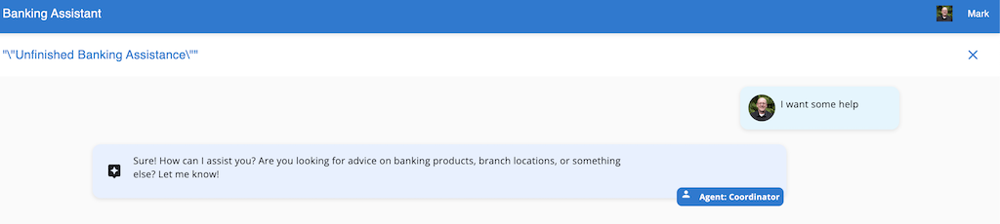

# Module 01 - Creating Your First Agent

## Introduction

In this Module, you'll implement your first agent as part of a multi-agent banking system implemented using LangGraph. You will get an introduction to the LangChain framework and their tool integration with OpenAI for generating completions.

## Learning Objectives and Activities

- Learn the basics for LangGraph including prompts, tools and functions
- Learn how to define prompts and workflows
- Build a simple chat agent

## Module Exercises

1. [Activity 1: Create Your Very First Agent](#activity-1-create-your-very-first-agent)
2. [Activity 2: Create a Simple Customer Service Agent](#activity-2-create-a-simple-customer-service-agent)
3. [Activity 3: Test your Work](#activity-3-test-your-work)

### Project Structure

This solution is organized in the folders below within the `/src` folder

- **/src** The root folder for the solution. 
    - **/app** The folder for the application files.
        - **banking_agents_api.py** This is the API front-end for this application
        - **banking_agents.py** This is where the agents are defined.
        - **prompts** This folder contains all of the prompty files which define each agent's behavior
        - **services** This folder contains the service layer wrappers for Azure Cosmos DB and Azure OpenAI Service
        - **tools** This folder contains the tool definitions for each of the agents in this application
    - **/test** This folder contains the python script to test our application

Here is what the structure of this solution appears like in VS Code. Spend a few moments to familiarize yourself with the structure as it will help you navigate as we go through the activities.



## Activity 1: Create your very first agent

In this hands-on exercise, you will learn the basic elements of a LangGraph agent application and how to define and implement them.

LangGraph is a powerful extension of LangChain that allows you to create stateful, multi-agent workflows using graph-based execution. It helps define AI-driven workflows where multiple agents collaborate, passing state and decisions dynamically.

LangGraph is a directed graph where *Nodes* represent different, functions, agents or steps in the AI workflow. The *Edges* in the graph define the possible transitions between nodes and *State* represents the evolving data as the workflow executes.

The main components of a LangGraph app include:

- StateGraph - The core execution engine for defining and executing multi-step workflows.
- State (Memory) Management - For tracking progress, sharing information and chat history.
- Agents - Individual entities with decision making capabilities.
- Tools - Provide external capabilities.

Let's begin to create our first agent application.

To being, navigate to the `src/app` folder of your project.

Open the the empty `banking_agents.py` file.

Copy the following code into it.

```python
import logging
import os
import uuid
from langchain.schema import AIMessage
from typing import Literal
from langgraph.graph import StateGraph, START, MessagesState
from langgraph.prebuilt import create_react_agent
from langgraph.types import Command, interrupt
from langgraph.checkpoint.memory import MemorySaver
from src.app.services.azure_open_ai import model

local_interactive_mode = False

logging.basicConfig(level=logging.ERROR)

PROMPT_DIR = os.path.join(os.path.dirname(__file__), 'prompts')

# load prompts

# define agents & tools

# define functions

# define workflow


```

This code here is the basis upon which we will build our multi-agent application. Notice the comments. Each of these specify the core of how you build a multi-agent application in LangGraph. For the remainer of this module we will replace each of these with the sections below in order.

### Prompts

Agent applications are powered by large language models or LLMs. Defining the behavior for an agent in a system powered by LLMs requires a prompt. This system will have lots of agents and lots of prompts. To simplify construction, we will define a function that loads the prompts for our agents from files.

In the `banking_agents.py` file, navigate to the `# load prompts` comment.

Replace the comment with the following:

```python
def load_prompt(agent_name):
    """Loads the prompt for a given agent from a file."""
    file_path = os.path.join(PROMPT_DIR, f"{agent_name}.prompty")
    print(f"Loading prompt for {agent_name} from {file_path}")
    try:
        with open(file_path, "r", encoding="utf-8") as file:
            return file.read().strip()
    except FileNotFoundError:
        print(f"Prompt file not found for {agent_name}, using default placeholder.")
        return "You are an AI banking assistant."  # Fallback default prompt
```

### Agents & Tools

Agents are the heart of these applications. Below, we are going to create a **ReAct Agent**. ReAct, or *Re-Act* stands for, *Reason and Act* and is a specific type of agent that is what you will most often use in a multi-agent scenario like this one.

In LangGraph there are different types of agents you can create, depending on your needs. These include:

| Agent Type | Best for |
|-|-|
| React Agent | Reasoning and decision making and tool use |
| Tools Agent | Direct function calling with structured APIs |
| Custom Agents| Full control over logic & multi-agent workflows |

In LangGraph, the definition of an agent includes any **Tools** it needs to do its job. This often involves retrieving some information or taking some action, like transfering execution to another agent (we will get into that soon). If an agent doesn't require any tools, this is defined as empty.

In our simple agent we are going to define a new React Agent as the coorindator for our app using a built-in function called, `create_react_agent()`. Since this is our first agent, there are no tools to define for it so the tools we define for it will be empty. Notice that this agent also calls the function we defined above, `load_prompt()`.

In the `banking_agents.py` file, navigate to the `# define agents & tools` comment.

Replace the comment with the following:

```python
tools = []
coordinator_agent = create_react_agent(
    model,
    tools=tools,
    state_modifier=load_prompt("coordinator_agent"),
)
```

### Functions

Since LangGraph is a graph, the agents, which are comprised of prompts, tools, and functions are implemented as nodes. But humans are also a part of the workflow here so we need to define them as a node too. In our simple sample we have two nodes, one for the coordinator agent and one for the human.

In the `banking_agents.py` file, navigate to the `# define functions` comment.

Replace the comment with the following:

```python
def call_coordinator_agent(state: MessagesState, config) -> Command[Literal["coordinator_agent", "human"]]:
    response = coordinator_agent.invoke(state)
    return Command(update=response, goto="human")


# The human_node with interrupt function serves as a mechanism to stop
# the graph and collect user input for multi-turn conversations.
def human_node(state: MessagesState, config) -> None:
    """A node for collecting user input."""
    interrupt(value="Ready for user input.")
    return None

```

### Built-in Functions

Before we go any further we should cover a few new things you may have seen. LangGraph has a series of built-in functions that you will use when building these types of applications. The first you saw above when we defined our agent, `create_react_agent()`. There are two more used above, `Command()` and `interrupt()`. Here is a short summary of built-in functions.

| Function | Purpose |
|-|-|
| create_react_agent() | Create an agent that reasons and acts using tools dynamically. |
| interrupt(value) | Pauses execution and waits for external input. |
| Command(update, goto) | Updates the state and moves execution to the next node. |
| create_openai_tools_agent() | Create an agent that calls predefined tools when needed. |

### Workflow

With our everything we need for our graph defined we are now ready to define the workflow for our graph.

In LangGraph, the, *StateGraph* is the execution engine where everything comes together. It defines the state that holds the information for the workflow, builds the workflow logic, and dynamically executes the workflow based upon the function outputs and logic defined in the graph.

The workflow below is defined with both, the addition of *nodes* that define who is doing the interacting, and an *edge* that defines a transition between the two.

In the `banking_agents.py` file, navigate to the `# define workflow` comment.

Replace the comment with the following:

```python
builder = StateGraph(MessagesState)
builder.add_node("coordinator_agent", call_coordinator_agent)
builder.add_node("human", human_node)

builder.add_edge(START, "coordinator_agent")

checkpointer = MemorySaver()
graph = builder.compile(checkpointer=checkpointer)
```

### Defining Prompts

Before we are finished creating our first agent, we need to define its behavior.

In your IDE, navigate to the the `src/app/prompts` folder in your project.

Locate and open the empty `coordinator_agent.prompty` file.

Copy and paste the following text into it:

```text
You are a Chat Initiator and Request Router in a bank.
Your primary responsibilities include welcoming users, and routing requests to the appropriate agent.
If the user needs general help, tell them you will be able to transfer to 'customer_support' for help when that agent is built.
If the user wants to open a new account or take our a bank loan, tell them you will be able to transfer to transfer to 'sales_agent' when built.
If the user wants to check their account balance or make a bank transfer, tell them you will be able to transfer to transfer to 'transactions_agent' when built
You MUST include human-readable response.
```

### Let's review

Congratulations, you have created your first AI agent!

We have:

- Used the `create_react_agent` function from the `langgraph.prebuilt` module to create a simple "coordinator" agent. The function imports the Azure OpenAI model already deployed (during `azd up`) and defined in `src/app/services/azure_open_ai.py` and returns an agent that can be used to generate completions.
- Defined a `call_coordinator_agent` function that invokes the agent and a `human_node` function that collects user input.
- Created a state graph that defines the flow of the conversation and compiles it into a langgraph object.
- Added an in-memory checkpoint to save the state of the conversation.

We could run this and see it in action but before we do this, let's implement a second agent for our coorindator agent to transfer to. In this next activity, we are going to create a Customer Service Agent that our Coordinator Agent will transfer execution to on behalf of the user.

## Activity 2: Create a Simple Customer Service Agent

In this activity, you will create a simple customer service agent that users interact with and generates completions using a large language model.

We've created a coordinator agent that can route requests to different agents. Now, let's create a simple customer service agent that can respond to user queries.

We'll cover **tools** in more detail in the next module, but we'll need to add our first tool (or rather a function that dynamically creates a tool) right here so that our coordinator agent can route requests to the customer service agent.

### Create Agent Transfer Tool

To begin, navigate to the `src/app/tools` folder of your project.

Copy the following code into the empty `coordinator.py` file.

```python
from colorama import Fore, Style
from langchain_core.tools import tool
from typing import Annotated
from langchain_core.tools.base import InjectedToolCallId
from langgraph.prebuilt import InjectedState
from langgraph.types import Command


def transfer_to_agent_message(agent):
    print(Fore.LIGHTMAGENTA_EX + f"transfer_to_{agent}..." + Style.RESET_ALL)


def create_agent_transfer(*, agent_name: str):
    """Create a tool that can return handoff via a Command"""
    tool_name = f"transfer_to_{agent_name}"

    @tool(tool_name)
    def transfer_to_agent(
            state: Annotated[dict, InjectedState],
            tool_call_id: Annotated[str, InjectedToolCallId],
    ):
        """Ask another agent for help."""
        tool_message = {
            "role": "tool",
            "content": f"Successfully transferred to {agent_name}",
            "name": tool_name,
            "tool_call_id": tool_call_id,
        }
        transfer_to_agent_message(agent_name)
        return Command(
            goto=agent_name,
            graph=Command.PARENT,
            update={"messages": state["messages"] + [tool_message]},
        )

    return transfer_to_agent
```

Next, navigate back to the `banking_agents.py` file.

At the top of the file, copy the following import statement:

```python
from src.app.tools.coordinator import create_agent_transfer
```

Next, within the same `banking_agents.py` file.

Locate this statement:

```python
tools = []
```

Replace it with the following code:

```python
coordinator_agent_tools = [
    create_agent_transfer(agent_name="customer_support_agent"),
]
```

On the line below, update the tools parameter in the coordinator agent creation.

Replace the value `tools` with the `coordinator_agent_tools` definition.

Your coordinator agent should now look like this:

```python
coordinator_agent = create_react_agent(
    model,
    tools=coordinator_agent_tools,
    state_modifier=load_prompt("coordinator_agent"),
)
```

### Define the Customer Support Agent

Now let's add the new customer support agent with an empty tool set, and a calling function.

Below the previous line of code, copy the following:

```python
customer_support_agent_tools = []
customer_support_agent = create_react_agent(
    model,
    customer_support_agent_tools,
    state_modifier=load_prompt("customer_support_agent"),
)
```

Next, locate the `call_coordinator_agent()` function on

Below this call, add a calling function for the customer support agent:

```python
def call_customer_support_agent(state: MessagesState, config) -> Command[Literal["customer_support_agent", "human"]]:
    response = customer_support_agent.invoke(state)
    return Command(update=response, goto="human")
```

### Define the Customer Service Agent Prompt

We are done building out our code for our customer service agent. Now, lets add a prompt for the customer support agent.

In your IDE, navigate to the `src/app/prompts` folder.

Locate the empty `customer_support_agent.prompty` file.

Copy and paste the following text into it:

```text
You are a customer support agent that can give general advice on banking products and branch locations
If the user wants to make a complaint or speak to someone, ask for the user's phone number and email address,
and say you will get someone to call them back.
You MUST include human-readable response.
```

The coordinator agent's job in this multi-agent system is to handle routing to multiple different agents. However, to do that we need to give it instructions to do so. This is done in the coordinator agent's prompt. With our customer service agent, now fully defined, let's update the coordinator agent's prompty file so it can transfer to the customer support agent.

### Update the Coorindator Agent Prompt

In your IDE, stay in the `src/app/prompts` folder.

Locate the `coordinator_agent.prompty` file.

Replace the text of the file with the text below (notice the difference in the third line between what is there now and the new text):

```text
You are a Chat Initiator and Request Router in a bank.
Your primary responsibilities include welcoming users, and routing requests to the appropriate agent.
If the user needs general help, transfer them to the 'customer_support_agent' agent.
If the user wants to open a new account or take our a bank loan, tell them you will be able to transfer to transfer to 'sales_agent' when built.
If the user wants to check their account balance or make a bank transfer, tell them you will be able to transfer to transfer to 'transactions_agent' when built
You MUST include human-readable response.
```

### Update our Workflow

Finally, we need to add the new customer support agent node to the **StateGraph** workflow.

In your IDE, navigate back to the `banking_agents.py` file.

Navigate towards the end of the file.

Locate this line of code, `builder.add_node("coordinator_agent", call_coordinator_agent)` 

Add the following line of code below it:

```python
builder.add_node("customer_support_agent", call_customer_support_agent)
```

## Activity 3: Test your Work

With the activities in this module complete, it is time to test your work!

To do this, we are going to add this code to our `banking_agents.py` file.

This code defines a new function, `interactive_chat()` that creates a message loop that invokes our StateGraph that we have defined in this file.

To being, navigate to the end of the `banking_agents.py` file.

Then paste the following code below all code in this file:

```python
def interactive_chat():
    thread_config = {"configurable": {"thread_id": str(uuid.uuid4()), "userId": "Mark", "tenantId": "Contoso"}}
    global local_interactive_mode
    local_interactive_mode = True
    print("Welcome to the single-agent banking assistant.")
    print("Type 'exit' to end the conversation.\n")

    user_input = input("You: ")
    conversation_turn = 1

    while user_input.lower() != "exit":

        input_message = {"messages": [{"role": "user", "content": user_input}]}

        response_found = False  # Track if we received an AI response

        for update in graph.stream(
                input_message,
                config=thread_config,
                stream_mode="updates",
        ):
            for node_id, value in update.items():
                if isinstance(value, dict) and value.get("messages"):
                    last_message = value["messages"][-1]  # Get last message
                    if isinstance(last_message, AIMessage):
                        print(f"{node_id}: {last_message.content}\n")
                        response_found = True

        if not response_found:
            print("DEBUG: No AI response received.")

        # Get user input for the next round
        user_input = input("You: ")
        conversation_turn += 1


if __name__ == "__main__":
    interactive_chat()
```

### Wiring up the API layer

In your IDE, navigate to the `src/app/banking_agents_api.py` file.

We will first import the graph and checkpoint from `banking_agents.py` that we've now created. 

Paste the following with the imports at the top of the file:

```python
from src.app.banking_agents import graph, checkpointer
```   

Below the imports, paste the function below to return the graph that is :

```python
def get_compiled_graph():
    return graph
```

Next, locate the `delete_chat_session` function in the file.

This is fairly deep in this file. It may be easier to search for this line of code (e.g. `CTRL-F`).

Here we need to add a background task that will delete checkpoints in the graph, in addition to the chat entries. 

Locate the return statement for this function, `return {"message": "Session deleted successfully"}`

Then add this line of code immediately above it:
    
```python
background_tasks.add_task(delete_all_thread_records, checkpointer, sessionId)
```

Next, locate this function, `get_chat_completion`. 

Currently it looks like this:

```python
@app.post("/tenant/{tenantId}/user/{userId}/sessions/{sessionId}/completion", tags=[endpointTitle],
          response_model=List[MessageModel])
async def get_chat_completion(
        tenantId: str,
        userId: str,
        sessionId: str,
        background_tasks: BackgroundTasks,
        request_body: str = Body(..., media_type="application/json"),

):
    return [
        {
            "id": "string",
            "type": "string",
            "sessionId": "string",
            "tenantId": "string",
            "userId": "string",
            "timeStamp": "string",
            "sender": "string",
            "senderRole": "string",
            "text": "Hello, I am not yet implemented",
            "debugLogId": "string",
            "tokensUsed": 0,
            "rating": "true",
            "completionPromptId": "string"
        }
    ]
```

Replace the entire function with the following code:

```python
@app.post("/tenant/{tenantId}/user/{userId}/sessions/{sessionId}/completion", tags=[endpointTitle],
          response_model=List[MessageModel])
async def get_chat_completion(
        tenantId: str,
        userId: str,
        sessionId: str,
        background_tasks: BackgroundTasks,
        request_body: str = Body(..., media_type="application/json"),
        workflow: CompiledStateGraph = Depends(get_compiled_graph),

):
    if not request_body.strip():
        raise HTTPException(status_code=400, detail="Request body cannot be empty")

    # Retrieve last checkpoint
    config = {"configurable": {"thread_id": sessionId, "checkpoint_ns": "", "userId": userId, "tenantId": tenantId}}
    checkpoints = list(checkpointer.list(config))
    last_active_agent = "coordinator_agent"  # Default fallback

    if not checkpoints:
        # No previous state, start fresh
        new_state = {"messages": [{"role": "user", "content": request_body}]}
        response_data = workflow.invoke(new_state, config, stream_mode="updates")
    else:
        # Resume from last checkpoint
        last_checkpoint = checkpoints[-1]
        last_state = last_checkpoint.checkpoint

        if "messages" not in last_state:
            last_state["messages"] = []

        last_state["messages"].append({"role": "user", "content": request_body})

        if "channel_versions" in last_state:
            for key in reversed(last_state["channel_versions"].keys()):
                if "agent" in key:
                    last_active_agent = key.split(":")[1]
                    break

        last_state["langgraph_triggers"] = [f"resume:{last_active_agent}"]
        response_data = workflow.invoke(last_state, config, stream_mode="updates")

    debug_log_id = store_debug_log(sessionId, tenantId, userId, response_data)
    messages = extract_relevant_messages(debug_log_id, last_active_agent, response_data, tenantId, userId, sessionId)

    # Schedule storing chat history and updating correct agent in last message as a background task
    # to avoid blocking the API response as this is not needed unless retrieving the message history later.
    background_tasks.add_task(process_messages, messages, userId, tenantId, sessionId)

    return messages
```
We should now be done wiring up the API layer.

### Start the Backend

If you stopped the backend, restart it. You can keep both running during the lab.

1. In VS Code, return to the Terminal session with the python folder.
1. Start the fastapi server.

```shell
uvicorn src.app.banking_agents_api:app --reload --host 0.0.0.0 --port 63280
```

### Start the Frontend

1. If you stopped the frontend, restart it.
1. In VS Code, return to the terminal session for your frontend app.

```sh
npm start
```

### Start a Conversation

1. Open your browser and navigate to <http://localhost:4200/>.
1. In the Login dialog, select a user and company and click, Login.

Open your browser and navigate to <http://localhost:4200/>.


1. Create a new conversation.
1. Send the message:

```text
I want some help
```

1. You should see your query being routed to the customer support agent and a response generated:



1. End the agent session by deleting the conversation.

## Validation Checklist

Your implementation is successful if:

- [ ] Your app compiles with no warnings or errors.
- [ ] Your agent successfully processes user input and generates and appropriate response.

## Common Issues and Troubleshooting

1. Issue 1: Nothing happens when I run `banking_agents.py`.
    - Confirm that all the code above has been accurately copy and pasted into the correct files.

1. Issue 2: I get a `ModuleNotFoundError:` error when I run `banking_agents.py`.
    - Make sure that your venv is started in the terminal before running any python code.
    - Make sure that you installed all the python package requirements from Module 0.

## Module Solution

The following sections include the completed code for this Module. Copy and paste these into your project if you run into issues and cannot resolve.

<details>
  <summary>Completed code for <strong>src/app/banking_agents.py</strong></summary>

<br>

```python
import logging
import os
import uuid
from langchain.schema import AIMessage
from typing import Literal
from langgraph.graph import StateGraph, START, MessagesState
from langgraph.prebuilt import create_react_agent
from langgraph.types import Command, interrupt
from langgraph.checkpoint.memory import MemorySaver
from src.app.services.azure_open_ai import model
from src.app.tools.coordinator import create_agent_transfer

local_interactive_mode = False

logging.basicConfig(level=logging.ERROR)

PROMPT_DIR = os.path.join(os.path.dirname(__file__), 'prompts')


def load_prompt(agent_name):
    """Loads the prompt for a given agent from a file."""
    file_path = os.path.join(PROMPT_DIR, f"{agent_name}.prompty")
    print(f"Loading prompt for {agent_name} from {file_path}")
    try:
        with open(file_path, "r", encoding="utf-8") as file:
            return file.read().strip()
    except FileNotFoundError:
        print(f"Prompt file not found for {agent_name}, using default placeholder.")
        return "You are an AI banking assistant."  # Fallback default prompt


coordinator_agent_tools = [
    create_agent_transfer(agent_name="customer_support_agent"),
]
coordinator_agent = create_react_agent(
    model,
    tools=coordinator_agent_tools,
    state_modifier=load_prompt("coordinator_agent"),
)

customer_support_agent_tools = []
customer_support_agent = create_react_agent(
    model,
    customer_support_agent_tools,
    state_modifier=load_prompt("customer_support_agent"),
)


def call_coordinator_agent(state: MessagesState, config) -> Command[Literal["coordinator_agent", "human"]]:
    response = coordinator_agent.invoke(state)
    return Command(update=response, goto="human")


def call_customer_support_agent(state: MessagesState, config) -> Command[Literal["customer_support_agent", "human"]]:
    response = customer_support_agent.invoke(state)
    return Command(update=response, goto="human")


# The human_node with interrupt function serves as a mechanism to stop
# the graph and collect user input for multi-turn conversations.
def human_node(state: MessagesState, config) -> None:
    """A node for collecting user input."""
    interrupt(value="Ready for user input.")
    return None


builder = StateGraph(MessagesState)
builder.add_node("coordinator_agent", call_coordinator_agent)
builder.add_node("customer_support_agent", call_customer_support_agent)
builder.add_node("human", human_node)

builder.add_edge(START, "coordinator_agent")

checkpointer = MemorySaver()
graph = builder.compile(checkpointer=checkpointer)


def interactive_chat():
    thread_config = {"configurable": {"thread_id": str(uuid.uuid4()), "userId": "Mark", "tenantId": "Contoso"}}
    global local_interactive_mode
    local_interactive_mode = True
    print("Welcome to the single-agent banking assistant.")
    print("Type 'exit' to end the conversation.\n")

    user_input = input("You: ")
    conversation_turn = 1

    while user_input.lower() != "exit":

        input_message = {"messages": [{"role": "user", "content": user_input}]}

        response_found = False  # Track if we received an AI response

        for update in graph.stream(
                input_message,
                config=thread_config,
                stream_mode="updates",
        ):
            for node_id, value in update.items():
                if isinstance(value, dict) and value.get("messages"):
                    last_message = value["messages"][-1]  # Get last message
                    if isinstance(last_message, AIMessage):
                        print(f"{node_id}: {last_message.content}\n")
                        response_found = True

        if not response_found:
            print("DEBUG: No AI response received.")

        # Get user input for the next round
        user_input = input("You: ")
        conversation_turn += 1


if __name__ == "__main__":
    interactive_chat()
```

</details>

<details>
  <summary>Completed code for <strong>src/app/tools/coordinator.py</strong></summary>

<br>

```python
from colorama import Fore, Style
from langchain_core.tools import tool
from typing import Annotated
from langchain_core.tools.base import InjectedToolCallId
from langgraph.prebuilt import InjectedState
from langgraph.types import Command


def transfer_to_agent_message(agent):
    print(Fore.LIGHTMAGENTA_EX + f"transfer_to_{agent}..." + Style.RESET_ALL)


def create_agent_transfer(*, agent_name: str):
    """Create a tool that can return handoff via a Command"""
    tool_name = f"transfer_to_{agent_name}"

    @tool(tool_name)
    def transfer_to_agent(
            state: Annotated[dict, InjectedState],
            tool_call_id: Annotated[str, InjectedToolCallId],
    ):
        """Ask another agent for help."""
        tool_message = {
            "role": "tool",
            "content": f"Successfully transferred to {agent_name}",
            "name": tool_name,
            "tool_call_id": tool_call_id,
        }
        transfer_to_agent_message(agent_name)
        return Command(
            goto=agent_name,
            graph=Command.PARENT,
            update={"messages": state["messages"] + [tool_message]},
        )

    return transfer_to_agent

```

</details>

<details>
  <summary>Completed code for <strong>src/app/prompts/coordinator_agent.prompty</strong></summary>

<br>

```text
You are a Chat Initiator and Request Router in a bank.
Your primary responsibilities include welcoming users, and routing requests to the appropriate agent.
If the user needs general help, transfer them to the 'customer_support_agent' agent.
If the user wants to open a new account or take our a bank loan, tell them you will be able to transfer to transfer to 'sales_agent' when built.
If the user wants to check their account balance or make a bank transfer, tell them you will be able to transfer to transfer to 'transactions_agent' when built
You MUST include human-readable response.
```

</details>

<details>
  <summary>Completed code for <strong>src/app/prompts/customer_support_agent.prompty</strong></summary>

<br>

```text
You are a customer support agent that can give general advice on banking products and branch locations
If the user wants to make a complaint or speak to someone, ask for the user's phone number and email address,
and say you will get someone to call them back.
You MUST include human-readable response.
```

</details>

## Next Steps

Proceed to Module 2: Connecting Agents to Memory
