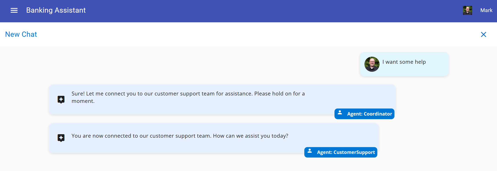

# Module 02 - Connecting Agents to Memory

## Introduction

In this Module, you'll connect your agent to Azure Cosmos DB to provide memory for chat history and state management for your agents to provide durability and context-awareness in your agent interactions.

## Learning Objectives and Activities

- Learn the basics for Azure Cosmos DB for storing state and chat history
- Learn how to integrate agent framworks to Azure Cosmos DB
- Test connectivity to Azure Cosmos DB works

## Module Exercises

1. [Activity 1: Connecting Agent Frameworks to Azure Cosmos DB](#activity-1-connecting-agent-frameworks-to-azure-cosmos-db)
2. [Activity 2: Test your Work](#activity-2-test-your-work)

## Activity 1: Connecting Agent Frameworks to Azure Cosmos DB

Here you will learn how to initialize Azure Cosmos DB and integrate with LangGraph to provide persistent memory for chat history and state management.

The problem with our agents so far is that state is only maintained in memory and is lost when the agent graph is restarted. To solve this problem, we will use Azure Cosmos DB to store the state of the agent. Azure Cosmos DB is a distributed NoSQL database service in Azure. It is designed to for applications requiring low latency and high availability. It is especially adept at handling massive volumes of data with high-concurrency. And its schema-agnostic design makes it ideally suited for theset types of applications. We will also use Azure Cosmos DB to store chat history.

Adding state management using Cosmos DB is easy with the checkpointer plugin.

### Checkpointer Plugin

The checkpointer plugin in LangGraph is a utility designed to facilitate the process of saving and restoring the state of an application at various points during its execution. This is particularly useful in multi-agent systems where maintaining consistent state across different agents and ensuring that progress can be resumed in case of failures or interruptions are critical.

Key Features of the Checkpointer Plugin:

- **State Management**: The checkpointer plugin allows developers to capture the current state of the agents and their interactions. This includes the data they are processing, their internal state, and any relevant context.
- **Persistence**: It provides mechanisms to persist this state to a durable storage medium, such as a database or file system. This ensures that the state can be reloaded even after a system crash or restart.
- **Restoration**: The plugin supports restoring the state to a previous checkpoint. This allows the system to resume operations from a known good state, reducing the need for reprocessing and minimizing downtime.
- **Consistency**: It ensures consistency across different agents by coordinating the checkpointing process. This is crucial in distributed systems where agents might be operating on different nodes or environments.
- **Configuration**: Developers can configure the frequency and conditions under which checkpoints are created. This flexibility allows for balancing between performance overhead and reliability.

### Storing Agent State

Let's add the Checkpointer Plugin to our application.

To begin, navigate to the `banking_Agents.py` file.

Copy the code below to the top of the file with the other imports:

```python
from langgraph_checkpoint_cosmosdb import CosmosDBSaver
from src.app.services.azure_cosmos_db import DATABASE_NAME, checkpoint_container, chat_container, update_chat_container, \
    patch_active_agent
```

In the same `banking_agents.py` file, scroll down to locate the following lines:

```python
checkpointer = MemorySaver()
graph = builder.compile(checkpointer=checkpointer)
```

Then replace those two lines with the code below:

```python
checkpointer = CosmosDBSaver(database_name=DATABASE_NAME, container_name=checkpoint_container)
graph = builder.compile(checkpointer=checkpointer)
```

From this point on, the agent will save its state to Azure Cosmos DB. The `CosmosDBSaver` class will save the state of the agent to the database represented by the global variable, `DATABASE_NAME` in the `checkpoint_container` container.

### Storing Agent Chat history

Next, we are going to modify the coordinator agent to store chat history.

Locate the following code in the `banking_agents.py` file:

```python
def call_coordinator_agent(state: MessagesState, config) -> Command[Literal["coordinator_agent", "human"]]:
    response = coordinator_agent.invoke(state)
    return Command(update=response, goto="human")
```

Replace it with the following code:

```python
def call_coordinator_agent(state: MessagesState, config) -> Command[Literal["coordinator_agent", "human"]]:
    thread_id = config["configurable"].get("thread_id", "UNKNOWN_THREAD_ID")
    userId = config["configurable"].get("userId", "UNKNOWN_USER_ID")
    tenantId = config["configurable"].get("tenantId", "UNKNOWN_TENANT_ID")

    logging.debug(f"Calling coordinator agent with Thread ID: {thread_id}")

    # Get the active agent from Cosmos DB with a point lookup
    partition_key = [tenantId, userId, thread_id]
    activeAgent = None
    try:
        activeAgent = chat_container.read_item(
            item=thread_id, 
            partition_key=partition_key).get('activeAgent', 'unknown')

    except Exception as e:
        logging.debug(f"No active agent found: {e}")

    if activeAgent is None:
        if local_interactive_mode:
            update_chat_container({
                "id": thread_id,
                "tenantId": "Contoso",
                "userId": "Mark",
                "sessionId": thread_id,
                "name": "cli-test",
                "age": "cli-test",
                "address": "cli-test",
                "activeAgent": "unknown",
                "ChatName": "cli-test",
                "messages": []
            })

    logging.debug(f"Active agent from point lookup: {activeAgent}")

    # If active agent is something other than unknown or coordinator_agent, transfer directly to that agent
    if activeAgent is not None and activeAgent not in ["unknown", "coordinator_agent"]:
        logging.debug(f"Routing straight to last active agent: {activeAgent}")
        return Command(update=state, goto=activeAgent)
    else:
        response = coordinator_agent.invoke(state)
        return Command(update=response, goto="human")
```

Lastly, we will store chat history for the customer service agent as well.

Locate the following code in the `banking_agents.py` file:

```python
def call_customer_support_agent(state: MessagesState, config) -> Command[Literal["customer_support_agent", "human"]]:
    response = customer_support_agent.invoke(state)
    return Command(update=response, goto="human")
```

Replace it with the following code:

```python
def call_customer_support_agent(state: MessagesState, config) -> Command[Literal["customer_support_agent", "human"]]:
    thread_id = config["configurable"].get("thread_id", "UNKNOWN_THREAD_ID")
    if local_interactive_mode:
        patch_active_agent(
            tenantId="Contoso", 
            userId="Mark", 
            sessionId=thread_id,
            activeAgent="customer_support_agent")

    response = customer_support_agent.invoke(state)
    return Command(update=response, goto="human")
```

The `patch_active_agent` function is used to log or track which agent is currently active within a multi-agent LangGraph application. It typically records metadata such as the `tenantId`, `userId`, `sessionId` (or `thread ID`), and the name of the `activeAgent`. This is especially useful in local or interactive environments where you want visibility into which agent is handling a specific part of the conversation. 

### Let's review

In this activity, we completed the following key steps:

- **Stored the active agent in Cosmos DB**:  
  We added logic to persist the current "active agent" in Azure Cosmos DB. Before routing, we check if an agent is already active—if so, the system routes the conversation directly to that agent without relying on further reasoning.

- **Enabled persistent state and chat history**:  
  We configured the application to store chat history and conversation state in Cosmos DB, ensuring the data persists beyond the current runtime session and can be retrieved across sessions or restarts.

- **Patched the active agent after agent transfer**:  
  After handing off to a new agent, we update the `activeAgent` field in the Cosmos DB `Chat` container. This ensures deterministic, turn-by-turn routing—especially when it's known which agent asked the last question.

> **Note**: While it's technically possible to rely on the LLM to determine the next agent using reasoning alone, this approach is generally less reliable and may not be suitable for scenarios requiring consistency and control.

## Activity 2: Test your Work

With the activities in this module complete, it is time to test your work! Let's test our agents!

### Start a Conversation

1. In you browser, return to our frontend, <http://localhost:4200/> and hit refresh.
1. Type the following text:

```text
I want some help
```

You should see your query being routed to the customer support agent and a response generated:



Let's prove that agent state is preserved.

1. In your browser, return to the Azure Portal.
1. Open the Cosmos DB account deployed with this lab.
1. Navigate to Data Explorer within the Cosmos DB blade
1. Locate and open the Chat container.
1. You should see the agent state and chat history stored there.

You may also want to look at the checkpoints container in your Cosmos DB account. You should see the agent state stored there. The data is generated by LangGraph. There is much more data stored in this container as it is not only maintaining the chat history, but also the state of the agent, and any other agent, including computations in between transfers. This allows for a richer conversational experience as the full agent state is remembered and checkpointed regularly.

## Validation Checklist

Your implementation is successful if:

- [ ] Your app compiles with no warnings or errors.
- [ ] Your agent successfully connects to Azure Cosmos DB.

### Module Solution

The following sections include the completed code for this Module. Copy and paste these into your project if you run into issues and cannot resolve.

<details>
  <summary>Completed code for <strong>src/app/banking_agents.py</strong></summary>

<br>

```python
import logging
import os
import uuid
from langchain.schema import AIMessage
from typing import Literal
from langgraph.graph import StateGraph, START, MessagesState
from langgraph.prebuilt import create_react_agent
from langgraph.types import Command, interrupt
from langgraph.checkpoint.memory import MemorySaver
from src.app.services.azure_open_ai import model
from src.app.tools.coordinator import create_agent_transfer
from langgraph_checkpoint_cosmosdb import CosmosDBSaver
from src.app.services.azure_cosmos_db import DATABASE_NAME, checkpoint_container, chat_container, update_chat_container, \
    patch_active_agent

local_interactive_mode = False

logging.basicConfig(level=logging.ERROR)

PROMPT_DIR = os.path.join(os.path.dirname(__file__), 'prompts')


def load_prompt(agent_name):
    """Loads the prompt for a given agent from a file."""
    file_path = os.path.join(PROMPT_DIR, f"{agent_name}.prompty")
    print(f"Loading prompt for {agent_name} from {file_path}")
    try:
        with open(file_path, "r", encoding="utf-8") as file:
            return file.read().strip()
    except FileNotFoundError:
        print(f"Prompt file not found for {agent_name}, using default placeholder.")
        return "You are an AI banking assistant."  # Fallback default prompt


coordinator_agent_tools = [
    create_agent_transfer(agent_name="customer_support_agent"),
]
coordinator_agent = create_react_agent(
    model,
    tools=coordinator_agent_tools,
    state_modifier=load_prompt("coordinator_agent"),
)

customer_support_agent_tools = []
customer_support_agent = create_react_agent(
    model,
    customer_support_agent_tools,
    state_modifier=load_prompt("customer_support_agent"),
)


def call_coordinator_agent(state: MessagesState, config) -> Command[Literal["coordinator_agent", "human"]]:
    thread_id = config["configurable"].get("thread_id", "UNKNOWN_THREAD_ID")
    userId = config["configurable"].get("userId", "UNKNOWN_USER_ID")
    tenantId = config["configurable"].get("tenantId", "UNKNOWN_TENANT_ID")

    logging.debug(f"Calling coordinator agent with Thread ID: {thread_id}")

    # Get the active agent from Cosmos DB with a point lookup
    partition_key = [tenantId, userId, thread_id]
    activeAgent = None
    try:
        activeAgent = chat_container.read_item(
            item=thread_id,
            partition_key=partition_key).get('activeAgent', 'unknown')

    except Exception as e:
        logging.debug(f"No active agent found: {e}")

    if activeAgent is None:
        if local_interactive_mode:
            update_chat_container({
                "id": thread_id,
                "tenantId": "Contoso",
                "userId": "Mark",
                "sessionId": thread_id,
                "name": "cli-test",
                "age": "cli-test",
                "address": "cli-test",
                "activeAgent": "unknown",
                "ChatName": "cli-test",
                "messages": []
            })

    logging.debug(f"Active agent from point lookup: {activeAgent}")

    # If active agent is something other than unknown or coordinator_agent, transfer directly to that agent
    if activeAgent is not None and activeAgent not in ["unknown", "coordinator_agent"]:
        logging.debug(f"Routing straight to last active agent: {activeAgent}")
        return Command(update=state, goto=activeAgent)
    else:
        response = coordinator_agent.invoke(state)
        return Command(update=response, goto="human")


def call_customer_support_agent(state: MessagesState, config) -> Command[Literal["customer_support_agent", "human"]]:
    thread_id = config["configurable"].get("thread_id", "UNKNOWN_THREAD_ID")
    if local_interactive_mode:
        patch_active_agent(
            tenantId="Contoso",
            userId="Mark",
            sessionId=thread_id,
            activeAgent="customer_support_agent")

    response = customer_support_agent.invoke(state)
    return Command(update=response, goto="human")


# The human_node with interrupt function serves as a mechanism to stop
# the graph and collect user input for multi-turn conversations.
def human_node(state: MessagesState, config) -> None:
    """A node for collecting user input."""
    interrupt(value="Ready for user input.")
    return None


builder = StateGraph(MessagesState)
builder.add_node("coordinator_agent", call_coordinator_agent)
builder.add_node("customer_support_agent", call_customer_support_agent)
builder.add_node("human", human_node)

builder.add_edge(START, "coordinator_agent")

checkpointer = CosmosDBSaver(database_name=DATABASE_NAME, container_name=checkpoint_container)
graph = builder.compile(checkpointer=checkpointer)
hardcoded_thread_id = "hardcoded-thread-id-01"


def interactive_chat():
    thread_config = {"configurable": {"thread_id": hardcoded_thread_id, "userId": "Mark", "tenantId": "Contoso"}}
    global local_interactive_mode
    local_interactive_mode = True
    print("Welcome to the single-agent banking assistant.")
    print("Type 'exit' to end the conversation.\n")

    user_input = input("You: ")
    conversation_turn = 1

    while user_input.lower() != "exit":

        input_message = {"messages": [{"role": "user", "content": user_input}]}

        response_found = False  # Track if we received an AI response

        for update in graph.stream(
                input_message,
                config=thread_config,
                stream_mode="updates",
        ):
            for node_id, value in update.items():
                if isinstance(value, dict) and value.get("messages"):
                    last_message = value["messages"][-1]  # Get last message
                    if isinstance(last_message, AIMessage):
                        print(f"{node_id}: {last_message.content}\n")
                        response_found = True

        if not response_found:
            print("DEBUG: No AI response received.")

        # Get user input for the next round
        user_input = input("You: ")
        conversation_turn += 1


if __name__ == "__main__":
    interactive_chat()

```

</details>

## Next Steps

Proceed to [Agent Specialization](./Module-03.md)

## Resources

- [LangGraph](https://langchain-ai.github.io/langgraph/concepts/)
- [Azure OpenAI Service documentation](https://learn.microsoft.com/azure/cognitive-services/openai/)
- [Azure Cosmos DB Vector Database](https://learn.microsoft.com/azure/cosmos-db/vector-database)
