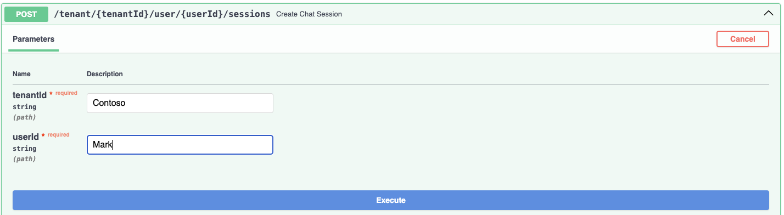
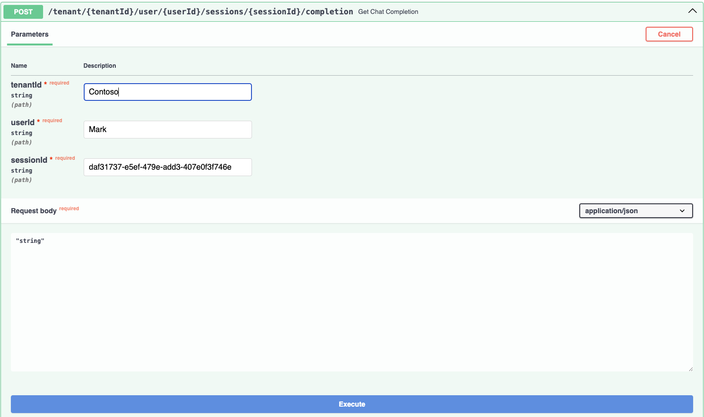

# Module 04 - Multi-Agent Orchestration

[< Agent Specialization](./Module-03.md) - **[Home](Home.md)** - [Lessons Learned, Agent Futures, Q&A >](./Module-05.md)

## Introduction

In this Module you'll learn how to implement the multi-agent orchestration to tie all of the agents you have created so far together into a single system. You'll also learn how to test the system as a whole is working correctly and how to debug and monitor the agents performance and behavior and troubleshoot them.

## Learning Objectives

- Learn how to write prompts for agents
- Define agent routing
- Learn how to define API contracts for a multi-agent system
- Learn how to test and debug agents, monitoring

## Module Exercises

1. [Activity 1: Session on Multi-Agent Architectures](#activity-1-session-on-multi-agent-architectures)
1. [Activity 2: Define Agents and Roles](#activity-2-define-agents-and-roles)
1. [Activity 3: Session on Testing and Monitoring](#activity-3-session-on-testing-and-monitoring)
1. [Activity 4: Implement Agent Tracing and Monitoring](#activity-4-implement-agent-tracing-and-monitoring)
1. [Activity 5: Putting it all together](#activity-4-putting-it-all-together)
1. [Activity 6: Test With Swagger](#activity-6-test-with-swagger)
1. [Activity 7: Connect to our Frontend Application](#activity-7-connect-to-our-frontend-application)

## Activity 1: Session on Multi-Agent Architectures

In this session you will learn how this all comes together and get insights into how the multi-agent orchestration works and coordindates across all of the defined agents for your system.

## Activity 2: Define Agents and Roles

In this hands-on exercise, you will complete the agent definitions by defining routing.

Up until this point, you have created a number of agents that can perform specific tasks, but they are not talking to each other. This means if any agent is asked a question that it cannot answer, it will not know which other agent to ask. This is where agent routing comes in.

Determine which agents you think should be able to talk to each other, and then wire them up! If you've forgotten how to do it, look back through the modules.

Hint: the coordinator agent is a good place to start! And you might need to update the agent prompts appropriately for it to work.

## Activity 3: Session on Testing and Monitoring

In this session you will learn about how to design the service layer for a multi-agent system and how to configure and conduct testing and debugging and monitoring for these systems.

## Activity 4: Implement Agent Tracing and Monitoring
In this activity, you'll integrate LangSmith, a powerful observability and monitoring platform, into our multi-agent application. You'll learn how to trace agent interactions and monitor application behavior using LangSmith's build in tools. This would help you understand how your agents perform, where bottlenecks occur, and how the application behaves end-to-end.

### Creating a LangSmith Account
1. Visit https://smith.langchain.com
2. Click Sign Up and create your free LangSmith account.
3. Once you're signed in, go to your Account Settings, and create a new API Key.

### Adding LangSmith Environment Variables
Open the .env file in the python folder of the code base.

```python
LANGCHAIN_API_KEY="<your_langsmith_api_key>"
LANGCHAIN_TRACING_V2="true"
LANGCHAIN_PROJECT="multi-agent-banking-app"
```

Your .env file should look like this after adding the above lines.

```python
COSMOSDB_ENDPOINT="<your_cosmos_db_uri>"
AZURE_OPENAI_ENDPOINT="<your_azure_open_ai_uri>"
AZURE_OPENAI_EMBEDDINGDEPLOYMENTID="text-embedding-3-small"
AZURE_OPENAI_COMPLETIONSDEPLOYMENTID="gpt-4o"
APPLICATIONINSIGHTS_CONNECTION_STRING="<your_applications_insights_conn_string>"
LANGCHAIN_API_KEY="<your_langsmith_api_key>"
LANGCHAIN_TRACING_V2="true"
LANGCHAIN_PROJECT="multi-agent-banking-app"
```

### Adding tracing to the Agents
LangSmith makes it easy to trace specific functions or agents using the @traceable decorator. 

The decorator works by creating a run tree for you each time the function is called and inserting it within the current trace. The function inputs, name, and other information is then streamed to LangSmith. If the function raises an error or if it returns a response, that information is also added to the tree, and updates are patched to LangSmith so you can detect and diagnose sources of errors. This is all done on a background thread to avoid blocking your app's execution.

LangSmith UX is built in a way that different components of your multi-agent application get rendered differently. LangSmith supports many different types of Runs - you can specify the type of Run in the @traceable decorator. The types of runs are:
1. LLM: Invokes an LLM 
2. Retriever: Retrieves documents from databases or other sources
3. Tool: Executes actions with function calls
4. Chain: Default type; combines multiple Runs into a larger process
5. Prompt: Hydrates a prompt to be used with an LLM
6. Parser: Extracts structured data

Let's update our code to add @traceable decorator so that we can monitor the traces in langsmith.

In your IDE, navigate to the file `banking_agents.py` file.

Add `@traceable(run_type="llm")` on top of the `def call_coordinator_agent(state: MessagesState, config)` function. It should look like this now.

Add the below import line under the imports for this file
```python
from langsmith import traceable
```

```python
@traceable(run_type="llm")
def call_coordinator_agent(state: MessagesState, config) -> Command[Literal["coordinator_agent", "human"]]:
```

Now, let's do this for other functions in the `banking_agents.py` file. Finally, your functions should look like this.

```python
@traceable(run_type="llm")
def call_coordinator_agent(state: MessagesState, config) -> Command[Literal["coordinator_agent", "human"]]:

@traceable(run_type="llm")
def call_customer_support_agent(state: MessagesState, config) -> Command[Literal["customer_support_agent", "human"]]:

@traceable(run_type="llm")
def call_sales_agent(state: MessagesState, config) -> Command[Literal["sales_agent", "human"]]:

@traceable(run_type="llm")
def call_transactions_agent(state: MessagesState, config) -> Command[Literal["transactions_agent", "human"]]:

@traceable
def human_node(state: MessagesState, config) -> None:

@traceable(run_type="llm")
def interactive_chat():
```

Let's go to the `tools/support.py` file now. We will add the `@traceable` on top of all the functions. We are not adding the run type on these functions because we already have `@tool` decorator on top of these functions which would help LangSmith to infer that these are tools used by the Agents. It should look like this.

Add the below import line under the imports for this file
```python
from langsmith import traceable
```

```python
@tool
@traceable
def service_request(config: RunnableConfig,  recipientPhone: str, recipientEmail: str,
                    requestSummary: str) -> str:

@tool
@traceable
def get_branch_location(state: str) -> Dict[str, List[str]]:
```

Now, let's go to the `tools/sales.py` file now. It should look like this after adding the `@traceable` decorator.

Add the below import line under the imports for this file
```python
from langsmith import traceable
```

```python
@tool
@traceable(run_type="retriever")
def get_offer_information(user_prompt: str, accountType: str) -> list[dict[str, Any]]:

@tool
@traceable
def create_account(account_holder: str, balance: float, config: RunnableConfig) -> str:

@tool
@traceable
def calculate_monthly_payment(loan_amount: float, years: int) -> float:
```

Now, let's go to the `tools/transactions.py` file  now. It should look like this after adding the `@traceable` decorator.

Add the below import line under the imports for this file
```python
from langsmith import traceable
```

```python
@tool
@traceable
def bank_transfer(config: RunnableConfig, toAccount: str, fromAccount: str, amount: float) -> str:

@tool
@traceable
def get_transaction_history(accountId: str, startDate: datetime, endDate: datetime) -> List[Dict]:

@tool
@traceable
def bank_balance(config: RunnableConfig, account_number: str) -> str:
```

### Let's monitor traces in LangSmith

In your IDE, run the following command in your terminal.

```bash
python -m src.app.banking_agents
```

Let's open [LangSmith](https://smith.langchain.com/) now to make sure our project is listed under traces. The project name will be `multi-agent-banking-app` as we mentioned in our .env file.

Note: If you are not able to see your project under traces, search for banking in the search bar, and then you should be able to see it.


Try asking about banking offers to invoke a vector search again:
```shell
Welcome to the single-agent banking assistant.
Type 'exit' to end the conversation.

You: Tell me about banking offers
transfer_to_sales_agent...
sales_agent: Would you like information about Credit Card offers or Savings offers? Let me know so I can provide the most relevant details for you!
```

You can see in the below image that the app starts with the coordinator agent, which calls the sales agent based on the user prompt. Clicking on the agent, under sales_agent as highlighted in the below image, you can check the stack trace of the conversation between Human and AI.


Try asking about credit card offers.

```shell
Welcome to the single-agent banking assistant.
Type 'exit' to end the conversation.

You: Tell me about banking offers
transfer_to_sales_agent...
sales_agent: Would you like information about Credit Card offers or Savings offers? Let me know so I can provide the most relevant details for you!

You: Credit Card
```

You can again see conversation between Human and AI based on the new user prompt, that we asked about credit card offers. 


You can see in the below image the stacktrace of the retriever tool call made to the cosmos db to perform vector search. Click the `get_offer_information` as highlighted in the image below. Scroll to the bottom, and you would be able to see the vector search results returned by the query made to cosmos db. 


You can see the result produced by the LLM after getting the result back from the vector search query. Click on the agent as highlighted in the image below, to view the LLM result. You should be able to see the same result printed on the terminal of your IDE.


You can try with the below example as well to monitor trace of the transactions agent. Please type `exit` to end the conversation and start a new one, before trying this example.

```shell
Welcome to the single-agent banking assistant.
Type 'exit' to end the conversation.

You: Show me transactions for account Acc001
transfer_to_transactions_agent...
transactions_agent: Please provide the start and end dates for the transaction history you would like to view for account Acc001.

You: start date as 2025-02-07 and end date as 2025-02-12
```
The run which has a loading icon in front of it should be the current trace. 


You can click the final agent call, highlighted below to see the final result created by the LLM based on the results returned by the cosmos db query. You would be able to see the same result in your terminal running on your IDE.


## Activity 5: Putting It All Together

In this activity, you will wire the API layer for the multi-agent system, connect the UI to the backend, implement tracing, and deploy your changes!

We're now going to wire up the API layer for the multi-agent system. The shell of this was pre-built for you, with operations like creating chat session entries and deleting them. But there was no implementation for chat completions and interacting with the agent graph (as we had not built that yet). We're going to add that now. 

### Wiring up the API Layer

In your IDE, navigate to the `src/app/banking_agents_api.py` file.

We will first import the graph and checkpoint from `banking_agents.py` that we've now created. 

Paste the following with the imports at the top of the file:

```python
from src.app.banking_agents import graph, checkpointer
```   

Below the imports, paste the function below to return the graph that is :

```python
def get_compiled_graph():
    return graph
```

Next, locate the `delete_chat_session` function in the file.

This is fairly deep in this file. It may be easier to search for this line of code (e.g. `CTRL-F`).

Here we need to add a background task that will delete checkpoints in the graph, in addition to the chat entries. 

Locate the return statement for this function, `return {"message": "Session deleted successfully"}`

Then add this line of code immediately above it:
    
```python
background_tasks.add_task(delete_all_thread_records, checkpointer, sessionId)
```

Next, locate this function, `get_chat_completion`. 

Currently it looks like this:

```python
@app.post("/tenant/{tenantId}/user/{userId}/sessions/{sessionId}/completion", tags=[endpointTitle],
          response_model=List[MessageModel])
async def get_chat_completion(
        tenantId: str,
        userId: str,
        sessionId: str,
        background_tasks: BackgroundTasks,
        request_body: str = Body(..., media_type="application/json"),

):
    return [
        {
            "id": "string",
            "type": "string",
            "sessionId": "string",
            "tenantId": "string",
            "userId": "string",
            "timeStamp": "string",
            "sender": "string",
            "senderRole": "string",
            "text": "Hello, I am not yet implemented",
            "debugLogId": "string",
            "tokensUsed": 0,
            "rating": "true",
            "completionPromptId": "string"
        }
    ]
```

Replace the entire function with the following code:

```python
@app.post("/tenant/{tenantId}/user/{userId}/sessions/{sessionId}/completion", tags=[endpointTitle],
          response_model=List[MessageModel])
async def get_chat_completion(
        tenantId: str,
        userId: str,
        sessionId: str,
        background_tasks: BackgroundTasks,
        request_body: str = Body(..., media_type="application/json"),
        workflow: CompiledStateGraph = Depends(get_compiled_graph),

):
    if not request_body.strip():
        raise HTTPException(status_code=400, detail="Request body cannot be empty")

    # Retrieve last checkpoint
    config = {"configurable": {"thread_id": sessionId, "checkpoint_ns": "", "userId": userId, "tenantId": tenantId}}
    checkpoints = list(checkpointer.list(config))
    last_active_agent = "coordinator_agent"  # Default fallback

    if not checkpoints:
        # No previous state, start fresh
        new_state = {"messages": [{"role": "user", "content": request_body}]}
        response_data = workflow.invoke(new_state, config, stream_mode="updates")
    else:
        # Resume from last checkpoint
        last_checkpoint = checkpoints[-1]
        last_state = last_checkpoint.checkpoint

        if "messages" not in last_state:
            last_state["messages"] = []

        last_state["messages"].append({"role": "user", "content": request_body})

        if "channel_versions" in last_state:
            for key in reversed(last_state["channel_versions"].keys()):
                if "agent" in key:
                    last_active_agent = key.split(":")[1]
                    break

        last_state["langgraph_triggers"] = [f"resume:{last_active_agent}"]
        response_data = workflow.invoke(last_state, config, stream_mode="updates")

    debug_log_id = store_debug_log(sessionId, tenantId, userId, response_data)
    messages = extract_relevant_messages(debug_log_id, last_active_agent, response_data, tenantId, userId, sessionId)

    # Schedule storing chat history and updating correct agent in last message as a background task
    # to avoid blocking the API response as this is not needed unless retrieving the message history later.
    background_tasks.add_task(process_messages, messages, userId, tenantId, sessionId)

    return messages
```

This new function calls some functions that already existed in the file, namely `extract_relevant_messages` and `process_messages`. These functions coalesce the message structure coming back from LangGraph into a format that fits our API design.

We've already implemented tracing at these lines:

```python
from azure.monitor.opentelemetry import configure_azure_monitor

configure_azure_monitor()
```

This will expect environment variable of `APPLICATIONINSIGHTS_CONNECTION_STRING` which should have been set in your local .env file at initial deployment.

We should now be done wiring up the API layer.


## Activity 6: Test with Swagger

With the API layer ready, it is time to do our final testing and preparation for integration with our front-end app.

First, start the FastAPI server:

In your IDE, run the following command in your terminal:

```shell
uvicorn src.app.banking_agents_api:app --reload --host 0.0.0.0 --port 8000
```

Next, open a browser and navigate to `http://localhost:8000/docs` to view the swagger UI.


This app comes with a few pre-created tenant and user ids that you can use to test with.

| Tenant Id | User Id  |
|-----------|----------|
| Contoso   | Mark     |
| Contoso   | Sandeep  |
| Contoso   | Theo     |
| Fabrikan  | Sajee    |
| Fabrikan  | Abhishek |
| Fabrikan  | David    |

You can use these to test the API using the Swagger UI with these operations below.

Create a new session with tenantId = `Contoso` and userId = `Mark`



Click Execute. 

Capture the value of the new sessionId

```json
{
  "id": "653cc488-e9d5-4af4-9175-9410e501acb9",
  "type": "session",
  "sessionId": "653cc488-e9d5-4af4-9175-9410e501acb9",
  "tenantId": "Contoso",
  "userId": "Mark",
  "tokensUsed": 0,
  "name": "Mark Brown",
  "messages": []
}
```

Next use the tenantId, userId, and the sessionId created above to say "Hello there!" to our agents.



Fill in the values and click execute.

Here you can see the request from Swagger and the response from our agent.

```json
[
  {
    "id": "1a568dff-43fe-4477-977b-9c21c8bf61f3",
    "type": "ai_response",
    "sessionId": "653cc488-e9d5-4af4-9175-9410e501acb9",
    "tenantId": "Contoso",
    "userId": "Mark",
    "timeStamp": "",
    "sender": "User",
    "senderRole": "User",
    "text": "Hello there!",
    "debugLogId": "a7203518-51d3-4df8-aa43-7c041b553776",
    "tokensUsed": 0,
    "rating": true,
    "completionPromptId": ""
  },
  {
    "id": "10c6daa8-714d-41d8-b564-99a6c8ffdb5d",
    "type": "ai_response",
    "sessionId": "653cc488-e9d5-4af4-9175-9410e501acb9",
    "tenantId": "Contoso",
    "userId": "Mark",
    "timeStamp": "",
    "sender": "Coordinator",
    "senderRole": "Assistant",
    "text": "Hi there! Welcome to our bank. How can I assist you today? Are you looking for help with general inquiries, opening a new account or loan, or managing transactions? Let me know!",
    "debugLogId": "a7203518-51d3-4df8-aa43-7c041b553776",
    "tokensUsed": 265,
    "rating": true,
    "completionPromptId": ""
  }
]
```

## Activity 7: Connect to our Frontend Application

Finally, hook up the UI to the backend locally and test the entire system end-to-end.

In your IDE, navigate to the `/frontend` folder.

Next, locate the `src/app/environments/environment.ts` file. 

Update the `API_URL` to point to your local FastAPI server:

```typescript
export const environment = {
    production: true,
    apiUrl: 'http://localhost:8000/'
  };
```

If you haven't already we need to install npm.

```shell 
npm i
```

Then build and start the frontend:


```shell
ng serve
```

Open a browser and navigate to `http://localhost:4200` to view the UI. 

You should be able to create a chat session, send messages, and receive completions from the agents.

**TBD this image needs to be updated. Cannot get front end to connect to python backend**


As a final last step, if you want, you can deploy your updates to Azure and then navigate to the final solution.

```shell   
azd up
```

### Validation Checklist

- [ ] LangSmith is showing the traces of the project correctly.
- [ ] Swagger UI is working correctly, and you are able to test the API's there.
- [ ] Frontend is loading correctly, and testing on the UI works correctly.

### Module Solution

The following sections include the completed code for this Module. Copy and paste these into your project if you run into issues and cannot resolve.

<details>
  <summary>Completed code for <strong>src/app/banking_agents_api.py</strong></summary>

<br>

```python
import os
import uuid
import fastapi

from dotenv import load_dotenv

from datetime import datetime
from fastapi import BackgroundTasks
from azure.monitor.opentelemetry import configure_azure_monitor

configure_azure_monitor()

from azure.cosmos.exceptions import CosmosHttpResponseError

from fastapi import Depends, HTTPException, Body
from langchain_core.messages import HumanMessage, ToolMessage
from pydantic import BaseModel
from typing import List, Dict
from src.app.services.azure_open_ai import model
from langgraph_checkpoint_cosmosdb import CosmosDBSaver
from langgraph.graph.state import CompiledStateGraph
from starlette.middleware.cors import CORSMiddleware
from src.app.services.azure_cosmos_db import update_chat_container, patch_active_agent, \
    fetch_chat_container_by_tenant_and_user, \
    fetch_chat_container_by_session, delete_userdata_item, debug_container, update_users_container, \
    update_account_container, update_offers_container, store_chat_history, update_active_agent_in_latest_message, \
    chat_container, fetch_chat_history_by_session, delete_chat_history_by_session
import logging

from src.app.banking_agents import graph, checkpointer

def get_compiled_graph():
    return graph

# Setup logging
logging.basicConfig(level=logging.ERROR)

load_dotenv(override=False)

INSTRUMENTATION_KEY = os.getenv("APPLICATIONINSIGHTS_CONNECTION_STRING", "<Your-App-Insights-Key>")

print(f"Using Application Insights Key: {INSTRUMENTATION_KEY}")

endpointTitle = "ChatEndpoints"
dataLoadTitle = "DataLoadEndpoints"

# Mapping for agent function names to standardized names
agent_mapping = {
    "coordinator_agent": "Coordinator",
    "customer_support_agent": "CustomerSupport",
    "transactions_agent": "Transactions",
    "sales_agent": "Sales"
}

app = fastapi.FastAPI(title="Cosmos DB Multi-Agent Banking API", openapi_url="/cosmos-multi-agent-api.json")

app.add_middleware(
    CORSMiddleware,
    allow_origins=["*"],
    allow_credentials=True,
    allow_methods=["*"],
    allow_headers=["*"],
)


class DebugLog(BaseModel):
    id: str
    sessionId: str
    tenantId: str
    userId: str
    details: str


class Session(BaseModel):
    id: str
    type: str = "session"
    sessionId: str
    tenantId: str
    userId: str
    tokensUsed: int = 0
    name: str
    messages: List


class MessageModel(BaseModel):
    id: str
    type: str
    sessionId: str
    tenantId: str
    userId: str
    timeStamp: str
    sender: str
    senderRole: str
    text: str
    debugLogId: str
    tokensUsed: int
    rating: bool
    completionPromptId: str


class DebugLog(BaseModel):
    id: str
    messageId: str
    type: str
    sessionId: str
    tenantId: str
    userId: str
    timeStamp: str
    propertyBag: list


def store_debug_log(sessionId, tenantId, userId, response_data):
    """Stores detailed debug log information in Cosmos DB."""
    debug_log_id = str(uuid.uuid4())
    message_id = str(uuid.uuid4())
    timestamp = datetime.utcnow().isoformat()

    # Extract relevant debug details
    agent_selected = "Unknown"
    previous_agent = "Unknown"
    finish_reason = "Unknown"
    model_name = "Unknown"
    system_fingerprint = "Unknown"
    input_tokens = 0
    output_tokens = 0
    total_tokens = 0
    cached_tokens = 0
    transfer_success = False
    tool_calls = []
    logprobs = None
    content_filter_results = {}

    for entry in response_data:
        for agent, details in entry.items():
            if "messages" in details:
                for msg in details["messages"]:
                    if hasattr(msg, "response_metadata"):
                        metadata = msg.response_metadata
                        finish_reason = metadata.get("finish_reason", finish_reason)
                        model_name = metadata.get("model_name", model_name)
                        system_fingerprint = metadata.get("system_fingerprint", system_fingerprint)
                        input_tokens = metadata.get("token_usage", {}).get("prompt_tokens", input_tokens)
                        output_tokens = metadata.get("token_usage", {}).get("completion_tokens", output_tokens)
                        total_tokens = metadata.get("token_usage", {}).get("total_tokens", total_tokens)
                        cached_tokens = metadata.get("token_usage", {}).get("prompt_tokens_details", {}).get(
                            "cached_tokens", cached_tokens)
                        logprobs = metadata.get("logprobs", logprobs)
                        content_filter_results = metadata.get("content_filter_results", content_filter_results)

                        if "tool_calls" in msg.additional_kwargs:
                            tool_calls.extend(msg.additional_kwargs["tool_calls"])
                            transfer_success = any(
                                call.get("name", "").startswith("transfer_to_") for call in tool_calls)
                            previous_agent = agent_selected
                            agent_selected = tool_calls[-1].get("name", "").replace("transfer_to_",
                                                                                    "") if tool_calls else agent_selected

    property_bag = [
        {"key": "agent_selected", "value": agent_selected, "timeStamp": timestamp},
        {"key": "previous_agent", "value": previous_agent, "timeStamp": timestamp},
        {"key": "finish_reason", "value": finish_reason, "timeStamp": timestamp},
        {"key": "model_name", "value": model_name, "timeStamp": timestamp},
        {"key": "system_fingerprint", "value": system_fingerprint, "timeStamp": timestamp},
        {"key": "input_tokens", "value": input_tokens, "timeStamp": timestamp},
        {"key": "output_tokens", "value": output_tokens, "timeStamp": timestamp},
        {"key": "total_tokens", "value": total_tokens, "timeStamp": timestamp},
        {"key": "cached_tokens", "value": cached_tokens, "timeStamp": timestamp},
        {"key": "transfer_success", "value": transfer_success, "timeStamp": timestamp},
        {"key": "tool_calls", "value": str(tool_calls), "timeStamp": timestamp},
        {"key": "logprobs", "value": str(logprobs), "timeStamp": timestamp},
        {"key": "content_filter_results", "value": str(content_filter_results), "timeStamp": timestamp}
    ]

    debug_entry = {
        "id": debug_log_id,
        "messageId": message_id,
        "type": "debug_log",
        "sessionId": sessionId,
        "tenantId": tenantId,
        "userId": userId,
        "timeStamp": timestamp,
        "propertyBag": property_bag
    }

    debug_container.create_item(debug_entry)
    return debug_log_id


def create_thread(tenantId: str, userId: str):
    sessionId = str(uuid.uuid4())
    name = userId
    age = 30
    address = "123 Main St"
    activeAgent = "unknown"
    ChatName = "New Chat"
    messages = []
    update_chat_container({
        "id": sessionId,
        "tenantId": tenantId,
        "userId": userId,
        "sessionId": sessionId,
        "name": name,
        "age": age,
        "address": address,
        "activeAgent": activeAgent,
        "ChatName": ChatName,
        "messages": messages
    })
    return Session(id=sessionId, sessionId=sessionId, tenantId=tenantId, userId=userId, name=name, age=age,
                   address=address, activeAgent=activeAgent, ChatName=ChatName, messages=messages)


@app.get("/status", tags=[endpointTitle], description="Gets the service status", operation_id="GetServiceStatus",
         response_description="Success",
         response_model=str)
def get_service_status():
    return "CosmosDBService: initializing"


@app.get("/tenant/{tenantId}/user/{userId}/sessions",
         description="Retrieves sessions from the given tenantId and userId", tags=[endpointTitle],
         response_model=List[Session])
def get_chat_sessions(tenantId: str, userId: str):
    items = fetch_chat_container_by_tenant_and_user(tenantId, userId)
    sessions = []

    for item in items:
        sessionId = item["sessionId"]
        messages = fetch_chat_history_by_session(sessionId)

        session = {
            "id": sessionId,
            "type": "Session",
            "sessionId": sessionId,
            "tenantId": item["tenantId"],
            "userId": item["userId"],
            "tokensUsed": item.get("tokensUsed", 0),
            "name": item.get("ChatName", "New Chat"),
            "messages": messages
        }
        sessions.append(session)

    return sessions


@app.get("/tenant/{tenantId}/user/{userId}/sessions/{sessionId}/messages",
         description="Retrieves messages from the sessionId", tags=[endpointTitle], response_model=List[MessageModel])
def get_chat_session(tenantId: str, userId: str, sessionId: str):
    return fetch_chat_history_by_session(sessionId)


# to be implemented
@app.post("/tenant/{tenantId}/user/{userId}/sessions/{sessionId}/message/{messageId}/rate",
          description="Not yet implemented", tags=[endpointTitle],
          operation_id="RateMessage", response_description="Success", response_model=MessageModel)
def rate_message(tenantId: str, userId: str, sessionId: str, messageId: str, rating: bool):
    return {
        "id": messageId,
        "type": "ai_response",
        "sessionId": sessionId,
        "tenantId": tenantId,
        "userId": userId,
        "timeStamp": "2023-01-01T00:00:00Z",
        "sender": "assistant",
        "senderRole": "agent",
        "text": "This is a rated message",
        "debugLogId": str(uuid.uuid4()),
        "tokensUsed": 0,
        "rating": rating,
        "completionPromptId": ""
    }


@app.get("/tenant/{tenantId}/user/{userId}/sessions/{sessionId}/completiondetails/{debuglogId}",
         description="Retrieves debug information for chat completions", tags=[endpointTitle],
         operation_id="GetChatCompletionDetails", response_model=DebugLog)
def get_chat_completion_details(tenantId: str, userId: str, sessionId: str, debuglogId: str):
    try:
        debug_log = debug_container.read_item(item=debuglogId, partition_key=sessionId)
        return debug_log
    except Exception:
        raise HTTPException(status_code=404, detail="Debug log not found")


# create a post function that renames the ChatName in the user data container
@app.post("/tenant/{tenantId}/user/{userId}/sessions/{sessionId}/rename", description="Renames the chat session",
          tags=[endpointTitle], response_model=Session)
def rename_chat_session(tenantId: str, userId: str, sessionId: str, newChatSessionName: str):
    items = fetch_chat_container_by_session(tenantId, userId, sessionId)
    if not items:
        raise HTTPException(status_code=404, detail="Session not found")

    item = items[0]
    item["ChatName"] = newChatSessionName
    update_chat_container(item)

    return Session(id=item["sessionId"], sessionId=item["sessionId"], tenantId=item["tenantId"], userId=item["userId"],
                   name=item["ChatName"], age=item["age"],
                   address=item["address"], activeAgent=item["activeAgent"], ChatName=newChatSessionName,
                   messages=item["messages"])


def delete_all_thread_records(cosmos_saver: CosmosDBSaver, thread_id: str) -> None:
    """
    Deletes all records related to a given thread in CosmosDB by first identifying all partition keys
    and then deleting every record under each partition key.
    """

    # Step 1: Identify all partition keys related to the thread
    query = "SELECT DISTINCT c.partition_key FROM c WHERE CONTAINS(c.partition_key, @thread_id)"
    parameters = [{"name": "@thread_id", "value": thread_id}]

    partition_keys = list(cosmos_saver.container.query_items(
        query=query, parameters=parameters, enable_cross_partition_query=True
    ))

    if not partition_keys:
        print(f"No records found for thread: {thread_id}")
        return

    print(f"Found {len(partition_keys)} partition keys related to the thread.")

    # Step 2: Delete all records under each partition key
    for partition in partition_keys:
        partition_key = partition["partition_key"]

        # Query all records under the current partition
        record_query = "SELECT c.id FROM c WHERE c.partition_key=@partition_key"
        record_parameters = [{"name": "@partition_key", "value": partition_key}]

        records = list(cosmos_saver.container.query_items(
            query=record_query, parameters=record_parameters, enable_cross_partition_query=True
        ))

        for record in records:
            record_id = record["id"]
            try:
                cosmos_saver.container.delete_item(record_id, partition_key=partition_key)
                print(f"Deleted record: {record_id} from partition: {partition_key}")
            except CosmosHttpResponseError as e:
                print(f"Error deleting record {record_id} (HTTP {e.status_code}): {e.message}")

    print(f"Successfully deleted all records for thread: {thread_id}")


# deletes the session user data container and all messages in the checkpointer store
@app.delete("/tenant/{tenantId}/user/{userId}/sessions/{sessionId}", tags=[endpointTitle], )
def delete_chat_session(tenantId: str, userId: str, sessionId: str, background_tasks: BackgroundTasks):
    delete_userdata_item(tenantId, userId, sessionId)

    # Delete all messages in the checkpointer store
    config = {
        "configurable": {
            "thread_id": sessionId,
            "checkpoint_ns": ""  # Ensure this matches the stored data
        }
    }
    delete_chat_history_by_session(sessionId)

    background_tasks.add_task(delete_all_thread_records, checkpointer, sessionId)

    return {"message": "Session deleted successfully"}


@app.post("/tenant/{tenantId}/user/{userId}/sessions", tags=[endpointTitle], response_model=Session)
def create_chat_session(tenantId: str, userId: str):
    return create_thread(tenantId, userId)


def extract_relevant_messages(debug_lod_id, last_active_agent, response_data, tenantId, userId, sessionId):
    # Convert last_active_agent to its mapped value
    last_active_agent = agent_mapping.get(last_active_agent, last_active_agent)

    debug_lod_id = debug_lod_id
    if not response_data:
        return []

    last_agent_node = None
    last_agent_name = "unknown"
    for i in range(len(response_data) - 1, -1, -1):
        if "__interrupt__" in response_data[i]:
            if i > 0:
                last_agent_node = response_data[i - 1]
                last_agent_name = list(last_agent_node.keys())[0]
            break

    # storing the last active agent in the session container so that we can retrieve it later
    # and deterministically route the incoming message directly to the agent that asked the question.
    patch_active_agent(tenantId, userId, sessionId, last_agent_name)

    if not last_agent_node:
        return []

    messages = []
    for key, value in last_agent_node.items():
        if isinstance(value, dict) and "messages" in value:
            messages.extend(value["messages"])

    last_user_index = -1
    for i in range(len(messages) - 1, -1, -1):
        if isinstance(messages[i], HumanMessage):
            last_user_index = i
            break

    if last_user_index == -1:
        return []

    filtered_messages = [msg for msg in messages[last_user_index:] if not isinstance(msg, ToolMessage)]

    return [
        MessageModel(
            id=str(uuid.uuid4()),
            type="ai_response",
            sessionId=sessionId,
            tenantId=tenantId,
            userId=userId,
            timeStamp=msg.response_metadata.get("timestamp", "") if hasattr(msg, "response_metadata") else "",
            sender="User" if isinstance(msg, HumanMessage) else last_active_agent,
            senderRole="User" if isinstance(msg, HumanMessage) else "Assistant",
            text=msg.content if hasattr(msg, "content") else msg.get("content", ""),
            debugLogId=debug_lod_id,
            tokensUsed=msg.response_metadata.get("token_usage", {}).get("total_tokens", 0) if hasattr(msg,
                                                                                                      "response_metadata") else 0,
            rating=True,
            completionPromptId=""
        )
        for msg in filtered_messages
        if msg.content
    ]


def process_messages(messages, userId, tenantId, sessionId):
    for message in messages:
        item = {
            "id": message.id,
            "type": message.type,
            "sessionId": message.sessionId,
            "tenantId": message.tenantId,
            "userId": message.userId,
            "timeStamp": message.timeStamp,
            "sender": message.sender,
            "senderRole": message.senderRole,
            "text": message.text,
            "debugLogId": message.debugLogId,
            "tokensUsed": message.tokensUsed,
            "rating": message.rating,
            "completionPromptId": message.completionPromptId
        }
        store_chat_history(item)

    partition_key = [tenantId, userId, sessionId]
    # Get the active agent from Cosmos DB with a point lookup
    activeAgent = chat_container.read_item(item=sessionId, partition_key=partition_key).get('activeAgent', 'unknown')

    last_active_agent = agent_mapping.get(activeAgent, activeAgent)
    update_active_agent_in_latest_message(sessionId, last_active_agent)


@app.post("/tenant/{tenantId}/user/{userId}/sessions/{sessionId}/completion", tags=[endpointTitle],
          response_model=List[MessageModel])
async def get_chat_completion(
        tenantId: str,
        userId: str,
        sessionId: str,
        background_tasks: BackgroundTasks,
        request_body: str = Body(..., media_type="application/json"),
        workflow: CompiledStateGraph = Depends(get_compiled_graph),

):
    if not request_body.strip():
        raise HTTPException(status_code=400, detail="Request body cannot be empty")

    # Retrieve last checkpoint
    config = {"configurable": {"thread_id": sessionId, "checkpoint_ns": "", "userId": userId, "tenantId": tenantId}}
    checkpoints = list(checkpointer.list(config))
    last_active_agent = "coordinator_agent"  # Default fallback

    if not checkpoints:
        # No previous state, start fresh
        new_state = {"messages": [{"role": "user", "content": request_body}]}
        response_data = workflow.invoke(new_state, config, stream_mode="updates")
    else:
        # Resume from last checkpoint
        last_checkpoint = checkpoints[-1]
        last_state = last_checkpoint.checkpoint

        if "messages" not in last_state:
            last_state["messages"] = []

        last_state["messages"].append({"role": "user", "content": request_body})

        if "channel_versions" in last_state:
            for key in reversed(last_state["channel_versions"].keys()):
                if "agent" in key:
                    last_active_agent = key.split(":")[1]
                    break

        last_state["langgraph_triggers"] = [f"resume:{last_active_agent}"]
        response_data = workflow.invoke(last_state, config, stream_mode="updates")

    debug_log_id = store_debug_log(sessionId, tenantId, userId, response_data)
    messages = extract_relevant_messages(debug_log_id, last_active_agent, response_data, tenantId, userId, sessionId)

    # Schedule storing chat history and updating correct agent in last message as a background task
    # to avoid blocking the API response as this is not needed unless retrieving the message history later.
    background_tasks.add_task(process_messages, messages, userId, tenantId, sessionId)

    return messages


@app.post("/tenant/{tenantId}/user/{userId}/sessions/{sessionId}/summarize-name", tags=[endpointTitle],
          operation_id="SummarizeChatSessionName", response_description="Success", response_model=str)
def summarize_chat_session_name(tenantId: str, userId: str, sessionId: str,
                                request_body: str = Body(..., media_type="application/json")):
    """
    Generates a summarized name for a chat session based on the chat text provided.
    """
    try:
        prompt = (
            "Given the following chat transcript, generate a short, meaningful name for the conversation.\n\n"
            f"Chat Transcript:\n{request_body}\n\n"
            "Summary Name:"
        )

        response = model.invoke(prompt)
        summarized_name = response.content.strip()

        return summarized_name

    except Exception as e:
        return {"error": f"Failed to generate chat session name: {str(e)}"}


@app.post("/tenant/{tenantId}/user/{userId}/semanticcache/reset", tags=[endpointTitle],
          operation_id="ResetSemanticCache", response_description="Success",
          description="Semantic cache reset - not yet implemented", )
def reset_semantic_cache(tenantId: str, userId: str):
    return {"message": "Semantic cache reset not yet implemented"}


@app.put("/userdata", tags=[dataLoadTitle], description="Inserts or updates a single user data record in Cosmos DB")
async def put_userdata(data: Dict):
    try:
        update_users_container(data)
        return {"message": "Inserted user record successfully", "id": data.get("id")}
    except Exception as e:
        raise HTTPException(status_code=500, detail=f"Failed to insert user data: {str(e)}")


@app.put("/accountdata", tags=[dataLoadTitle],
         description="Inserts or updates a single account data record in Cosmos DB")
async def put_accountdata(data: Dict):
    try:
        update_account_container(data)
        return {"message": "Inserted account record successfully", "id": data.get("id")}
    except Exception as e:
        raise HTTPException(status_code=500, detail=f"Failed to insert account data: {str(e)}")


@app.put("/offerdata", tags=[dataLoadTitle], description="Inserts or updates a single offer data record in Cosmos DB")
async def put_offerdata(data: Dict):
    try:
        update_offers_container(data)
        return {"message": "Inserted offer record successfully", "id": data.get("id")}
    except Exception as e:
        raise HTTPException(status_code=500, detail=f"Failed to insert offer data: {str(e)}")
```
</details>

## Next Steps

Proceed to [Lessons Learned, Agent Futures, Q&A](./Module-04.md)

## Resources

- [Semantic Kernel Agent Framework](https://learn.microsoft.com/semantic-kernel/frameworks/agent)
- [LangGraph](https://langchain-ai.github.io/langgraph/concepts/)
- [Azure OpenAI Service documentation](https://learn.microsoft.com/azure/cognitive-services/openai/)
- [Azure Cosmos DB Vector Database](https://learn.microsoft.com/azure/cosmos-db/vector-database)

